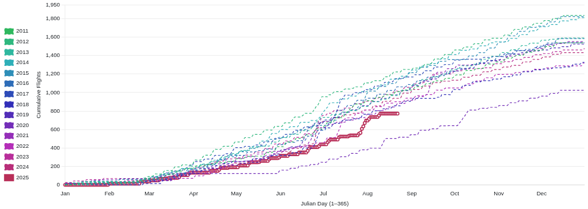
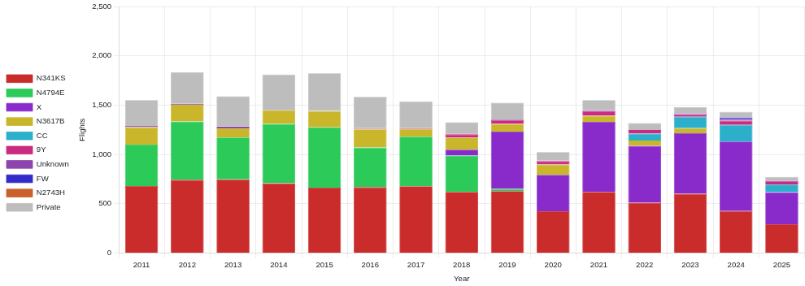
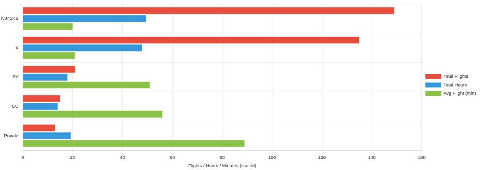

# Analytics

Presentation-grade, read-only charts for club operations. Built on existing data (`logsheet`, `members`) and rendered with Chart.js. Every chart supports **PNG | SVG | CSV** export.

- **Route:** `/analytics/`
- **Access:** any authenticated member (admins bypass membership checks)
- **Docs:** see [docs/index.md](docs/index.md)

---

## Quick Start

```bash
python manage.py collectstatic
# then visit /analytics/
```

Annual controls set the year range; the date-range picker drives all other charts.  
Export buttons (top-right of each card) download **PNG/SVG/CSV**.

---

## Screenshots


| Cumulative (Annual) | Flights by Year by Aircraft (Annual) |
| :--: | :--: |
|  |  |

| Glider Utilization (Date range) | Flight Duration Distribution (Date range) |
| :--: | :--: |
|  |  |

More charts and details in the [docs](docs/index.md).

---

## Docs

- [Overview & parameters](docs/index.md)
- [Management](docs/management.md) — *(none yet)*
- [Models](docs/models.md) — *(none; reads existing apps)*
- [Signals](docs/signals.md) — *(none)*
- [Utilities](docs/utils.md) — *(logic in `queries.py`)*

---

## Structure

```
analytics/
├─ docs/
│  ├─ index.md
│  ├─ management.md
│  ├─ models.md
│  ├─ signals.md
│  ├─ utils.md
│  └─ img/
│     ├─ cumulative.png
│     ├─ by_aircraft.png
│     ├─ utilization.png
│     └─ duration.png
├─ static/
│  └─ analytics/
│     ├─ analytics.css
│     └─ charts.js
├─ templates/
│  └─ analytics/
│     └─ dashboard.html
├─ queries.py
└─ views.py
```

---

## Notes

- Charts read a single `analytics_data` JSON blob (see `docs/index.md` for schema).
- Styling lives in `static/analytics/analytics.css`.
- If charts feel slow in-season, consider nightly pre-aggregation.
