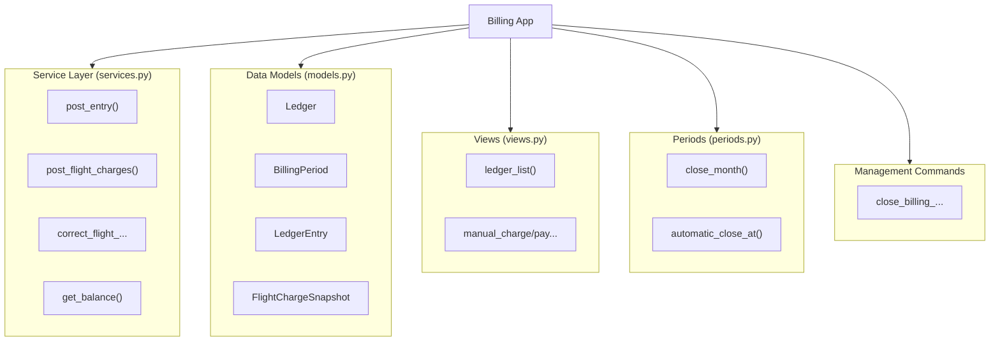
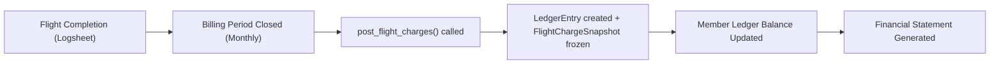

# Billing App - Architecture Documentation

## Overview

The **billing** app is a Django application that manages the financial operations for Manage2Soar, an online soaring club management platform. It provides immutable financial ledgers, monthly billing period management, flight charge allocation from logsheet data, and manual charge/payment processing.

### Key Design Principles

1. **Immutability**: Once posted, billing entries cannot be modified or deleted. Corrections happen via reversals.
2. **Idempotency**: All operations use source keys to prevent duplicate charges.
3. **Auditability**: Every transaction is traceable with full audit trails.
4. **Atomicity**: All financial operations are wrapped in database transactions.

## System Architecture



## Core Components

### 1. Service Layer (`billing/services.py`)

The service layer provides the core business logic for all billing operations:

#### Key Functions

- **`get_or_create_ledger(member)`**: Retrieves or creates a ledger for a member with transaction-safe race condition handling.

- **`post_entry()`**: Posts an immutable financial entry to a member's ledger. Uses source key for idempotency.

- **`post_flight_charges()`**: Records flight charges from Logsheet data, creating both LedgerEntry and FlightChargeSnapshot records.

- **`correct_flight_charges()`**: Replaces all active charges for a flight with corrected allocations (version-based correction).

- **`post_charge()`**: Creates debit entries for various charge types.

- **`post_credit()`**: Creates credit entries for payments or credits.

- **`post_manual_charge/payment()`**: Requires treasurer permission and audit text.

#### Data Flow



### 2. Data Models (`billing/models.py`)

#### Ledger Model

Represents the immutable financial history for one member. Each member gets exactly one ledger (OneToOne relationship).

**Properties**:
- `balance`: Computed from sum of all entry signed_amounts

#### BillingPeriod Model

Tracks open/closed state for one calendar billing month. When a period is closed, no new charges can be posted for that date range.

**Constraints**:
- Unique constraint on (year, month)
- Month must be 1-12
- Ordered by most recent first

#### BillingPeriodEvent Model

Audit trail for period close/reopen actions. Records who took the action and why.

#### LedgerEntry Model

Individual immutable financial transactions. Cannot be modified or deleted after creation.

**Kind Choices**:
- `flight_charge` - Automated flight allocation charges
- `misc_charge` - Miscellaneous charges
- `manual_charge` - Treasurer-posted charges
- `payment` - Payments received
- `credit` - Credits applied
- `opening_balance` - Initial balance for new members
- `reversal` - Correction of previous entries

**Effect Choices**:
- `debit` - Amount owed (charges)
- `credit` - Amount paid (payments/credits)

**Key Constraints**:
- Positive amounts only
- Source key uniqueness (idempotency)
- Kind/effect validity combinations enforced
- Reversals must reference original entry
- Flight charges must link to a flight

#### FlightChargeSnapshot Model

Frozen allocation evidence for posted flight charges. Captures the exact charge breakdown at posting time.

**Fields**:
- `tow_amount`, `rental_amount`, `instruction_amount` - Component amounts
- `total_amount` - Sum of components
- `allocation_rule` - Rule used (e.g., "full", "pro_rata")
- `allocation_version` - Version for correction tracking
- `allocation_snapshot` - JSON snapshot of full allocation state

### 3. Period Management (`billing/periods.py`)

Automates monthly billing period closing with configurable policies:

- **Manual Policy**: No automatic closing (default)
- **Nth Weekday Policy**: Close on nth weekday of month at specific time

#### Configuration Example

```python
# In siteconfig.models.SiteConfiguration
billing_period_close_policy = "nth_weekday"
billing_period_close_ordinal = 1      # 1st Monday, 2nd Tuesday, etc.
billing_period_close_weekday = 0      # Monday (0=Mon, 6=Sun)
billing_period_close_time_hour = 23   # Hour (23 = 11 PM)
billing_period_close_time_minute = 59 # Minutes
```

### 4. Permission System

- **`require_manual_transaction_access(actor)`**: Service-layer guard in `billing/permissions.py`
- **`treasurer_required(view_func)`**: View decorator defined in `billing/views.py`
- **`billing_app_required(view_func)`**: App-enabled decorator defined in `billing/decorators.py`

### 5. URL Routes (`billing/urls.py`)

```python
urlpatterns = [
    # List member ledgers (requires treasurer access)
    path("ledgers/", views.ledger_list, name="ledger_list"),
    path("periods/", views.billing_period_list, name="period_list"),
    path("periods/close/", views.close_billing_period, name="period_close"),
    path("periods/<int:period_id>/reopen/", views.reopen_billing_period, name="period_reopen"),
    path("ledgers/<int:member_id>/", views.ledger_detail, name="ledger_detail"),
    path("entries/<int:entry_id>/reverse/", views.reverse_entry, name="entry_reverse"),
]
```

## Immutability Guarantees

### Model-Level Protection

```python
# LedgerEntry.save() - prevents updates
def save(self, *args, **kwargs):
    if self.pk:
        raise ValidationError("Posted billing entries cannot be edited.")
    return super().save(*args, **kwargs)

# LedgerEntry.delete() - prevents deletion
def delete(self, *args, **kwargs):
    raise ValidationError("Posted billing entries cannot be deleted.")
```

### Database-Level Protection

- `billing_entry_immutability` migration installs triggers for additional enforcement
- Foreign key relationships use `on_delete=models.PROTECT`

## Idempotency System

Every operation uses `source_key` for deduplication:

```python
# First call posts the entry
entry1 = post_entry(member=member, source_key="flight_123")

# Duplicate call returns same entry (no duplicate charge)
entry2 = post_entry(member=member, source_key="flight_123")
assert entry1.pk == entry2.pk  # True
```

## Correction Workflow

Flight charges can be corrected with version tracking:

```python
# Original charges posted (version 1)
posted = post_flight_charges(flight=flight, allocations=allocs_v1)

# Later, corrections needed (version 2)
reversals, new_entries = correct_flight_charges(
    flight=flight,
    actor=admin,
    allocations=corrected_allocs,  # version 2
    effective_date=today,
    reason="Rate adjustment"
)

# Original entries now have reversal references
assert original.reverses is not None
assert new_entries[0].correction_group == group_uuid
```

## Balance Calculation

```python
from billing.services import get_balance

ledger = member.billing_ledger
balance = get_balance(ledger)
# Returns Decimal with current member balance
# Positive = money owed to club
# Negative = overpayment/credit
```

### Query Performance

The `billing_entry_statement_idx` composite index optimizes balance queries:
- Indexed on `(ledger, effective_date, created_at, id)`
- Enables fast aggregation of entries per ledger

## Error Handling

### Custom Exceptions

```python
from billing.exceptions import BillingDisabledError

try:
    post_charge(...)
except BillingDisabledError:
    # Handle disabled billing gracefully
    pass
```

### Validation Errors

All service functions raise `django.core.exceptions.ValidationError` for invalid operations. The service layer validates:
- Billing app enabled
- Positive amounts only (quantized to $0.01)
- No future effective dates
- Required relationships (source_key, flight, reversal targets)
- Amount consistency in corrections

## Testing Strategy

The billing app includes comprehensive test coverage:

```bash
# Run all billing tests
pytest billing/tests/ -v

# Key test modules:
billing/tests/test_ledger.py        # Ledger operations
billing/tests/test_manual_transactions.py  # Manual charges/payments
billing/tests/test_periods.py       # Period close logic
billing/tests/test_views.py         # View integration
billing/tests/conftest.py           # Fixtures (enable_billing_app)
```

### Test Fixtures

```python
@pytest.fixture
def enable_billing_app(db):
    """Enable billing app for test."""
    SiteConfiguration.objects.update(billing_app_enabled=True)
```

## Migration History

| Migration | Description |
|-----------|-------------|
| 0001_initial | Initial schema |
| 0002_ledger_entry_immutability | Entry immutability triggers |
| 0003_billing_period_events | Audit trail for period changes |
| 0004_snapshot_immutability | Snapshot integrity checks |

## Related Documentation

- [Data Models](models.md) - Detailed field specifications
- [API Reference](api.md) - Service layer API
- [Development Guide](development.md) - Contributing and setup
