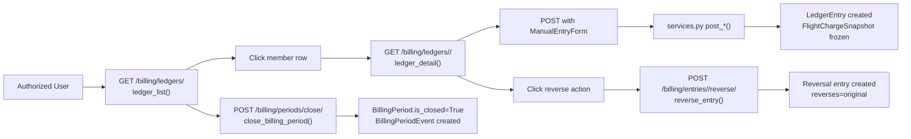

# Billing App - View Functions Documentation

## Overview

The billing app provides a set of treasurer-only views for managing financial ledgers, billing periods, and manual ledger entries. All views require both application-level gating (billing enabled) and role-based authorization (superuser or treasurer).

---

## URL Routes (`billing/urls.py`)

```python
from django.urls import path
from . import views

app_name = "billing"

urlpatterns = [
    # List all member ledgers with running balances
    path("ledgers/", views.ledger_list, name="ledger_list"),

    # View individual member ledger
    path("ledgers/<int:member_id>/", views.ledger_detail, name="ledger_detail"),

    # Reverse a specific ledger entry
    path("entries/<int:entry_id>/reverse/", views.reverse_entry, name="entry_reverse"),

    # List all billing periods
    path("periods/", views.billing_period_list, name="period_list"),

    # Close/open billing periods (POST-only)
    path("periods/close/", views.close_billing_period, name="period_close"),
    path("periods/<int:period_id>/reopen/", views.reopen_billing_period, name="period_reopen"),
]
```

---

## View Functions

### `ledger_list` — Member Ledger Index

**URL**: `/billing/ledgers/`  
**Method**: GET  
**Decorators**: `@billing_app_required`, `@treasurer_required`

Lists all members with their current running ledger balances. Supports optional search query parameter `?q=fullname`.

**Parameters**:
| Parameter | Type | Required | Description |
|-----------|------|----------|-------------|
| `q` | string | No | Search query for member username/first_name/last_name |

**Response**: Renders `billing/ledger_list.html` with context:
```python
{
    "rows": [  # List of dicts
        {
            "member": <Member>,
            "balance": Decimal,  # Computed via annotations
        },
        ...
    ],
    "query": str,  # Search term (if provided)
}
```

**Query**:
```python
Ledger.objects.filter(member__in=members).annotate(
    running_balance=Coalesce(
        Sum(Case(
            When(entries__effect='credit', then=-F('entries__amount')),
            default=F('entries__amount'),
            output_field=DecimalField(max_digits=12, decimal_places=2),
        )),
        Value(0),
        output_field=DecimalField(max_digits=12, decimal_places=2),
    )
)
```

---

### `ledger_detail` — Individual Ledger View

**URL**: `/billing/ledgers/<member_id>/`  
**Method**: GET, POST  
**Decorators**: `@billing_app_required`, `@treasurer_required`

Displays a single member's full ledger with a form for posting manual charges/payments/credits.

**Parameters**:
| Parameter | Type | Required | Description |
|-----------|------|----------|-------------|
| `member_id` | int | Yes | Member primary key |

**POST Data** (from `ManualEntryForm`):
| Field | Type | Description |
|-------|------|-------------|
| `kind` | choice | manual_charge / payment / credit / opening_balance |
| `effect` | choice | debit / credit |
| `amount` | Decimal | Positive amount |
| `effective_date` | date | Transaction date |
| `description` | string | Entry description |
| `reason` | string | Audit justification |

**Response**: Renders `billing/ledger_detail.html` with context:
```python
{
    "member": <Member>,
    "ledger": <Ledger> or None,
    "entries": <QuerySet of LedgerEntry>,  # Ordered by -effective_date, -id
    "form": ManualEntryForm,
    "balance": Decimal,  # Computed via get_balance()
}
```

**Flow**:
1. Fetches member and their ledger (if any)
2. Loads entries with `select_related('created_by')`
3. On POST, validates form and dispatches to appropriate service function:
   - `manual_charge` → `post_manual_charge()`
   - `payment` → `post_manual_payment()`
   - `credit` → `post_manual_credit()`
   - Other → `post_opening_balance()`

---

### `reverse_entry` — Reverse a Ledger Entry

**URL**: `/billing/entries/<entry_id>/reverse/`  
**Method**: POST only (`@require_POST`)  
**Decorators**: `@billing_app_required`, `@treasurer_required`

Creates a reversal entry for a given ledger entry using the `ReverseEntryForm`.

**Parameters**:
| Parameter | Type | Required | Description |
|-----------|------|----------|-------------|
| `entry_id` | int | Yes | LedgerEntry primary key to reverse |

**POST Data**:
| Field | Type | Description |
|-------|------|-------------|
| `reason` | string | Audit justification (required) |

**Behavior**:
- Calls `reverse_manual_entry()` from services layer
- On success: message "Ledger entry reversed." → redirect to ledger detail
- On failure: message with error details → remain on page

---

### `close_billing_period` — Close a Billing Period

**URL**: `/billing/periods/close/`  
**Method**: POST only (`@require_POST`)  
**Decorators**: `@billing_app_required`, `@treasurer_required`

Closes a billing period by year/month. Creates a `BillingPeriodEvent` audit record.

**POST Data**:
| Parameter | Type | Description |
|-----------|------|-------------|
| `year` | int | Billing year (e.g., 2026) |
| `month` | int | Billing month (1-12) |
| `reason` | string | Audit justification |

**Validation**:
- Year/month must form a valid date
- Calls `close_period(year, month, actor=request.user, reason=...)`

---

### `reopen_billing_period` — Reopen a Billing Period

**URL**: `/billing/periods/<period_id>/reopen/`  
**Method**: POST only (`@require_POST`)  
**Decorators**: `@billing_app_required`, `@treasurer_required`

Reopens a previously closed billing period for corrections.

**Parameters**:
| Parameter | Type | Required | Description |
|-----------|------|----------|-------------|
| `period_id` | int | Yes | BillingPeriod primary key |

**POST Data**:
| Parameter | Type | Description |
|-----------|------|-------------|
| `reason` | string | Audit justification |

---

### `billing_period_list` — Period Index

**URL**: `/billing/periods/`  
**Method**: GET  
**Decorators**: `@billing_app_required`, `@treasurer_required`

Lists all billing periods with their events, ordered by most recent first.

**Context**:
```python
{
    "periods": <QuerySet of BillingPeriod>,  # Prefetched events + actor
    "today": date,
}
```

---

## Forms (`billing/forms.py`)

### `ManualEntryForm`

Form for posting manual ledger entries from `ledger_detail` view.

**Fields**:
| Field | Type | Widget | Required | Description |
|-------|------|--------|----------|-------------|
| `kind` | ChoiceField | Select | Yes | Charge type (manual_charge, payment, credit, opening_balance) |
| `effect` | ChoiceField | Select | Yes | Effect (debit or credit) |
| `amount` | DecimalField | Number input | Yes | Positive amount |
| `effective_date` | DateField | Date input | Yes | Transaction date |
| `description` | CharField | Text input | Yes | Display description |
| `reason` | CharField | Textarea | No | Audit justification |

### `ReverseEntryForm`

Form for reversing a ledger entry from `reverse_entry` view.

**Fields**:
| Field | Type | Widget | Required | Description |
|-------|------|--------|----------|-------------|
| `reason` | CharField | Textarea | Yes | Audit justification for reversal |

---

## Request/Response Flow



---

## Template Files

| Template | Rendered By | Purpose |
|----------|-------------|---------|
| `billing/ledger_list.html` | `ledger_list()` | Member ledger index with running balances |
| `billing/ledger_detail.html` | `ledger_detail()` | Individual ledger with entry form |
| `billing/period_list.html` | `billing_period_list()` | Billing periods list |

---

## Error Handling

All views use Django's messages framework for feedback:

| Scenario | Message Type | Behavior |
|----------|--------------|----------|
| Billing disabled | `info` | Redirect to home page |
| Not treasurer | `403 Forbidden` | "Treasurer access is required." |
| Not authenticated | `redirect_to_login` | Redirect to login with return URL |
| Invalid form data | `form.add_error()` | Re-render with errors on form |
| Period close/validation error | `messages.error()` | Redirect to period list |
| Success | `messages.success()` | Redirect after POST |

---

## Related Documentation

- [Architecture Overview](architecture.md) - System design and flow
- [Data Models](models.md) - Detailed model relationships and constraints  
- [Decorators](decorators.md) - Authentication and authorization decorators
- [Development Guide](development.md) - Contributing to billing app
- [Testing Guide](testing.md) - Billing test modules and execution
