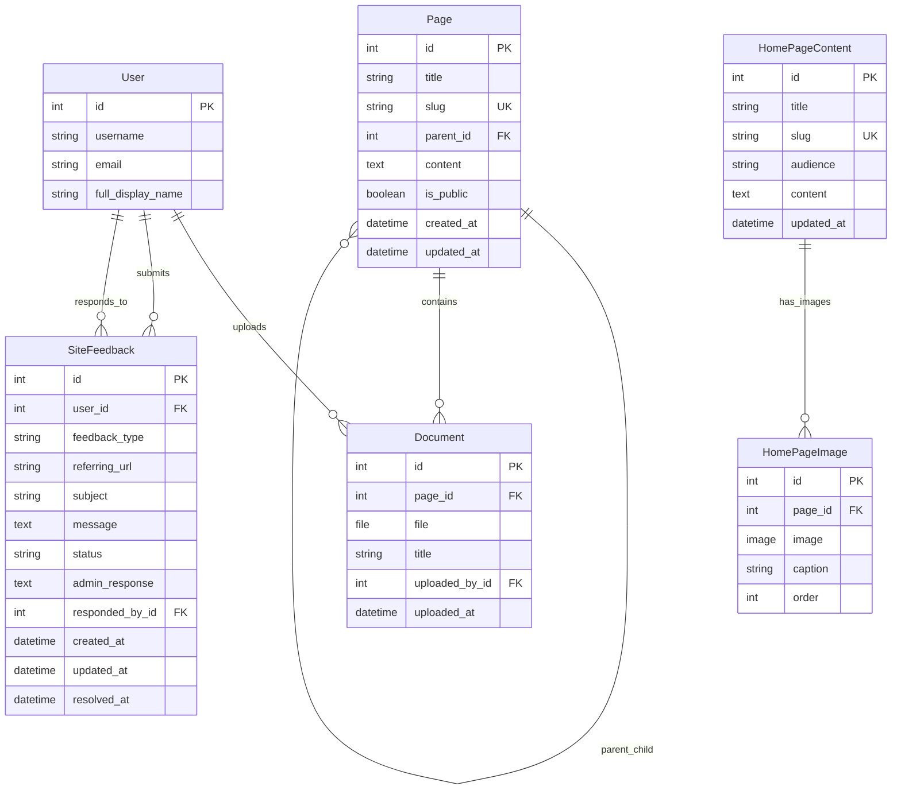

# CMS App

## Database Schema

The CMS app manages the website's pages, document attachments, and homepage content. Below is a concise reference to the current models, routes, and developer notes.

Key points
- **Audience**: Role-based editing permissions; public viewing for unrestricted pages
- **Editing**: Modern web interface with TinyMCE, PDF embedding, and file management
- **Permissions**: "If you need a token to see it, you can edit it" - webmasters have universal access
- **Route**: `/cms/` (CMS directory/index) and site root (`/`) is routed to CMS homepage content when available

Models (current)

- Page
	- title, slug, parent (self FK for hierarchy), content (HTML), is_public, created_at, updated_at
	- related_name `children` for sub-pages
	- documents: reverse relation to `Document`
	- role_permissions: Many-to-Many relation to `PageRolePermission`

- PageRolePermission (Issue #239)
	- page (FK -> Page), role_name (choices: director, treasurer, instructor, etc.)
	- Enables role-based access control for private pages
	- OR logic: users need ANY of the assigned roles to access/edit

- Document
	- page (FK -> Page), file (FileField), title, uploaded_by (user FK), uploaded_at
	- helper properties: `is_pdf`, `extension`
	- **Ordering**: Documents sorted by title first, then filename for consistency

- HomePageContent
	- slug, title, audience (public/member), content, updated_at
	- reverse relation `images` to `HomePageImage`

- HomePageImage
	- page (FK -> HomePageContent), image (ImageField), caption, order

- SiteFeedback (Issue #117)
	- user (FK -> Member), feedback_type (choices: bug_report, feature_request, general), subject, message (HTML), status (choices: open, in_progress, resolved, closed), referring_url, admin_response (HTML), responded_by (FK -> Member), created_at, updated_at, resolved_at
	- Enables site-wide feedback collection and admin management

URLs and views (current)

**Public Views:**
- `/cms/` — CMS index (list of top-level `Page` entries)
- `/cms/<slug>/` — Page detail (supports nested pages via additional path segments)
- `/cms/feedback/` — Site feedback submission form (Issue #117)
- `/cms/feedback/success/` — Feedback submission success page
- site root `/` — the project routes to `cms.views.homepage` which will render `HomePageContent` (audience-specific) when present, otherwise falls back to the CMS index

**Editing Views (Issue #273):**
- `/cms/edit/page/<id>/` — Edit CMS page with TinyMCE and file uploads (role-based permissions)
- `/cms/create/page/` — Create new CMS page with parent context (role-based permissions)
- `/cms/edit/homepage/<id>/` — Edit homepage content (webmaster-only)

Developer notes

- The CMS uses `tinymce`'s `HTMLField` for page and homepage content. Uploaded documents are stored under `cms/<page-slug>/...` or obfuscated when a page is not public (see `upload_document_to`).
- The `Page.get_absolute_url()` implements a simple two-level slug URL scheme; nested pages route via `cms.urls`.
- **Site Feedback System (Issue #117)**: Provides comprehensive feedback collection accessible via site footer. Features include form validation, referring URL capture, webmaster notifications, and full admin management with bulk actions.
- **Footer Integration**: Site footer content is managed via HomePageContent with slug 'footer', includes feedback link with referring URL parameter.
- Database relationships are documented above using Mermaid diagrams.

Templates

- `templates/cms/` holds the templates for index, page rendering, and admin-ish edit forms used by staff.
- `templates/cms/feedback_form.html` — Site feedback submission form with Bootstrap styling
- `templates/cms/feedback_success.html` — Feedback submission confirmation page
- `templates/footer.html` — Site-wide footer template with CMS content integration

Admin & permissions

**Django Admin:**
- **Webmaster Access**: Full CRUD permissions for all CMS models without superuser requirement
- **Role Management**: Intuitive inline interface for setting page role restrictions
- **Document Management**: File upload tracking with uploader attribution
- **SiteFeedback Admin**: Full-featured admin interface with list display, filtering, search, bulk status actions, and automatic response tracking

**Web Editing Interface (Issue #273):**
- **Role-Based Editing**: Users can edit pages they have viewing access to
- **Permission Model**: "Token to see = ability to edit" with webmaster override
- **Modern UI**: Bootstrap 5 styling with TinyMCE rich text editor
- **PDF Embedding**: Simple button for embedding PDF documents
- **File Management**: Drag-and-drop uploads with formset support
- **Message Integration**: Success/error feedback via Bootstrap alerts

Where to look

- Models: `cms/models.py`
- Views: `cms/views.py`
- Forms: `cms/forms.py` (includes SiteFeedbackForm)
- Admin: `cms/admin.py` (includes SiteFeedbackAdmin with custom features)
- Context Processors: `cms/context_processors.py` (footer content integration)
- Database schema is documented using Mermaid diagrams in this README

## Key Features (Issue #117)

### Site-wide Feedback System
- **User-facing**: Accessible via site footer "🛠️ Report Issue" link
- **Smart URL tracking**: Automatically captures referring page for context
- **Rich content**: TinyMCE integration for detailed feedback messages
- **Professional workflow**: Status tracking (open → in_progress → resolved/closed)
- **Admin notifications**: Automatic webmaster alerts on new submissions

### Footer Content Management
- **CMS Integration**: Footer content managed via HomePageContent with slug 'footer'
- **Dynamic content**: Supports member/public audience-specific footers
- **Context processor**: Global availability across all templates
- **Print-friendly**: Automatically excluded from print views

### Admin Interface Enhancements
- **Comprehensive management**: Full CRUD operations with advanced filtering
- **Bulk operations**: Status change actions for efficient workflow management
- **Smart field handling**: Auto-populated response tracking and readonly fields
- **Enhanced display**: Clickable referring URLs and readable responder names

Changelog
- 2025-11-19: **Issue #273** - Complete CMS editing enhancement: PDF embedding, role-based editing permissions, webmaster admin access, Bootstrap 5 modernization, document ordering
- 2025-10-26: Added comprehensive site feedback system (Issue #117) with SiteFeedback model, admin interface, footer integration, and context processors  
- 2025-10-19: Updated docs to reflect current models and relationships (Page, Document, HomePageContent, HomePageImage)
