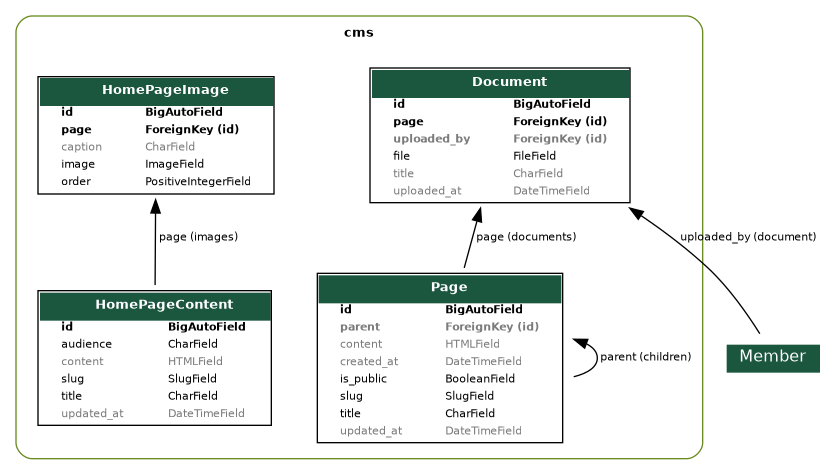

# CMS App

The CMS app manages the website's pages, document attachments, and homepage content. Below is a concise reference to the current models, routes, and developer notes. The ERD image (`cms.png`) in this folder reflects the models as of the last graph generation.

Key points
- Audience: staff may edit content via admin; members and guests may view public pages.
- Route: `/cms/` (CMS directory/index) and site root (`/`) is routed to CMS homepage content when available.

Models (current)

- Page
	- title, slug, parent (self FK for hierarchy), content (HTML), is_public, created_at, updated_at
	- related_name `children` for sub-pages
	- documents: reverse relation to `Document`

- Document
	- page (FK -> Page), file (FileField), title, uploaded_by (user FK), uploaded_at
	- helper properties: `is_pdf`, `extension`

- HomePageContent
	- slug, title, audience (public/member), content, updated_at
	- reverse relation `images` to `HomePageImage`

- HomePageImage
	- page (FK -> HomePageContent), image (ImageField), caption, order

URLs and views (current)

- `/cms/` — CMS index (list of top-level `Page` entries)
- `/cms/<slug>/` — Page detail (supports nested pages via additional path segments)
- site root `/` — the project routes to `cms.views.homepage` which will render `HomePageContent` (audience-specific) when present, otherwise falls back to the CMS index

Developer notes

- The CMS uses `tinymce`'s `HTMLField` for page and homepage content. Uploaded documents are stored under `cms/<page-slug>/...` or obfuscated when a page is not public (see `upload_document_to`).
- The `Page.get_absolute_url()` implements a simple two-level slug URL scheme; nested pages route via `cms.urls`.
- The ERD in `cms.png` and `cms.dot` are generated by `django-extensions` graph_models; regenerate if you change models.

Templates

- `templates/cms/` holds the templates for index, page rendering, and admin-ish edit forms used by staff.

Admin & permissions

- All models are registered in the admin for staff editing. Public visibility for pages/documents is controlled with `is_public` on `Page` and the `audience` field on `HomePageContent`.

Where to look

- Models: `cms/models.py`
- Views: `cms/views.py`
- ERD source: `cms/docs/cms.dot` and generated `cms/docs/cms.png`

Changelog
- 2025-10-19: Updated docs to reflect current models and relationships (Page, Document, HomePageContent, HomePageImage).
