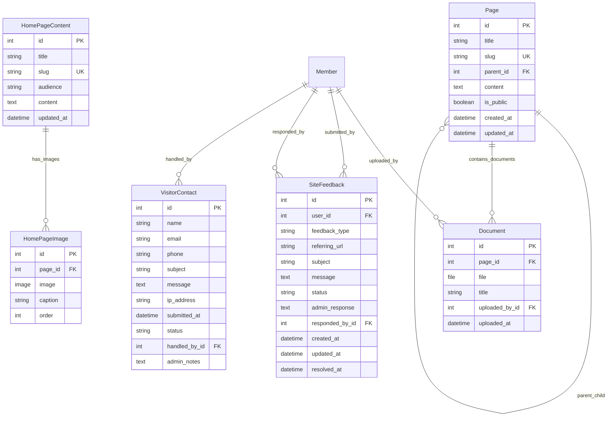

# CMS App Models

This document describes the models in the `cms` app and their relationships. See the database schema below for a visual overview.

## Database Schema

## Models

### `Page`
- Hierarchical CMS pages with parent-child relationships
- Supports both public and member-only content
- Auto-generates slugs from titles
- Contains rich HTML content via TinyMCE

### `Document`
- File attachments linked to CMS pages
- Smart upload paths: public files go to `cms/<page-slug>/`, private files are obfuscated
- Tracks uploader and upload timestamp
- Helper methods for file type detection

### `HomePageContent`
- Special content pages for the site homepage
- Audience-based content (public vs member)
- Unique slugs for different content sections
- Rich HTML content support

### `HomePageImage`
- Image gallery for homepage content
- Linked to `HomePageContent` pages
- Supports captions and ordering
- Upload paths managed by entropy-based naming

### `SiteFeedback`
- Internal feedback system for logged-in members (Issue #117)
- Categorized feedback types: bug reports, feature requests, help requests
- Status tracking workflow: open → in_progress → resolved/closed
- Admin response system with staff assignment
- Captures referring URL for context

### `VisitorContact`
- Contact form for external visitors (Issue #70)
- Replaces spam-prone `welcome@skylinesoaring.org` email
- Captures visitor details: name, email, phone, subject, message
- Anti-spam features: IP address tracking, keyword detection
- Status workflow: new → read → responded → closed
- Admin assignment and internal notes system

## Key Features

### Anti-Spam Protection
- `VisitorContact` includes IP address logging
- Form validation blocks known spam domains and keywords
- Rate limiting and honeypot fields (implemented in forms/views)

### Content Management
- Hierarchical page structure with parent-child relationships
- Public/private content segregation
- File upload with intelligent path management
- Rich text editing via TinyMCE integration

### Workflow Management
- Both `SiteFeedback` and `VisitorContact` include status tracking
- Admin assignment capabilities
- Timestamp tracking for submission, updates, and resolution

## Upload Strategies

### Document Storage
- **Public pages**: `cms/<page-slug>/<filename>`
- **Private pages**: Obfuscated paths via `upload_document_obfuscated()`

### Image Storage
- **Homepage images**: Entropy-based naming via `upload_homepage_gallery()`

## Also See
- [README.md](README.md)
- [index.md](index.md)