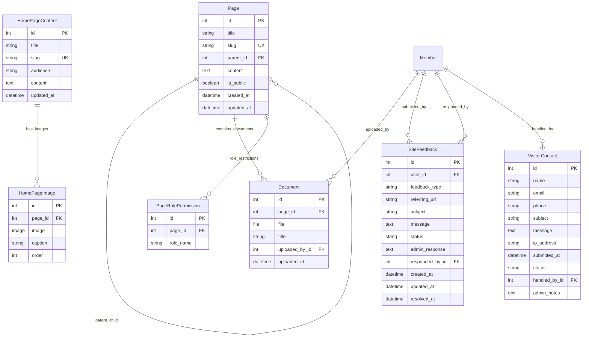

# CMS App Models

This document describes the models in the `cms` app and their relationships. See the database schema below for a visual overview.

## Database Schema



## Models

### `Page`
- Hierarchical CMS pages with parent-child relationships
- **Role-based access control**: Three access levels - public, member-only, and role-restricted
- Auto-generates slugs from titles
- Contains rich HTML content via TinyMCE
- Access control methods: `can_user_access()`, `has_role_restrictions()`, `get_required_roles()`
- Validation prevents public pages from having role restrictions

### `PageRolePermission` (Issue #239)
- Many-to-Many relationship for role-based page access control
- Restricts private pages to specific member roles (director, treasurer, instructor, etc.)
- Unique constraint prevents duplicate role assignments per page
- OR logic: users need ANY of the assigned roles to access the page
- Only applies to private pages (`is_public=False`)

### `Document`
- File attachments linked to CMS pages
- Smart upload paths: public files go to `cms/<page-slug>/`, private files are obfuscated
- Tracks uploader and upload timestamp
- Helper methods for file type detection (`is_pdf`, `extension`)
- **Default ordering**: Documents are sorted by title first, then filename (ensures consistent ordering in admin and public views)

### `HomePageContent`
- Special content pages for the site homepage
- Audience-based content (public vs member)
- Unique slugs for different content sections
- Rich HTML content support

### `HomePageImage`
- Image gallery for homepage content
- Linked to `HomePageContent` pages
- Supports captions and ordering
- Upload paths managed by entropy-based naming

### `SiteFeedback`
- Internal feedback system for logged-in members (Issue #117)
- Categorized feedback types: bug reports, feature requests, help requests
- Status tracking workflow: open → in_progress → resolved/closed
- Admin response system with staff assignment
- Captures referring URL for context

### `VisitorContact`
- Contact form for external visitors (Issue #70)
- Replaces spam-prone `welcome@skylinesoaring.org` email
- Captures visitor details: name, email, phone, subject, message
- Anti-spam features: IP address tracking, keyword detection
- Status workflow: new → read → responded → closed
- Admin assignment and internal notes system
- **Multi-club integration**: Uses `SiteConfiguration` fields for customizable contact page content, address, and operations info

## Key Features

### Anti-Spam Protection
- `VisitorContact` includes IP address logging
- Form validation blocks known spam domains and keywords
- Rate limiting and honeypot fields (implemented in forms/views)

### Content Management
- Hierarchical page structure with parent-child relationships
- **Three-tier access control**: Public (everyone) → Private (active members) → Role-restricted (specific positions)
- File upload with intelligent path management
- Rich text editing via TinyMCE integration

### Role-Based Access Control (Issue #239)
- **Page Access Levels**: Public pages, member-only pages, and role-restricted pages
- **Role Integration**: Uses Member model boolean fields (director, treasurer, instructor, etc.)
- **OR Logic Access**: Users with ANY required role gain access (not ALL roles needed)
- **Admin Interface**: Intuitive TabularInline for managing role permissions with visual indicators
- **Template Integration**: Role badges and indicators for easy identification of access restrictions
- **Validation**: Prevents invalid configurations (public pages can't have role restrictions)

### CMS Editing Permissions (Issue #273)
- **Permission Model**: "If you need a token to see it, you can edit it"
- **Webmaster Override**: Webmasters have universal edit access to all CMS content
- **Role-Based Editing**: Users can edit pages they have role-based access to view
- **Public/Member Pages**: Only webmasters can edit pages without role restrictions
- **Directory Creation**: Users can create pages in directories they have access to
- **Admin Access**: Webmasters have full CRUD access to CMS models in Django admin without superuser requirements

### Workflow Management
- Both `SiteFeedback` and `VisitorContact` include status tracking
- Admin assignment capabilities
- Timestamp tracking for submission, updates, and resolution

## CMS Editing Interface (Issue #273)

### Web-Based Editing
- **Modern Interface**: Bootstrap 5-styled editing forms with TinyMCE rich text editor
- **PDF Embedding**: Simple "📄 Insert PDF" button for embedding PDF documents
- **File Management**: Drag-and-drop file upload with formsets for multiple document attachments
- **Permission-Aware**: Edit buttons only appear for users with appropriate permissions
- **Message Integration**: Success/error messages displayed using Bootstrap alert components

### Available Editing Views
- **Edit Page**: `/cms/edit/page/<id>/` - Edit existing CMS pages with content and file uploads
- **Create Page**: `/cms/create/page/` - Create new CMS pages with parent directory context
- **Edit Homepage**: `/cms/edit/homepage/<id>/` - Edit homepage content (webmaster-only)

### Permission Logic
```python
def can_edit_page(user, page):
    # Webmaster override
    if user.is_superuser or user.webmaster:
        return True
    # Role-based editing: if page has role restrictions AND user can access it
    if page.has_role_restrictions() and page.can_user_access(user):
        return True
    # Public/member-only pages: webmaster only
    return False
```

## Upload Strategies

### Document Storage
- **Public pages**: `cms/<page-slug>/<filename>`
- **Private pages**: Obfuscated paths via `upload_document_obfuscated()`

### Image Storage
- **Homepage images**: Entropy-based naming via `upload_homepage_gallery()`

## Also See
- [README.md](README.md)
- [index.md](index.md)
- [SiteConfig Models](../../siteconfig/docs/models.md) - Multi-club configuration integration for VisitorContact
- [Issue #273 Implementation](../../resolved-issues/issue-273-tinymce-pdf-embedding-cms.md) - Complete CMS editing enhancement details
