# Offline Logsheet Architecture

## Overview

The Manage2Soar PWA supports offline flight data entry through a combination of:
- **IndexedDB** for local data storage
- **Background Sync API** for automatic syncing when connectivity returns
- **Service Worker** for request interception and offline page serving

This allows duty officers to continue logging flights even during network outages, a critical requirement for remote airfield operations.

## Architecture

```mermaid
flowchart TB
    subgraph Browser["🌐 Browser (Client)"]
        direction TB
        subgraph ClientLayer["Client Application"]
            FlightForm["📝 Flight Form<br/>(UI)"]
            SyncManager["🔄 Sync Manager<br/>(JS)"]
            IndexedDB["💾 IndexedDB<br/>Local Storage"]
            ServiceWorker["⚙️ Service Worker"]
        end

        FlightForm -->|"Save Flight"| SyncManager
        SyncManager -->|"Store Locally"| IndexedDB
        IndexedDB -.->|"Read Pending"| ServiceWorker
    end

    subgraph Network["📡 Network Layer"]
        NetworkRequest["Direct Request"]
        BackgroundSync["Background Sync Event"]
    end

    subgraph Server["🖥️ Django Server"]
        ReferenceAPI["GET reference-data/"]
        FlightsAPI["POST flights/sync/"]

        subgraph Database["🗄️ PostgreSQL"]
            Tables["flights | members | gliders<br/>towplanes | airfields"]
        end

        ReferenceAPI --> Tables
        FlightsAPI --> Tables
    end

    FlightForm -.->|"Online"| NetworkRequest
    ServiceWorker -.->|"Reconnect"| BackgroundSync
    NetworkRequest --> ReferenceAPI
    NetworkRequest --> FlightsAPI
    BackgroundSync --> FlightsAPI

    style Browser fill:#e1f5fe
    style Server fill:#e8f5e9
    style Database fill:#fff3e0
```



## Components

### 1. IndexedDB Schema (`static/js/offline/indexeddb.js`)

Local database with the following object stores:

| Store | Purpose | Key Fields |
|-------|---------|------------|
| `flights` | Offline flight entries | id, logsheet_id, pilot_id, syncStatus |
| `members` | Cached member list | id, name, display_name |
| `gliders` | Cached glider list | id, display_name, n_number |
| `towplanes` | Cached towplane list | id, name, n_number |
| `airfields` | Cached airfield list | id, identifier, name |
| `syncQueue` | Items pending sync | id, type, action, data, idempotencyKey |
| `metadata` | Cache timestamps, version | key, value |

### 2. Sync Manager (`static/js/offline/sync-manager.js`)

Handles:
- Queueing flights for offline sync
- Background Sync API registration
- Batch sync processing
- Conflict detection and resolution
- Idempotency key generation

### 3. Service Worker (`static/js/service-worker.js`)

Level 3 additions:
- Caches logsheet pages for offline access
- Intercepts offline API requests
- Serves cached reference data when offline
- Queues POST requests for Background Sync
- Handles `sync` events to upload pending flights

### 4. API Endpoints (`logsheet/api.py`)

| Endpoint | Method | Purpose |
|----------|--------|---------|
| `/logsheet/api/offline/reference-data/` | GET | Fetch members, gliders, etc. for caching |
| `/logsheet/api/offline/flights/sync/` | POST | Batch upload flights with idempotency |
| `/logsheet/api/offline/sync-status/` | GET | Check connectivity and sync status |

### 5. Sync Status UI (`logsheet/templates/logsheet/partials/sync_status.html`)

Floating indicator showing:
- Online/offline status
- Number of pending flights
- Sync in progress indicator
- Error/conflict badges
- Manual sync button

## Data Flow

### Online Flow
1. User fills flight form
2. Form submits to server directly
3. Server creates flight in PostgreSQL
4. Success response updates UI

### Offline Flow
1. User fills flight form
2. Sync Manager saves to IndexedDB with `syncStatus: 'pending'`
3. Generates idempotency key for deduplication
4. Registers for Background Sync
5. UI shows "1 flight pending sync"

### Reconnection Flow
1. Browser detects network connectivity
2. Background Sync event fires
3. Service Worker retrieves pending items from IndexedDB
4. Batch POST to `/flights/sync/` endpoint
5. Server processes with idempotency check
6. Successful items marked as synced
7. Conflicts/errors stored for user resolution
8. UI notified via `postMessage`

## Conflict Resolution

Three strategies available (configurable):

1. **Server Wins** (default): Accept server version, discard local changes
2. **Client Wins**: Force push local version
3. **Manual**: Present both versions to user for resolution

Conflicts detected via:
- Version timestamp comparison
- Missing referenced entities
- Business rule violations

## Idempotency

Every offline flight gets a unique idempotency key:
```javascript
`flight-${timestamp}-${random}`
```

Server maintains cache of processed keys to prevent duplicates when:
- Background Sync retries
- User force-syncs manually
- Network flakes cause request replay

## Reference Data Caching

On member login (or manual refresh):
1. Fetch `/api/offline/reference-data/`
2. Store in IndexedDB stores
3. Record cache timestamp in metadata
4. Use cached data when offline

Data cached:
- Active members (id, name)
- Active gliders (id, display_name, seats)
- Active towplanes (id, name, n_number)
- Active airfields (id, identifier, name)
- Flight types (value, label pairs)
- Release altitudes (0-7000 in 100ft increments)
- Launch methods (tow, winch, self, other)

## Testing

### Django API Tests
```bash
pytest logsheet/tests/test_offline_api.py -v
```

### Manual Testing
1. Open DevTools > Application > Service Workers
2. Check "Offline" in Network panel
3. Try adding a flight
4. Observe IndexedDB > manage2soar-offline > syncQueue
5. Uncheck "Offline"
6. Watch console for sync events

## Troubleshooting

### "Flights stuck in pending"
1. Check DevTools Console for sync errors
2. Verify service worker is active
3. Check IndexedDB syncQueue for error messages
4. Try manual sync via status modal

### "Reference data not loading offline"
1. Ensure user logged in while online first
2. Check IndexedDB has cached data
3. Verify metadata.referenceDataCached timestamp
4. Try manual refresh via service worker message

### "Duplicate flights created"
1. Check idempotency cache (server-side)
2. Verify idempotencyKey in syncQueue items
3. May need to clear browser IndexedDB and re-sync

## Future Enhancements

- [ ] Flight form offline-first modifications
- [ ] Login page data pre-caching trigger
- [ ] Conflict resolution UI for manual mode
- [ ] Periodic sync worker (not just on reconnect)
- [ ] WebSocket for real-time sync status
