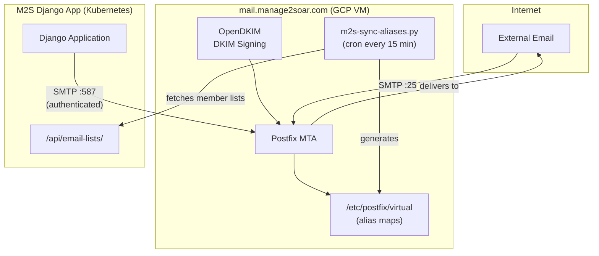

# Issue #238: Email Infrastructure Setup

## Status: In Progress

**Issue:** [#238 - Allow M2S to send and receive email](https://github.com/pietbarber/Manage2Soar/issues/238)

**Started:** 2025-11-30

---

## Overview

Setting up a self-hosted Postfix mail server on GCP to handle:
1. **Outbound transactional email** from M2S (notifications, password resets)
2. **Inbound mailing lists** (members@, instructors@, towpilots@, board@)
3. **Multi-tenant support** for 50+ clubs under `*.manage2soar.com`

## Architecture Decision

After evaluating options (SendGrid, Mailgun, Google Workspace, self-hosted), decided on **self-hosted Postfix** because:

- Need 4+ mailing lists per club (not supported on free tiers)
- Need reply-to-list functionality
- Scale to 50+ clubs in 2-3 years
- Full control over sender domains
- No per-message costs

### Architecture Diagram



## Implementation Plan

### Phase 1: Basic Outbound ⬜ Not Started
- [ ] Provision GCP VM (Debian 12, e2-small)
- [ ] Run Ansible playbook for Postfix + OpenDKIM
- [ ] Configure DNS (SPF, DKIM, DMARC) for manage2soar.com
- [ ] Update Django settings for SMTP
- [ ] Test: Password resets, notifications work

### Phase 2: Multi-Domain Support ⬜ Not Started
- [ ] Add DKIM keys for club subdomains (ssc, masa, etc.)
- [ ] Update M2S to use per-tenant FROM address
- [ ] DNS records for each subdomain
- [ ] Test: Emails from each club domain

### Phase 3: Mailing Lists ⬜ Not Started
- [ ] Create M2S API endpoint `/api/email-lists/`
- [ ] Management command to sync aliases
- [ ] Sender whitelist (only members can post)
- [ ] Reply-to-list headers
- [ ] Test: Send to members@ssc.manage2soar.com

### Phase 4: Production Hardening ⬜ Not Started
- [ ] Monitoring (Postfix queue, delivery rates)
- [ ] Alerting on queue buildup
- [ ] Log rotation
- [ ] Backup DKIM keys

---

## Files Created

### Ansible Infrastructure

```
infrastructure/
├── README.md                           # Full documentation
├── ansible/
│   ├── ansible.cfg                     # Ansible configuration
│   ├── inventory/
│   │   └── hosts.yml.example           # Template (copy to hosts.yml)
│   ├── group_vars/
│   │   └── all.yml.example             # Template with all variables
│   ├── playbooks/
│   │   └── mail-server.yml             # Main playbook
│   └── roles/
│       ├── common/                     # Base system (UFW, fail2ban)
│       │   ├── tasks/main.yml
│       │   └── handlers/main.yml
│       ├── postfix/                    # MTA with virtual aliases
│       │   ├── tasks/main.yml
│       │   ├── handlers/main.yml
│       │   └── templates/
│       │       ├── main.cf.j2
│       │       ├── master.cf.j2
│       │       ├── virtual_domains.j2
│       │       └── sasl_passwd.j2
│       ├── opendkim/                   # DKIM signing per domain
│       │   ├── tasks/main.yml
│       │   ├── handlers/main.yml
│       │   └── templates/
│       │       ├── opendkim.conf.j2
│       │       ├── KeyTable.j2
│       │       ├── SigningTable.j2
│       │       └── TrustedHosts.j2
│       └── m2s-mail-sync/              # Sync script from M2S API
│           ├── tasks/main.yml
│           └── templates/
│               ├── sync-aliases.py.j2
│               └── sync-config.yml.j2
```

### Security Configuration

Updated `.gitignore` to exclude:
- `infrastructure/ansible/inventory/hosts.yml` (real IPs)
- `infrastructure/ansible/group_vars/all.yml` (passwords)
- `infrastructure/ansible/group_vars/*.vault.yml` (encrypted secrets)

Updated `.dockerignore` to exclude:
- `infrastructure/` (not needed in Docker image)

---

## Configuration Required

### DNS Records (per club subdomain)

For each club (e.g., `ssc.manage2soar.com`):

```dns
; MX record - route mail to our server
ssc.manage2soar.com.  IN  MX  10 mail.manage2soar.com.

; SPF record - authorize our server to send
ssc.manage2soar.com.  IN  TXT "v=spf1 mx a:mail.manage2soar.com -all"

; DKIM record - public key for signature verification
mail._domainkey.ssc.manage2soar.com.  IN  TXT "v=DKIM1; k=rsa; p=<public-key>"

; DMARC policy - what to do with failures
_dmarc.ssc.manage2soar.com.  IN  TXT "v=DMARC1; p=quarantine; rua=mailto:dmarc@manage2soar.com"
```

### Django Settings (to be added)

```python
# Production email configuration
if not DEBUG:
    EMAIL_BACKEND = "django.core.mail.backends.smtp.SMTPBackend"
    EMAIL_HOST = os.getenv("EMAIL_HOST", "mail.manage2soar.com")
    EMAIL_PORT = int(os.getenv("EMAIL_PORT", "587"))
    EMAIL_USE_TLS = True
    EMAIL_HOST_USER = os.getenv("EMAIL_HOST_USER")
    EMAIL_HOST_PASSWORD = os.getenv("EMAIL_HOST_PASSWORD")

    # Per-tenant FROM address
    DEFAULT_FROM_EMAIL = os.getenv(
        "DEFAULT_FROM_EMAIL",
        f"noreply@{os.getenv('CLUB_PREFIX', 'default')}.manage2soar.com"
    )
```

---

## Mailing Lists per Club

Each club automatically gets these lists (populated from member database):

| List | Source | Description |
|------|--------|-------------|
| `members@{club}.manage2soar.com` | All active members with email | General announcements |
| `instructors@{club}.manage2soar.com` | `is_instructor=True` | Instructor coordination |
| `towpilots@{club}.manage2soar.com` | `is_towpilot=True` | Tow pilot scheduling |
| `board@{club}.manage2soar.com` | `is_board_member=True` | Board discussions |

**Security:** Lists are whitelist-only - only club members can send to them.

---

## Still TODO (Django side)

1. **Create API endpoint** `/api/email-lists/`
   - Returns member lists grouped by role
   - Returns whitelist of allowed senders
   - Secured by API key

2. **Update settings.py** for production SMTP

3. **Test email sending** from Django

---

## Session Log

### 2025-11-30

- Discussed email architecture options
- Decided on self-hosted Postfix + OpenDKIM
- Created full Ansible playbook structure in `infrastructure/ansible/`
- Updated `.gitignore` and `.dockerignore` for security
- Created 4 roles: common, postfix, opendkim, m2s-mail-sync
- All YAML files validated

**Next session:** Provision GCP VM, run Ansible playbook, configure DNS

---

## References

- [Issue #238](https://github.com/pietbarber/Manage2Soar/issues/238)
- [Postfix Virtual Alias Documentation](http://www.postfix.org/VIRTUAL_README.html)
- [OpenDKIM Configuration](http://opendkim.org/opendkim.conf.5.html)
- [Multi-Tenant Deployment Guide](../multi-tenant-deployment.md)
