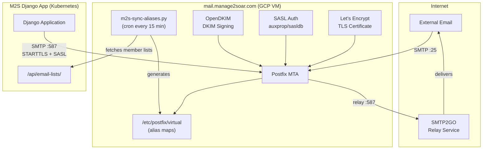

# Issue #238: Email Infrastructure Setup

## Status: ✅ Resolved

**Issue:** [#238 - Allow M2S to send and receive email](https://github.com/pietbarber/Manage2Soar/issues/238)

**Started:** 2025-11-30  
**Completed:** 2025-12-03

---

## Overview

Self-hosted Postfix mail server on GCP handling:
1. **Outbound transactional email** from M2S (notifications, password resets)
2. **Inbound mailing lists** (members@, instructors@, towpilots@, board@) - *future phase*
3. **Multi-tenant support** for 50+ clubs under `*.manage2soar.com` - *future phase*

## Architecture Decision

After evaluating options (SendGrid, Mailgun, Google Workspace, self-hosted), decided on **self-hosted Postfix** because:

- Need 4+ mailing lists per club (not supported on free tiers)
- Need reply-to-list functionality
- Scale to 50+ clubs in 2-3 years
- Full control over sender domains
- No per-message costs

### Architecture Diagram



## Implementation Status

### Phase 1: Basic Outbound ✅ Complete
- [x] Provision GCP VM (Debian 12, e2-small)
- [x] Run Ansible playbook for Postfix + OpenDKIM
- [x] Configure DNS (SPF, DKIM, DMARC) for manage2soar.com
- [x] Update Django settings for SMTP
- [x] Configure SASL authentication (auxprop/sasldb)
- [x] Obtain Let's Encrypt TLS certificate
- [x] Test: Password resets, notifications work

### Phase 2: Multi-Domain Support ⬜ Future
- [ ] Add DKIM keys for club subdomains (ssc, masa, etc.)
- [ ] Update M2S to use per-tenant FROM address
- [ ] DNS records for each subdomain
- [ ] Test: Emails from each club domain

### Phase 3: Mailing Lists ⬜ Future
- [ ] Create M2S API endpoint `/api/email-lists/`
- [ ] Management command to sync aliases
- [ ] Sender whitelist (only members can post)
- [ ] Reply-to-list headers
- [ ] Test: Send to members@ssc.manage2soar.com

### Phase 4: Production Hardening ⬜ Future
- [ ] Monitoring (Postfix queue, delivery rates)
- [ ] Alerting on queue buildup
- [ ] Log rotation
- [ ] Backup DKIM keys

---

## Current Production Configuration

### Django Environment Variables

```bash
EMAIL_HOST=mail.manage2soar.com
EMAIL_PORT=587
EMAIL_USE_TLS=True
EMAIL_HOST_USER=<username>@manage2soar.com   # Full username with domain required
EMAIL_HOST_PASSWORD=<password>
EMAIL_DEV_MODE=true                           # Safety valve - redirects all emails
EMAIL_DEV_MODE_REDIRECT_TO=<your-email>
```

### Kubernetes Secrets (GKE)

```bash
kubectl patch secret manage2soar-env --patch='{"stringData":{
  "EMAIL_HOST":"mail.manage2soar.com",
  "EMAIL_PORT":"587",
  "EMAIL_USE_TLS":"True",
  "EMAIL_HOST_USER":"<username>@manage2soar.com",
  "EMAIL_HOST_PASSWORD":"<password>",
  "EMAIL_DEV_MODE":"true",
  "EMAIL_DEV_MODE_REDIRECT_TO":"<your-email>"
}}'
kubectl rollout restart deployment/django-app
```

### SASL Authentication Architecture

Django authenticates to Postfix using SASL with **auxprop/sasldb** (not saslauthd):

| Component | Path | Notes |
|-----------|------|-------|
| SASL config | `/var/spool/postfix/etc/sasl2/smtpd.conf` | Inside Postfix chroot |
| SASL database | `/var/spool/postfix/etc/sasldb2` | Copied from `/etc/sasldb2` |
| OpenDKIM socket | `/var/spool/postfix/opendkim/opendkim.sock` | Inside Postfix chroot |
| TLS certificate | `/etc/letsencrypt/live/mail.manage2soar.com/` | Let's Encrypt |

**Why auxprop instead of saslauthd?**
- Postfix runs in a chroot at `/var/spool/postfix`
- saslauthd uses a socket at `/var/run/saslauthd/` which is outside the chroot
- auxprop with sasldb keeps everything inside the chroot

### GCP Firewall Rules

```
smtp587-from-gke:
  - Source: 34.29.120.45/32, 34.68.161.166/32 (K8s nodes)
  - Destination: port 587
  - Target: mail server
```

### SMTP2GO Relay

GCP blocks outbound port 25, so Postfix relays through SMTP2GO:

```
# In Postfix main.cf
relayhost = [mail.smtp2go.com]:587
smtp_sasl_auth_enable = yes
smtp_sasl_password_maps = hash:/etc/postfix/sasl_passwd
```

---

## Files Created

### Ansible Infrastructure

```
infrastructure/
├── README.md                           # Full documentation
├── ansible/
│   ├── ansible.cfg                     # Ansible configuration
│   ├── inventory/
│   │   └── hosts.yml.example           # Template (copy to hosts.yml)
│   ├── group_vars/
│   │   └── all.yml.example             # Template with all variables
│   ├── playbooks/
│   │   └── mail-server.yml             # Main playbook
│   └── roles/
│       ├── common/                     # Base system (UFW, fail2ban)
│       │   ├── tasks/main.yml
│       │   └── handlers/main.yml
│       ├── postfix/                    # MTA with SASL auth
│       │   ├── tasks/main.yml          # Configures auxprop SASL
│       │   ├── handlers/main.yml
│       │   └── templates/
│       │       ├── main.cf.j2
│       │       ├── master.cf.j2
│       │       ├── virtual_domains.j2
│       │       └── sasl_passwd.j2
│       ├── opendkim/                   # DKIM signing per domain
│       │   ├── tasks/main.yml          # Socket in Postfix chroot
│       │   ├── handlers/main.yml
│       │   └── templates/
│       │       ├── opendkim.conf.j2
│       │       ├── KeyTable.j2
│       │       ├── SigningTable.j2
│       │       └── TrustedHosts.j2
│       └── m2s-mail-sync/              # Sync script from M2S API
│           ├── tasks/main.yml
│           └── templates/
│               ├── sync-aliases.py.j2
│               └── sync-config.yml.j2
```

### Security Configuration

Updated `.gitignore` to exclude:
- `infrastructure/ansible/inventory/hosts.yml` (real IPs)
- `infrastructure/ansible/group_vars/all.yml` (passwords)
- `infrastructure/ansible/group_vars/*.vault.yml` (encrypted secrets)

Updated `.dockerignore` to exclude:
- `infrastructure/` (not needed in Docker image)

---

## Configuration Required

### DNS Records (per club subdomain)

For each club (e.g., `ssc.manage2soar.com`):

```dns
; MX record - route mail to our server
ssc.manage2soar.com.  IN  MX  10 mail.manage2soar.com.

; SPF record - authorize our server to send
ssc.manage2soar.com.  IN  TXT "v=spf1 mx a:mail.manage2soar.com -all"

; DKIM record - public key for signature verification
mail._domainkey.ssc.manage2soar.com.  IN  TXT "v=DKIM1; k=rsa; p=<public-key>"

; DMARC policy - what to do with failures
_dmarc.ssc.manage2soar.com.  IN  TXT "v=DMARC1; p=quarantine; rua=mailto:dmarc@manage2soar.com"
```

---

## Mailing Lists per Club (Future)

Each club will automatically get these lists (populated from member database):

| List | Source | Description |
|------|--------|-------------|
| `members@{club}.manage2soar.com` | All active members with email | General announcements |
| `instructors@{club}.manage2soar.com` | `is_instructor=True` | Instructor coordination |
| `towpilots@{club}.manage2soar.com` | `is_towpilot=True` | Tow pilot scheduling |
| `board@{club}.manage2soar.com` | `is_board_member=True` | Board discussions |

**Security:** Lists are whitelist-only - only club members can send to them.

---

## Session Log

### 2025-11-30

- Discussed email architecture options
- Decided on self-hosted Postfix + OpenDKIM
- Created full Ansible playbook structure in `infrastructure/ansible/`
- Updated `.gitignore` and `.dockerignore` for security
- Created 4 roles: common, postfix, opendkim, m2s-mail-sync
- All YAML files validated

### 2025-12-02 / 2025-12-03

- Deployed mail server to GCP VM
- Discovered GCP blocks port 25 → configured SMTP2GO relay
- Obtained Let's Encrypt TLS certificate for mail.manage2soar.com
- Configured SASL authentication:
  - Initial attempt with saslauthd failed (chroot issue)
  - Switched to auxprop with sasldb (works inside Postfix chroot)
  - User must be `user@domain` format for SASL
- Moved OpenDKIM socket into Postfix chroot
- Opened GCP firewall port 587 for K8s nodes
- Successfully tested email end-to-end from Django
- Backported all manual fixes to Ansible playbooks (PR #351)

---

## Troubleshooting

### Common Issues

**"454 TLS not available due to local problem"**
- TLS certificate missing or expired
- Fix: `certbot certonly --standalone -d mail.manage2soar.com`

**"535 5.7.8 Error: authentication failed"**
- SASL user not in database or wrong format
- User must be `user@domain` not just `user`
- Check: `sasldblistusers2`
- Fix: `saslpasswd2 -c -u manage2soar.com m2s-app`

**"No worthy mechs found"**
- SASL config not in Postfix chroot
- Check: `/var/spool/postfix/etc/sasl2/smtpd.conf` exists
- Check: `/var/spool/postfix/etc/sasldb2` exists

**OpenDKIM socket not found**
- Socket must be inside Postfix chroot
- Path: `/var/spool/postfix/opendkim/opendkim.sock`
- Milter path: `unix:/opendkim/opendkim.sock` (chroot-relative)

---

## References

- [Issue #238](https://github.com/pietbarber/Manage2Soar/issues/238)
- [PR #350 - Email Dev Mode Feature](https://github.com/pietbarber/Manage2Soar/pull/350)
- [PR #351 - Ansible Postfix Fixes](https://github.com/pietbarber/Manage2Soar/pull/351)
- [Postfix Virtual Alias Documentation](http://www.postfix.org/VIRTUAL_README.html)
- [OpenDKIM Configuration](http://opendkim.org/opendkim.conf.5.html)
- [Postfix SASL README](http://www.postfix.org/SASL_README.html)
- [Multi-Tenant Deployment Guide](../multi-tenant-deployment.md)
- [Infrastructure README](../../infrastructure/README.md)
