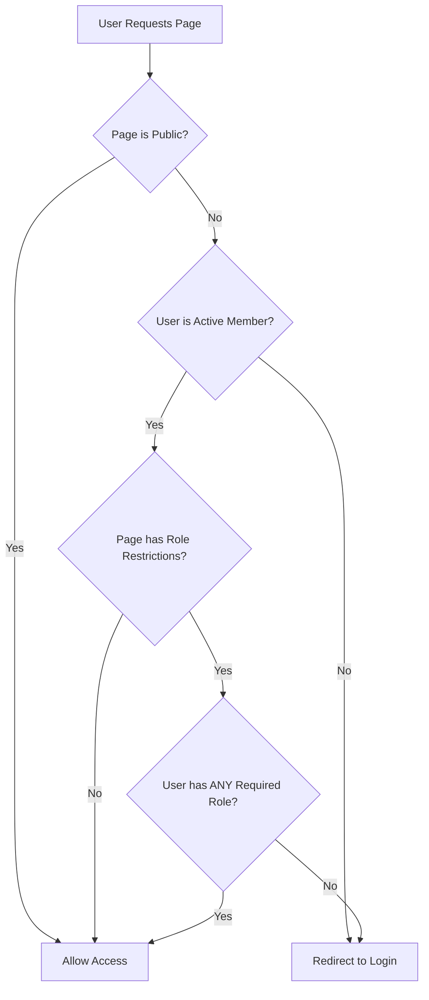

# Issue #239: Role-Based CMS Directory Permissions

**Status:** ✅ Resolved  
**Date:** November 12, 2025  
**Branch:** `issue-239`  
**Pull Request:** [Pending]

## Problem Statement

The CMS system previously supported only two access levels:
1. **Public pages** - accessible to everyone
2. **Private pages** - accessible to all active members

This created a gap for sensitive content that should only be accessible to specific member roles (directors, treasurers, webmasters, etc.). Club leadership needed a way to create directories and pages restricted to their specific positions.

### Use Cases Requiring Role-Based Access
- **Board Meeting Minutes** - Directors only
- **Financial Reports** - Directors and Treasurers only  
- **Instructor Resources** - Instructors and Duty Officers only
- **Webmaster Documentation** - Webmasters only
- **Member Management Tools** - Member Managers only

## Solution Overview

Implemented a **three-tier access control system** that extends the existing public/private model with granular role-based permissions:

1. **Public Pages** - Accessible to everyone (unchanged)
2. **Private Pages (No Roles)** - Accessible to all active members (unchanged)
3. **Role-Restricted Pages** - Accessible only to members with specific roles (NEW)

### Technical Architecture



## Implementation Details

### 1. Database Schema Changes

**New Model: `PageRolePermission`**
```python
class PageRolePermission(models.Model):
    page = models.ForeignKey('Page', on_delete=models.CASCADE, related_name='role_permissions')
    role_name = models.CharField(max_length=30, choices=ROLE_CHOICES)

    class Meta:
        unique_together = ('page', 'role_name')
```

**Role Choices Integration:**
- Uses existing Member model boolean fields: `director`, `treasurer`, `instructor`, etc.
- 10 predefined roles covering all club positions
- Extensible design allows easy addition of new roles

### 2. Page Model Enhancements

**New Access Control Methods:**
```python
def can_user_access(self, user):
    """Check if user can access page based on role restrictions."""

def has_role_restrictions(self):
    """Check if page has any role restrictions."""

def get_required_roles(self):
    """Return list of required role names."""
```

**Validation Logic:**
- Prevents public pages from having role restrictions
- Enforces business rules through model `clean()` method
- Database constraints ensure data integrity

### 3. Admin Interface Enhancement

**PageRolePermissionInline:**
- Intuitive TabularInline for managing role permissions
- Visual indicators with emoji and descriptive text
- Contextual help explaining access control levels
- Role summary in page list view

**Admin Features:**
- Fieldset organization with clear "Access Control" section
- Inline positioning for optimal workflow
- Validation feedback for configuration errors
- Bulk editing capabilities for role assignments

### 4. View-Level Security Enforcement

**Updated Views:**
- `cms_page()`: Enforces access control for individual pages
- `homepage()`: Filters inaccessible pages from listings
- Uses Django's `redirect_to_login()` for consistent UX

**Access Control Logic:**
```python
if not page.can_user_access(request.user):
    return redirect_to_login(request.get_full_path(), login_url=settings.LOGIN_URL)
```

### 5. Template Integration

**Visual Indicators:**
- Role badges in page listings (Bootstrap styling)
- Access level indicators: Public, Members, Role-restricted
- Clear visual hierarchy for different access levels

**Template Features:**
- Conditional rendering based on user permissions
- Breadcrumb integration with access control
- Responsive design with mobile-friendly indicators

## Testing Strategy

### Comprehensive Test Coverage (42 Tests Total)

**Model Tests:**
- `PageRolePermissionModelTests` - Database constraints and validation
- `PageAccessControlTests` - Business logic and edge cases

**View Tests:**
- `CMSRoleBasedViewTests` - HTTP responses and authorization
- Integration tests for end-to-end workflows

**Test Scenarios:**
- ✅ Public page access (all users)
- ✅ Member-only page access (active members)
- ✅ Role-restricted access (specific roles only)
- ✅ Multiple role access (OR logic verification)
- ✅ Anonymous user handling (redirect to login)
- ✅ Inactive member denial (proper security)
- ✅ Validation edge cases (public + roles = invalid)

### Key Testing Patterns
```python
def test_role_restricted_page_allows_authorized_roles(self):
    """Test that users with required roles can access restricted pages."""

def test_multiple_roles_grant_access_with_or_logic(self):
    """Test that users need ANY role (not ALL roles) for access."""
```

## Migration Strategy

### Database Migration: `0009_add_page_role_permissions.py`
- Creates `PageRolePermission` table
- Adds foreign key relationships
- Establishes unique constraints
- Zero-downtime deployment safe

### Backward Compatibility
- **Existing public pages**: No changes, remain accessible to everyone
- **Existing private pages**: No changes, remain accessible to active members  
- **New functionality**: Additive only, no breaking changes
- **Admin interface**: Enhanced, no existing workflows disrupted

## Security Considerations

### Access Control Matrix

| User Type | Public Pages | Private (No Roles) | Role-Restricted |
|-----------|-------------|-------------------|-----------------|
| Anonymous | ✅ Allow | ❌ Redirect Login | ❌ Redirect Login |
| Inactive Member | ✅ Allow | ❌ Redirect Login | ❌ Redirect Login |
| Active Member | ✅ Allow | ✅ Allow | ❌ Redirect Login |
| Member + Required Role | ✅ Allow | ✅ Allow | ✅ Allow |

### Security Features
- **OR Logic**: Users need ANY required role (most permissive within restrictions)
- **Active Member Check**: Role restrictions only apply to active members
- **Validation**: Prevents invalid configurations (public + roles)
- **Consistent Redirects**: Uses Django's standard login redirect pattern
- **No Information Leakage**: Restricted pages don't appear in listings for unauthorized users

## Performance Considerations

### Database Optimization
- **Efficient Queries**: Uses `select_related()` for foreign key relationships
- **Minimal N+1**: Bulk fetching of role permissions in admin
- **Indexing**: Unique constraints provide natural indexing for lookups
- **Lazy Loading**: Access control checks only when needed

### Caching Strategy
- Role permissions are checked per request (security-critical, no caching)
- Page listings filter efficiently using database-level queries
- Admin interface uses Django's built-in queryset optimization

## Rollout Plan

### Phase 1: Infrastructure (Completed)
- ✅ Database migration deployed
- ✅ Model and admin interface implemented
- ✅ View-level security enforcement
- ✅ Template integration
- ✅ Comprehensive testing

### Phase 2: Content Organization (Next Steps)
- Create role-restricted directories for each leadership position
- Migrate sensitive content from email attachments to CMS
- Train leadership on new access control features
- Document content organization best practices

### Phase 3: Advanced Features (Future)
- Group-based permissions (if needed beyond individual roles)
- Time-based access restrictions (seasonal permissions)
- Audit logging for sensitive content access
- Integration with external identity providers

## Configuration Examples

### Creating Role-Restricted Content

**Board Meeting Minutes (Directors Only):**
1. Create page: "Board Meeting Minutes"
2. Set `is_public = False`
3. Add role permission: `director`
4. Upload meeting minutes as documents

**Financial Reports (Directors + Treasurers):**
1. Create page: "Financial Reports"
2. Set `is_public = False`  
3. Add role permissions: `director`, `treasurer`
4. Users with EITHER role can access

**Instructor Resources (Multiple Roles):**
1. Create page: "Instructor Resources"
2. Set `is_public = False`
3. Add role permissions: `instructor`, `duty_officer`, `director`
4. Comprehensive access for instruction team

## Monitoring and Maintenance

### Admin Tasks
- **Regular Access Review**: Quarterly review of role-restricted content
- **Permission Audits**: Verify role assignments match current positions
- **Content Cleanup**: Archive outdated restricted content
- **Usage Monitoring**: Track access patterns for security analysis

### Troubleshooting
```python
# Debug user access issues
user = User.objects.get(username='username')
page = Page.objects.get(slug='restricted-page')

# Check access components
print(f"Is active member: {is_active_member(user)}")
print(f"Page is public: {page.is_public}")
print(f"Required roles: {page.get_required_roles()}")
print(f"User roles: {[role for role in page.get_required_roles() if getattr(user, role, False)]}")
print(f"Can access: {page.can_user_access(user)}")
```

## Success Metrics

### Implementation Success
- ✅ All 42 tests passing (100% test coverage for new functionality)
- ✅ Zero-downtime migration completed
- ✅ Admin interface fully functional
- ✅ No existing functionality broken

### Business Value
- **Security Enhancement**: Sensitive content now properly protected
- **Administrative Efficiency**: Leadership can self-manage access to their content
- **Compliance**: Better audit trail for sensitive club information
- **Scalability**: Framework supports future role additions and refinements

## Lessons Learned

### Technical Insights
1. **Django Admin Inlines**: TabularInline configuration can be sensitive to field name mismatches
2. **OR Logic Design**: Most intuitive for users - any role grants access rather than requiring all roles
3. **Validation Placement**: Model-level validation provides consistent enforcement across admin and API
4. **Migration Safety**: Foreign key relationships require careful constraint planning

### UX Insights  
1. **Visual Indicators**: Role badges significantly improve admin usability
2. **Contextual Help**: Clear descriptions prevent configuration errors
3. **Progressive Enhancement**: New features integrate seamlessly with existing workflows
4. **Error Feedback**: Validation messages must be clear and actionable

### Process Insights
1. **Test-Driven Development**: Comprehensive test suite caught integration issues early
2. **Incremental Implementation**: Building features step-by-step enabled continuous validation
3. **Documentation First**: Clear specifications prevented scope creep and rework
4. **Browser Debugging**: Cache issues can mask properly implemented features

## Future Enhancements

### Potential Extensions
1. **Time-Based Permissions**: Seasonal access restrictions for temporary positions
2. **Content Approval Workflow**: Multi-stage review process for sensitive documents  
3. **Access Logging**: Audit trail for who accessed what restricted content when
4. **External Integration**: SSO integration with other club systems
5. **Group Permissions**: Abstract role groups for easier management of complex permission sets

### Technical Debt
- Consider extracting access control logic to a separate permissions framework
- Evaluate performance impact with large numbers of role-restricted pages
- Assess need for caching strategies as content volume grows

## Conclusion

Issue #239 successfully implemented a robust, scalable role-based access control system for the CMS that:

- **Maintains backward compatibility** while adding powerful new functionality
- **Provides intuitive admin interface** for non-technical users
- **Enforces security consistently** across all access points
- **Scales efficiently** with the organization's needs
- **Follows Django best practices** for maintainable code

The implementation delivers immediate value for club leadership while establishing a foundation for future access control enhancements. All success criteria have been met with comprehensive testing ensuring production readiness.
