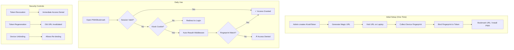
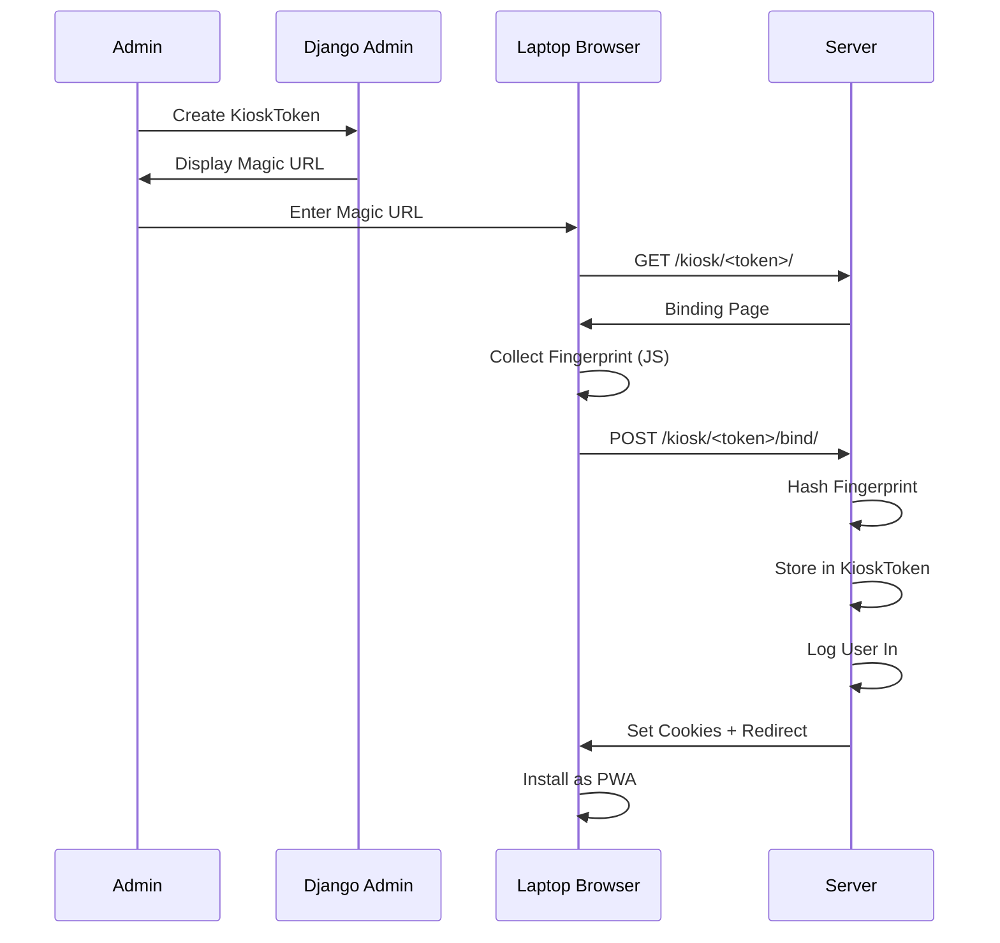
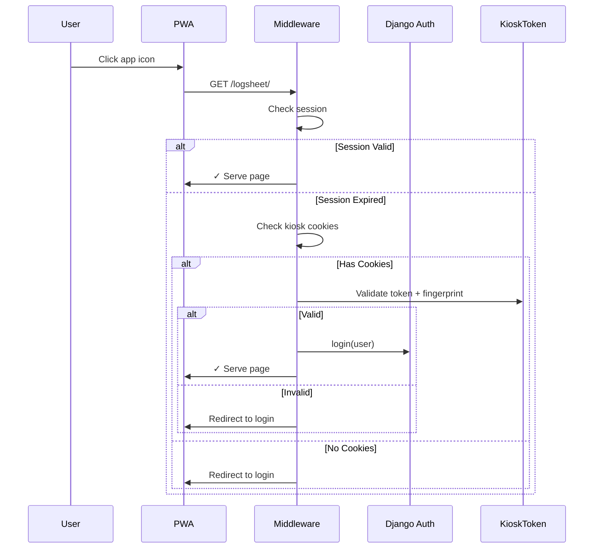
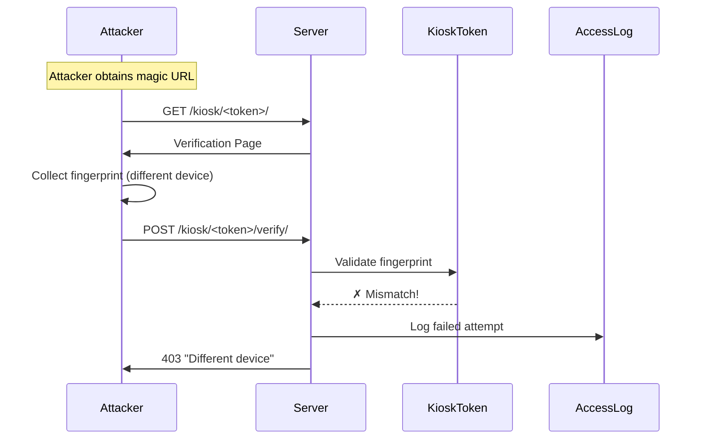

# Kiosk Token Authentication (Issue #364)

This document describes the kiosk authentication system that enables passwordless login for dedicated club devices (e.g., the club laptop at the airfield).

## Problem Statement

The club laptop at the airfield needs to allow duty officers to enter flight data without:
- Requiring them to remember individual passwords
- Using a shared password on a "post-it note" that could be compromised
- Risking lockout if someone accidentally clicks logout

## Solution Overview

A **magic URL + device binding** system that:
1. Uses a cryptographically secure token in a bookmarked URL
2. Binds the token to a specific device via browser fingerprinting
3. Auto-reauthenticates if the session expires
4. Hides the logout button for kiosk users
5. Provides full audit logging and revocation capabilities

## Architecture

## Components

### 1. KioskToken Model

Located in `members/models.py`:

| Field | Type | Purpose |
|-------|------|---------|
| `user` | ForeignKey | Role account to authenticate as |
| `token` | CharField | Cryptographic token (auto-generated) |
| `name` | CharField | Human-readable identifier |
| `device_fingerprint` | CharField | SHA-256 hash of device characteristics |
| `is_active` | BooleanField | Can be revoked instantly |
| `landing_page` | CharField | Where to redirect after auth |
| `last_used_at` | DateTimeField | For auditing |
| `last_used_ip` | GenericIPAddressField | For auditing |

### 2. Device Fingerprinting

JavaScript in the binding/verification pages collects:
- User Agent
- Screen resolution and color depth
- Timezone
- Platform and language
- Hardware concurrency (CPU cores)
- Canvas fingerprint (GPU-specific)
- WebGL renderer info
- Audio context sample rate

These are combined and hashed to create a semi-unique device identifier.

### 3. Auto-Reauth Middleware

`utils.middleware.KioskAutoLoginMiddleware`:
- Runs on every request AFTER Django's AuthenticationMiddleware
- Checks for `kiosk_token` and `kiosk_fingerprint` cookies
- If present and valid, automatically logs in the user
- Prevents logout from locking out kiosk users

### 4. Template Tag

``:
- Returns True if current session is a kiosk session
- Used to hide logout button for kiosk users
- Displays "(Kiosk)" indicator in navbar

## Workflow Diagrams

### Initial Device Binding

### Daily Authentication

### Security: Stolen URL Attack

## Admin Interface

### Kiosk Tokens List

- View all tokens with status, binding state, last use
- Actions: Revoke, Regenerate, Unbind

### Token Detail

- Magic URL display (copy to clipboard)
- Device fingerprint (read-only)
- Usage statistics
- Notes field

### Access Logs

- Timestamp, token, status, IP, fingerprint
- Filter by status (success, fingerprint_mismatch, etc.)
- Date hierarchy for easy navigation

## Security Considerations

### What's Protected

| Attack | Protection |
|--------|------------|
| URL theft | Device fingerprint binding |
| Session hijacking | Fingerprint validation on reauth |
| Ex-member revenge | Token revocation |
| Brute force | Long cryptographic tokens |
| Accidental logout | Auto-reauth middleware |

### What's NOT Protected

| Risk | Mitigation |
|------|------------|
| Physical access to laptop | Physical security at airfield |
| Sophisticated fingerprint spoofing | Requires technical skill + original device access |
| Admin token leak | Limit admin access |

### Recommendations

1. **Rotate tokens periodically** (e.g., annually)
2. **Monitor access logs** for unusual patterns
3. **Use Role Account** membership type for kiosk users
4. **Train duty officers** not to share the magic URL

## Files Modified/Created

### New Files
- `members/views_kiosk.py` - Kiosk login/binding views
- `members/templates/members/kiosk/` - Templates
- `members/tests/test_kiosk_auth.py` - Tests
- `members/migrations/0017_kiosk_token.py` - Migration

### Modified Files
- `members/models.py` - KioskToken, KioskAccessLog models
- `members/admin.py` - Admin interfaces
- `members/urls.py` - URL routes
- `members/templatetags/member_extras.py` - `is_kiosk_session` tag
- `utils/middleware.py` - KioskAutoLoginMiddleware
- `manage2soar/settings.py` - Middleware registration
- `templates/base.html` - Hide logout for kiosk users

## Usage Instructions

### For Administrators

1. **Create Role Account:**
   - Go to Admin → Members → Add Member
   - Username: `kiosk-laptop` (or similar)
   - Membership Status: "Role Account"
   - No password needed

2. **Create Kiosk Token:**
   - Go to Admin → Kiosk Tokens → Add
   - Select the role account
   - Give it a name (e.g., "Club Laptop")
   - Choose landing page
   - Save

3. **Set Up Device:**
   - Copy the Magic URL from the token detail page
   - On the laptop, open the URL in Chrome/Edge
   - Wait for "Device Registered!" message
   - Install as PWA (optional but recommended)
   - Bookmark the landing page

4. **Revoke if Needed:**
   - Go to Admin → Kiosk Tokens
   - Uncheck "Active" on the token
   - Or use the "Revoke tokens" action

### For Duty Officers

1. Open the PWA or bookmarked page
2. You're automatically logged in
3. Enter flight data as normal
4. No logout needed (session handles itself)

## Troubleshooting

### "Device Mismatch" Error
- The laptop's browser was updated or fingerprint changed
- **Fix:** Admin unbinds device, then re-visit magic URL

### Kiosk Can't Access System
- Token may be revoked or regenerated
- **Fix:** Check token status in admin, re-bookmark if needed

### Logout Button Missing
- This is by design for kiosk users
- The "(Kiosk)" indicator confirms kiosk mode
