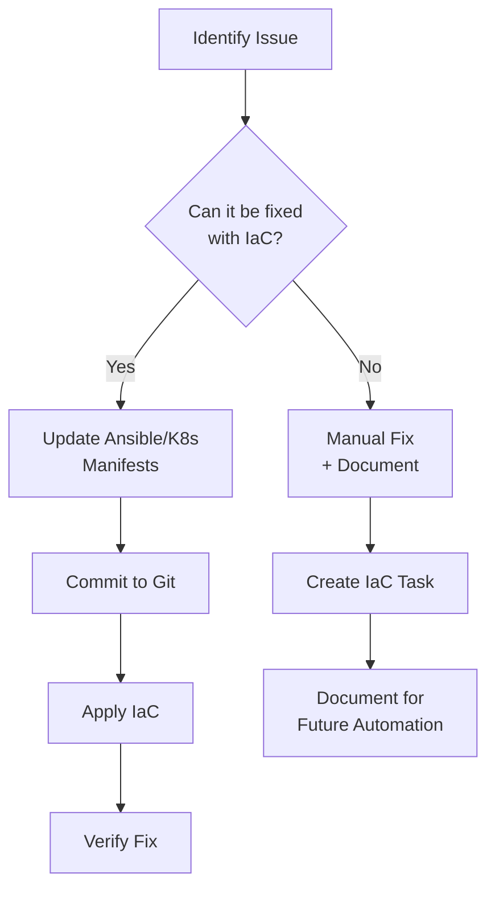

# Manage2Soar Operational Runbooks

This directory contains operational runbooks for system administrators managing Manage2Soar production environments. These runbooks follow the **Infrastructure as Code (IaC) First** philosophy - always prefer Ansible playbooks and Kubernetes manifests over manual commands.

## 🎯 Quick Navigation

### Essential Runbooks

| Runbook | Description | When to Use |
|---------|-------------|-------------|
| [Deployment & Updates](deployment-updates.md) | Deploy new versions, rollbacks, zero-downtime updates | Weekly deployments, hotfixes |
| [Troubleshooting Guide](troubleshooting.md) | Common issues and solutions | Production incidents |
| [Ansible Playbook Guide](ansible-playbook-guide.md) | Complete reference for all Ansible playbooks | Reference |
| Database Operations *(coming soon)* | PostgreSQL backups, migrations, troubleshooting | Database changes, recovery |
| Security Operations *(coming soon)* | Secret rotation, vulnerability patching | Security incidents, monthly maintenance |
| Disaster Recovery *(coming soon)* | System restore, data recovery | Critical outages |

### Reference Materials

| Document | Description |
|----------|-------------|
| Monitoring & Alerts *(coming soon)* | Key metrics, log analysis, performance diagnosis |
| Kubernetes Cheat Sheet *(coming soon)* | Common kubectl commands for GKE |

## 🏗️ IaC-First Philosophy

**CRITICAL PRINCIPLE**: This project operates as an "Infrastructure as Code first" shop. Always prefer IaC solutions over manual commands.

### IaC Workflow



### Key IaC Locations

| Type | Location | Purpose |
|------|----------|---------|
| Ansible Playbooks | `infrastructure/ansible/playbooks/*.yml` | Infrastructure provisioning, deployment |
| Ansible Roles | `infrastructure/ansible/roles/*/` | Reusable configuration modules |
| K8s Manifests | `k8s-*.yaml` (project root) | Application deployment, cronjobs |
| Secrets | Ansible Vault (`vault_*` variables) | Encrypted credentials |
| Infrastructure Docs | `infrastructure/ansible/docs/` | Deployment guides, architecture |

### IaC Examples

**❌ Manual Approach (Avoid)**
```bash
kubectl set env deployment/django-app-ssc DB_PASSWORD=newpass123
kubectl rollout restart deployment/django-app-ssc
```

**✅ IaC Approach (Preferred)**
```bash
# 1. Update Ansible vault
ansible-vault edit group_vars/gcp_app/vault.yml

# 2. Apply changes via Ansible
ansible-playbook -i inventory/gcp_app.yml \
  --vault-password-file ~/.ansible_vault_pass \
  playbooks/gcp-app-deploy.yml --tags secrets
```

## 📋 Runbook Structure

Each runbook follows this template:

1. **Overview**: What this runbook covers
2. **Prerequisites**: Required access, tools, credentials
3. **Common Scenarios**: Step-by-step procedures with commands
4. **Troubleshooting**: Symptom → diagnosis → fix workflow
5. **References**: Links to relevant docs, playbooks, manifests

## 🚨 Emergency Response

For production emergencies, follow this priority:

1. **Assess Impact**: Users affected? Data at risk? Service down?
2. **Quick Mitigation**: Use [Troubleshooting Guide](troubleshooting.md) for rapid fix
3. **IaC Remediation**: Update infrastructure code to prevent recurrence
4. **Post-Mortem**: Document incident, update runbooks

### Emergency Contact

```bash
# Quick health check
kubectl get pods -n tenant-ssc
kubectl logs -n tenant-ssc deployment/django-app-ssc --tail=50

# Database health
gcloud compute ssh m2s-database --zone=us-east1-b \
  --command "systemctl status postgresql"
```

## 🔧 Prerequisites

### Required Tools

- **kubectl**: Kubernetes CLI (version 1.28+)
- **gcloud**: Google Cloud SDK
- **ansible**: Automation framework (version 2.15+)
- **gh**: GitHub CLI (for CodeQL alerts, PRs)

### Required Access

- GCP project access (`manage2soar`)
- GKE cluster access (cluster-admin role)
- Database SSH access (`m2s-database` VM)
- Ansible vault password (`~/.ansible_vault_pass`)
- GitHub repository write access

### Environment Setup

```bash
# GCP authentication
gcloud auth login
gcloud config set project manage2soar

# Kubernetes cluster access
gcloud container clusters get-credentials m2s-gke-prod \
  --zone=us-east1-b --project=manage2soar

# Verify access
kubectl get namespaces
kubectl get pods -n tenant-ssc

# Ansible setup
cd infrastructure/ansible
ansible-playbook --version  # Should be 2.15+
```

## 📚 Related Documentation

### Infrastructure Guides
- [GKE Deployment Guide](../../infrastructure/ansible/docs/gke-deployment-guide.md)
- [GKE Post-Deployment](../../infrastructure/ansible/docs/gke-post-deployment.md)
- [GKE Gateway Ingress Guide](../../infrastructure/ansible/docs/gke-gateway-ingress-guide.md)
- [GKE Cluster Provisioning](../../infrastructure/ansible/docs/gke-cluster-provisioning-guide.md)

### Architecture Documentation
- [CronJob Architecture](../cronjob-architecture.md)
- [Multi-Tenant Deployment](../multi-tenant-deployment.md)
- [Bootstrap 5 Modernization](../bootstrap5-modernization-guide.md)

### Ansible Reference
- [Ansible README](../../infrastructure/ansible/README.md)
- [Ansible CHANGELOG](../../infrastructure/ansible/CHANGELOG.md)

## 🤝 Contributing

When adding or updating runbooks:

1. **Test all commands**: Verify in non-production first
2. **Include examples**: Use actual project configuration
3. **Follow IaC-first**: Show IaC approach before manual fixes
4. **Cross-reference**: Link to relevant playbooks and manifests
5. **Add troubleshooting**: Include symptom → fix workflow

## 📝 Runbook Maintenance

Runbooks should be updated when:
- New features are deployed requiring operational changes
- Incident response reveals documentation gaps
- Ansible playbooks are modified
- Kubernetes manifests are updated
- Security procedures change

---

**Last Updated**: January 17, 2026  
**Maintained By**: Infrastructure Team  
**Review Cycle**: Quarterly
