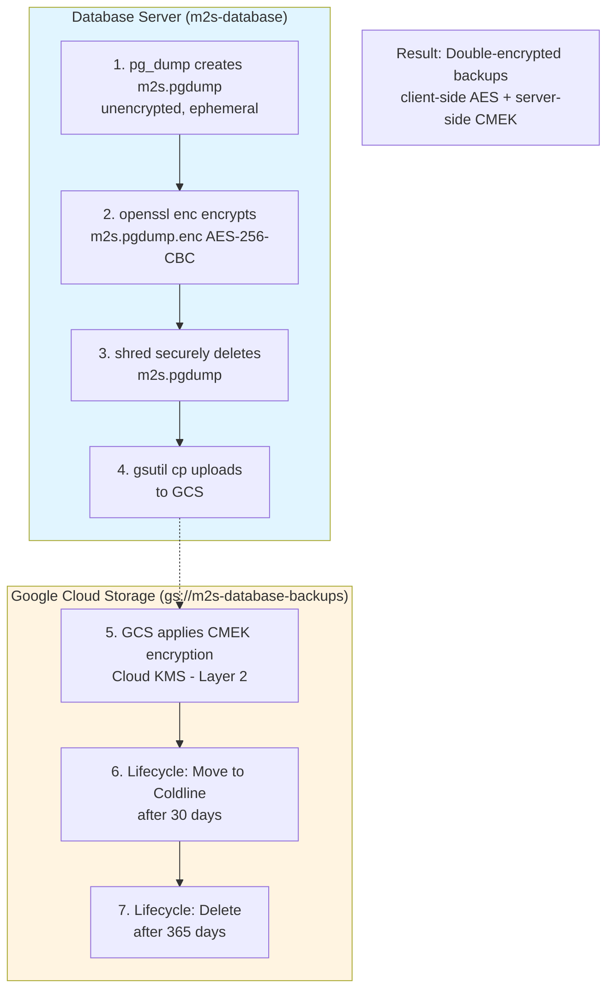

# Database Operations Runbook

This runbook covers PostgreSQL database operations including backups, restoration, and troubleshooting for Manage2Soar production environments.

## 🎯 Quick Reference

| Operation | Command | When to Use |
|-----------|---------|-------------|
| Check backup status | `ssh pb@m2s-database "sudo tail -50 /var/log/m2s-pg-backup.log"` | Daily monitoring |
| Manual backup | `ssh pb@m2s-database "sudo -u postgres /usr/local/bin/m2s-pg-backup.sh"` | Before major changes |
| List local backups | `ssh pb@m2s-database "sudo ls -lh /var/backups/postgresql/daily/"` | Verify recent backups |
| List GCS backups | `gsutil ls -lh gs://m2s-database-backups/postgresql/` | Disaster recovery prep |
| Full restore | See [Restoration Procedures](#restoration-procedures) | Disaster recovery |

## 📋 Table of Contents

- [Overview](#overview)
- [Prerequisites](#prerequisites)
- [Backup Architecture](#backup-architecture)
- [Verification Procedures](#verification-procedures)
- [Manual Backup Execution](#manual-backup-execution)
- [Restoration Procedures](#restoration-procedures)
- [Disaster Recovery (Total Loss)](#disaster-recovery-total-loss)
- [Testing Backup Integrity](#testing-backup-integrity)
- [Troubleshooting](#troubleshooting)
- [Monitoring & Alerts](#monitoring--alerts)

## Overview

### Database Architecture

- **Database**: PostgreSQL 17
- **Location**: GCP Compute Engine VM (`m2s-database`)
- **Database Name**: `m2s` (single-tenant) or `m2s_all` (multi-tenant)
- **Backup Schedule**: Daily at 2:00 AM UTC (cron job)
- **Backup Retention**:
  - Local: 7 days (encrypted backups)
  - GCS: 365 days (30 days Standard, 335 days Coldline)

### Backup Strategy

**Three-Layer Security Model**:

1. **Layer 1 - Client-Side Encryption** (CRITICAL)
   - OpenSSL AES-256-CBC encryption on database server
   - Passphrase stored in Ansible Vault
   - Backups encrypted **before** leaving the VM

2. **Layer 2 - GCS CMEK**
   - Customer-Managed Encryption Keys via Cloud KMS
   - Automatic 90-day key rotation
   - Keys never leave Google infrastructure

3. **Layer 3 - Bucket Hardening**
   - Write-only access for database server
   - Public Access Prevention enforced
   - Versioning enabled for deletion protection

### Storage Locations

- **Local**: `/var/backups/postgresql/daily/` on database server
- **GCS**: `gs://m2s-database-backups/postgresql/`
- **Format**: PostgreSQL custom format (`.pgdump`) with AES-256 encryption (`.pgdump.enc`)

## Prerequisites

### Required Access

- **SSH access** to database server: `ssh pb@m2s-database`
- **GCS bucket access**: Read permissions for `gs://m2s-database-backups`
- **Ansible Vault password**: For backup passphrase retrieval
- **PostgreSQL credentials**: Automated via peer authentication for `postgres` user

### Required Tools

On your local machine:
```bash
# Google Cloud SDK
gcloud --version

# OpenSSL (for decryption)
openssl version

# yq (for Ansible Vault parsing)
yq --version  # Optional but recommended
```

On database server:
```bash
# Already installed via Ansible
- PostgreSQL 17 (pg_dump, pg_restore)
- OpenSSL
- gcloud CLI
```

### Authentication Setup

```bash
# Authenticate with GCP
gcloud auth login

# Set default project
gcloud config set project skyline-soaring-storage

# Test GCS access
gsutil ls gs://m2s-database-backups/postgresql/ | head -5
```

## Backup Architecture

### Automated Backup Process

The backup script runs daily via cron job as the `postgres` user:

```
Daily 2:00 AM UTC:
1. pg_dump creates custom-format backup → /var/backups/postgresql/daily/m2s_TIMESTAMP.pgdump
2. OpenSSL encrypts with AES-256-CBC → /var/backups/postgresql/daily/m2s_TIMESTAMP.pgdump.enc
3. Shred deletes unencrypted file (secure deletion)
4. gsutil uploads to GCS → gs://m2s-database-backups/postgresql/
5. Local retention cleanup (delete backups older than 7 days)
```

### Multi-Layer Encryption Flow



### Backup File Naming

```
# Local backups (encrypted)
/var/backups/postgresql/daily/m2s_2026-01-28_020000.pgdump.enc
/var/backups/postgresql/daily/m2s_latest.pgdump.enc (symlink to latest)

# GCS backups (encrypted)
gs://m2s-database-backups/postgresql/m2s_2026-01-28_020000.pgdump.enc
```

## Verification Procedures

### Daily Health Check (5 minutes)

**Step 1: Check backup cron job is running**

```bash
# SSH to database server
ssh pb@m2s-database

# Verify cron job is scheduled
sudo crontab -u postgres -l | grep m2s-pg-backup
# Expected output: 0 2 * * * /usr/local/bin/m2s-pg-backup.sh >> /var/log/m2s-pg-backup.log 2>&1
```

**Step 2: Check last backup execution**

```bash
# View recent backup logs
ssh pb@m2s-database "sudo tail -50 /var/log/m2s-pg-backup.log"

# Look for these success indicators:
# - "Starting backup of m2s"
# - "Backup completed: ... (XXX MB)"
# - "Encryption completed: ... (XXX MB)"
# - "GCS upload completed"
# - No ERROR messages
```

**Step 3: Verify local backups exist**

```bash
# List local backups with sizes and timestamps
ssh pb@m2s-database "sudo ls -lh /var/backups/postgresql/daily/"

# Expected: 7 backup files (7-day retention)
# Check: Latest backup timestamp is recent (within 24 hours)
# Check: File sizes are reasonable (not 0 bytes, consistent with DB size)
```

**Step 4: Verify GCS backups**

```bash
# List recent GCS backups (local machine)
gsutil ls -lh gs://m2s-database-backups/postgresql/ | tail -10

# Expected: Multiple backups, latest within 24 hours
# Check: File sizes match local backup sizes
```

**Step 5: Verify encryption**

```bash
# Check that files are encrypted (not plaintext)
ssh pb@m2s-database "sudo file /var/backups/postgresql/daily/m2s_latest.pgdump.enc"

# Expected output: "data" (encrypted binary)
# NOT: "PostgreSQL custom database dump" (would indicate unencrypted)
```

### Weekly Integrity Check (15 minutes)

**Test decryption of latest backup**:

```bash
# SSH to database server
ssh pb@m2s-database

# Create test directory
sudo mkdir -p /tmp/backup-test
cd /tmp/backup-test

# Decrypt latest backup
sudo openssl enc -d -aes-256-cbc -pbkdf2 \
  -in /var/backups/postgresql/daily/m2s_latest.pgdump.enc \
  -out /tmp/backup-test/test_restore.pgdump \
  -pass file:/var/lib/postgresql/.backup_passphrase

# Verify decrypted file is valid PostgreSQL backup
sudo file /tmp/backup-test/test_restore.pgdump
# Expected: "PostgreSQL custom database dump"

# List contents of backup (no actual restore)
sudo -u postgres pg_restore -l /tmp/backup-test/test_restore.pgdump | head -20

# Expected: List of database objects (schemas, tables, etc.)

# Clean up (secure deletion)
sudo shred -u /tmp/backup-test/test_restore.pgdump
sudo rm -rf /tmp/backup-test
```

### Monthly Full Restore Test (2-4 hours)

**Test full restoration to staging/test server** (see [Testing Backup Integrity](#testing-backup-integrity))

## Manual Backup Execution

### When to Run Manual Backups

- Before major Django migrations
- Before significant data imports/changes
- Before infrastructure upgrades
- Before application deployments with schema changes
- When backup schedule doesn't meet your needs

### Execute Manual Backup

```bash
# SSH to database server
ssh pb@m2s-database

# Run backup script manually as postgres user
sudo -u postgres /usr/local/bin/m2s-pg-backup.sh

# Monitor output in real-time
# Expected output:
# YYYY-MM-DD HH:MM:SS - Starting backup of m2s
# YYYY-MM-DD HH:MM:SS - Backup completed: /var/backups/postgresql/daily/m2s_TIMESTAMP.pgdump (XXX MB)
# YYYY-MM-DD HH:MM:SS - Encrypting backup with OpenSSL AES-256-CBC
# YYYY-MM-DD HH:MM:SS - Encryption completed: /var/backups/postgresql/daily/m2s_TIMESTAMP.pgdump.enc (XXX MB)
# YYYY-MM-DD HH:MM:SS - Securely removing unencrypted backup file
# YYYY-MM-DD HH:MM:SS - Uploading to GCS: gs://m2s-database-backups/postgresql/
# YYYY-MM-DD HH:MM:SS - GCS upload completed
# YYYY-MM-DD HH:MM:SS - Cleaning up backups older than 7 days
```

### Verify Manual Backup Success

```bash
# Check backup was created
ssh pb@m2s-database "sudo ls -lh /var/backups/postgresql/daily/ | tail -2"

# Verify GCS upload
gsutil ls -lh gs://m2s-database-backups/postgresql/ | tail -2

# Check logs for errors
ssh pb@m2s-database "sudo tail -30 /var/log/m2s-pg-backup.log"
```

## Restoration Procedures

> **⚠️ WARNING**: Database restoration involves DATA LOSS of current database state. Always verify you have a valid backup before proceeding.

### Pre-Restoration Checklist

- [ ] Identify correct backup timestamp to restore
- [ ] Verify backup file exists and is accessible
- [ ] Stop application servers to prevent writes during restore
- [ ] Create a backup of current database (if accessible)
- [ ] Have Ansible Vault password for decryption passphrase
- [ ] Estimate restoration time (typically: backup_size / 50 MB/min)

### Scenario 1: Local Restore (Database Server Accessible)

**Use Case**: Need to restore recent backup, database server is functional.

```bash
# Step 1: Stop application to prevent writes
# For GKE deployment:
kubectl scale deployment django-app-ssc --replicas=0 -n tenant-ssc

# For single-host:
ssh pb@m2s-database "sudo systemctl stop gunicorn"

# Step 2: SSH to database server
ssh pb@m2s-database

# Step 3: List available backups
sudo ls -lh /var/backups/postgresql/daily/

# Step 4: Choose backup to restore (replace TIMESTAMP)
BACKUP_TIMESTAMP="2026-01-28_020000"

# Step 5: Decrypt backup
sudo openssl enc -d -aes-256-cbc -pbkdf2 \
  -in /var/backups/postgresql/daily/m2s_${BACKUP_TIMESTAMP}.pgdump.enc \
  -out /tmp/m2s_restore.pgdump \
  -pass file:/var/lib/postgresql/.backup_passphrase

# Step 6: Verify decrypted backup
sudo file /tmp/m2s_restore.pgdump
# Expected: "PostgreSQL custom database dump"

# Step 7: Create backup of current database (if needed)
sudo -u postgres pg_dump -Fc -f /tmp/m2s_pre_restore_backup.pgdump m2s

# Step 8: Terminate active connections
sudo -u postgres psql -c "SELECT pg_terminate_backend(pid) FROM pg_stat_activity WHERE datname='m2s' AND pid != pg_backend_pid();"

# Step 9: Drop existing database
sudo -u postgres psql -c 'DROP DATABASE m2s;'

# Step 10: Create fresh database
sudo -u postgres psql -c 'CREATE DATABASE m2s OWNER m2s;'

# Step 11: Restore from backup
sudo -u postgres pg_restore -d m2s /tmp/m2s_restore.pgdump

# Step 12: Verify restoration
sudo -u postgres psql -d m2s -c "SELECT COUNT(*) FROM members_member;"
sudo -u postgres psql -d m2s -c "SELECT COUNT(*) FROM logsheet_flight;"

# Step 13: Clean up decrypted file (secure deletion)
sudo shred -u /tmp/m2s_restore.pgdump

# Step 14: Restart application
# For GKE:
kubectl scale deployment django-app-ssc --replicas=2 -n tenant-ssc

# For single-host:
ssh pb@m2s-database "sudo systemctl start gunicorn"

# Step 15: Verify application is working
curl -I https://skylinesoaring.manage2soar.com
```

### Scenario 2: GCS Restore (Disaster Recovery)

**Use Case**: Database server failed, restoring to new server from GCS backups.

```bash
# Step 1: List available GCS backups
gsutil ls -lh gs://m2s-database-backups/postgresql/ | tail -20

# Step 2: Download encrypted backup (replace TIMESTAMP)
BACKUP_TIMESTAMP="2026-01-28_020000"
gsutil cp "gs://m2s-database-backups/postgresql/m2s_${BACKUP_TIMESTAMP}.pgdump.enc" /tmp/

# Step 3: Retrieve passphrase from Ansible Vault
cd /path/to/manage2soar/infrastructure/ansible

# Using yq (recommended - more reliable YAML parsing)
ansible-vault view --vault-password-file ~/.ansible_vault_pass \
  group_vars/gcp_database/vault.yml | \
  yq -r '.vault_postgresql_backup_passphrase' > /tmp/passphrase.txt

# OR manual extraction (if yq not available):
# ansible-vault view --vault-password-file ~/.ansible_vault_pass \
#   group_vars/gcp_database/vault.yml
# Then copy the vault_postgresql_backup_passphrase value to /tmp/passphrase.txt

chmod 600 /tmp/passphrase.txt

# Step 4: Decrypt backup
openssl enc -d -aes-256-cbc -pbkdf2 \
  -in /tmp/m2s_${BACKUP_TIMESTAMP}.pgdump.enc \
  -out /tmp/m2s_restore.pgdump \
  -pass file:/tmp/passphrase.txt

# Step 5: Verify decrypted backup
file /tmp/m2s_restore.pgdump
# Expected: "PostgreSQL custom database dump"

# Step 6: Copy to new database server
scp /tmp/m2s_restore.pgdump pb@NEW_DATABASE_SERVER:/tmp/

# Step 7: Restore database on new server
ssh pb@NEW_DATABASE_SERVER "sudo -u postgres createdb m2s -O m2s"
ssh pb@NEW_DATABASE_SERVER "sudo -u postgres pg_restore -d m2s /tmp/m2s_restore.pgdump"

# Step 8: Verify restoration
ssh pb@NEW_DATABASE_SERVER "sudo -u postgres psql -d m2s -c 'SELECT COUNT(*) FROM members_member;'"

# Step 9: Clean up sensitive files (secure deletion)
shred -u /tmp/passphrase.txt /tmp/m2s_${BACKUP_TIMESTAMP}.pgdump.enc /tmp/m2s_restore.pgdump
ssh pb@NEW_DATABASE_SERVER "sudo shred -u /tmp/m2s_restore.pgdump"

# Step 10: Update application connection strings
# Update Ansible inventory with new database server IP/hostname
# Redeploy application with new connection string
cd infrastructure/ansible
ansible-playbook -i inventory/gcp_app.yml playbooks/gcp-app-deploy.yml
```

### Scenario 3: Partial Restore (Single Table)

**Use Case**: Need to restore specific table(s) without full database restore.

```bash
# Step 1: Download and decrypt backup (steps 1-4 from Scenario 2)

# Step 2: List available tables in backup
pg_restore -l /tmp/m2s_restore.pgdump | grep "TABLE DATA"

# Expected output shows table names like:
# 3241; 1259 16421 TABLE DATA public members_member m2s
# 3242; 1259 16422 TABLE DATA public logsheet_flight m2s

# Step 3: Restore specific table (example: members_member)
# WARNING: This will drop and recreate the table!
sudo -u postgres pg_restore -d m2s -t members_member --clean /tmp/m2s_restore.pgdump

# Step 4: Verify restore
sudo -u postgres psql -d m2s -c "SELECT COUNT(*) FROM members_member;"

# Step 5: Clean up (secure deletion)
shred -u /tmp/m2s_restore.pgdump
```

## Testing Backup Integrity

### Why Test Backups?

- Backups are useless if they can't be restored
- Test restoration before disaster strikes
- Verify backup process catches all data
- Estimate restoration time for disaster planning

### Monthly Test Restore (Recommended)

**Test full restoration to separate test server**:

```bash
# Prerequisites:
# - Test server with PostgreSQL 17 installed
# - Same schema as production (or create fresh database)

# Step 1: Download latest production backup from GCS
LATEST_BACKUP="$(gsutil ls gs://m2s-database-backups/postgresql/m2s_*.pgdump.enc | sort | tail -n 1)"
gsutil cp "${LATEST_BACKUP}" /tmp/m2s_latest.pgdump.enc

# Step 2: Retrieve decryption passphrase (Scenario 2, Step 3)
# ...

# Step 3: Decrypt backup
openssl enc -d -aes-256-cbc -pbkdf2 \
  -in /tmp/m2s_latest.pgdump.enc \
  -out /tmp/m2s_test_restore.pgdump \
  -pass file:/tmp/passphrase.txt

# Step 4: Copy to test server
scp /tmp/m2s_test_restore.pgdump pb@TEST_SERVER:/tmp/

# Step 5: Restore to test database
ssh pb@TEST_SERVER "sudo -u postgres dropdb m2s_test --if-exists"
ssh pb@TEST_SERVER "sudo -u postgres createdb m2s_test -O m2s"
ssh pb@TEST_SERVER "sudo -u postgres pg_restore -d m2s_test /tmp/m2s_test_restore.pgdump"

# Step 6: Verify data integrity
ssh pb@TEST_SERVER "sudo -u postgres psql -d m2s_test -c 'SELECT COUNT(*) FROM members_member;'"
ssh pb@TEST_SERVER "sudo -u postgres psql -d m2s_test -c 'SELECT COUNT(*) FROM logsheet_flight;'"
ssh pb@TEST_SERVER "sudo -u postgres psql -d m2s_test -c 'SELECT MAX(created_at) FROM logsheet_logsheet;'"

# Step 7: Verify database connectivity
ssh pb@TEST_SERVER "sudo -u postgres psql -d m2s_test -c 'SELECT 1;'"

# Step 8: Document results
# - Restoration time: [X minutes]
# - Data integrity: [OK/Issues found]
# - Latest logsheet date: [YYYY-MM-DD]
# - Total members: [count]
# - Total flights: [count]

# Step 9: Clean up
ssh pb@TEST_SERVER "sudo -u postgres dropdb m2s_test"
ssh pb@TEST_SERVER "sudo shred -u /tmp/m2s_test_restore.pgdump"
shred -u /tmp/passphrase.txt /tmp/m2s_latest.pgdump.enc /tmp/m2s_test_restore.pgdump
```

### Automated Backup Validation Script

Create a monthly cron job to verify backup integrity:

```bash
#!/bin/bash
# /usr/local/bin/verify-backup.sh
# Run monthly to verify latest backup can be decrypted

BACKUP_FILE="/var/backups/postgresql/daily/m2s_latest.pgdump.enc"
TEST_FILE="/tmp/backup_verify_test.pgdump"

# Decrypt
openssl enc -d -aes-256-cbc -pbkdf2 \
  -in "${BACKUP_FILE}" \
  -out "${TEST_FILE}" \
  -pass file:/var/lib/postgresql/.backup_passphrase

# Verify
if pg_restore -l "${TEST_FILE}" > /dev/null 2>&1; then
  echo "$(date) - Backup verification SUCCESS" | systemd-cat -t backup-verify
  shred -u "${TEST_FILE}"
  exit 0
else
  echo "$(date) - Backup verification FAILED" | systemd-cat -t backup-verify
  shred -u "${TEST_FILE}"
  exit 1
fi
```

## Disaster Recovery (Total Loss)

### 🔥 Scenario: Database Server Completely Destroyed

**Critical Requirements** - You MUST have access to:
1. ✅ Ansible Vault password (`~/.ansible_vault_pass`)
2. ✅ Ansible `group_vars/gcp_database/vault.yml` file
3. ✅ GCS bucket access: `gs://m2s-database-backups-manage2soar`

**If you don't have these**, backups cannot be decrypted. This is why we:
- Store Ansible Vault password in a secure password manager (1Password, LastPass)
- Maintain off-site backups of Ansible vault files
- Share DR credentials with co-webmasters

### Quick Reference Card

**🚨 Database Destroyed - Recovery in 4 Steps:**

> **Note**: Steps 1-3 run on your local machine. Step 4 must run from a machine with PostgreSQL client tools and network access to the new database (for example, the new database server itself or another trusted client host) after you've copied the decrypted backup there.
> See detailed procedure below for complete workflow.

```bash
# 1. Get passphrase from Ansible Vault (local machine)
cd infrastructure/ansible
ansible-vault view --vault-password-file ~/.ansible_vault_pass \
  group_vars/gcp_database/vault.yml | grep vault_postgresql_backup_passphrase

# 2. Download encrypted backup from GCS
gsutil ls -lh gs://m2s-database-backups-manage2soar/postgresql/
gsutil cp gs://m2s-database-backups-manage2soar/postgresql/m2s_all_TIMESTAMP.sql.enc /tmp/

# 3. Decrypt backup
echo "PASSPHRASE_FROM_STEP_1" > /tmp/.backup_passphrase && chmod 400 /tmp/.backup_passphrase
openssl enc -d -aes-256-cbc -pbkdf2 \
  -in /tmp/m2s_all_TIMESTAMP.sql.enc \
  -out /tmp/m2s_restore.sql \
  -pass file:/tmp/.backup_passphrase

# 4. Restore to new database
psql -f /tmp/m2s_restore.sql  # For SQL text backups (pg_dumpall)
# OR
pg_restore -d m2s /tmp/m2s_restore.pgdump  # For custom format backups (pg_dump -Fc)
```

### Detailed Recovery Procedure

#### Step 1: Provision New Database Server

**Option A: Use IaC (Recommended)**

```bash
cd infrastructure/ansible

# Provision new GCP database VM
ansible-playbook -i inventory/gcp_database.yml \
  playbooks/gcp-database.yml \
  --vault-password-file ~/.ansible_vault_pass

# This will:
# - Create new GCP Compute Engine VM
# - Install PostgreSQL 17
# - Configure firewall rules
# - Deploy backup passphrase to /var/lib/postgresql/.backup_passphrase
```

**Option B: Manual Provisioning (⚠️ NOT RECOMMENDED)**

> **Warning**: Manual provisioning bypasses IaC and is not repeatable.
> Use this only as a last resort when IaC is unavailable. Document all manual steps for later IaC migration.

```bash
# Create GCP VM
gcloud compute instances create m2s-database-new \
  --project=manage2soar \
  --zone=us-east1-b \
  --machine-type=e2-medium \
  --boot-disk-size=50GB \
  --boot-disk-type=pd-standard \
  --image-family=ubuntu-2404-lts-amd64 \
  --image-project=ubuntu-os-cloud

# Install PostgreSQL 17
ssh ${USER}@NEW_DB_SERVER "
  sudo apt update && \
  sudo apt install -y postgresql-17 postgresql-contrib-17
"
```

> **⚠️ IaC First Philosophy**: If the Ansible playbook fails, debug the specific failure (authentication, quotas, network) rather than bypassing IaC. The manual commands above are shown only as diagnostic/verification tools, not as a provisioning alternative. Changes made manually won't persist if deployments are rerun from Ansible.

#### Step 2: Retrieve Decryption Passphrase

**Critical File**: `infrastructure/ansible/group_vars/gcp_database/vault.yml`

**If you have Ansible vault files locally:**

```bash
cd infrastructure/ansible

# View the passphrase
ansible-vault view --vault-password-file ~/.ansible_vault_pass \
  group_vars/gcp_database/vault.yml | grep vault_postgresql_backup_passphrase

# Expected output:
# vault_postgresql_backup_passphrase: "very-long-random-string-64-chars-or-more"
```

**If you only have the backup tarball:**

```bash
# Extract backup tarball (created manually with tar command)
tar -xzf /path/to/manage2soar-ansible-secrets-YYYYMMDD.tar.gz

# View passphrase from extracted vault file
ansible-vault view --vault-password-file ~/.ansible_vault_pass \
  infrastructure/ansible/group_vars/gcp_database/vault.yml | \
  grep vault_postgresql_backup_passphrase
```

**If you don't have EITHER:**
- Check your secure password manager (1Password, LastPass)
- Contact co-webmasters who have the backup tarball
- Check offline backup storage (USB drives, encrypted cloud storage)

⚠️ **WITHOUT THE PASSPHRASE, BACKUPS CANNOT BE DECRYPTED!**

#### Step 3: Download Encrypted Backup from GCS

```bash
# List available backups (sorted by date, newest first)
gsutil ls -lh gs://m2s-database-backups-manage2soar/postgresql/ | \
  grep "\.enc$" | sort -r | head -20

# Identify the backup you want to restore
# Format: m2s_all_YYYY-MM-DD_HHMMSS.sql.enc (multi-tenant)
#     OR: m2s_YYYY-MM-DD_HHMMSS.pgdump.enc (single-tenant)

# Download the selected backup
BACKUP_FILE="m2s_all_2026-02-04_020001.sql.enc"  # Replace with actual filename
gsutil cp "gs://m2s-database-backups-manage2soar/postgresql/${BACKUP_FILE}" /tmp/

# Verify download
ls -lh /tmp/${BACKUP_FILE}
file /tmp/${BACKUP_FILE}
# Expected: "openssl enc'd data with salted password" or "data"
```

#### Step 4: Decrypt Backup

```bash
# Create temporary passphrase file
# Replace YOUR_PASSPHRASE_FROM_VAULT with actual value from Step 2
echo "YOUR_PASSPHRASE_FROM_VAULT" > /tmp/.backup_passphrase
chmod 400 /tmp/.backup_passphrase

# Decrypt the backup
BACKUP_FILE="m2s_all_2026-02-04_020001.sql.enc"  # Use actual filename
DECRYPTED_FILE="/tmp/m2s_restore.sql"  # Or .pgdump for custom format

openssl enc -d -aes-256-cbc -pbkdf2 \
  -in "/tmp/${BACKUP_FILE}" \
  -out "${DECRYPTED_FILE}" \
  -pass file:/tmp/.backup_passphrase

# Verify decryption succeeded
file "${DECRYPTED_FILE}"
# Expected: "ASCII text" (for SQL) or "PostgreSQL custom database dump" (for custom format)

# Check decrypted file size (should be larger than encrypted)
ls -lh "${DECRYPTED_FILE}"
```

**Common Decryption Errors:**

| Error Message | Cause | Solution |
|--------------|-------|----------|
| `bad decrypt` | Wrong passphrase | Verify passphrase from vault, check for typos |
| `digital envelope routines::unsupported` | OpenSSL version mismatch | Use same OpenSSL version as backup server |
| File is empty | Corrupted backup | Try an older backup from GCS |

#### Step 5: Restore Database

**For SQL Text Backups** (pg_dumpall format - multi-tenant):

```bash
# Copy decrypted backup to new database server
scp /tmp/m2s_restore.sql ${USER}@NEW_DB_SERVER:/tmp/

# Restore all databases and global objects
ssh ${USER}@NEW_DB_SERVER "
  sudo -u postgres psql -f /tmp/m2s_restore.sql
"

# Verify restoration
ssh ${USER}@NEW_DB_SERVER "
  sudo -u postgres psql -d m2s_all -c 'SELECT COUNT(*) FROM members_member;'
  sudo -u postgres psql -d m2s_all -c 'SELECT COUNT(*) FROM logsheet_flight;'
"
```

**For Custom Format Backups** (pg_dump -Fc format - single-tenant):

```bash
# Copy decrypted backup to new database server
scp /tmp/m2s_restore.pgdump ${USER}@NEW_DB_SERVER:/tmp/

# Ensure m2s role exists and create database
# PREFERRED: Use Ansible postgresql-setup role (IaC approach) to create role/database automatically
# Manual fallback if starting from bare PostgreSQL (retrieve password from Ansible vault):
ssh ${USER}@NEW_DB_SERVER "
  # Create m2s role if it doesn't exist
  sudo -u postgres psql -tc \"SELECT 1 FROM pg_roles WHERE rolname = 'm2s';\" | grep -q 1 || \\
    sudo -u postgres psql -c \"CREATE ROLE m2s LOGIN PASSWORD '<vault_m2s_db_password>';\"
  # Create database owned by m2s
  sudo -u postgres psql -c 'CREATE DATABASE m2s OWNER m2s;'
"

# Restore database
ssh ${USER}@NEW_DB_SERVER "
  sudo -u postgres pg_restore -d m2s /tmp/m2s_restore.pgdump
"

# Verify restoration
ssh ${USER}@NEW_DB_SERVER "
  sudo -u postgres psql -d m2s -c 'SELECT COUNT(*) FROM members_member;'
  sudo -u postgres psql -d m2s -c 'SELECT COUNT(*) FROM logsheet_flight;'
"
```

#### Step 6: Update Application Configuration

**Update Django application to point to new database server:**

**Preferred IaC Approach:**

```bash
cd infrastructure/ansible

# Update inventory with new database server IP
vim inventory/gcp_database.yml
# Change ansible_host: NEW_DB_SERVER_IP

# Update application secrets with new database host
ansible-vault edit --vault-password-file ~/.ansible_vault_pass \
  group_vars/gcp_app/vault.yml

# Update: vault_database_host: "NEW_DB_SERVER_IP"

# Redeploy application
ansible-playbook -i inventory/gcp_app.yml \
  playbooks/gcp-app-deploy.yml \
  --vault-password-file ~/.ansible_vault_pass
```

**Emergency Break-Glass Only (if app must be restored before IaC can be fixed):**

> **⚠️ CRITICAL WARNING**: This bypasses IaC. Use ONLY in absolute emergencies when the application must be restored immediately. Changes won't persist if deployment is rerun from Ansible. **CREATE A FOLLOW-UP TASK** to properly implement this fix via Ansible after using this workaround to prevent configuration drift.

```bash
# Update database host in secret
kubectl edit secret manage2soar-env-ssc -n tenant-ssc

# Update DATABASE_HOST value (base64 encoded)
echo -n "NEW_DB_SERVER_IP" | base64

# Restart pods to pick up new configuration
kubectl rollout restart deployment/django-app-ssc -n tenant-ssc
```

#### Step 7: Verify Application Connectivity

```bash
# Test database connectivity from application pod
kubectl exec -it deployment/django-app-ssc -n tenant-ssc -- \
  python manage.py dbshell

# Should connect successfully and show psql prompt

# Test application health
curl -I https://skylinesoaring.manage2soar.com

# Check Django admin
curl -I https://skylinesoaring.manage2soar.com/admin/

# Verify member login works
# (Manual test via browser)
```

#### Step 8: Secure Cleanup

```bash
# CRITICAL: Delete decrypted backup files (contain sensitive data).
# NOTE: `shred` is a *best-effort* secure delete and its effectiveness is filesystem-dependent.
# It may not reliably overwrite data on journaling (e.g., ext3/ext4 with data=journal),
# copy-on-write (e.g., btrfs, ZFS), or snapshot-backed/cloud storage volumes.
# COMPENSATING CONTROLS (IaC RECOMMENDED):
#   - Ensure database disks and /tmp are on encrypted storage (e.g., LUKS) in server provisioning.
#   - Prefer mounting /tmp as tmpfs on highly sensitive systems.
# Within that context, use shred as an additional defense-in-depth measure:
shred -u /tmp/m2s_restore.sql /tmp/.backup_passphrase
ssh ${USER}@NEW_DB_SERVER "sudo shred -u /tmp/m2s_restore.sql"

# Delete encrypted backup (can re-download from GCS if needed)
rm /tmp/m2s_all_*.enc
```

### Post-Recovery Checklist

- [ ] Database server provisioned and PostgreSQL 17 running
- [ ] Backup decrypted successfully from GCS
- [ ] Database restored and data verified (member/flight counts)
- [ ] Application configuration updated (database host)
- [ ] Application pods restarted and connecting to new database
- [ ] User login tested and working
- [ ] New backup cron job configured on new server
- [ ] GCS credentials re-deployed (for future backups)
- [ ] Decrypted files securely deleted
- [ ] DNS/firewall rules updated (if needed)
- [ ] Monitoring alerts configured for new server
- [ ] Document recovery time and any issues encountered

### Recovery Time Estimate

| Phase | Estimated Time |
|-------|---------------|
| Provision new database server | 15-30 minutes (IaC) |
| Download backup from GCS | 2-5 minutes (depending on size) |
| Decrypt backup | 1-2 minutes |
| Restore database | 10-30 minutes (depending on size) |
| Update application configuration | 5-10 minutes |
| Verify and test | 10-20 minutes |
| **Total** | **45-90 minutes** |

### Prevention and Preparedness

**Quarterly Backup Drills:**

```bash
# Run verification script (auto-detects database server from inventory)
cd infrastructure/ansible
./verify-backup-encryption.sh
# Or specify database server explicitly:
# ./verify-backup-encryption.sh m2s-database
```

**Store Off-Site:**
1. Ansible Vault password in password manager
2. Backup tarball: `/tmp/manage2soar-ansible-secrets-YYYYMMDD.tar.gz`
3. GCS service account key: `manage2soar-django-key.json`

**Share with Co-Webmasters:**
- Ansible Vault password (via secure channel)
- Backup tarball (encrypted, via Google Drive or similar)
- DR runbook access (this document)

**Document Passphrase Rotation:**
- If passphrase is rotated, document OLD passphrase
- Old passphrase needed to decrypt backups created before rotation
- Keep old passphrases until all old backups expire (365 days)

### Related Documentation

- [Backup Encryption Architecture](../../infrastructure/ansible/roles/postgresql/docs/backup-encryption.md)
- [Ansible GCP Database Playbook](../../infrastructure/ansible/playbooks/gcp-database.yml)
- [GKE Deployment Guide](../../infrastructure/ansible/docs/gke-post-deployment.md)

## Troubleshooting

### Backup Script Fails

**Symptom**: No recent backups in `/var/backups/postgresql/daily/`

```bash
# Check cron job status
ssh pb@m2s-database "sudo systemctl status cron"

# Check postgres crontab
ssh pb@m2s-database "sudo crontab -u postgres -l"

# Check backup script exists and is executable
ssh pb@m2s-database "sudo ls -lh /usr/local/bin/m2s-pg-backup.sh"

# Check logs for errors
ssh pb@m2s-database "sudo tail -100 /var/log/m2s-pg-backup.log | grep ERROR"

# Test backup script manually
ssh pb@m2s-database "sudo -u postgres /usr/local/bin/m2s-pg-backup.sh"
```

### Encryption Fails

**Symptom**: "ERROR: Encryption passphrase file not found" in logs

```bash
# Check passphrase file exists
ssh pb@m2s-database "sudo ls -lh /var/lib/postgresql/.backup_passphrase"
# Expected: -r-------- 1 postgres postgres 65 [date] /var/lib/postgresql/.backup_passphrase

# If missing, redeploy via Ansible:
cd infrastructure/ansible
ansible-playbook -i inventory/gcp_database.yml playbooks/gcp-database.yml --tags postgresql

# Test encryption manually (as postgres, using the backup passphrase file)
ssh pb@m2s-database "echo 'test' | sudo -u postgres openssl enc -aes-256-cbc -salt -pbkdf2 \
  -pass file:/var/lib/postgresql/.backup_passphrase | sudo -u postgres openssl enc -d -aes-256-cbc -pbkdf2 \
  -pass file:/var/lib/postgresql/.backup_passphrase"
# Expected: "test"
```

### GCS Upload Fails

**Symptom**: "ERROR: GCS upload failed" in logs, backups not appearing in GCS

```bash
# Check gcloud authentication
ssh pb@m2s-database "sudo -u postgres gcloud auth list"
# Expected: Service account m2s-database-backup@... is active

# Test GCS write access
ssh pb@m2s-database "echo 'test' | sudo -u postgres gsutil cp - gs://m2s-database-backups/postgresql/test.txt"
ssh pb@m2s-database "sudo -u postgres gsutil ls gs://m2s-database-backups/postgresql/ | grep test.txt"

# Clean up test file
ssh pb@m2s-database "sudo -u postgres gsutil rm gs://m2s-database-backups/postgresql/test.txt"

# Check network connectivity to GCS
ssh pb@m2s-database "curl -I https://storage.googleapis.com"
# Expected: HTTP/2 200 or 403 (connectivity OK)

# Verify IAM permissions
gcloud storage buckets get-iam-policy gs://m2s-database-backups | grep m2s-database-backup
# Expected: roles/storage.objectCreator
```

### Decryption Fails

**Symptom**: "bad decrypt" error when restoring backup

```bash
# Verify backup file is encrypted
file backup.pgdump.enc
# Expected: "data" (binary)
# NOT: "PostgreSQL custom database dump" (unencrypted)

# Test decryption with verbose output
openssl enc -d -aes-256-cbc -pbkdf2 -v \
  -in backup.pgdump.enc \
  -out test_restore.pgdump \
  -pass file:/var/lib/postgresql/.backup_passphrase

# Common causes:
# 1. Wrong passphrase - check Ansible Vault
# 2. Corrupted backup file - verify checksums
# 3. OpenSSL version mismatch - check versions match

# Verify OpenSSL version
ssh pb@m2s-database "openssl version"
openssl version  # On restore machine
```

### Restoration Hangs

**Symptom**: `pg_restore` runs for hours without completing

```bash
# Check pg_restore progress (from another terminal)
ssh pb@m2s-database "sudo -u postgres psql -d m2s -c 'SELECT query, state, wait_event_type FROM pg_stat_activity WHERE query LIKE '\''%COPY%'\'';'"

# Common causes:
# 1. Large tables (normal) - wait for completion
# 2. Disk space full - check available space
# 3. Network issues (if restore from remote)

# Check disk space
ssh pb@m2s-database "df -h /var/lib/postgresql"

# Monitor restoration progress with verbose output
sudo -u postgres pg_restore -v -d m2s /tmp/m2s_restore.pgdump 2>&1 | tee /tmp/restore.log

# Cancel stuck restoration if needed
sudo -u postgres psql -c "SELECT pg_terminate_backend(pid) FROM pg_stat_activity WHERE datname='m2s' AND query LIKE '%COPY%';"
```

### Disk Space Issues

**Symptom**: "No space left on device" error

```bash
# Check disk usage
ssh pb@m2s-database "df -h"

# Check backup directory size
ssh pb@m2s-database "sudo du -sh /var/backups/postgresql/"

# Check PostgreSQL data directory size
ssh pb@m2s-database "sudo du -sh /var/lib/postgresql/"

# Emergency cleanup (if needed):
# Delete old local backups manually (GCS still has copies)
ssh pb@m2s-database "sudo find /var/backups/postgresql/daily/ -type f -mtime +7 -delete"

# Long-term solution: Adjust retention or increase disk size
# Update Ansible vars:
# postgresql_backup_retention_days: 3  # Reduce from 7 to 3 days
```

## Monitoring & Alerts

### Log Locations

| Log | Location | Purpose |
|-----|----------|---------|
| Backup script | `/var/log/m2s-pg-backup.log` | Backup execution details |
| PostgreSQL | `/var/log/postgresql/postgresql-17-main.log` | Database errors, queries |
| System logs | `journalctl -u cron` | Cron job execution |

### Expected Backup Schedule

- **Daily automated**: 2:00 AM UTC (cron job)
- **Log rotation**: Daily, keep 7 days
- **Local retention**: 7 days
- **GCS retention**: 365 days (30 Standard + 335 Coldline)

### Monitoring Checklist

**Daily** (automated):
- [ ] Backup cron job executed (check cron logs)
- [ ] Backup file created in `/var/backups/postgresql/daily/`
- [ ] Backup encrypted (file type is "data")
- [ ] GCS upload successful (file appears in GCS bucket)
- [ ] No ERROR messages in backup log

**Weekly** (manual):
- [ ] Test decrypt latest backup
- [ ] Verify pg_restore can list backup contents
- [ ] Check GCS bucket size and cost
- [ ] Review backup log for warnings

**Monthly** (manual):
- [ ] Full test restore to staging server
- [ ] Verify data integrity after restore
- [ ] Update disaster recovery documentation
- [ ] Review and update backup retention policy

### Setting Up Alerts

**Google Cloud Monitoring** (recommended):

```bash
# Create log-based metric for backup failures
gcloud logging metrics create m2s-backup-failures \
  --description="M2S PostgreSQL backup failures" \
  --log-filter='resource.type="gce_instance"
    AND logName="projects/skyline-soaring-storage/logs/m2s-pg-backup"
    AND textPayload=~"ERROR"'

# Create alerting policy (via GCP Console)
# Condition: m2s-backup-failures > 0
# Notification: Email to ops@yourdomain.com
```

**Email Notification Script** (alternative):

```bash
# Add to end of /usr/local/bin/m2s-pg-backup.sh
if tail -50 /var/log/m2s-pg-backup.log | grep -q "ERROR"; then
  echo "Backup failed! Check /var/log/m2s-pg-backup.log" | \
    mail -s "M2S Backup FAILED" ops@yourdomain.com
fi
```

## References

### Internal Documentation

- [Backup Encryption Architecture](../../infrastructure/ansible/roles/postgresql/docs/backup-encryption.md)
- [GCS Backup Role](../../infrastructure/ansible/roles/gcs-backup/README.md)
- [Single-Host Architecture](../../infrastructure/docs/single-host-architecture.md)
- [Ansible Playbook Guide](ansible-playbook-guide.md)

### External Resources

- [PostgreSQL pg_dump Documentation](https://www.postgresql.org/docs/current/app-pgdump.html)
- [PostgreSQL pg_restore Documentation](https://www.postgresql.org/docs/current/app-pgrestore.html)
- [OpenSSL Encryption](https://www.openssl.org/docs/man1.1.1/man1/enc.html)
- [Google Cloud KMS](https://cloud.google.com/kms/docs)
- [GCS CMEK Encryption](https://cloud.google.com/storage/docs/encryption/customer-managed-keys)

---

**Last Updated**: 2026-01-28  
**Maintainer**: Infrastructure Team  
**Review Frequency**: Quarterly or after major infrastructure changes
