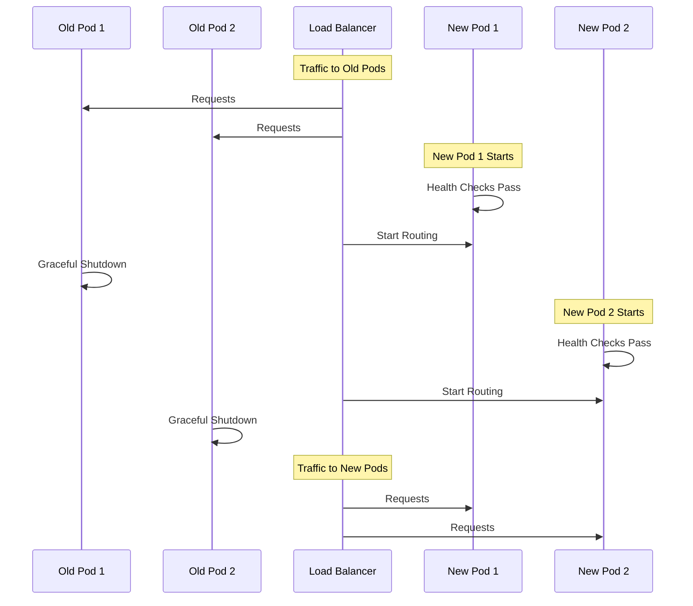

# Deployment & Updates Runbook

Procedures for deploying new versions, updates, and rollbacks in production.

## 📖 Overview

This runbook covers:
- Regular deployment procedures
- Hotfix deployments
- Rollback procedures
- Zero-downtime deployments
- Post-deployment verification

**Key Principle**: Always use Ansible playbooks for deployments. Manual kubectl commands should only be used for emergency fixes, followed by IaC remediation.

## 🎯 Quick Reference

| Scenario | Command | Time |
|----------|---------|------|
| Weekly deployment | `ansible-playbook playbooks/gcp-app-deploy.yml` | 5-10 min |
| Hotfix (no build) | `ansible-playbook playbooks/gcp-app-deploy.yml -e gke_build_image=false` | 2-3 min |
| Rollback to previous | Change image tag + deploy | 2-3 min |
| Secrets update | `ansible-playbook playbooks/gcp-app-deploy.yml --tags secrets` | 1-2 min |

---

## Regular Weekly Deployment

### Prerequisites

```bash
# Ensure you're on the correct branch
cd /path/to/Manage2Soar
git status
git checkout main
git pull origin main

# Verify tests pass
source .venv/bin/activate
pytest

# Check for security vulnerabilities
safety check
```

### Deployment Steps

#### 1. Pre-Deployment Checks

```bash
# Verify current production status
kubectl get pods -n tenant-ssc
kubectl get pods -n tenant-masa

# Check for pending database migrations
kubectl exec -n tenant-ssc deployment/django-app-ssc -- \
  python manage.py showmigrations --plan | grep "\[ \]"

# Review recent commits
git log --oneline -10
```

#### 2. Execute Deployment

```bash
cd infrastructure/ansible

# Full deployment (build, push, deploy)
ansible-playbook -i inventory/gcp_app.yml \
  --vault-password-file ~/.ansible_vault_pass \
  playbooks/gcp-app-deploy.yml
```

**What happens**:
1. ✅ Builds Docker image with latest code
2. ✅ Pushes to Google Container Registry
3. ✅ Updates Kubernetes secrets
4. ✅ Applies deployment manifests
5. ✅ Runs database migrations
6. ✅ Performs rolling update (zero downtime)
7. ✅ Waits for pods to be ready
8. ✅ Runs health checks

#### 3. Monitor Deployment

```bash
# Watch pod rollout
kubectl rollout status deployment/django-app-ssc -n tenant-ssc
kubectl rollout status deployment/django-app-masa -n tenant-masa

# Check pod logs for errors
kubectl logs -n tenant-ssc deployment/django-app-ssc --tail=50
kubectl logs -n tenant-masa deployment/django-app-masa --tail=50

# Verify new pods are running
kubectl get pods -n tenant-ssc -l app=django-app-ssc
kubectl get pods -n tenant-masa -l app=django-app-masa
```

#### 4. Post-Deployment Verification

```bash
# Test SSC site
curl -I https://ssc.manage2soar.com/
curl -s https://ssc.manage2soar.com/ | grep -i "title"

# Test MASA site
curl -I https://masa.manage2soar.com/
curl -s https://masa.manage2soar.com/ | grep -i "title"

# Check CronJobs are running
kubectl get cronjobs -n tenant-ssc
kubectl get cronjobs -n tenant-masa

# Verify static files serve correctly
curl -I https://ssc.manage2soar.com/static/css/baseline.css
```

#### 5. Functional Tests

- [ ] Login as member user
- [ ] View flight log (latest entries visible)
- [ ] Check duty roster (upcoming duties display)
- [ ] Test analytics page (charts render)
- [ ] Verify email notifications (check recent sends)

### Rollout Complete

```bash
# Tag successful deployment
git tag -a v$(date +%Y.%m.%d) -m "Production deployment $(date +%Y-%m-%d)"
git push origin v$(date +%Y.%m.%d)

# Document in deployment log
echo "$(date): Deployed version $(git rev-parse --short HEAD)" >> deployment.log
```

---

## Hotfix Deployment

### When to Use

- Critical bug fix needed immediately
- Small code change (< 5 files)
- Security patch
- Configuration-only change

### Procedure

#### 1. Create Hotfix Branch

```bash
cd /path/to/Manage2Soar
git checkout main
git pull origin main
git checkout -b hotfix/issue-XXX-description
```

#### 2. Make and Test Changes

```bash
# Make code changes
vim path/to/file.py

# Test locally
source .venv/bin/activate
python manage.py runserver 127.0.0.1:8001

# Run affected tests
pytest path/to/test_file.py -v

# Commit changes
isort .
black .
git add .
git commit -m "Fix: Brief description (Issue #XXX)"
```

#### 3. Deploy Hotfix

```bash
# Push branch
git push origin hotfix/issue-XXX-description

# Deploy from branch
cd infrastructure/ansible
ansible-playbook -i inventory/gcp_app.yml \
  --vault-password-file ~/.ansible_vault_pass \
  playbooks/gcp-app-deploy.yml \
  -e gke_image_tag=hotfix-issue-XXX
```

#### 4. Verify and Merge

```bash
# Verify fix in production
curl -I https://ssc.manage2soar.com/

# Create PR and merge to main
gh pr create --title "Hotfix: Description" --body "Fixes #XXX"
gh pr merge --auto --squash
```

---

## Rollback Procedure

### When to Rollback

- Deployment causes errors
- Performance degradation
- Database migration issues
- Critical functionality broken

### Emergency Rollback (Manual)

**Use only when immediate action needed. Follow with IaC remediation.**

```bash
# Find previous working version
kubectl rollout history deployment/django-app-ssc -n tenant-ssc

# Rollback to previous version
kubectl rollout undo deployment/django-app-ssc -n tenant-ssc
kubectl rollout undo deployment/django-app-masa -n tenant-masa

# Verify rollback
kubectl rollout status deployment/django-app-ssc -n tenant-ssc
kubectl get pods -n tenant-ssc
```

### IaC Rollback (Preferred)

```bash
cd /path/to/Manage2Soar

# Find last good commit
git log --oneline -20

# Checkout previous version
git checkout <good-commit-hash>

# Deploy previous version
cd infrastructure/ansible
ansible-playbook -i inventory/gcp_app.yml \
  --vault-password-file ~/.ansible_vault_pass \
  playbooks/gcp-app-deploy.yml

# Verify
kubectl get pods -n tenant-ssc
```

### Database Migration Rollback

**CAUTION**: Database rollbacks are complex. Consult the [GKE Post-Deployment guide](../../infrastructure/ansible/docs/gke-post-deployment.md) and Ansible database playbook documentation.

```bash
# List applied migrations
kubectl exec -n tenant-ssc deployment/django-app-ssc -- \
  python manage.py showmigrations

# Rollback specific migration
kubectl exec -n tenant-ssc deployment/django-app-ssc -- \
  python manage.py migrate app_name migration_number

# Example: Rollback logsheet to 0042
kubectl exec -n tenant-ssc deployment/django-app-ssc -- \
  python manage.py migrate logsheet 0042
```

---

## Zero-Downtime Deployment

**Built-in**: Ansible playbook performs rolling updates automatically.

### How It Works



### Configuration

Edit `k8s-deployment.yaml` to adjust rolling update strategy:

```yaml
spec:
  replicas: 2
  strategy:
    type: RollingUpdate
    rollingUpdate:
      maxUnavailable: 0  # Never take down all pods
      maxSurge: 1         # Allow 1 extra pod during update
```

### Verification

```bash
# Check rolling update in progress
kubectl rollout status deployment/django-app-ssc -n tenant-ssc

# Watch pod transitions
watch kubectl get pods -n tenant-ssc
```

---

## Deployment Specific Scenarios

### Deploy Single Tenant

```bash
# Deploy only SSC
ansible-playbook -i inventory/gcp_app.yml \
  --vault-password-file ~/.ansible_vault_pass \
  playbooks/gcp-app-deploy.yml \
  -e gke_deploy_tenant=ssc

# Deploy only MASA
ansible-playbook -i inventory/gcp_app.yml \
  --vault-password-file ~/.ansible_vault_pass \
  playbooks/gcp-app-deploy.yml \
  -e gke_deploy_tenant=masa
```

### Deploy Without Building Image

**When**: Using existing image, config-only changes

```bash
ansible-playbook -i inventory/gcp_app.yml \
  --vault-password-file ~/.ansible_vault_pass \
  playbooks/gcp-app-deploy.yml \
  -e gke_build_image=false -e gke_push_image=false
```

### Update Secrets Only

```bash
ansible-playbook -i inventory/gcp_app.yml \
  --vault-password-file ~/.ansible_vault_pass \
  playbooks/gcp-app-deploy.yml --tags secrets
```

### Force Rebuild

```bash
# Clear Docker cache
docker system prune -a --volumes

# Build with no-cache
ansible-playbook -i inventory/gcp_app.yml \
  --vault-password-file ~/.ansible_vault_pass \
  playbooks/gcp-app-deploy.yml \
  -e docker_no_cache=true
```

---

## Post-Deployment Tasks

### Run Database Migrations

**Automated**: Happens during deployment by default.

**Manual**:
```bash
kubectl exec -n tenant-ssc deployment/django-app-ssc -- \
  python manage.py migrate

kubectl exec -n tenant-masa deployment/django-app-masa -- \
  python manage.py migrate
```

### Collect Static Files

**Automated**: Happens during image build.

**Manual**:
```bash
kubectl exec -n tenant-ssc deployment/django-app-ssc -- \
  python manage.py collectstatic --noinput
```

### Create Superuser

```bash
# Using Ansible
ansible-playbook -i inventory/gcp_app.yml \
  --vault-password-file ~/.ansible_vault_pass \
  playbooks/gcp-app-deploy.yml \
  -e gke_create_superuser=true \
  -e gke_superuser_username=admin \
  -e gke_superuser_email=admin@example.com

# Manual
kubectl exec -it -n tenant-ssc deployment/django-app-ssc -- \
  python manage.py createsuperuser
```

### Clear Cache

```bash
# Clear Django cache
kubectl exec -n tenant-ssc deployment/django-app-ssc -- \
  python manage.py shell -c "from django.core.cache import cache; cache.clear()"

# Restart pods to clear memory cache
kubectl rollout restart deployment/django-app-ssc -n tenant-ssc
```

---

## Troubleshooting

### Build Fails

**Symptom**: Docker build errors during deployment

```bash
# Check Docker service
docker ps

# Test local build
docker build -t test-build .

# Check disk space
df -h

# Clean up old images
docker system prune -a
```

### Pods Won't Start

**Symptom**: Pods stuck in `CrashLoopBackOff` or `ImagePullBackOff`

```bash
# Check pod events
kubectl describe pod <pod-name> -n tenant-ssc

# Check logs
kubectl logs <pod-name> -n tenant-ssc

# Common fixes:
# - ImagePullBackOff: Check GCR permissions
# - CrashLoopBackOff: Check database connectivity
# - Pending: Check resource limits
```

### Health Checks Fail

**Symptom**: Pods running but not marked ready

```bash
# Check health endpoints
kubectl exec -n tenant-ssc deployment/django-app-ssc -- \
  curl -f http://localhost:8000/health/

# View pod readiness status
kubectl get pods -n tenant-ssc -o wide

# Adjust health check timing in deployment manifest
```

### Rollout Stuck

**Symptom**: Deployment hangs, new pods won't start

```bash
# Check rollout status
kubectl rollout status deployment/django-app-ssc -n tenant-ssc

# Force restart
kubectl rollout restart deployment/django-app-ssc -n tenant-ssc

# Rollback if stuck
kubectl rollout undo deployment/django-app-ssc -n tenant-ssc
```

---

## Deployment Checklist

### Pre-Deployment

- [ ] All tests pass locally
- [ ] No merge conflicts
- [ ] Security scan clean (CodeQL, safety)
- [ ] Database migrations reviewed
- [ ] Changelog updated
- [ ] Stakeholders notified

### During Deployment

- [ ] Monitor pod rollout
- [ ] Check logs for errors
- [ ] Verify database migrations succeed
- [ ] Confirm no CronJob failures

### Post-Deployment

- [ ] Health checks pass
- [ ] Site accessible via HTTPS
- [ ] Login/logout works
- [ ] Key features tested
- [ ] No error spike in logs
- [ ] Tag release in Git

---

## Emergency Contacts

For deployment issues:

1. Check [Troubleshooting Guide](troubleshooting.md)
2. Review pod logs: `kubectl logs -n tenant-ssc deployment/django-app-ssc`
3. Check GKE console: https://console.cloud.google.com/kubernetes
4. Rollback if critical: `kubectl rollout undo`

---

## References

- [Ansible Playbook Guide](ansible-playbook-guide.md)
- [GKE Deployment Guide](../../infrastructure/ansible/docs/gke-deployment-guide.md)
- [GKE Post-Deployment](../../infrastructure/ansible/docs/gke-post-deployment.md)
- Database Operations Runbook (planned for future)
- Kubernetes Command Cheat Sheet (planned for future)

---

**Last Updated**: January 17, 2026  
**Maintained By**: Infrastructure Team
