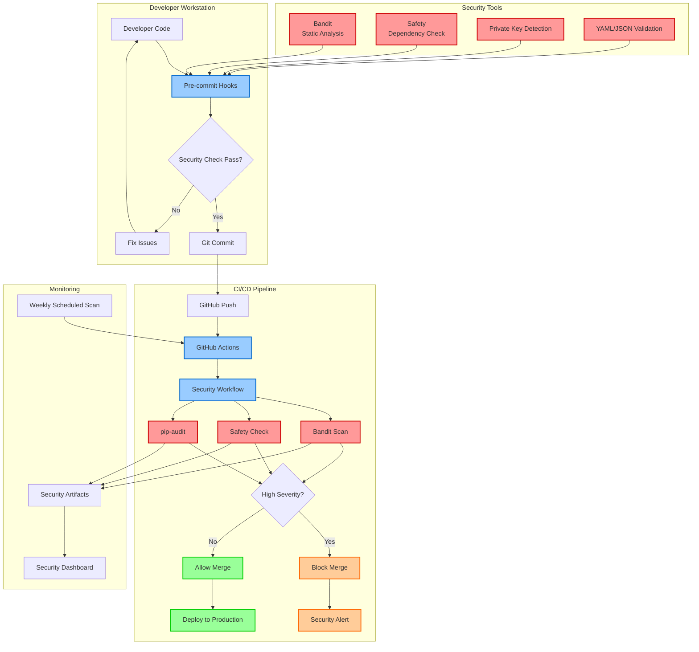
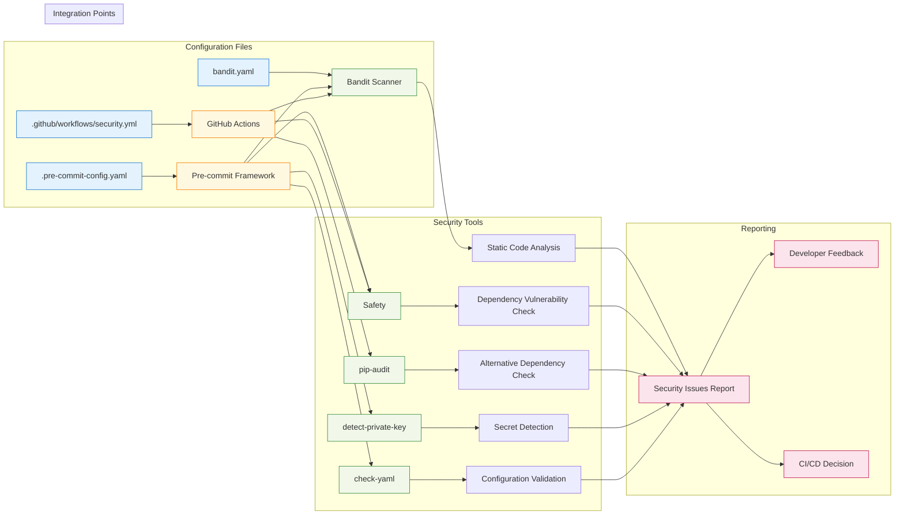
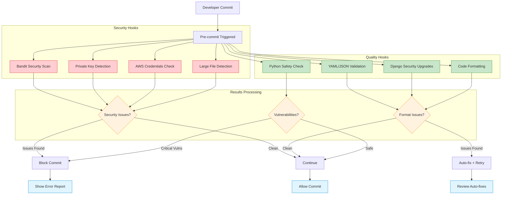
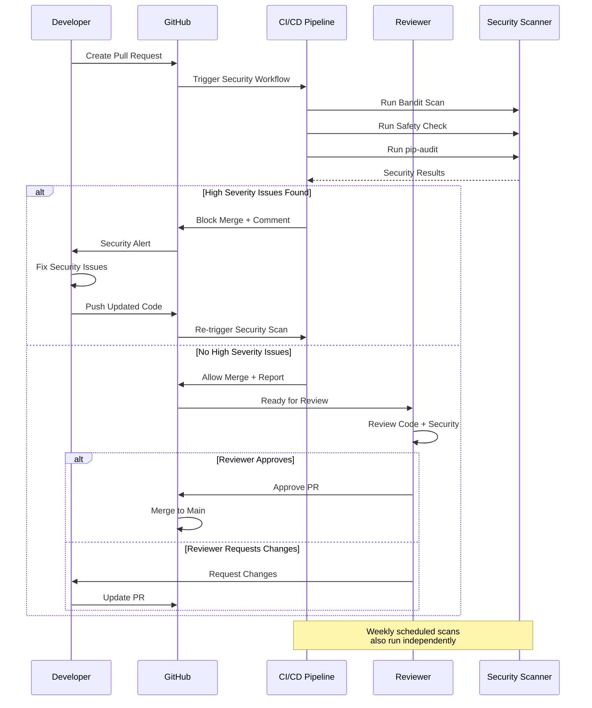
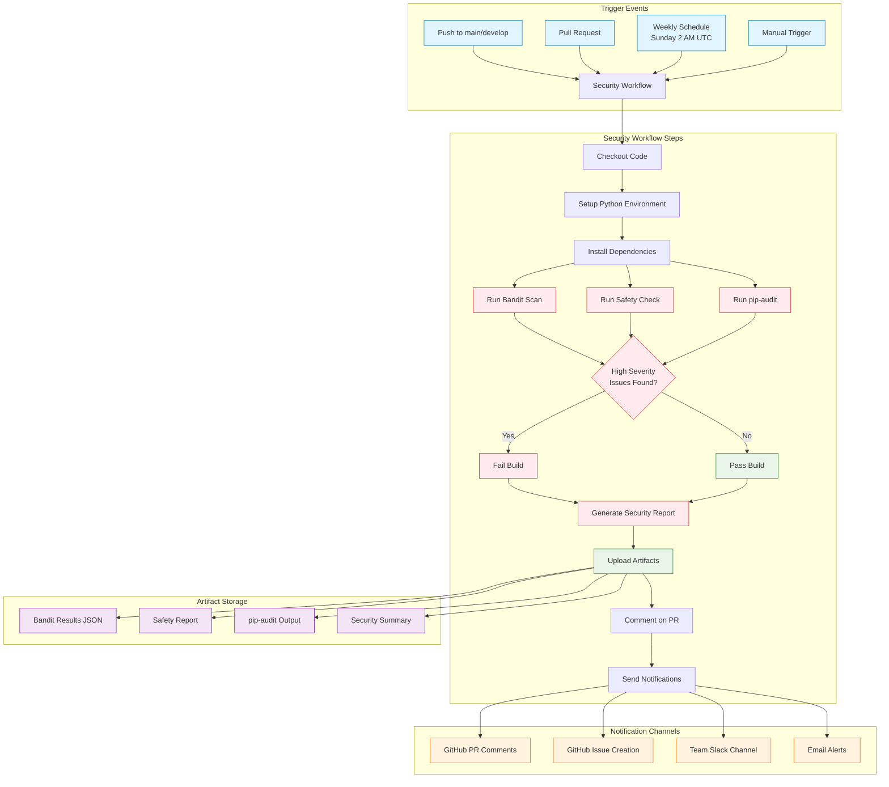
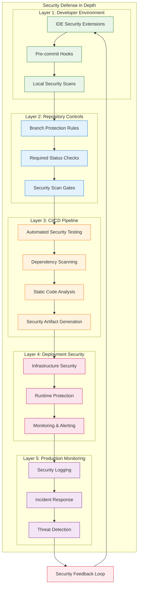

# Security Scanning Workflow for Manage2Soar

This document outlines the security scanning setup and workflow for the Manage2Soar Django project.

## Overview

We use multiple layers of security scanning to protect the application:

1. **Bandit** - Static analysis for Python security issues
2. **Safety** - Vulnerability scanning for Python dependencies
3. **pip-audit** - Alternative dependency vulnerability scanner
4. **Pre-commit hooks** - Automated checks before commits
5. **CI/CD integration** - Automated scanning on pull requests and releases

## Security Architecture



## Security Tools Configuration

### Tool Integration Architecture



### Bandit Configuration (`bandit.yaml`)

Our Bandit configuration focuses on real security issues while excluding test noise:

```yaml
# Excluded directories and file patterns
exclude_dirs: ['.venv', 'staticfiles', 'generated_avatars', 'media', 'tinymce']
exclude: ['*/test_*.py', '*/tests/*', '*/migrations/*', 'conftest.py']

# Security tests to skip (false positives)
skips: ['B101', 'B106', 'B308', 'B601', 'B703']

# Focus on medium+ severity issues  
severity: 'medium'
confidence: 'medium'
```

### Pre-commit Hook Security Stack



## Development Workflow

### Daily Development Process

```mermaid
flowchart TD
    A[Developer Starts Work] --> B[Write/Modify Code]
    B --> C[git add .]
    C --> D[git commit -m "message"]
    D --> E[Pre-commit Hooks Execute]

    E --> F{Bandit Check}
    F -->|Pass| G{Safety Check}
    F -->|Fail| H[Fix Security Issues]

    G -->|Pass| I{Format Checks}
    G -->|Fail| J[Update Dependencies]

    I -->|Pass| K[Commit Success]
    I -->|Fail| L[Auto-fix Formatting]

    H --> M[Add Security Fix]
    J --> N[Review Vulnerabilities]
    L --> O[Review Changes]

    M --> B
    N --> P{Critical Vuln?}
    O --> Q{Acceptable?}

    P -->|Yes| R[Emergency Fix]
    P -->|No| S[Plan Upgrade]
    Q -->|Yes| C
    Q -->|No| B

    R --> B
    S --> T[Create Issue]
    T --> U[Continue Development]
    U --> C

    K --> V[Push to GitHub]
    V --> W[CI/CD Pipeline Triggered]

    classDef success fill:#d4edda,stroke:#155724
    classDef warning fill:#fff3cd,stroke:#856404
    classDef error fill:#f8d7da,stroke:#721c24
    classDef process fill:#cce5ff,stroke:#004085

    class K,V success
    class J,L,O warning
    class H,R error
    class E,F,G,I process
```

### Setup Instructions

1. **Install pre-commit hooks** (one-time setup):
   ```bash
   pip install pre-commit
   pre-commit install
   ```

2. **Normal commits automatically trigger security checks**:
   ```bash
   git add .
   git commit -m "Your commit message"
   # Pre-commit hooks run automatically
   ```

3. **Manual security scan** (optional):
   ```bash
   bandit -r . --configfile bandit.yaml
   ```

### Handling Security Issues

#### When Pre-commit Hooks Fail

1. **Review the security issue** reported by the hook
2. **Fix the issue** in your code
3. **Re-commit** - hooks will run again
4. If it's a **false positive**, add `# nosec` comment with justification:
   ```python
   password = "test123"  # nosec B105 - This is a test fixture password
   ```

#### Security Issue Priority

- **HIGH severity**: Must be fixed before merging
- **MEDIUM severity**: Should be reviewed and addressed
- **LOW severity**: Can be addressed in follow-up work

### Pull Request Security Process



### PR Security Checklist

1. **Create pull request** - triggers automated security scanning
2. **Review security scan results** in the PR comments
3. **Address any HIGH severity issues** before approval
4. **Security gate** will block merge if high-severity issues exist
5. **Document security fixes** in PR description if applicable

## CI/CD Integration

### GitHub Actions Security Pipeline



### Security Workflow Configuration
Located in `.github/workflows/security.yml`, this workflow:

- **Triggers on**: Pushes to main/develop, pull requests, weekly schedule
- **Runs**: Bandit, Safety, pip-audit scans  
- **Reports**: Upload scan results as artifacts
- **Comments**: Adds security summary to pull requests
- **Blocks**: Fails build on high-severity issues

### Scheduled Security Monitoring

```mermaid
gantt
    title Security Scanning Schedule
    dateFormat  X
    axisFormat %w

    section Daily
    Pre-commit Hooks        :active, daily, 0, 7

    section Weekly  
    Dependency Scan         :crit, weekly, 0, 1
    Vulnerability Database Update :weekly, 1, 2

    section Monthly
    Security Tool Updates   :monthly, 4, 5
    Security Config Review  :monthly, 5, 6

    section Quarterly
    Security Audit         :quarterly, 6, 7
    Tool Evaluation        :quarterly, 6, 7
```



## Security Issue Response

### Security Incident Response Workflow

```mermaid
flowchart TD
    A[Security Issue Detected] --> B{Severity Level}

    B -->|CRITICAL/HIGH| C[IMMEDIATE ACTION]
    B -->|MEDIUM| D[STANDARD PROCESS]
    B -->|LOW| E[BACKLOG PROCESS]

    subgraph "Critical/High Severity Response"
        C --> F[Stop Deployment Pipeline]
        F --> G[Create Hotfix Branch]
        G --> H[Security Team Notification]
        H --> I[Develop Emergency Fix]
        I --> J[Emergency Testing]
        J --> K{Fix Verified?}
        K -->|No| I
        K -->|Yes| L[Deploy Hotfix]
        L --> M[Monitor Production]
        M --> N[Post-Incident Review]
        N --> O[Update Security Docs]
    end

    subgraph "Medium Severity Process"
        D --> P[Create GitHub Issue]
        P --> Q[Assign Security Label]
        Q --> R[Developer Assignment]
        R --> S[Plan in Next Sprint]
        S --> T[Implement Fix]
        T --> U[Code Review]
        U --> V[Security Testing]
        V --> W[Deploy with Release]
    end

    subgraph "Low Severity Process"
        E --> X[Add to Security Backlog]
        X --> Y[Quarterly Review]
        Y --> Z[Batch Fix Planning]
        Z --> AA[Include in Maintenance]
    end

    classDef critical fill:#ff4444,stroke:#cc0000,color:#fff
    classDef medium fill:#ffaa44,stroke:#cc6600,color:#000
    classDef low fill:#44ff44,stroke:#00cc00,color:#000
    classDef process fill:#4444ff,stroke:#0000cc,color:#fff

    class C,F,G,H,I,J,K,L,M,N,O critical
    class D,P,Q,R,S,T,U,V,W medium  
    class E,X,Y,Z,AA low
    class A,B process
```

### Response Time Requirements

| Severity | Response Time | Resolution Time | Escalation |
|----------|---------------|-----------------|------------|
| **CRITICAL** | < 1 hour | < 24 hours | Immediate to Security Team |
| **HIGH** | < 4 hours | < 72 hours | Team Lead notification |
| **MEDIUM** | < 1 day | < 2 weeks | Standard assignment |
| **LOW** | < 1 week | Next quarter | Backlog review |

## Common Security Patterns

### Safe Coding Practices

✅ **DO**:
```python
import requests
from django.utils.html import escape

# Use timeouts on external requests
response = requests.get(url, timeout=10)

# Escape user input before mark_safe
safe_content = mark_safe(f"<p>{escape(user_input)}</p>")
```

❌ **DON'T**:
```python
# No timeout - can hang indefinitely
response = requests.get(url)

# Raw user input in mark_safe - XSS risk
unsafe_content = mark_safe(f"<p>{user_input}</p>")
```

### Django Security Settings

- **DEBUG = False** in production
- **SECURE_SSL_REDIRECT = True** for HTTPS
- **CSRF protection** enabled
- **XSS protection** headers set
- **Content Security Policy** configured

## Troubleshooting

### Common Issues

1. **Pre-commit hooks slow/failing**:
   ```bash
   pre-commit run --all-files  # Run on all files
   pre-commit clean  # Clear cache
   ```

2. **False positive security warnings**:
   - Add `# nosec B###` comment with justification
   - Update `.bandit` configuration if pattern is common

3. **CI security scans failing**:
   - Check GitHub Actions logs for specific errors
   - Verify all dependencies are properly installed
   - Review security scan artifacts for details

### Getting Help

- **Security questions**: Ask in team Slack #security channel
- **Tool issues**: Check tool documentation or create GitHub issue
- **Urgent security concerns**: Contact security team immediately

## Updating Security Tools

### Regular Maintenance

- **Monthly**: Update pre-commit hook versions
- **Quarterly**: Review and update security tool configurations
- **As needed**: Add new security tools or rules

### Version Updates

1. **Update `.pre-commit-config.yaml`** with new versions
2. **Test locally** with `pre-commit run --all-files`
3. **Update CI workflow** if needed
4. **Document changes** in team communication

## Security Defense Layers



### Security Tool Effectiveness Matrix

| Tool | Code Issues | Dependencies | Secrets | Config | Runtime |
|------|-------------|--------------|---------|--------|---------|
| **Bandit** | ✅ High | ❌ None | ⚠️ Limited | ❌ None | ❌ None |
| **Safety** | ❌ None | ✅ High | ❌ None | ❌ None | ❌ None |
| **pip-audit** | ❌ None | ✅ High | ❌ None | ❌ None | ❌ None |
| **detect-private-key** | ❌ None | ❌ None | ✅ High | ❌ None | ❌ None |
| **Pre-commit** | ✅ Medium | ✅ Medium | ✅ High | ✅ Medium | ❌ None |
| **GitHub Actions** | ✅ High | ✅ High | ✅ Medium | ✅ Medium | ❌ None |

---

## Quick Reference Commands

| Command | Purpose | When to Use |
|---------|---------|-------------|
| `bandit -r . --configfile bandit.yaml` | Manual security scan | Before major commits |
| `bandit -r . --configfile bandit.yaml --severity-level high` | High severity only | Critical issue check |
| `pre-commit run --all-files` | Run all pre-commit hooks | After config changes |
| `pre-commit run bandit --all-files` | Run only Bandit hook | Security-focused check |
| `safety check` | Check dependencies for vulnerabilities | Dependency updates |
| `pip-audit` | Alternative dependency vulnerability check | Cross-validation |
| `pre-commit autoupdate` | Update hook versions | Monthly maintenance |
| `pre-commit clean` | Clear hook cache | Troubleshooting |

### Emergency Security Commands

```bash
# Stop all running processes
git stash  # Save current work
git checkout main  # Switch to stable branch

# Emergency security scan
bandit -r . --configfile bandit.yaml --severity-level high --format json -o security-emergency.json

# Create hotfix branch
git checkout -b hotfix/security-$(date +%Y%m%d)

# After fix, test security
pre-commit run --all-files
pytest --no-cov  # Quick test run
```

### Configuration Files Reference

- **`bandit.yaml`** - Bandit security scanner configuration
- **`.pre-commit-config.yaml`** - Pre-commit hooks configuration  
- **`.github/workflows/security.yml`** - CI/CD security pipeline
- **`.vscode/settings.json`** - VS Code security extensions config

For questions or security concerns, contact the development team or create a GitHub issue with the `security` label.
