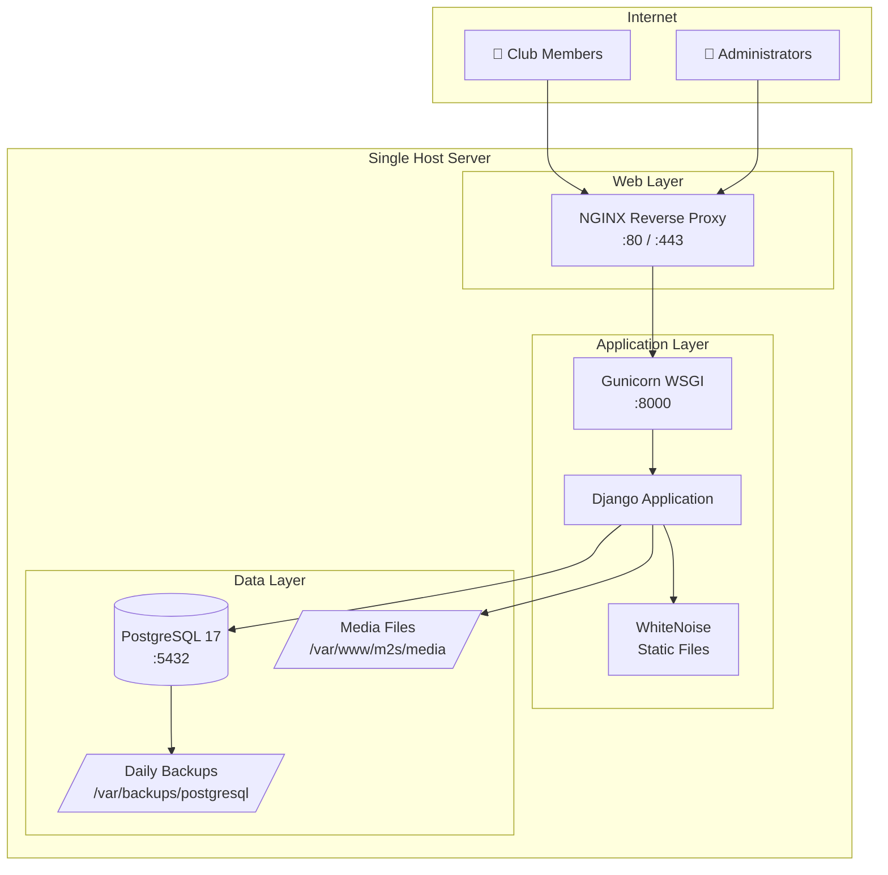
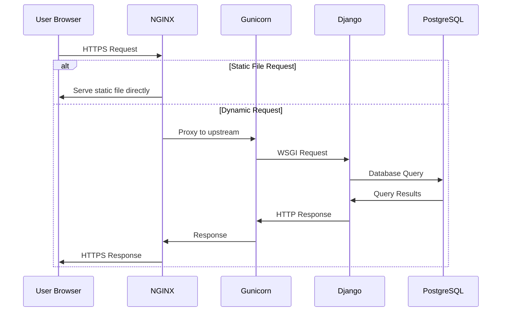
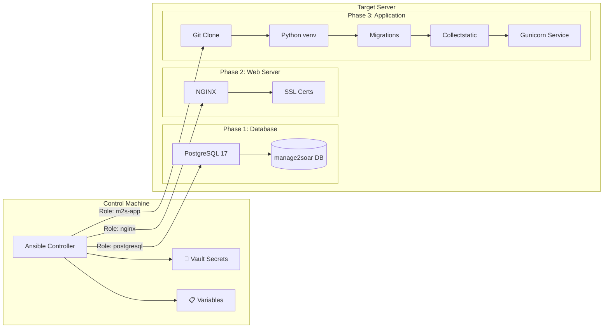
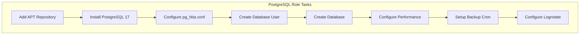
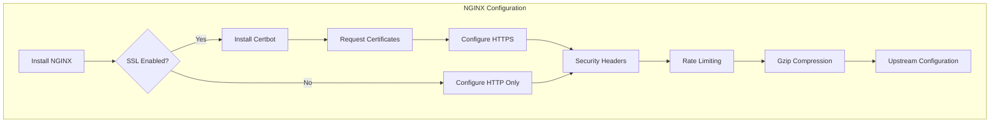
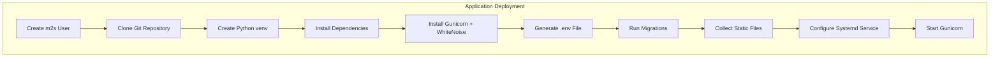
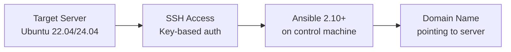
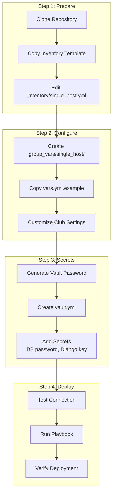

# Single-Host Ansible Deployment

## Overview

Manage2Soar supports deployment to a single Linux server using Ansible automation. This deployment option is ideal for soaring clubs that want to self-host their instance without the complexity of Kubernetes or cloud infrastructure.

**Key Features:**
- 🚀 **One-Command Deployment**: Complete stack installed with a single `ansible-playbook` command
- 🔒 **Security Hardened**: Fail2ban, rate limiting, secure headers, and encrypted secrets
- 📦 **All-in-One Server**: PostgreSQL, NGINX, Gunicorn, and Django on a single host
- 🔄 **Automated Updates**: Easy re-deployment with migration handling
- 💾 **Automated Backups**: Daily PostgreSQL backups with retention policy

## ✅ Status

| Component | Status | Notes |
|-----------|--------|-------|
| PostgreSQL Role | ✅ **READY** | PostgreSQL 17 with automated backups |
| NGINX Role | ✅ **READY** | Reverse proxy with optional Let's Encrypt SSL |
| Django/Gunicorn Role | ✅ **READY** | WhiteNoise static files, systemd service |
| Main Playbook | ✅ **READY** | Orchestrates all roles |
| Documentation | ✅ **COMPLETE** | README and example files |

## Architecture

### System Overview



### Request Flow



### Deployment Process



## Component Details

### PostgreSQL 17

The database role installs and configures PostgreSQL 17 from the official PostgreSQL APT repository.



**Features:**
- Latest PostgreSQL 17 from official repo
- MD5 password authentication for local connections
- Automated daily backups to `/var/backups/postgresql/`
- 30-day backup retention policy
- Performance tuning via `postgresql.conf`

### NGINX Reverse Proxy

The web server role configures NGINX as a secure reverse proxy.



**Security Features:**
- Rate limiting: 10 requests/second burst 20
- Security headers: X-Frame-Options, X-Content-Type-Options, X-XSS-Protection
- Optional Let's Encrypt SSL with automatic renewal
- Connection limits per IP
- Fail2ban integration

### Django/Gunicorn Application

The application role deploys Django with Gunicorn as the WSGI server.



**Features:**
- Git-based deployment from specified branch
- Isolated Python virtual environment
- WhiteNoise for static file serving
- Systemd service with automatic restart
- Environment-based configuration
- Logrotate for log management

## Deployment Workflow

### Prerequisites



### Initial Setup Steps



## Security Architecture

```mermaid
graph TB
    subgraph "Network Security"
        FW[UFW Firewall<br/>Ports: 22, 80, 443]
        F2B[Fail2ban<br/>Brute-force protection]
        RL[NGINX Rate Limiting<br/>10 req/s]
    end

    subgraph "Application Security"
        VAULT[Ansible Vault<br/>Encrypted secrets]
        ENV[Environment Variables<br/>Not in code]
        CSRF[Django CSRF<br/>Protection]
    end

    subgraph "Data Security"
        SSL[TLS 1.2+<br/>Let's Encrypt]
        BACKUP[Daily Backups<br/>30-day retention]
        PERMS[File Permissions<br/>Least privilege]
    end

    FW --> F2B
    F2B --> RL
    VAULT --> ENV
    ENV --> CSRF
    SSL --> BACKUP
    BACKUP --> PERMS
```



## Comparison: Single-Host vs Kubernetes

| Feature | Single-Host | Kubernetes (GKE) |
|---------|-------------|------------------|
| **Complexity** | Low | High |
| **Cost** | ~$10-40/month VPS | $70+/month GKE |
| **Scaling** | Vertical only | Horizontal + Vertical |
| **High Availability** | No | Yes (multi-pod) |
| **Maintenance** | Self-managed | Managed infrastructure |
| **Best For** | Small-medium clubs | Large clubs, multiple tenants |
| **Storage** | Local filesystem | Google Cloud Storage |
| **SSL** | Let's Encrypt | GCP Managed Certs |
| **Deployment** | Ansible | kubectl + GitHub Actions |

## File Locations

### Application Files

```
/opt/m2s/
├── app/                    # Django application code
├── venv/                   # Python virtual environment
├── .env                    # Environment configuration
└── gunicorn.conf.py       # Gunicorn configuration
```

### Web Server Files

```
/etc/nginx/
├── nginx.conf              # Main NGINX config
├── sites-available/
│   └── m2s.conf           # M2S site configuration
└── sites-enabled/
    └── m2s.conf           # Symlink to sites-available
```

### Data & Logs

```
/var/www/m2s/
├── media/                  # User uploads
└── static/                 # Collected static files (optional)

/var/log/
├── m2s/
│   └── django.log         # Application logs
├── nginx/
│   ├── access.log
│   └── error.log
└── gunicorn/
    ├── access.log
    └── error.log
```

### Backups

```
/var/backups/postgresql/
└── m2s_YYYYMMDD.sql.gz    # Daily database backups
```

## Operational Commands

### Service Management

```bash
# Check all services
sudo systemctl status postgresql nginx gunicorn

# Restart application (after code changes)
sudo systemctl restart gunicorn

# View Django logs
journalctl -u gunicorn -f

# View NGINX logs
tail -f /var/log/nginx/access.log
```

### Database Operations

```bash
# Django shell
sudo -u m2s /opt/m2s/venv/bin/python /opt/m2s/app/manage.py shell

# Create superuser
sudo -u m2s /opt/m2s/venv/bin/python /opt/m2s/app/manage.py createsuperuser

# Manual backup
pg_dump -U m2s m2s | gzip > backup.sql.gz
```

### Updates

```bash
# Re-run playbook to update
ansible-playbook -i inventory/single_host.yml \
  --vault-password-file ~/.ansible_vault_pass \
  -e "@group_vars/single_host/vault.yml" \
  -e "@group_vars/single_host/vars.yml" \
  -e "m2s_force_migrate=true" \
  playbooks/single-host.yml
```

## Related Documentation

- **Setup Guide**: [infrastructure/ansible/README.md](../infrastructure/ansible/README.md)
- **Multi-Tenant Deployment**: [multi-tenant-deployment.md](multi-tenant-deployment.md)
- **CronJob Architecture**: [cronjob-architecture.md](cronjob-architecture.md)
- **Notifications System**: [notifications.md](notifications.md)

## GitHub Issue

This deployment option was implemented as part of [Issue #405](https://github.com/pietbarber/Manage2Soar/issues/405).

## Future Enhancements

See [Issue #435](https://github.com/pietbarber/Manage2Soar/issues/435) for planned mail server integration (Postfix + OpenDKIM).
