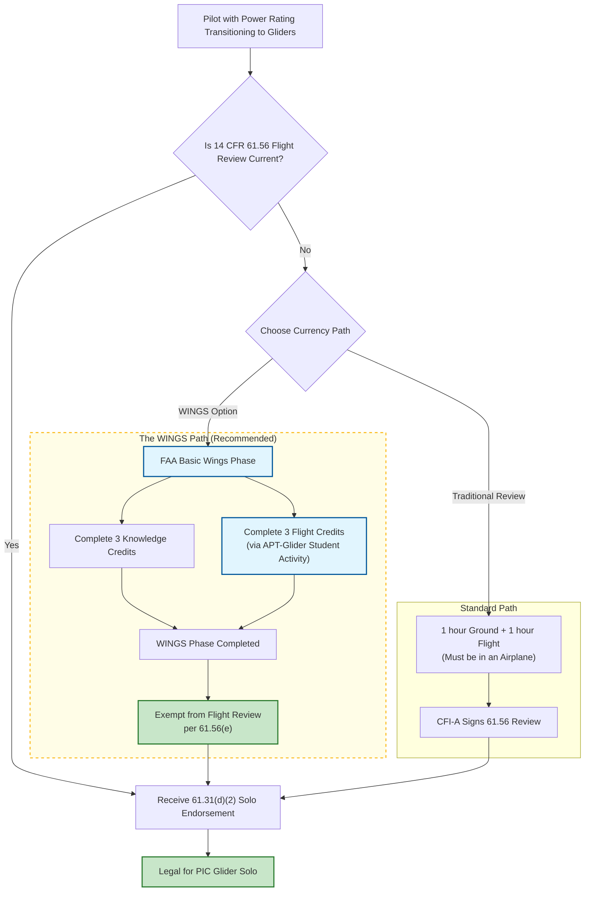

```mermaid
graph TD
    %% Define Node Styles
    classDef wingsPath fill:#fffde7,stroke:#fbc02d,stroke-width:2px,stroke-dasharray: 5 5;
    classDef highlight fill:#e1f5fe,stroke:#01579b,stroke-width:2px;
    classDef success fill:#c8e6c9,stroke:#2e7d32,stroke-width:2px;

    Start[Pilot with Power Rating Transitioning to Gliders] --> ReviewCheck{"Is 14 CFR 61.56 Flight Review Current?"}
    
    ReviewCheck -- "Yes" --> Endorsement["Receive 61.31(d)(2) Solo Endorsement"]
    ReviewCheck -- "No" --> Choice{Choose Currency Path}

    %% WINGS Path on the Left
    subgraph WINGS ["The WINGS Path (Recommended)"]
        direction TB
        W1[FAA Basic Wings Phase] --> W2[Complete 3 Knowledge Credits]
        W1 --> W3["Complete 3 Flight Credits<br/>(via APT-Glider Student Activity)"]
        W2 --> W4[WINGS Phase Completed]
        W3 --> W4
        W4 --> Exempt["Exempt from Flight Review<br/>per 61.56(e)"]
    end

    %% Standard Path on the Right
    subgraph Standard ["Standard Path"]
        direction TB
        S1["1 hour Ground + 1 hour Flight<br/>(Must be in an Airplane)"] --> S2[CFI-A Signs 61.56 Review]
    end

    %% Connect Choice to the start of each subgraph
    Choice -- "WINGS Option" --> W1
    Choice -- "Traditional Review" --> S1

    %% Final exit paths
    Exempt --> Endorsement
    S2 --> Endorsement
    Endorsement --> Solo[Legal for PIC Glider Solo]

    %% Apply Styles
    class WINGS wingsPath;
    class W1,W3 highlight;
    class Exempt,Solo success;

```
