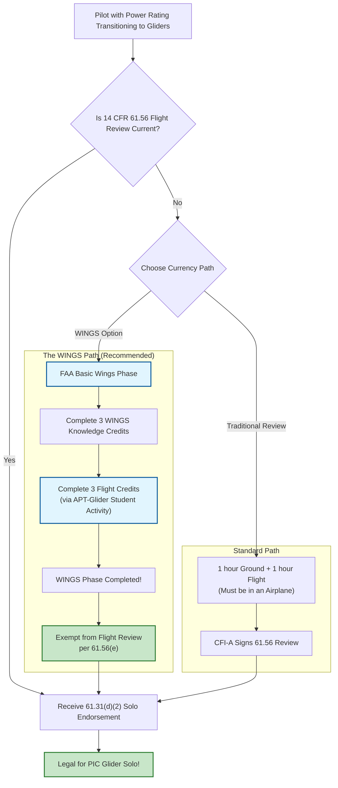

```mermaid
---
config:
  layout: fixed
---
flowchart TB
 subgraph WINGS["The WINGS Path (Recommended)"]
    direction TB
        W2["Complete 3 WINGS Knowledge Credits"]
        W1["FAA Basic Wings Phase"]
        W3["Complete 3 Flight Credits<br>(via APT-Glider Student Activity)"]
        W4["WINGS Phase Completed!"]
        Exempt["Exempt from Flight Review<br>per 61.56(e)"]
  end
 subgraph Standard["Standard Path"]
    direction TB
        S2["CFI-A Signs 61.56 Review"]
        S1["1 hour Ground + 1 hour Flight<br>(Must be in an Airplane)"]
  end
    Start["Pilot with Power Rating Transitioning to Gliders"] --> ReviewCheck{"Is 14 CFR 61.56 Flight Review Current?"}
    ReviewCheck -- Yes --> Endorsement["Receive 61.31(d)(2) Solo Endorsement"]
    ReviewCheck -- No --> Choice{"Choose Currency Path"}
    W1 --> W2
    W4 --> Exempt
    S1 --> S2
    Choice -- WINGS Option --> W1
    Choice -- Traditional Review --> S1
    Exempt --> Endorsement
    Endorsement --> Solo["Legal for PIC Glider Solo!"]
    S2 --> Endorsement
    W3 --> W4
    W2 --> W3

     W1:::highlight
     W3:::highlight
     Exempt:::success
     Solo:::success
    classDef wingsPath fill:#fffde7,stroke:#fbc02d,stroke-width:2px,stroke-dasharray: 5 5
    classDef highlight fill:#e1f5fe,stroke:#01579b,stroke-width:2px
    classDef success fill:#c8e6c9,stroke:#2e7d32,stroke-width:2px
```
