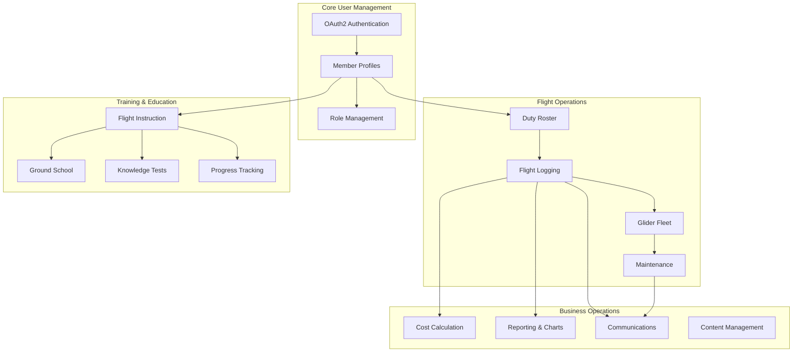
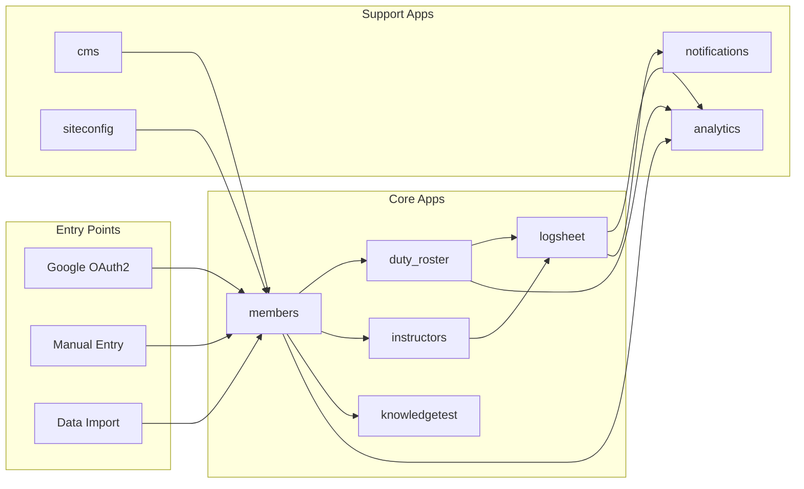
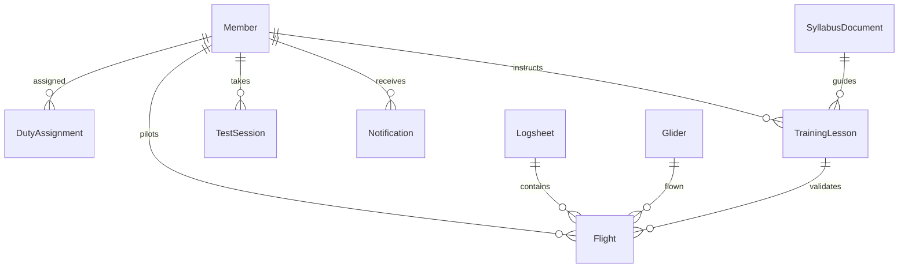
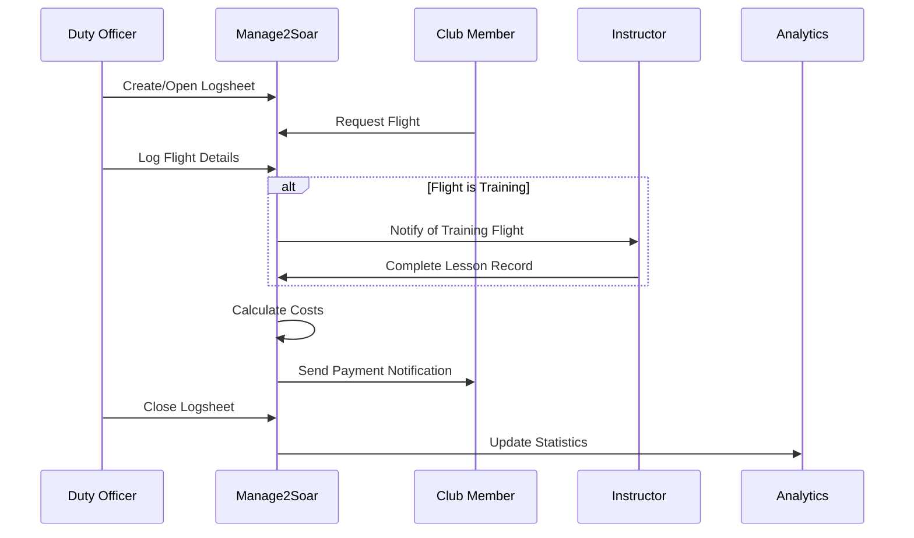
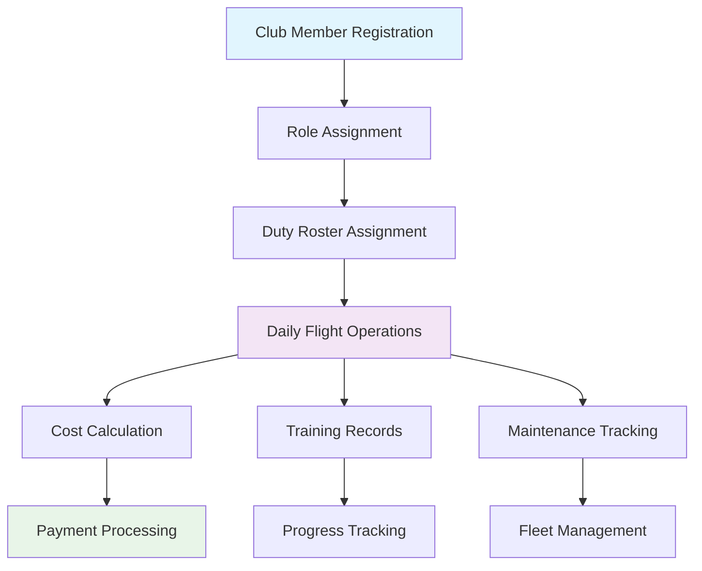

# System Overview - Manage2Soar Workflows

## Manager Overview

Manage2Soar is designed around the core activities of a soaring club: managing members, scheduling duties, logging flights, tracking instruction, and handling payments. The system integrates these activities so that information flows naturally from one process to another.

**Key Principles:**
- **Member-Centric**: Everything revolves around club members and their activities
- **Flight Operations Focus**: Daily flight operations drive most data collection
- **Integrated Workflows**: Each process connects to and supports the others
- **Role-Based Access**: Different members see different features based on their club roles

## System Architecture Overview

## Data Flow Between Apps

## Technical Implementation

### **Django Apps Structure**

| App | Purpose | Key Models | Dependencies |
|-----|---------|------------|--------------|
| `members` | User management, profiles, roles | Member, Badge | Auth (Django) |
| `logsheet` | Flight operations, glider fleet | Flight, Logsheet, Glider | members |
| `duty_roster` | Duty scheduling | DutyAssignment, DutyDay | members |
| `instructors` | Training management | TrainingLesson, SyllabusDocument | members |
| `knowledgetest` | Written examinations | TestSession, Question | members |
| `analytics` | Read-only reporting | *(no models)* | logsheet, members |
| `notifications` | Communication system | Notification | members |
| `cms` | Content management | Page, HomePageContent | members |
| `siteconfig` | System configuration | *(admin only)* | *(none)* |

### **Key Integration Points**

1. **Member Model**: Central user model extended from Django's AbstractUser
2. **Signals**: Cross-app communication for automated actions
3. **Permissions**: Role-based access control throughout the system
4. **Shared Templates**: Common UI components and styling

### **Database Relationships**

## Process Integration Flow

### **Daily Operations Workflow**

### **Information Flow Hierarchy**

## Key Workflow Categories

### **1. Member Management**
- Registration and authentication
- Profile maintenance and roles
- Badge tracking and certification

### **2. Operations Planning** 
- Duty roster generation and management
- Resource allocation and scheduling
- Weather and operations coordination

### **3. Flight Operations**
- Daily logsheet management
- Flight logging and validation
- Cost calculation and payment tracking

### **4. Training & Education**
- Lesson planning and instruction
- Progress tracking and certification
- Knowledge testing and evaluation

### **5. Business Intelligence**
- Performance analytics and reporting
- Fleet utilization and maintenance
- Financial tracking and forecasting

## Known Gaps & Improvements

### **Current System Strengths**
- ✅ Comprehensive flight logging
- ✅ Integrated cost calculation
- ✅ Role-based permissions
- ✅ Automated notifications
- ✅ Rich analytics and reporting

### **Identified Gaps**
- 🟡 **Calendar Integration**: No centralized calendar view across all activities
- 🟡 **Mobile Optimization**: Some workflows not optimized for mobile devices
- 🟡 **Real-time Updates**: Limited real-time collaboration features
- 🟡 **Inventory Management**: Basic glider tracking, could be more comprehensive
- 🟡 **External Integrations**: No weather data, payment gateway, or external calendar integration

### **Improvement Opportunities**
- 🔄 **Workflow Automation**: More automated task routing and notifications
- 🔄 **Data Validation**: Enhanced data quality checks and validation rules
- 🔄 **User Experience**: Streamlined workflows for common tasks
- 🔄 **Reporting Enhancement**: More detailed analytics and custom report generation
- 🔄 **Integration APIs**: External system integration capabilities

## Next Steps

For detailed information about specific workflows, see the individual workflow documents:

- **[Member Lifecycle](02-member-lifecycle.md)** - How users join and progress through the system
- **[Flight Operations](04-logsheet-workflow.md)** - The heart of daily club operations
- **[Training Programs](03-instruction-workflow.md)** - How instruction and certification work
- **[Business Processes](07-payment-workflow.md)** - Financial and administrative workflows

---

*This overview provides the foundation for understanding how all Manage2Soar workflows interconnect. Each specific workflow document builds on these concepts with detailed process flows and implementation details.*