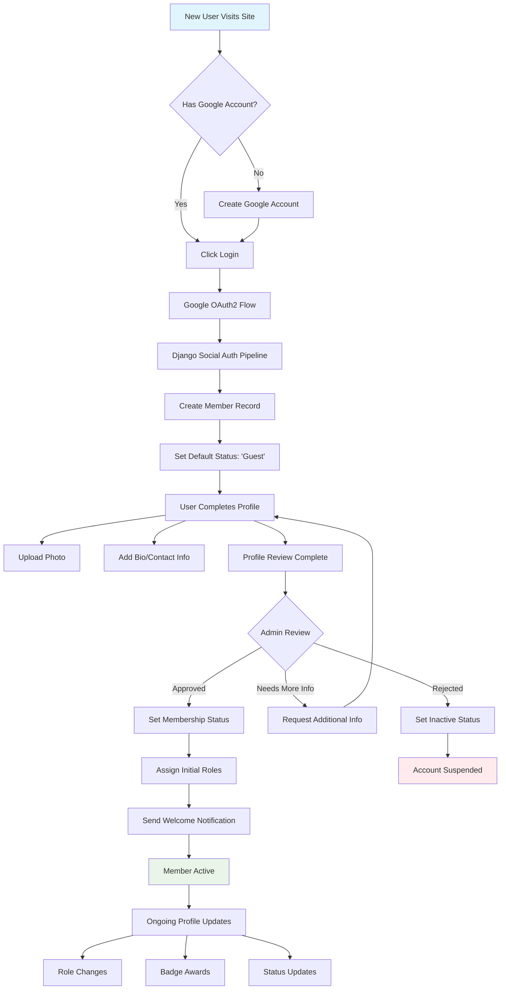
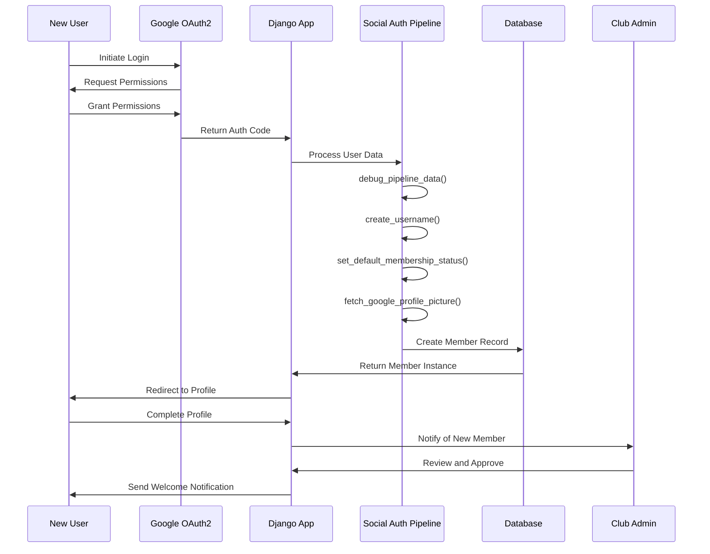
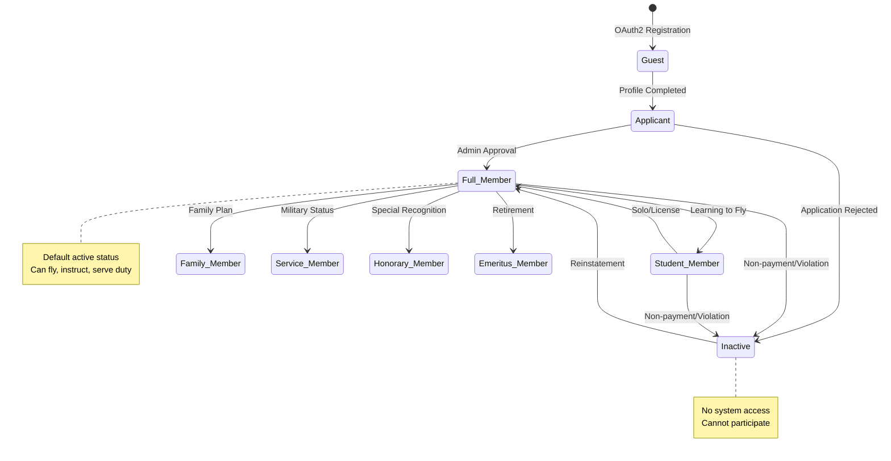
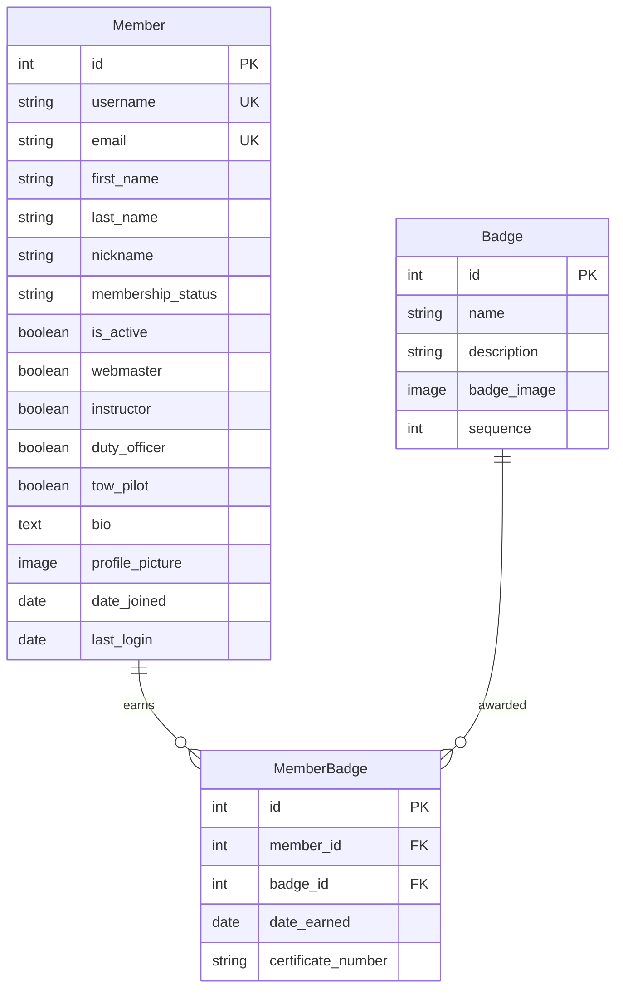
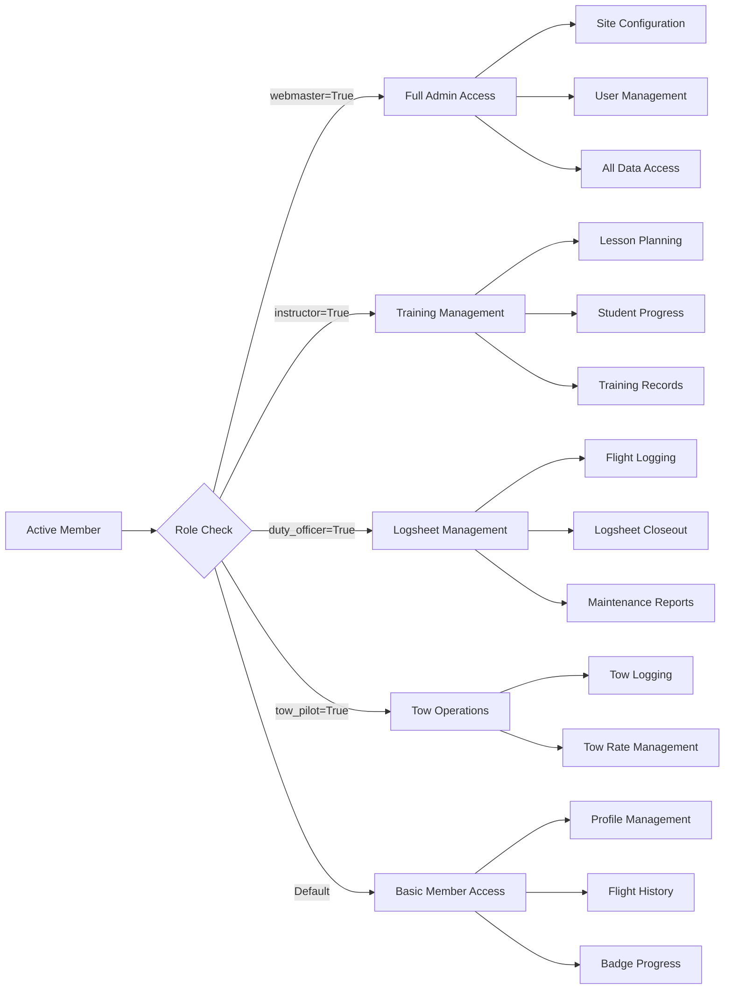
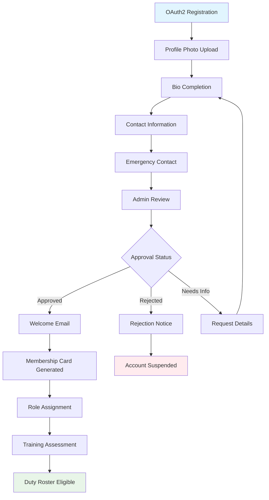
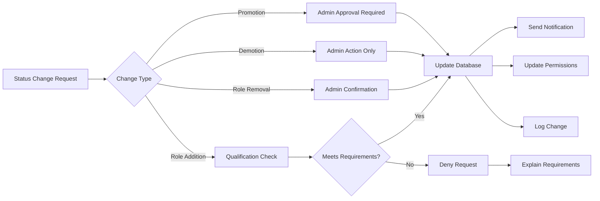

# Member Lifecycle Workflow

## Manager Overview

The member lifecycle describes how individuals join the club, get their profiles set up, receive appropriate permissions, and progress through different membership levels. This is the foundation workflow that enables all other club activities.

**Key Stages:**
1. **Registration** - New user creates account via Google OAuth2
2. **Profile Setup** - Basic information and club-specific details
3. **Membership Activation** - Admin approval and status assignment
4. **Role Assignment** - Permissions based on qualifications and club roles
5. **Ongoing Management** - Updates, renewals, and status changes

## Process Flow

## Technical Implementation

### **Models Involved**
- **`members.Member`**: Extended Django User model with club-specific fields
- **`members.Badge`**: Soaring badges and certifications
- **`notifications.Notification`**: Welcome messages and status updates

### **Key Files**
- **Pipeline**: `members/pipeline.py` - OAuth2 user creation and setup
- **Views**: `members/views.py` - Profile management and display
- **Forms**: `members/forms.py` - Profile editing and validation
- **Admin**: `members/admin.py` - Membership approval and management

### **Authentication Flow Details**

### **Member Status Progression**

### **Database Schema**

## Key Integration Points

### **Downstream Dependencies**
Once a member is active, they can participate in:
- **Duty Roster**: Assignment to duty officer, instructor, or tow pilot roles
- **Flight Operations**: Logging flights as pilot or passenger
- **Instruction**: Taking lessons or providing instruction
- **Knowledge Tests**: Taking written examinations
- **Notifications**: Receiving club communications

### **Permission-Based Access**
Member roles determine access to different parts of the system:

## Common Workflows

### **New Member Onboarding Checklist**

### **Member Status Changes**

## Known Gaps & Improvements 

### **Current Strengths**
- ✅ Seamless Google OAuth2 integration
- ✅ Comprehensive profile management
- ✅ Flexible role-based permissions
- ✅ Automated welcome process
- ✅ Badge tracking and display

### **Identified Gaps**
- 🟡 **Membership Renewals**: No automated renewal process or expiration tracking
- 🟡 **Family Plans**: Limited support for family membership management
- 🟡 **Payment Integration**: No payment processing for membership dues
- 🟡 **Document Management**: No member document storage (certificates, medical, etc.)
- 🟡 **Communication Preferences**: Limited notification preference management

### **Improvement Opportunities**
- 🔄 **Self-Service Role Requests**: Allow members to request role changes with approval workflow
- 🔄 **Onboarding Automation**: Guided setup process for new members
- 🔄 **Profile Completeness**: Progress indicators and reminders for incomplete profiles
- 🔄 **Bulk Operations**: Admin tools for bulk member updates and communications
- 🔄 **Integration APIs**: Connect with external membership management systems

### **Data Quality Issues**
- 🔄 **Duplicate Detection**: Prevent duplicate accounts for same person
- 🔄 **Profile Validation**: Ensure required fields are completed
- 🔄 **Contact Updates**: Automated reminders to keep contact information current
- 🔄 **Photo Standards**: Guidelines and validation for profile photos

## Related Workflows

- **[Duty Roster Workflow](05-duty-roster-workflow.md)**: How members get assigned to duties
- **[Instruction Workflow](03-instruction-workflow.md)**: How members progress through training
- **[Knowledge Test Lifecycle](09-knowledge-test-lifecycle.md)**: How members take written exams
- **[System Overview](01-system-overview.md)**: How member management fits into the broader system

---

*The member lifecycle is the foundation that enables all other club activities. A well-managed member database ensures smooth operations across all other workflows.*