# Instruction Workflow

## Manager Overview

The instruction workflow manages the complete training lifecycle for club members learning to fly gliders. This includes lesson planning, flight instruction, progress tracking, and certification management. The system integrates instruction records with flight logging to provide comprehensive training documentation.

**Key Stages:**
1. **Student Assessment** - Evaluate student readiness and goals
2. **Lesson Planning** - Create structured training curriculum
3. **Flight Instruction** - Conduct actual training flights
4. **Progress Tracking** - Monitor student advancement through syllabus
5. **Certification** - Document achievements and endorsements

## Process Flow

## Technical Implementation

### **Models Involved**
- **`instructors.TrainingLesson`**: Individual lesson records
- **`instructors.SyllabusDocument`**: Training curriculum structure
- **`instructors.TrainingPhase`**: Organized training stages
- **`instructors.ClubQualificationType`**: Certification types
- **`logsheet.Flight`**: Flight records linked to training
- **`members.Member`**: Students and instructors

### **Key Files**
- **Models**: `instructors/models.py` - Training data structures
- **Views**: `instructors/views.py` - Lesson management interface
- **Forms**: `instructors/forms.py` - Lesson creation and editing
- **Utils**: `instructors/utils.py` - Training logic and calculations
- **Signals**: `instructors/signals.py` - Automated notifications

### **Training Lesson Lifecycle**

### **Training Progress Tracking**

### **Database Schema**

## Key Integration Points

### **Flight Operations Integration**
Training lessons are tightly integrated with flight logging:

```mermaid
flowchart LR
    A[Training Lesson Created] --> B[Flight Scheduled]
    B --> C[Duty Officer Logs Flight]
    C --> D[Flight Linked to Lesson]
    D --> E[Instructor Completes Lesson]
    E --> F[Progress Updated]
    F --> G[Reports Generated]

    subgraph "Automatic Connections"
        H[Student → Pilot]
        I[Instructor → Instructor]
        J[Lesson Date → Flight Date]
        K[Training Type → Flight Purpose]
    end
```

### **Notification Triggers**

The system sends automated notifications for:

**In-App Notifications:**
- InstructionReport created/updated → Student notification with link to instruction record
- GroundInstruction logged → Student notification with instructor/date details
- MemberQualification awarded → Member notification with qualification details
- MemberBadge awarded → Member notification with link to badge board

**Email Notifications (Issue #366):**
- **Instruction Report Submission** → Email sent to student with full report details
  - **TO**: Student's email address
  - **CC**: Instructors mailing list (if configured via MailingList model)
  - **Content**: Report date, instructor, lesson scores, instructor notes, new qualifications
  - **Update Detection**: "Updated:" prefix in subject and banner for modified reports
  - **Qualifications**: Newly awarded qualifications highlighted with celebration styling
  - **Call to Action**: Link to student's training logbook

Email delivery is automatic when an instructor fills out an instruction report. The system detects both new reports and updates to existing reports, and intelligently tracks qualification status transitions (not just new qualifications, but also updates from unqualified to qualified status).

### **Analytics Integration**
Training data feeds into analytics for:
- Instructor performance metrics
- Student progress statistics
- Training phase completion rates
- Seasonal training activity patterns

## Common Workflows

### **New Student Onboarding**

### **Lesson Documentation Process**

### **Instructor Assignment Process**

## Known Gaps & Improvements

### **Current Strengths**
- ✅ Comprehensive lesson documentation
- ✅ Structured training phases and syllabus
- ✅ Integration with flight logging
- ✅ Progress tracking and reporting
- ✅ Instructor assignment management
- ✅ **Automated email notifications to students** (Issue #366)
- ✅ **Instructor team CC on instruction reports** (via MailingList)
- ✅ **Qualification tracking and notifications** (new and status changes)
- ✅ **Update detection for modified reports**
- ✅ **In-app notifications for students** (InstructionReport, GroundInstruction, Qualifications, Badges)

### **Identified Gaps**
- 🟡 **Calendar Integration**: No centralized scheduling system for lessons
- 🟡 **Student Portal**: Limited self-service options for students
- 🟡 **Mobile Access**: Instructors need mobile-friendly lesson entry
- 🟡 **Automated Scheduling**: Manual coordination between instructors and students
- 🟡 **Video/Photo Integration**: No multimedia support for training documentation

### **Improvement Opportunities**
- 🔄 **Smart Scheduling**: AI-assisted lesson scheduling based on weather, availability, and progress
- 🔄 **Progress Visualization**: Better charts and graphs for student progress tracking
- 🔄 **Standardized Checkrides**: Formal check ride scheduling and documentation
- 🔄 **Training Analytics**: Advanced metrics on training effectiveness and completion rates
- 🔄 **External Integration**: Connect with FAA databases and external training records

### **Training Quality Issues**
- 🔄 **Consistency Standards**: Ensure all instructors follow the same syllabus standards
- 🔄 **Competency Tracking**: Better validation that students master required skills
- 🔄 **Safety Documentation**: Enhanced safety incident tracking and lesson learned integration
- 🔄 **Instructor Development**: Continuing education tracking for instructors

### **Administrative Efficiency**
- 🔄 **Bulk Operations**: Tools for managing multiple students and lessons efficiently
- 🔄 **Report Automation**: Automated generation of training progress reports
- 🔄 **Compliance Tracking**: Ensure training meets regulatory requirements
- 🔄 **Resource Management**: Better allocation of aircraft and instructor time

## Student Communication System

### **Email Notification Flow**

When an instructor submits an instruction report, the system automatically delivers a comprehensive email to the student:

### **Email Content Design**

The instruction report email provides a professional, comprehensive summary of the training session:

**Subject Line:**
- New: `Instruction Report - [Student Name] - [Date]`
- Update: `Updated: Instruction Report - [Student Name] - [Date]`

**Visual Elements:**
- Club logo and branding
- Color-coded lesson scores:
  - 🟣 ① Introduced (purple)
  - 🔵 ② Practiced (blue)
  - 🟢 ③ Solo Standard (green)
  - 🟢 ④ Checkride Standard (dark green)
  - 🔴 ⚠ Needs Attention (red)
- Update banner for modified reports (yellow highlight)
- Celebration section for new qualifications (green highlight)

**Content Sections:**
1. Greeting with report date and instructor name
2. Update notice (if applicable)
3. New qualifications with expiration dates (if any)
4. Training items covered with color-coded scores
5. Instructor notes (rich text from TinyMCE)
6. Score legend for reference
7. Call-to-action button linking to student's training logbook

**Technical Implementation:**
- Multipart email (HTML + plain text)
- Responsive design for mobile devices
- From: `noreply@[domain_name]`
- Respects EMAIL_DEV_MODE for safe testing
- Automatic deduplication of student from CC list

### **Qualification Tracking Intelligence**

The system intelligently tracks qualification status changes:
- **New qualification**: Student didn't have this qualification before → Email includes it
- **Status transition**: Student had unqualified record, now marked qualified → Email includes it
- **Re-qualification**: Student already qualified, record updated → Not included (no change in status)

This ensures students receive notifications when they actually achieve a new qualification, not just when database records are updated.

## Related Workflows

- **[Member Lifecycle](02-member-lifecycle.md)**: How students become members and gain certifications
- **[Logsheet Workflow](04-logsheet-workflow.md)**: How training flights are logged and tracked
- **[Ground Instruction](08-ground-instruction.md)**: Classroom and theory training integration
- **[Knowledge Test Lifecycle](09-knowledge-test-lifecycle.md)**: Written examination process for students
- **[Duty Roster Workflow](05-duty-roster-workflow.md)**: How instructors are scheduled for duty

---

*The instruction workflow is critical for club growth and safety. Well-documented training ensures consistent, high-quality instruction that produces competent, safe pilots.*
