# Logsheet Workflow

## Manager Overview

The logsheet workflow is the operational heart of the soaring club, managing daily flight operations from dawn to dusk. It encompasses logsheet creation, flight logging, cost calculation, maintenance tracking, and end-of-day reconciliation. This workflow captures all flight activity and integrates with billing, instruction, and maintenance systems.

**Key Stages:**
1. **Pre-Operations Setup** - Create daily logsheet and assign duty crew
2. **Flight Operations** - Log flights, track aircraft, manage operations
3. **Cost Calculation** - Calculate tow fees, rental costs, and member charges
4. **Maintenance Tracking** - Document aircraft issues and maintenance needs
5. **End-of-Day Closeout** - Reconcile flights, finalize costs, archive records

## Process Flow

## Technical Implementation

### **Models Involved**
- **`logsheet.Logsheet`**: Daily operations record
- **`logsheet.Flight`**: Individual flight records
- **`logsheet.Glider`**: Aircraft fleet management
- **`logsheet.Towplane`**: Tow aircraft management
- **`logsheet.Airfield`**: Operations locations
- **`logsheet.TowRate`**: Pricing for tow services
- **`logsheet.MaintenanceIssue`**: Aircraft maintenance tracking
- **`members.Member`**: Pilots, instructors, and duty officers

### **Key Files**
- **Models**: `logsheet/models.py` - Flight operations data structures
- **Views**: `logsheet/views.py` - Flight logging interface
- **Forms**: `logsheet/forms.py` - Flight entry and editing forms
- **Utils**: `logsheet/utils.py` - Cost calculations and business logic
- **Signals**: `logsheet/signals.py` - Automated notifications and analytics updates

### **Daily Operations Sequence**

### **Flight Cost Calculation Engine**

```mermaid
flowchart LR
    A[Flight Data] --> B[Calculate Tow Cost]
    A --> C[Calculate Rental Cost]
    A --> D[Check Split Arrangements]
    
    B --> E[Release Altitude × Rate]
    C --> F[Flight Time × Hourly Rate]
    D --> G[Apply Cost Splitting]
    
    E --> H[Base Tow Cost]
    F --> I[Base Rental Cost]
    G --> J[Member Portions]
    
    H --> K[Apply Member Discounts]
    I --> K
    J --> K
    
    K --> L[Final Member Costs]
    L --> M[Generate Billing Records]
    M --> N[Send Payment Notifications]
```

### **Aircraft Status Tracking**

### **Database Schema**

## Key Integration Points

### **Training Integration**
Flight operations seamlessly integrate with instruction:

### **Payment Processing Integration**
Flight costs automatically flow to payment systems:

### **Maintenance Workflow Integration**
Maintenance issues are tracked and resolved:

## Common Workflows

### **Standard Flight Operations Day**

### **Flight Cost Splitting Process**

### **Maintenance Issue Resolution**

## Known Gaps & Improvements

### **Current Strengths**
- ✅ Comprehensive flight logging and tracking
- ✅ Integrated cost calculation and billing
- ✅ Real-time aircraft status management
- ✅ Maintenance issue tracking and notifications
- ✅ Training flight integration
- ✅ Detailed reporting and analytics integration

### **Identified Gaps**
- 🟡 **Real-time Updates**: Limited real-time collaboration between duty officers
- 🟡 **Mobile Interface**: Duty officers need better mobile access for field operations
- 🟡 **Weather Integration**: No automated weather data integration
- 🟡 **Aircraft Scheduling**: No advance booking system for aircraft
- 🟡 **Digital Signatures**: Paper-based sign-offs for maintenance and inspections

### **Improvement Opportunities**
- 🔄 **Predictive Analytics**: Use historical data to predict busy periods and maintenance needs
- 🔄 **Automated Notifications**: Enhanced notification system for operations status
- 🔄 **Integration APIs**: Connect with external flight tracking and weather systems
- 🔄 **Workflow Automation**: Reduce manual data entry and repetitive tasks
- 🔄 **Advanced Reporting**: More sophisticated analytics and operational metrics

### **Operational Efficiency**
- 🔄 **Queue Management**: Better system for managing flight requests during busy periods
- 🔄 **Resource Optimization**: AI-assisted aircraft and instructor scheduling
- 🔄 **Batch Operations**: Tools for processing multiple flights efficiently
- 🔄 **Error Prevention**: Enhanced validation to prevent data entry errors
- 🔄 **Backup Procedures**: Improved contingency planning for system outages

### **Safety and Compliance**
- 🔄 **Safety Reporting**: Enhanced safety incident tracking and analysis
- 🔄 **Regulatory Compliance**: Automated compliance checking and reporting
- 🔄 **Audit Trail**: Complete tracking of all changes and modifications
- 🔄 **Risk Management**: Integration with safety management systems

## Related Workflows

- **[Duty Roster Workflow](05-duty-roster-workflow.md)**: How duty officers are assigned to manage operations
- **[Instruction Workflow](03-instruction-workflow.md)**: How training flights are integrated with operations
- **[Payment Workflow](07-payment-workflow.md)**: How flight costs are calculated and collected
- **[Maintenance Workflow](06-maintenance-workflow.md)**: How aircraft maintenance is tracked and managed
- **[Member Lifecycle](02-member-lifecycle.md)**: How member status affects flight privileges and costs

---

*The logsheet workflow is essential for safe, efficient flight operations. It provides the data foundation that drives instruction tracking, financial management, and operational analytics throughout the club.*