# Duty Roster Workflow

## Manager Overview

The duty roster workflow manages the scheduling and assignment of club members to essential operational roles. This includes duty officers, assistant duty officers, instructors, tow pilots, and other staff needed for safe daily flight operations. The system balances member availability, qualifications, and preferences while ensuring adequate coverage for all operations.

**Key Stages:**
1. **Roster Planning** - Determine coverage needs and generate schedules
2. **Member Availability** - Collect blackout dates and preferences  
3. **Assignment Generation** - Create duty assignments using automated logic
4. **Review and Approval** - Validate assignments and handle conflicts
5. **Ongoing Management** - Handle swaps, changes, and coverage issues

## Process Flow

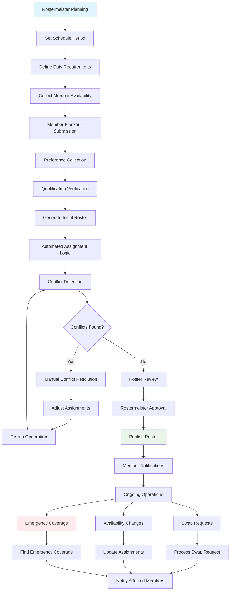

## Technical Implementation

### **Models Involved**
- **`duty_roster.DutyAssignment`**: Individual duty assignments
- **`duty_roster.DutyDay`**: Duty requirements for specific dates
- **`duty_roster.MemberBlackout`**: Member unavailable dates
- **`duty_roster.DutyPreference`**: Member role preferences
- **`duty_roster.DutySwapRequest`**: Swap requests between members
- **`duty_roster.DutySwapOffer`**: Available coverage offers
- **`duty_roster.OpsIntent`**: Planned operations and weather decisions
- **`members.Member`**: Club members with qualifications

### **Key Files**
- **Models**: `duty_roster/models.py` - Duty scheduling data structures
- **Views**: `duty_roster/views.py` - Roster management interface
- **Generator**: `duty_roster/roster_generator.py` - Automated assignment logic
- **Utils**: `duty_roster/utils.py` - Scheduling algorithms and validation
- **Management**: `duty_roster/management/commands/` - Automated roster generation

### **Roster Generation Process**

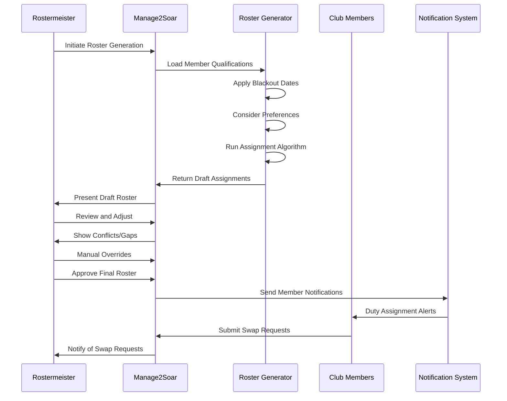

### **Assignment Logic Flow**

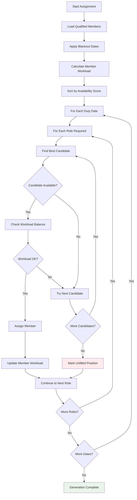

### **Member Qualification Matrix**

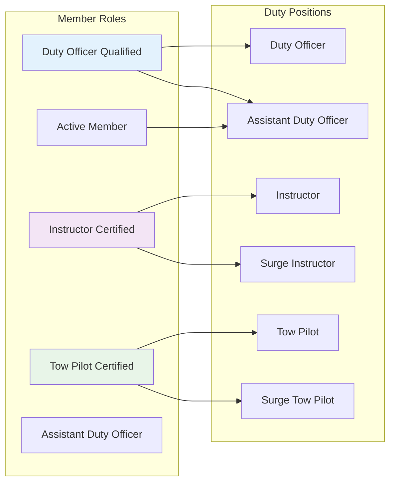

### **Database Schema**

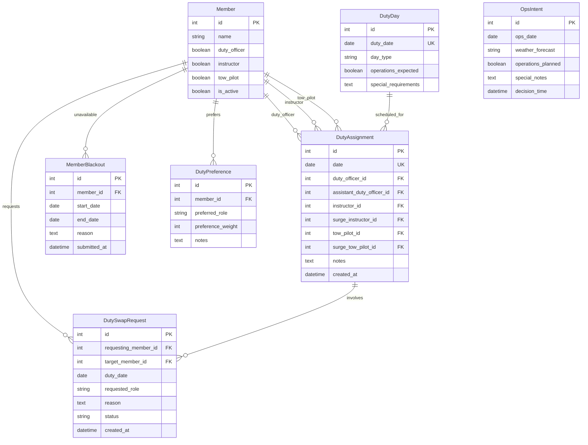

## Key Integration Points

### **Logsheet Integration**
Duty assignments flow directly into daily operations:

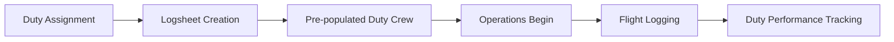

### **Member Qualification Tracking**
The system tracks and validates member qualifications:

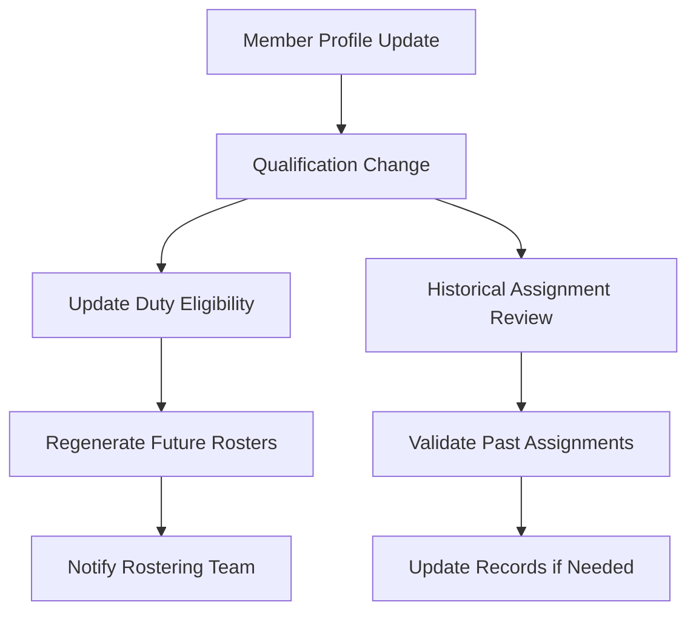

### **Communication and Notifications**
Automated notifications keep members informed:

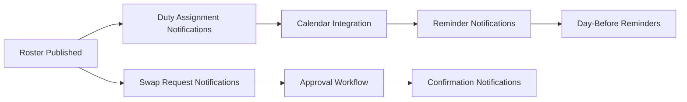

## Common Workflows

### **Monthly Roster Generation**

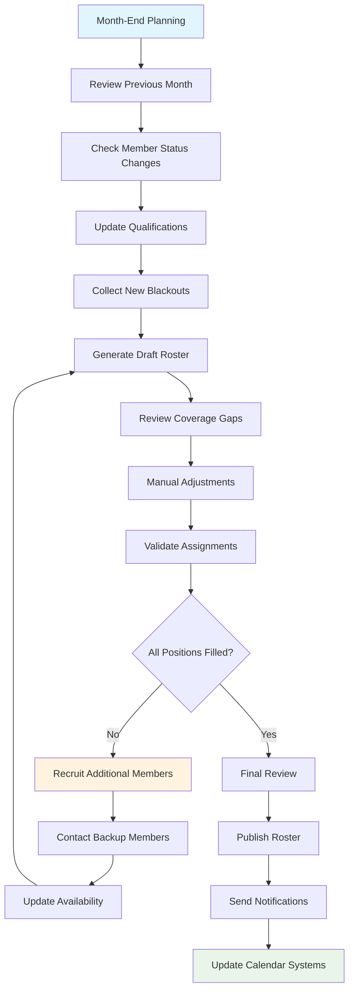

### **Duty Swap Management**

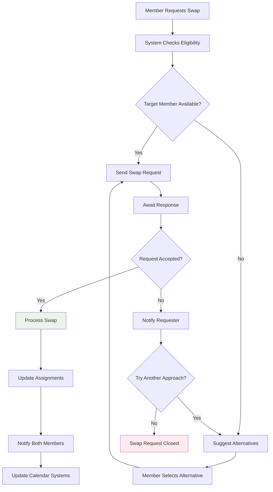

### **Emergency Coverage Process**

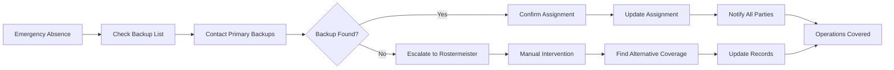

## Known Gaps & Improvements

### **Current Strengths**
- ✅ Automated roster generation with conflict detection
- ✅ Member blackout and preference management
- ✅ Duty swap request and approval workflow
- ✅ Integration with daily operations (logsheet)
- ✅ Qualification-based assignment validation
- ✅ Comprehensive notification system

### **Identified Gaps**
- 🟡 **Predictive Scheduling**: No weather-based scheduling adjustments
- 🟡 **Mobile Accessibility**: Limited mobile interface for duty management
- 🟡 **Calendar Integration**: No two-way sync with external calendar systems
- 🟡 **Workload Analytics**: Limited analysis of member duty distribution
- 🟡 **Automated Reminders**: Basic reminder system could be enhanced

### **Improvement Opportunities**
- 🔄 **AI-Assisted Scheduling**: Machine learning for optimal assignment patterns
- 🔄 **Weather Integration**: Automatic adjustment based on weather forecasts
- 🔄 **Skill Development Tracking**: Integrate with training progress for role advancement
- 🔄 **Performance Metrics**: Track duty performance and reliability
- 🔄 **External Integration**: Connect with other club scheduling systems

### **Operational Efficiency**
- 🔄 **Batch Processing**: Bulk operations for roster management
- 🔄 **Template Systems**: Reusable roster patterns for seasonal operations
- 🔄 **Conflict Prevention**: Enhanced validation to prevent scheduling conflicts
- 🔄 **Resource Optimization**: Better allocation of qualified members
- 🔄 **Succession Planning**: Identify and develop future duty officers and instructors

### **Member Experience**
- 🔄 **Self-Service Portal**: Enhanced member interface for availability and swaps
- 🔄 **Mobile Notifications**: Push notifications for duty assignments and changes
- 🔄 **Preference Learning**: System learns from member swap patterns and preferences
- 🔄 **Feedback Integration**: Member feedback on duty assignments and improvements
- 🔄 **Recognition System**: Acknowledge members who take on extra duty responsibilities

## Related Workflows

- **[Member Lifecycle](02-member-lifecycle.md)**: How member qualifications determine duty eligibility
- **[Logsheet Workflow](04-logsheet-workflow.md)**: How duty assignments enable daily flight operations
- **[Instruction Workflow](03-instruction-workflow.md)**: How instructors are scheduled for training duties
- **[System Overview](01-system-overview.md)**: How duty roster fits into overall club operations

---

*The duty roster workflow ensures adequate staffing for safe flight operations. Effective duty scheduling is essential for consistent club operations and member engagement.*
