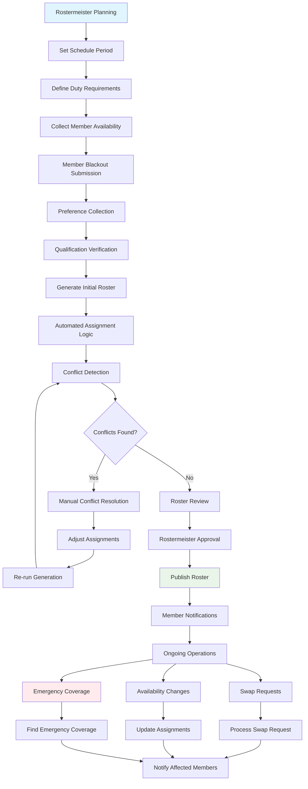
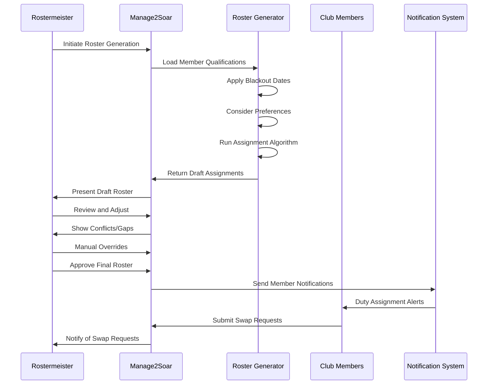
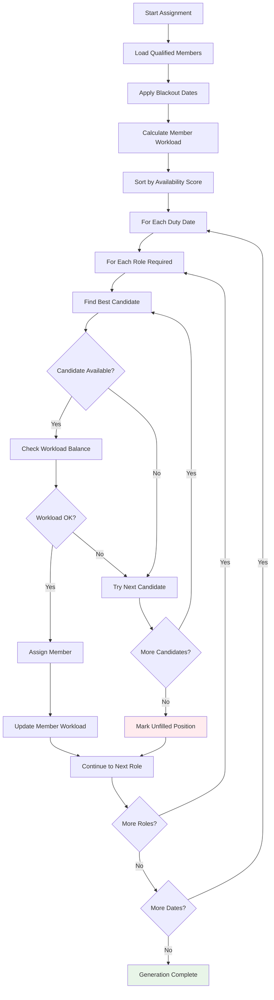
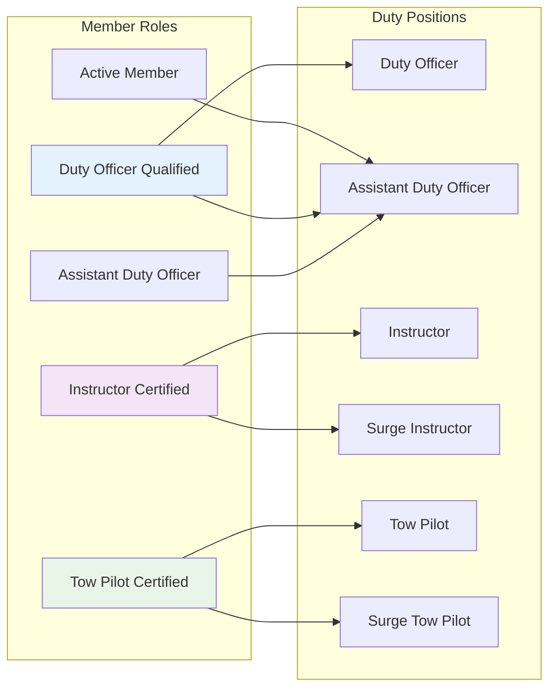
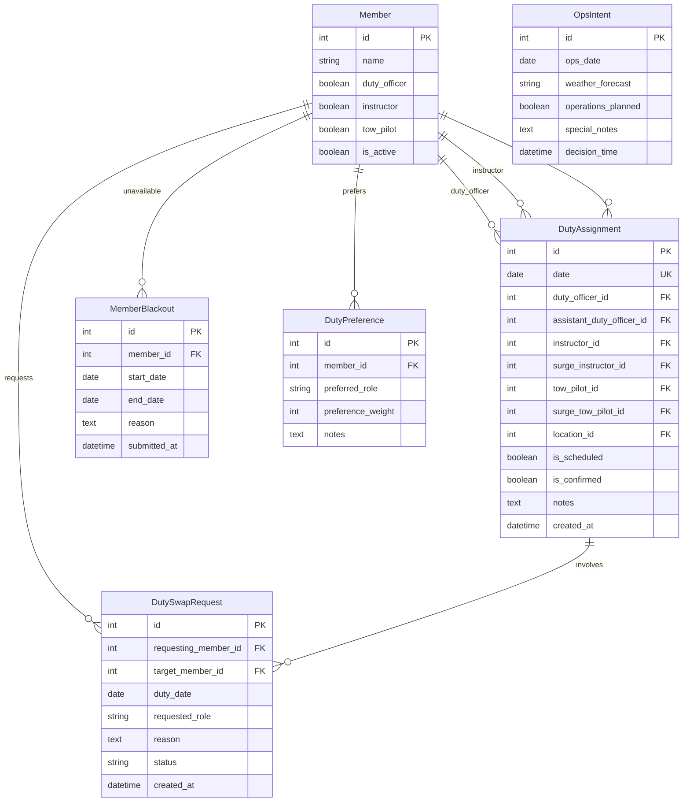
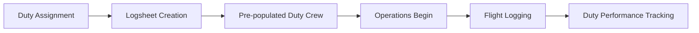
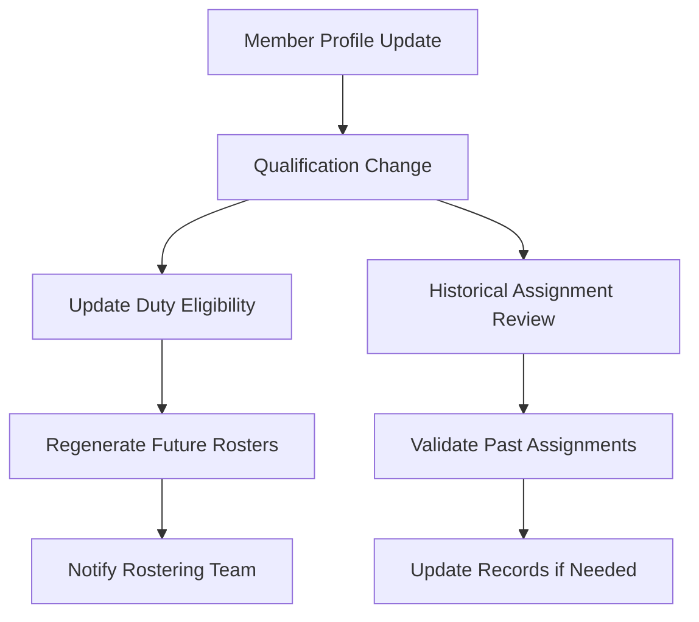
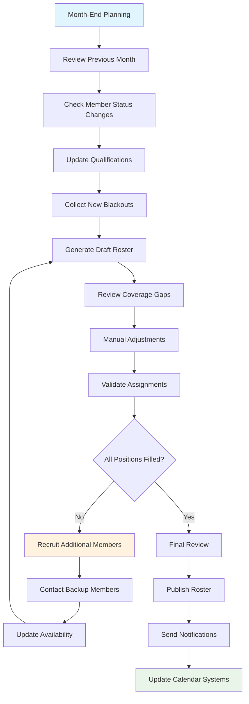
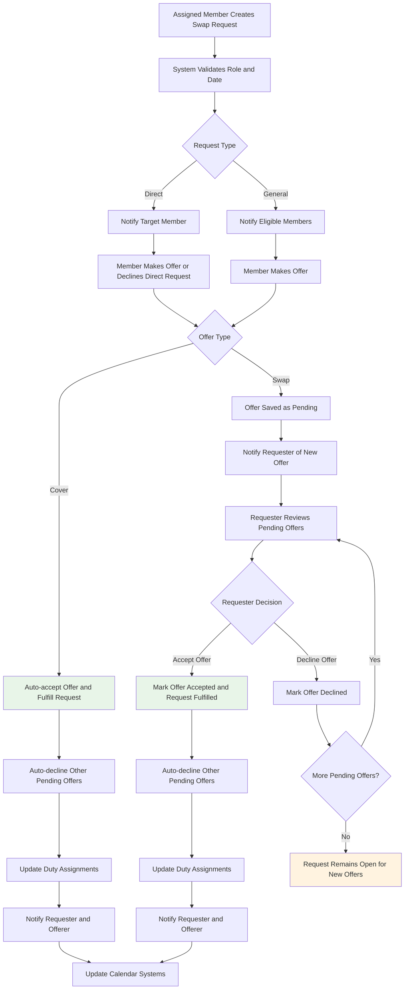
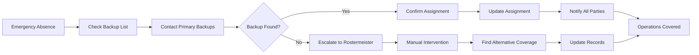

# Duty Roster Workflow

## Manager Overview

The duty roster workflow manages the scheduling and assignment of club members to essential operational roles. This includes duty officers, assistant duty officers, instructors, tow pilots, and other staff needed for safe daily flight operations. The system balances member availability, qualifications, and preferences while ensuring adequate coverage for all operations.

**Key Stages:**
1. **Roster Planning** - Determine coverage needs and generate schedules
2. **Member Availability** - Collect blackout dates and preferences  
3. **Assignment Generation** - Create duty assignments using automated logic
4. **Review and Approval** - Validate assignments and handle conflicts
5. **Ongoing Management** - Handle swaps, changes, and coverage issues

## Process Flow

```mermaid
flowchart TD
    A[Rostermeister Planning] --> B[Set Schedule Period]
    B --> C[Define Duty Requirements]
    C --> D[Collect Member Availability]

    D --> E[Member Blackout Submission]
    E --> F[Preference Collection]
    F --> G[Qualification Verification]
    G --> H[Generate Initial Roster]

    H --> I[Automated Assignment Logic]
    I --> J[Conflict Detection]
    J --> K{Conflicts Found?}

    K -->|Yes| L[Manual Conflict Resolution]
    K -->|No| M[Roster Review]

    L --> N[Adjust Assignments]
    N --> O[Re-run Generation]
    O --> J

    M --> P[Rostermeister Approval]
    P --> Q[Publish Roster]
    Q --> R[Member Notifications]

    R --> S[Ongoing Operations]
    S --> T[Swap Requests]
    S --> U[Availability Changes]
    S --> V[Emergency Coverage]

    T --> W[Process Swap Request]
    U --> X[Update Assignments]
    V --> Y[Find Emergency Coverage]

    W --> Z[Notify Affected Members]
    X --> Z
    Y --> Z

    style A fill:#e1f5fe
    style Q fill:#e8f5e8
    style V fill:#ffebee
```

## Technical Implementation

### **Models Involved**
- **`duty_roster.DutyAssignment`**: Individual duty assignments for a specific date
- **`duty_roster.MemberBlackout`**: Member unavailable dates
- **`duty_roster.DutyPreference`**: Member scheduling preferences (preferred days, temporary suspension, role allocation percentages, and monthly assignment limits)
- **`duty_roster.DutySwapRequest`**: Swap requests between members
- **`duty_roster.DutySwapOffer`**: Available coverage offers
- **`duty_roster.OpsIntent`**: Planned operations intent for specific dates
- **`duty_roster.GliderReservation`**: Member glider reservations integrated with duty planning
- **`members.Member`**: Club members with qualifications

### **Key Files**
- **Models**: `duty_roster/models.py` - Duty scheduling data structures
- **Views**: `duty_roster/views.py` - Roster management interface
- **Generator**: `duty_roster/roster_generator.py` - Automated assignment logic
- **Optimized Scheduler**: `duty_roster/ortools_scheduler.py` - Constraint-based optimized duty selection
- **Utils**: `duty_roster/utils.py` - Scheduling algorithms and validation
- **Management**: `duty_roster/management/commands/` - Automated roster generation

### **Roster Generation Process**

```mermaid
sequenceDiagram
    participant RM as Rostermeister
    participant System as Manage2Soar
    participant Generator as Roster Generator
    participant Members as Club Members
    participant Notifications as Notification System

    RM->>System: Initiate Roster Generation
    System->>Generator: Load Member Qualifications
    Generator->>Generator: Apply Blackout Dates
    Generator->>Generator: Consider Preferences

    Generator->>Generator: Run Assignment Algorithm
    Generator->>System: Return Draft Assignments
    System->>RM: Present Draft Roster

    RM->>System: Review and Adjust
    System->>RM: Show Conflicts/Gaps
    RM->>System: Manual Overrides

    RM->>System: Approve Final Roster
    System->>Notifications: Send Member Notifications
    Notifications->>Members: Duty Assignment Alerts

    Members->>System: Submit Swap Requests
    System->>RM: Notify of Swap Requests
```

### **Assignment Logic Flow**

```mermaid
flowchart TD
    A[Start Assignment] --> B[Load Qualified Members]
    B --> C[Apply Blackout Dates]
    C --> D[Calculate Member Workload]
    D --> E[Sort by Availability Score]

    E --> F[For Each Duty Date]
    F --> G[For Each Role Required]
    G --> H[Find Best Candidate]

    H --> I{Candidate Available?}
    I -->|Yes| J[Check Workload Balance]
    I -->|No| K[Try Next Candidate]

    J --> L{Workload OK?}
    L -->|Yes| M[Assign Member]
    L -->|No| K

    K --> N{More Candidates?}
    N -->|Yes| H
    N -->|No| O[Mark Unfilled Position]

    M --> P[Update Member Workload]
    O --> Q[Continue to Next Role]
    P --> Q

    Q --> R{More Roles?}
    R -->|Yes| G
    R -->|No| S{More Dates?}

    S -->|Yes| F
    S -->|No| T[Generation Complete]

    style T fill:#e8f5e8
    style O fill:#ffebee
```

### **Member Qualification Matrix**

```mermaid
flowchart LR
    subgraph "Member Roles"
        A[Active Member]
        B[Duty Officer Qualified]
        C[Instructor Certified]
        D[Tow Pilot Certified]
        E[Assistant Duty Officer]
    end

    subgraph "Duty Positions"
        F[Duty Officer]
        G[Assistant Duty Officer]
        H[Instructor]
        I[Surge Instructor]
        J[Tow Pilot]
        K[Surge Tow Pilot]
    end

    A --> G
    B --> F
    B --> G
    E --> G
    C --> H
    C --> I
    D --> J
    D --> K

    style B fill:#e3f2fd
    style C fill:#f3e5f5
    style D fill:#e8f5e8
```

### **Database Schema**

```mermaid
erDiagram
    Member {
        int id PK
        string name
        boolean duty_officer
        boolean instructor
        boolean tow_pilot
        boolean is_active
    }

    DutyAssignment {
        int id PK
        date date UK
        int duty_officer_id FK
        int assistant_duty_officer_id FK
        int instructor_id FK
        int surge_instructor_id FK
        int tow_pilot_id FK
        int surge_tow_pilot_id FK
        int location_id FK
        boolean is_scheduled
        boolean is_confirmed
        text notes
        datetime created_at
    }

    MemberBlackout {
        int id PK
        int member_id FK
        date start_date
        date end_date
        text reason
        datetime submitted_at
    }

    DutyPreference {
        int id PK
        int member_id FK
        string preferred_role
        int preference_weight
        text notes
    }

    DutySwapRequest {
        int id PK
        int requesting_member_id FK
        int target_member_id FK
        date duty_date
        string requested_role
        text reason
        string status
        datetime created_at
    }

    OpsIntent {
        int id PK
        date ops_date
        string weather_forecast
        boolean operations_planned
        text special_notes
        datetime decision_time
    }

    Member ||--o{ DutyAssignment : duty_officer
    Member ||--o{ DutyAssignment : instructor
    Member ||--o{ DutyAssignment : tow_pilot
    Member ||--o{ MemberBlackout : unavailable
    Member ||--o{ DutyPreference : prefers
    Member ||--o{ DutySwapRequest : requests
    DutyAssignment ||--o{ DutySwapRequest : involves
```

## Key Integration Points

### **Logsheet Integration**
Duty assignments flow directly into daily operations:

```mermaid
flowchart LR
    A[Duty Assignment] --> B[Logsheet Creation]
    B --> C[Pre-populated Duty Crew]
    C --> D[Operations Begin]
    D --> E[Flight Logging]
    E --> F[Duty Performance Tracking]
```

### **Member Qualification Tracking**
The system tracks and validates member qualifications:

```mermaid
flowchart TD
    A[Member Profile Update] --> B[Qualification Change]
    B --> C[Update Duty Eligibility]
    C --> D[Regenerate Future Rosters]
    D --> E[Notify Rostering Team]

    B --> F[Historical Assignment Review]
    F --> G[Validate Past Assignments]
    G --> H[Update Records if Needed]
```

### **Communication and Notifications**
Automated notifications keep members informed:

```mermaid
flowchart LR
    A[Roster Published] --> B[Duty Assignment Notifications]
    B --> C[Calendar Invitations (.ics)]
    C --> D[Reminder Notifications]
    D --> E[Day-Before Reminders]

    A --> F[Swap Request Notifications]
    F --> G[Approval Workflow]
    G --> H[Confirmation Notifications]
```

## Common Workflows

### **Integrated Features Snapshot**

- Duty swap management is now integrated in this workflow (Issue #1)
- Glider reservation planning is now integrated in duty roster operations (Issue #410)
- Optimized duty selection is available via the OR-Tools scheduler path, with feature-flag routing and legacy fallback in `roster_generator.py`

### **Monthly Roster Generation**

```mermaid
flowchart TD
    A[Month-End Planning] --> B[Review Previous Month]
    B --> C[Check Member Status Changes]
    C --> D[Update Qualifications]
    D --> E[Collect New Blackouts]

    E --> F[Generate Draft Roster]
    F --> G[Review Coverage Gaps]
    G --> H[Manual Adjustments]
    H --> I[Validate Assignments]

    I --> J{All Positions Filled?}
    J -->|No| K[Recruit Additional Members]
    J -->|Yes| L[Final Review]

    K --> M[Contact Backup Members]
    M --> N[Update Availability]
    N --> F

    L --> O[Publish Roster]
    O --> P[Send Notifications]
    P --> Q[Update Calendar Systems]

    style A fill:#e1f5fe
    style Q fill:#e8f5e8
    style K fill:#fff3e0
```

### **Duty Swap Management**

```mermaid
flowchart TD
    A[Assigned Member Creates Swap Request] --> B[System Validates Role and Date]
    B --> C{Request Type}

    C -->|Direct| D[Notify Target Member]
    C -->|General| E[Notify Eligible Members]

    D --> F[Member Makes Offer or Declines Direct Request]
    E --> G[Member Makes Offer]

    F --> H{Offer Type}
    G --> H

    H -->|Cover| I[Auto-accept Offer and Fulfill Request]
    H -->|Swap| J[Offer Saved as Pending]

    I --> K[Auto-decline Other Pending Offers]
    K --> L[Update Duty Assignments]
    L --> M[Notify Requester and Offerer]
    M --> N[Update Calendar Systems]

    J --> O[Notify Requester of New Offer]
    O --> P[Requester Reviews Pending Offers]
    P --> Q{Requester Decision}

    Q -->|Accept Offer| R[Mark Offer Accepted and Request Fulfilled]
    Q -->|Decline Offer| S[Mark Offer Declined]

    R --> T[Auto-decline Other Pending Offers]
    T --> U[Update Duty Assignments]
    U --> V[Notify Requester and Offerer]
    V --> N

    S --> W{More Pending Offers?}
    W -->|Yes| P
    W -->|No| X[Request Remains Open for New Offers]

    style I fill:#e8f5e8
    style R fill:#e8f5e8
    style X fill:#fff3e0
```

### **Emergency Coverage Process**

```mermaid
flowchart LR
    A[Emergency Absence] --> B[Check Backup List]
    B --> C[Contact Primary Backups]
    C --> D{Backup Found?}

    D -->|Yes| E[Confirm Assignment]
    D -->|No| F[Escalate to Rostermeister]

    E --> G[Update Assignment]
    G --> H[Notify All Parties]

    F --> I[Manual Intervention]
    I --> J[Find Alternative Coverage]
    J --> K[Update Records]

    H --> L[Operations Covered]
    K --> L
```

## Known Gaps & Improvements

### **Current Strengths**
- ✅ Automated roster generation with conflict detection
- ✅ Member blackout and preference management
- ✅ Duty swap request and approval workflow
- ✅ Integration with daily operations (logsheet)
- ✅ Qualification-based assignment validation
- ✅ Comprehensive notification system

### **Identified Gaps**
- 🟡 **Predictive Scheduling**: Assignment balancing can be improved with better forecasting
- 🟡 **Workload Analytics**: Limited analysis of member duty distribution
- 🟡 **Automated Reminders**: Basic reminder system could be enhanced

### **Improvement Opportunities**
- 🔄 **AI-Assisted Scheduling**: Machine learning for optimal assignment patterns
- 🔄 **Skill Development Tracking**: Integrate with training progress for role advancement
- 🔄 **Performance Metrics**: Track duty performance and reliability
- 🔄 **External Integration**: Connect with other club scheduling systems

### **Operational Efficiency**
- 🔄 **Batch Processing**: Bulk operations for roster management
- 🔄 **Template Systems**: Reusable roster patterns for seasonal operations
- 🔄 **Conflict Prevention**: Enhanced validation to prevent scheduling conflicts
- 🔄 **Resource Optimization**: Better allocation of qualified members
- 🔄 **Succession Planning**: Identify and develop future duty officers and instructors

### **Member Experience**
- 🔄 **Self-Service Portal**: Enhanced member interface for availability and swaps
- 🔄 **Mobile Notifications**: Push notifications for duty assignments and changes
- 🔄 **Preference Learning**: System learns from member swap patterns and preferences
- 🔄 **Feedback Integration**: Member feedback on duty assignments and improvements
- 🔄 **Recognition System**: Acknowledge members who take on extra duty responsibilities

## Related Workflows

- **[Member Lifecycle](02-member-lifecycle.md)**: How member qualifications determine duty eligibility
- **[Logsheet Workflow](04-logsheet-workflow.md)**: How duty assignments enable daily flight operations
- **[Instruction Workflow](03-instruction-workflow.md)**: How instructors are scheduled for training duties
- **[System Overview](01-system-overview.md)**: How duty roster fits into overall club operations

---

*The duty roster workflow ensures adequate staffing for safe flight operations. Effective duty scheduling is essential for consistent club operations and member engagement.*
