# Maintenance Workflow

## Manager Overview

The maintenance workflow manages the complete lifecycle of aircraft maintenance issues, from initial problem discovery through resolution and return to service. This system ensures aircraft safety, tracks maintenance costs, and maintains regulatory compliance while minimizing aircraft downtime.

**Key Stages:**
1. **Issue Discovery** - Identification of maintenance problems during operations
2. **Problem Documentation** - Detailed reporting and priority assessment
3. **Work Assignment** - Routing to appropriate maintenance personnel
4. **Repair Execution** - Performing maintenance work and documentation
5. **Return to Service** - Validation and aircraft availability restoration

## Process Flow

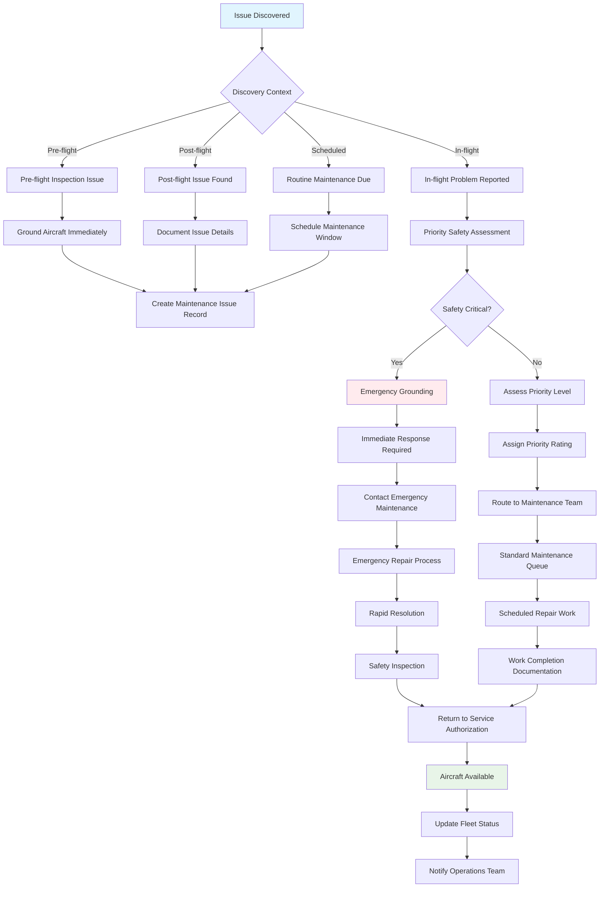

## Technical Implementation

### **Models Involved**
- **`logsheet.MaintenanceIssue`**: Core maintenance tracking record
- **`logsheet.Glider`**: Aircraft being maintained
- **`logsheet.Flight`**: Flight records that may trigger maintenance
- **`members.Member`**: Maintenance personnel and reporting members
- **`notifications.Notification`**: Maintenance team communications

### **Key Files**
- **Models**: `logsheet/models.py` - Maintenance data structures
- **Views**: `logsheet/views.py` - Maintenance issue management interface
- **Forms**: `logsheet/forms.py` - Issue reporting and resolution forms
- **Signals**: `logsheet/signals.py` - Automated maintenance notifications
- **Utils**: `logsheet/utils.py` - Maintenance calculations and validation

### **Issue Lifecycle Management**

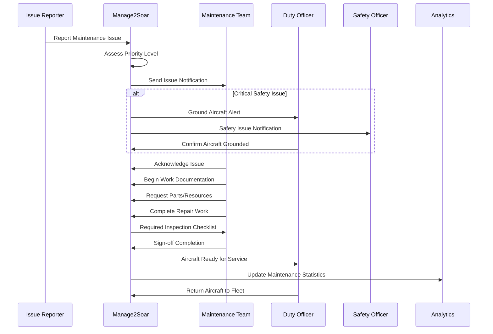

### **Priority Classification System**

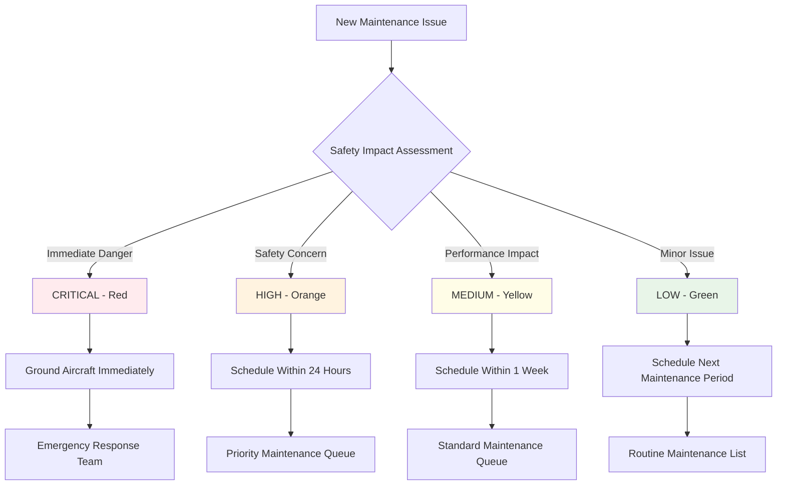

### **Maintenance Status Tracking**

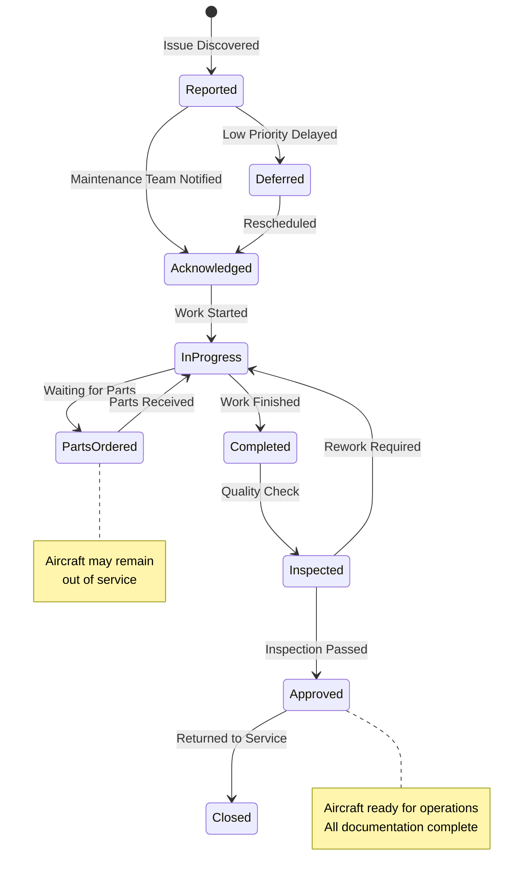

### **Database Schema**

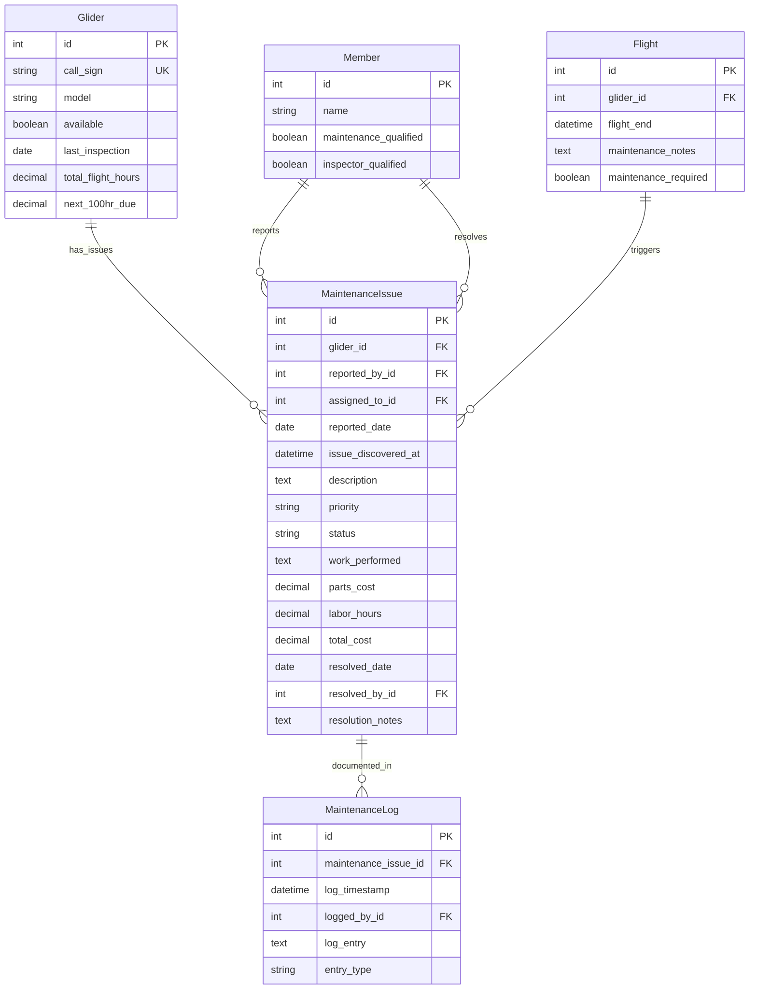

## Key Integration Points

### **Flight Operations Integration**
Maintenance issues integrate closely with daily flight operations:

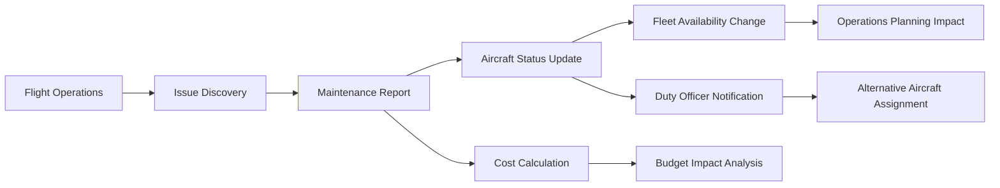

### **Analytics and Reporting Integration**
Maintenance data feeds comprehensive analytics:

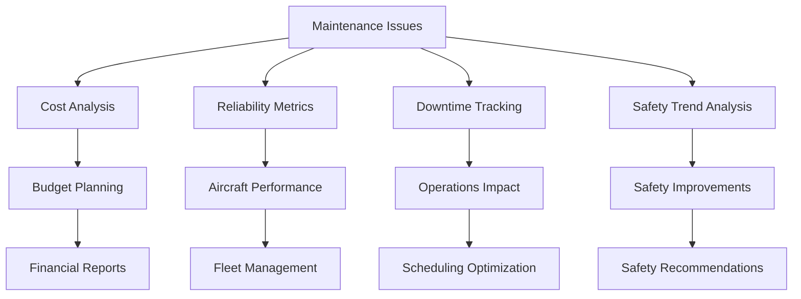

### **Notification and Communication**
Automated notifications ensure timely maintenance response:

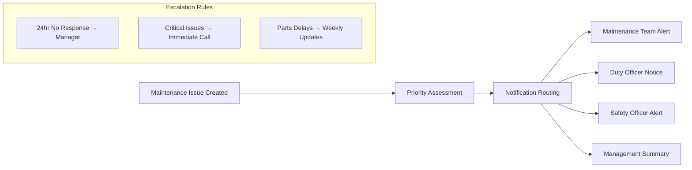

## Common Workflows

### **Routine Maintenance Planning**

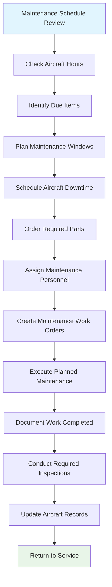

### **Emergency Maintenance Response**

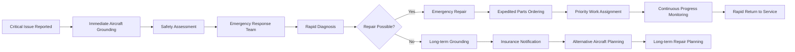

### **Parts and Inventory Management**

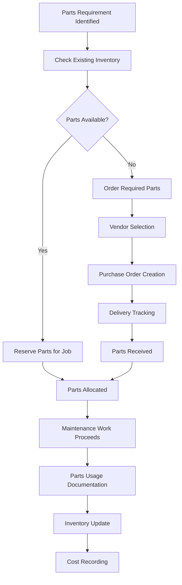

## Known Gaps & Improvements

### **Current Strengths**
- ✅ Comprehensive issue tracking and documentation
- ✅ Priority-based workflow management
- ✅ Integration with flight operations and analytics
- ✅ Automated notification system for maintenance teams
- ✅ Cost tracking and budget impact analysis
- ✅ Aircraft availability status management

### **Identified Gaps**
- 🟡 **Parts Inventory Management**: No integrated parts inventory tracking system
- 🟡 **Maintenance Scheduling**: Limited advanced scheduling and resource planning
- 🟡 **Mobile Interface**: Maintenance personnel need mobile access for field work
- 🟡 **Digital Documentation**: Paper-based maintenance logs and sign-offs
- 🟡 **Vendor Integration**: No automated integration with parts suppliers

### **Improvement Opportunities**
- 🔄 **Predictive Maintenance**: Use flight data to predict maintenance needs
- 🔄 **Digital Signatures**: Electronic sign-off for maintenance work completion
- 🔄 **Photo Documentation**: Image capture for maintenance issues and repairs
- 🔄 **Workflow Automation**: Reduce manual steps in maintenance processes
- 🔄 **Integration APIs**: Connect with aviation maintenance software systems

### **Operational Efficiency**
- 🔄 **Resource Optimization**: Better allocation of maintenance personnel and equipment
- 🔄 **Batch Processing**: Efficient handling of multiple maintenance items
- 🔄 **Quality Control**: Enhanced inspection and quality assurance processes
- 🔄 **Knowledge Management**: Capture and share maintenance expertise and solutions
- 🔄 **Performance Metrics**: Advanced analytics on maintenance effectiveness

### **Regulatory Compliance**
- 🔄 **Compliance Tracking**: Automated monitoring of regulatory requirements
- 🔄 **Audit Trail**: Complete documentation trail for regulatory inspections
- 🔄 **Certification Management**: Track maintenance personnel certifications and currency
- 🔄 **Regulatory Reporting**: Automated generation of required regulatory reports
- 🔄 **Safety Management**: Integration with safety management system (SMS)

### **Cost Management**
- 🔄 **Budget Forecasting**: Predictive maintenance cost modeling
- 🔄 **Warranty Tracking**: Monitor warranty coverage and claims
- 🔄 **Vendor Performance**: Track supplier performance and costs
- 🔄 **Cost-Benefit Analysis**: Evaluate repair vs. replacement decisions
- 🔄 **Financial Integration**: Direct connection to accounting systems

## Related Workflows

- **[Logsheet Workflow](04-logsheet-workflow.md)**: How maintenance issues are discovered and reported during operations
- **[Payment Workflow](07-payment-workflow.md)**: How maintenance costs are tracked and allocated
- **[System Overview](01-system-overview.md)**: How maintenance fits into overall fleet management
- **[Duty Roster Workflow](05-duty-roster-workflow.md)**: How maintenance affects aircraft availability and duty planning

---

*The maintenance workflow is essential for aircraft safety and regulatory compliance. Effective maintenance management ensures reliable aircraft availability while controlling costs and maintaining safety standards.*