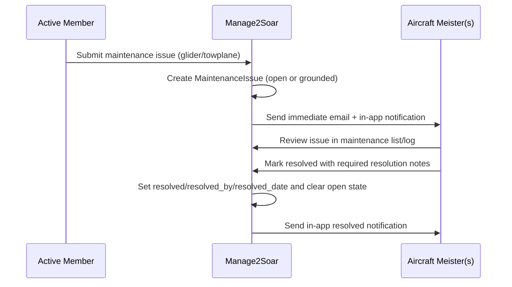
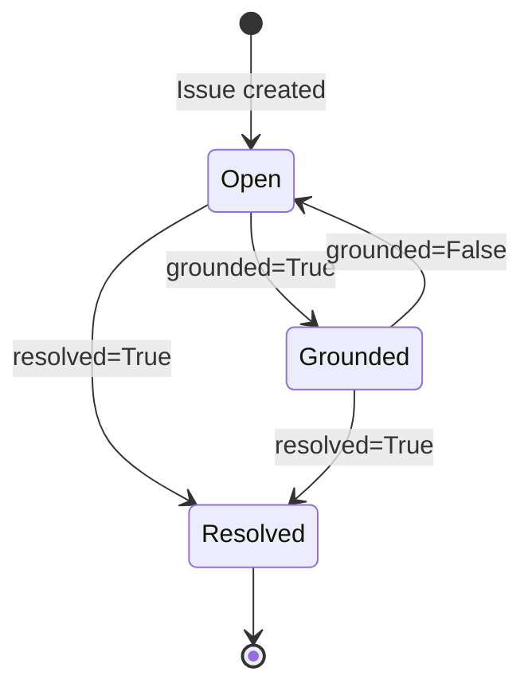
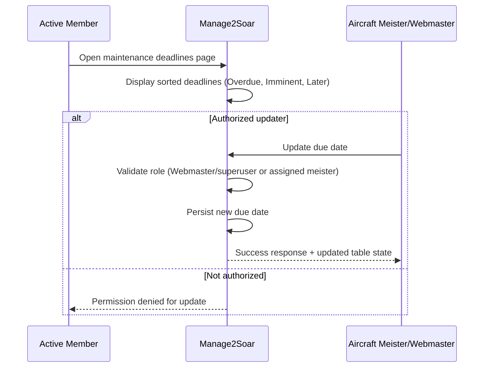

# Maintenance Workflow

## Manager Overview

The maintenance workflow in Manage2Soar is focused on two implemented areas:

1. Issue tracking for gliders and towplanes
2. Deadline tracking for recurring inspections and compliance dates

This document reflects only current software behavior.

## Technical Implementation

### Models Involved
- logsheet.MaintenanceIssue: open/resolved issue records with optional grounding flag
- logsheet.MaintenanceDeadline: recurring maintenance due dates for aircraft
- logsheet.AircraftMeister: aircraft-to-member assignment used for maintenance permissions
- logsheet.Glider and logsheet.Towplane: affected aircraft entities
- members.Member: reporting/resolving members

### Key Files
- logsheet/models.py: MaintenanceIssue, MaintenanceDeadline, AircraftMeister
- logsheet/views.py: maintenance_issues, maintenance_log, maintenance_deadlines, maintenance_mark_resolved, update_maintenance_deadline
- logsheet/forms.py: MaintenanceIssueForm
- logsheet/signals.py: meister email and in-app notifications on issue create/resolve
- logsheet/templates/logsheet/maintenance_list.html
- logsheet/templates/logsheet/maintenance_log.html
- logsheet/templates/logsheet/maintenance_deadlines.html

## Implemented Workflow Details

### Issue Lifecycle Management

```mermaid
sequenceDiagram
    participant Reporter as Active Member
    participant System as Manage2Soar
    participant Meister as Aircraft Meister(s)

    Reporter->>System: Submit maintenance issue (glider/towplane)
    System->>System: Create MaintenanceIssue (open or grounded)
    System->>Meister: Send immediate email + in-app notification

    Meister->>System: Review issue in maintenance list/log
    Meister->>System: Mark resolved with required resolution notes
    System->>System: Set resolved/resolved_by/resolved_date and clear open state
    System->>Meister: Send in-app resolved notification
```

Notes:
- No safety-officer notification path exists in current code.
- No parts ordering or inventory request flow exists in current code.
- The software uses grounded/open/resolved status flags, not priority classes.

### Maintenance Status Tracking (Current)

```mermaid
stateDiagram-v2
    [*] --> Open: Issue created
    Open --> Grounded: grounded=True
    Grounded --> Open: grounded=False
    Open --> Resolved: resolved=True
    Grounded --> Resolved: resolved=True
    Resolved --> [*]
```

### Deadline Management Workflow

```mermaid
sequenceDiagram
    participant Member as Active Member
    participant System as Manage2Soar
    participant Meister as Aircraft Meister/Webmaster

    Member->>System: Open maintenance deadlines page
    System->>System: Display sorted deadlines (Overdue, Imminent, Later)

    alt Authorized updater
        Meister->>System: Update due date
        System->>System: Validate role (Webmaster/superuser or assigned meister)
        System->>System: Persist new due date
        System-->>Meister: Success response + updated table state
    else Not authorized
        System-->>Member: Permission denied for update
    end
```

## Key Integration Points

### Flight Operations Integration
- Issues can be reported during logsheet closeout and from the standalone maintenance page.
- Open/grounded issues affect aircraft operational awareness in maintenance and equipment views.

### Notifications Integration
- On issue creation, assigned aircraft meisters receive immediate email and in-app notifications.
- On resolution transition, meisters receive in-app resolution notifications.

### Permissions Integration
- All maintenance pages require active membership.
- Issue resolution is restricted to superusers or assigned aircraft meisters.
- Deadline updates are restricted to superusers/Webmasters or assigned aircraft meisters.

## Known Gaps and Future Enhancements

### Current Strengths
- Consistent issue capture and history (open/resolved with notes)
- Grounding flag for operational safety visibility
- Meister-targeted notification flow for new issues
- Permission-gated resolution and deadline updates

### Gaps (Not Currently Implemented)
- Integrated parts inventory and ordering workflows
- Priority classification/color-coded maintenance severity model
- Dedicated maintenance analytics dashboards and trend reporting

### Improvement Opportunities
- Add maintenance-specific analytics (MTTR, recurring issue frequency, aircraft downtime)
- Add workflow automation for overdue deadline escalation
- Add richer evidence capture (attachments/photos) on issue and resolution records
- Add structured maintenance categories to improve reporting and triage

## Related Workflows

- [Logsheet Workflow](04-logsheet-workflow.md): maintenance issue capture during logsheet operations
- [Payment Workflow](07-payment-workflow.md): financial workflows (maintenance accounting integration is limited today)
- [System Overview](01-system-overview.md): cross-app context and operational dependencies
- [Duty Roster Workflow](05-duty-roster-workflow.md): aircraft availability impact on duty-day planning

---

*The maintenance workflow is essential for aircraft safety and regulatory compliance. Effective maintenance management ensures reliable aircraft availability while controlling costs and maintaining safety standards.*
