# Payment Workflow

## Manager Overview

The payment workflow manages the complete financial lifecycle of flight operations, from automatic cost calculation through payment collection and account reconciliation. This system integrates flight data with pricing rules to generate accurate member billing, supports various payment methods, and maintains comprehensive financial records.

**Key Stages:**
1. **Cost Calculation** - Automatic computation of flight costs based on operations data
2. **Member Billing** - Generation of individual member charges and notifications
3. **Payment Processing** - Collection and recording of payments from various sources
4. **Account Management** - Member account balances and payment history tracking
5. **Financial Reconciliation** - Period-end reconciliation and reporting

## Process Flow


## Technical Implementation

### **Models Involved**
- **`logsheet.Flight`**: Source data for cost calculations
- **`logsheet.TowRate`**: Pricing for tow services by altitude
- **`logsheet.Glider`**: Aircraft rental rates and specifications
- **`members.Member`**: Account holders and payment recipients
- **Custom Payment Models**: Member account balances and payment records *(future implementation)*

### **Key Files**
- **Models**: `logsheet/models.py` - Cost calculation properties and methods
- **Views**: `logsheet/views.py` - Payment interface and account management
- **Utils**: `logsheet/utils.py` - Cost calculation algorithms
- **Forms**: `logsheet/forms.py` - Payment entry and account management forms
- **Analytics**: `analytics/queries.py` - Financial reporting and analysis

### **Cost Calculation Engine**


### **Cost Calculation Logic**

```mermaid
flowchart TD
    A[Flight Data Input] --> B[Tow Cost Calculation]
    A --> C[Rent Cost Calculation]

    B --> E[Release Altitude * Tow Rate]
    C --> F[Flight Duration * Hourly Rate]

    E --> H[Apply Member Discounts]
    F --> H

    H --> I{Cost Splitting?}
    I -->|Equal Split| J[Total Cost ÷ Participants]
    I -->|Custom Split| K[Apply Split Percentages]
    I -->|Pilot Pays All| L[Assign Full Cost to Pilot]

    J --> M[Individual Member Charges]
    K --> M
    L --> M

    M --> N[Account Balance Updates]
    N --> O[Payment Notifications]

    style E fill:#e3f2fd
    style F fill:#f3e5f5
    style G fill:#e8f5e8
```



### **Payment Processing States**


### **Member Account Structure**


## Key Integration Points

### **Flight Operations Integration**
Payment calculations are triggered automatically by flight completion:


### **Member Account Management**
Payment workflow integrates with member lifecycle and privileges:

```mermaid
flowchart TD
    A[Member Account Status] --> B{Account Balance}
    B -->|Positive/Zero| C[Good Standing]
    B -->|Negative (Recent)| D[Payment Reminder]
    B -->|Negative (Extended)| E[Account Suspension]

    C --> F[Full Club Privileges]
    D --> G[Limited Warnings]
    E --> H[Restricted Access]

    F --> I[Continue Operations]
    G --> J[Payment Follow-up]
    H --> K[Administrative Review]

    J --> L{Payment Received?}
    L -->|Yes| C
    L -->|No| E
```

### **Analytics and Reporting Integration**
Payment data feeds financial analytics and reporting:


## Common Workflows

### **Standard Flight Payment Process**


### **Cost Splitting for Multi-Member Flights**


### **Monthly Account Reconciliation**


## Known Gaps & Improvements

### **Current Strengths**
- ✅ Automatic cost calculation based on flight data
- ✅ Flexible cost splitting for multi-member flights
- ✅ Integration with flight operations and member management
- ✅ Real-time account balance updates
- ✅ Comprehensive notification system
- ✅ Analytics integration for financial reporting

### **Identified Gaps**
- 🟡 **Instructor Compensation**: No system for tracking or processing instructor payments for flight instruction services
- 🟡 **Payment Gateway Integration**: No automated electronic payment processing
- 🟡 **Mobile Payment Options**: Limited mobile-friendly payment interfaces
- 🟡 **Recurring Payments**: No support for membership dues or subscription billing
- 🟡 **Payment Plans**: No installment or deferred payment options
- 🟡 **External Accounting**: Limited integration with external accounting systems

### **Improvement Opportunities**
- 🔄 **Instructor Payment System**: Comprehensive system for billing students and compensating instructors for flight instruction services
- 🔄 **Online Payment Portal**: Full-featured member payment portal with multiple payment methods
- 🔄 **Payment Gateway Integration**: Integration with PayPal, Stripe, or other payment processors
- 🔄 **Mobile Payments**: Support for mobile wallets and contactless payments
- 🔄 **Automated Billing**: Recurring billing for membership dues and training programs
- 🔄 **Payment Analytics**: Advanced analytics on payment patterns and member behavior

### **Financial Management**
- 🔄 **QuickBooks Integration**: Direct integration with popular accounting software
- 🔄 **Tax Reporting**: Automated generation of tax-related reports and documents
- 🔄 **Budget Tracking**: Integration with club budgeting and financial planning
- 🔄 **Multi-Currency Support**: Support for international members and operations
- 🔄 **Financial Auditing**: Enhanced audit trails and compliance reporting

### **Member Experience**
- 🔄 **Payment History**: Comprehensive payment history and transaction tracking
- 🔄 **Account Statements**: Professional monthly and annual account statements
- 🔄 **Payment Reminders**: Intelligent reminder system with multiple notification methods
- 🔄 **Dispute Resolution**: Formal process for handling payment disputes and adjustments
- 🔄 **Payment Preferences**: Member-controlled payment preferences and methods

### **Administrative Efficiency**
- 🔄 **Bulk Payment Processing**: Tools for processing multiple payments efficiently
- 🔄 **Payment Matching**: Automated matching of payments to outstanding charges
- 🔄 **Exception Handling**: Better handling of payment exceptions and errors
- 🔄 **Refund Processing**: Streamlined refund and credit processing
- 🔄 **Collections Management**: Formal collections process and tracking

## Related Workflows

- **[Logsheet Workflow](04-logsheet-workflow.md)**: How flight operations generate the cost data for payment calculations
- **[Member Lifecycle](02-member-lifecycle.md)**: How member status affects payment privileges and account management
- **[Instruction Workflow](03-instruction-workflow.md)**: How training flights are billed and payment split between participants
- **[Maintenance Workflow](06-maintenance-workflow.md)**: How maintenance costs are tracked and allocated
- **[System Overview](01-system-overview.md)**: How payment processing fits into overall club financial management

---

*The payment workflow ensures accurate, timely collection of flight-related costs while providing members with convenient payment options. Effective payment processing is essential for club financial sustainability and member satisfaction.*
