# Ground Instruction Workflow

## Manager Overview

The ground instruction workflow manages the logging and tracking of individual ground-based instructional sessions between instructors and students. This is a simple system for recording one-on-one briefings, theoretical discussions, and lesson-specific training that supports flight instruction and student development.

**Key Stages:**
1. **Session Logging** - Record individual ground instruction sessions
2. **Content Documentation** - Document topics covered and lesson progress
3. **Progress Tracking** - Track student advancement through training lessons
4. **Performance Scoring** - Score student performance on specific training lessons

## Process Flow

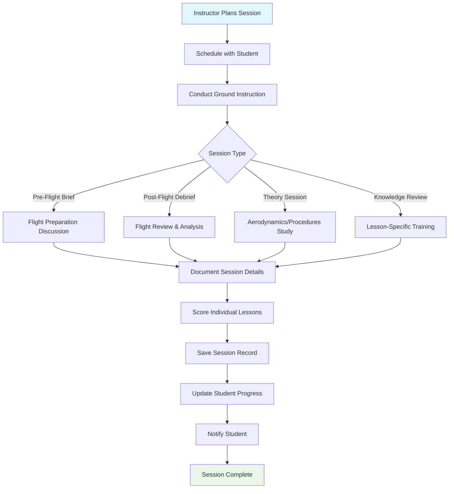

## Technical Implementation

### **Models Involved**
- **`instructors.GroundInstruction`**: Individual ground instruction sessions
- **`instructors.GroundLessonScore`**: Lesson-specific performance scores
- **`instructors.TrainingLesson`**: Training syllabus lesson definitions
- **`instructors.TrainingPhase`**: Organized training phases
- **`members.Member`**: Students and instructors

### **Key Files**
- **Models**: `instructors/models.py` - Ground instruction data structures
- **Views**: `instructors/views.py` - Ground instruction logging interface
- **Forms**: `instructors/forms.py` - Ground instruction session forms
- **Templates**: `instructors/templates/` - Ground instruction logging UI
- **Signals**: `instructors/signals.py` - Progress tracking and notifications

### **Ground Instruction Session Logging**

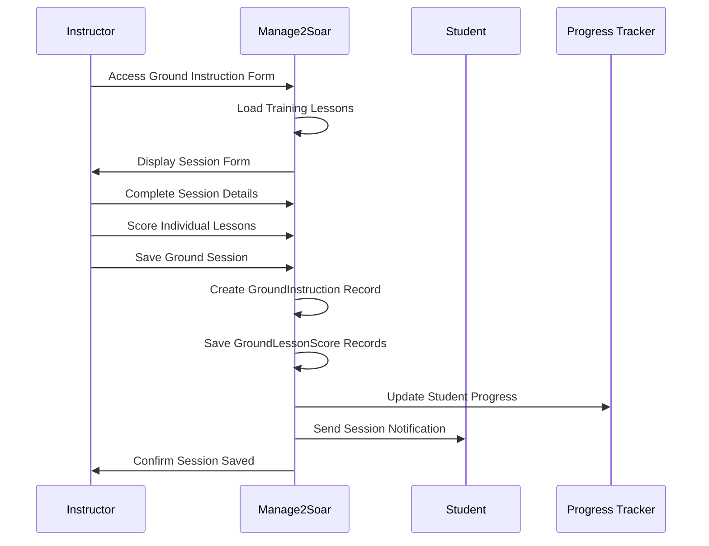

### **Ground Instruction Session Types**

```mermaid
flowchart TD
    A[Ground Instruction Session] --> B[Pre-Flight Briefing]
    A --> C[Post-Flight Debrief]
    A --> D[Theory Discussion]
    A --> E[Lesson Review]

    B --> F[Weather Analysis]
    B --> G[Flight Planning]
    B --> H[Aircraft Systems]
    B --> I[Safety Considerations]

    C --> J[Flight Performance Review]
    C --> K[Learning Points Discussion]
    C --> L[Areas for Improvement]
    C --> M[Next Steps Planning]

    D --> N[Aerodynamics Concepts]
    D --> O[Regulations & Procedures]
    D --> P[Emergency Procedures]

    E --> Q[Lesson-Specific Scoring]
    E --> R[Progress Assessment]
    E --> S[Remedial Training]

    style B fill:#e3f2fd
    style C fill:#f3e5f5
    style D fill:#fff3e0
    style E fill:#e8f5e8
```

### **Learning Progress Tracking**

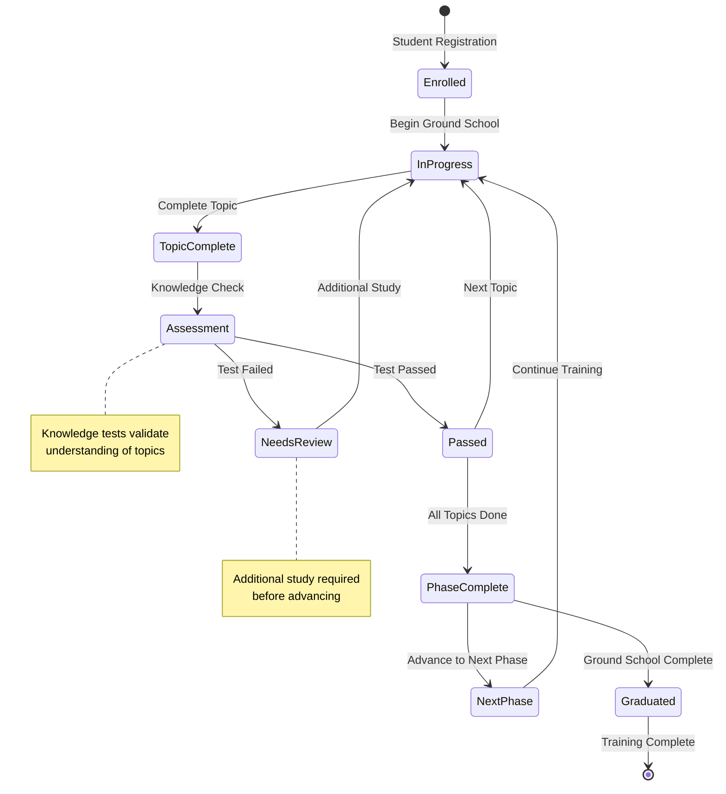

### **Database Schema**

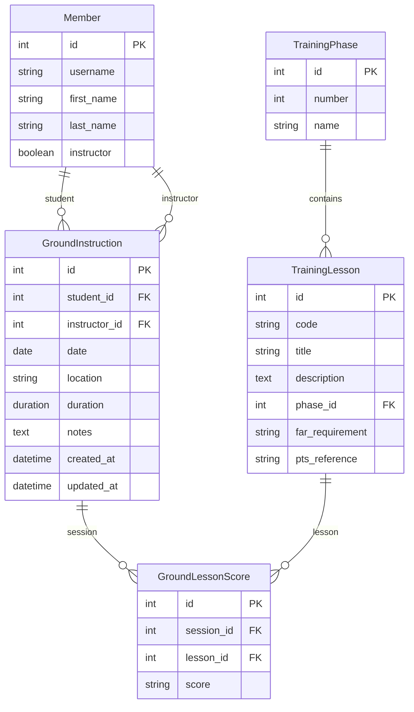

## Key Integration Points

### **Flight Instruction Integration**
Ground instruction coordinates closely with flight training:

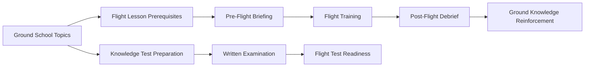

### **Progress Tracking Integration**
Ground instruction integrates with overall student progress tracking:

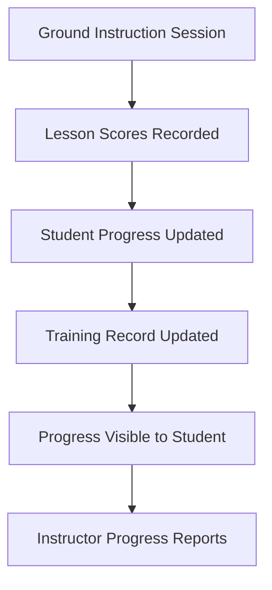

### **Flight Training Integration**
Ground instruction complements flight training activities:

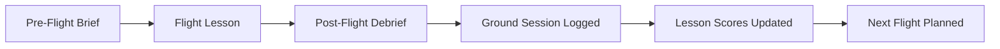

## Common Workflows

### **Individual Ground Instruction Session**

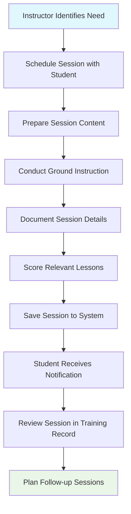

### **Pre-Flight Briefing Workflow**

```mermaid
flowchart LR
    A[Flight Lesson Scheduled] --> B[Pre-Flight Ground Brief]
    B --> C[Review Lesson Objectives]
    C --> D[Discuss Weather/Conditions]
    D --> E[Aircraft Systems Review]

    E --> F[Flight Training Session]
    F --> G[Post-Flight Debrief]
    G --> H[Log Ground Session]
    H --> I[Score Lesson Performance]
    I --> J[Update Training Record]
```

### **Theory Discussion Session**

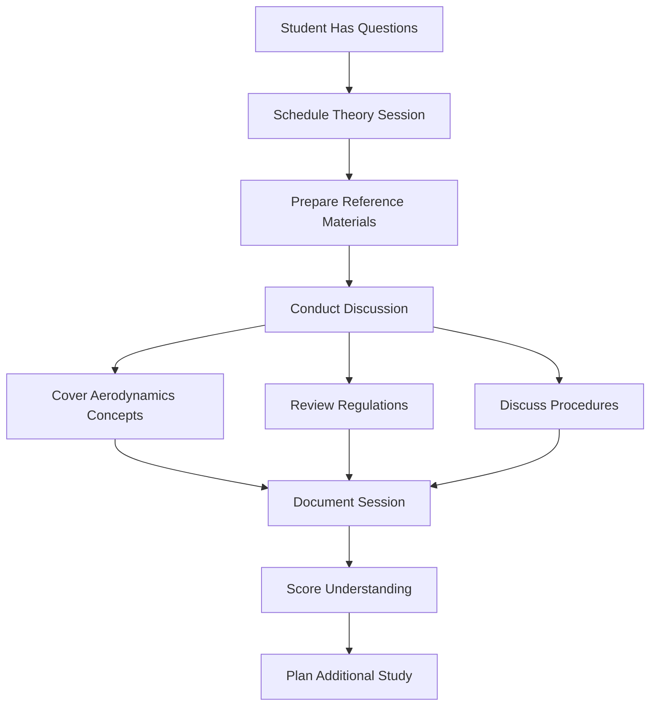

## Known Gaps & Improvements

### **Current Strengths**
- ✅ Simple session logging for individual ground instruction
- ✅ Integration with flight instruction progress tracking
- ✅ Lesson-specific scoring and progress monitoring
- ✅ Automatic student notifications of completed sessions
- ✅ Historical session tracking and instructor records

### **Identified Gaps**
- 🟡 **Group Sessions**: No support for formal group classes or ground schools
- 🟡 **Session Scheduling**: No built-in scheduling system for ground instruction
- 🟡 **Content Management**: No formal curriculum or materials management
- 🟡 **Attendance Tracking**: Limited to individual sessions, no group attendance
- 🟡 **Knowledge Testing**: No formal testing integration specific to ground instruction

### **Improvement Opportunities**
- 🔄 **Formal Ground School**: Support for scheduled group classes and attendance tracking
- 🔄 **Session Scheduling**: Calendar integration and scheduling tools for ground instruction
- 🔄 **Curriculum Management**: Structured ground school curriculum and materials
- 🔄 **Student Portal**: Self-service access for students to view ground instruction history
- 🔄 **Progress Analytics**: Enhanced analytics on ground instruction effectiveness
- 🔄 **Payment Integration**: Ground instruction billing and payment tracking (currently no payment structure exists)

### **Content and Materials**
- 🔄 **Reference Materials**: Library of ground school materials and references
- 🔄 **Multimedia Content**: Support for videos, presentations, and interactive content
- 🔄 **External Resources**: Integration with external training materials and resources
- 🔄 **Content Organization**: Better organization and categorization of training materials
- 🔄 **Mobile Access**: Mobile-optimized access to ground instruction materials

### **Assessment and Evaluation**
- 🔄 **Knowledge Testing**: Integration with formal knowledge testing system
- 🔄 **Progress Visualization**: Better visual representation of student progress
- 🔄 **Competency Tracking**: Formal competency-based progression tracking
- 🔄 **Session Analytics**: Analytics on ground instruction session effectiveness
- 🔄 **Instructor Feedback**: Enhanced feedback mechanisms for instructors

### **Communication and Planning**
- 🔄 **Session Planning**: Tools for planning and preparing ground instruction sessions
- 🔄 **Student Communication**: Enhanced communication between instructors and students
- 🔄 **Session Reminders**: Automated reminders for scheduled ground instruction
- 🔄 **Progress Reports**: Automated progress reports for students and instructors
- 🔄 **Calendar Integration**: Integration with club and personal calendars

## Related Workflows

- **[Instruction Workflow](03-instruction-workflow.md)**: How ground instruction integrates with flight training
- **[Knowledge Test Lifecycle](09-knowledge-test-lifecycle.md)**: How ground instruction prepares students for testing
- **[Member Lifecycle](02-member-lifecycle.md)**: How ground school supports member development and progression
- **[System Overview](01-system-overview.md)**: How ground instruction fits into overall training programs

---

*Ground instruction is essential for safe, knowledgeable pilots. Effective ground school programs build the theoretical foundation that supports practical flight training and lifelong learning.*
