# Ground Instruction Workflow

## Manager Overview

The ground instruction workflow manages classroom-based training and theoretical knowledge transfer that complements flight instruction. This includes ground school sessions, individual briefings, safety seminars, and knowledge assessments that are essential for pilot development and regulatory compliance.

**Key Stages:**
1. **Curriculum Planning** - Develop ground school syllabus and learning objectives
2. **Session Scheduling** - Plan and schedule ground instruction sessions
3. **Content Delivery** - Conduct ground school classes and individual briefings
4. **Progress Tracking** - Monitor student understanding and completion
5. **Knowledge Assessment** - Validate learning through tests and evaluations

## Process Flow

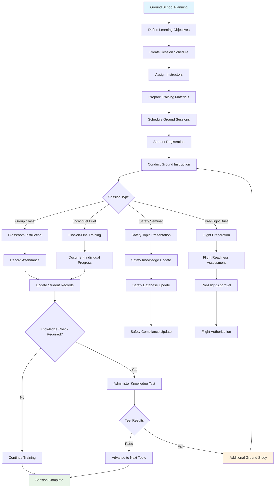

## Technical Implementation

### **Models Involved**
- **`instructors.SyllabusDocument`**: Ground school curriculum and materials
- **`instructors.TrainingLesson`**: Individual ground instruction sessions
- **`instructors.TrainingPhase`**: Organized learning modules
- **`knowledgetest.TestSession`**: Knowledge assessments and evaluations
- **`members.Member`**: Students and ground school instructors
- **`cms.Page`**: Ground school materials and reference documents

### **Key Files**
- **Models**: `instructors/models.py` - Ground instruction data structures
- **Views**: `instructors/views.py` - Ground school management interface
- **Utils**: `instructors/utils.py` - Progress tracking and assessment logic
- **Knowledge Tests**: `knowledgetest/` - Assessment and testing functionality
- **Content Management**: `cms/` - Training materials and documentation

### **Ground School Session Management**

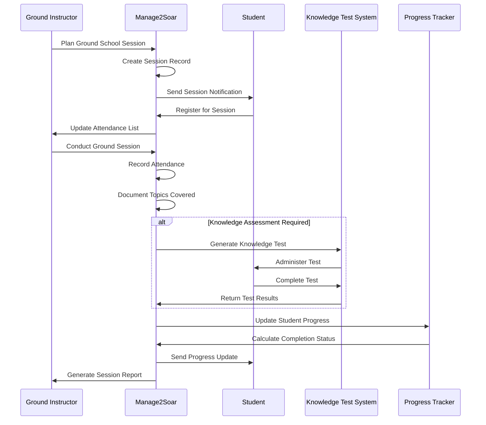

### **Ground Instruction Categories**

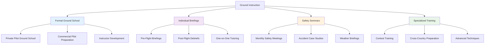

### **Learning Progress Tracking**

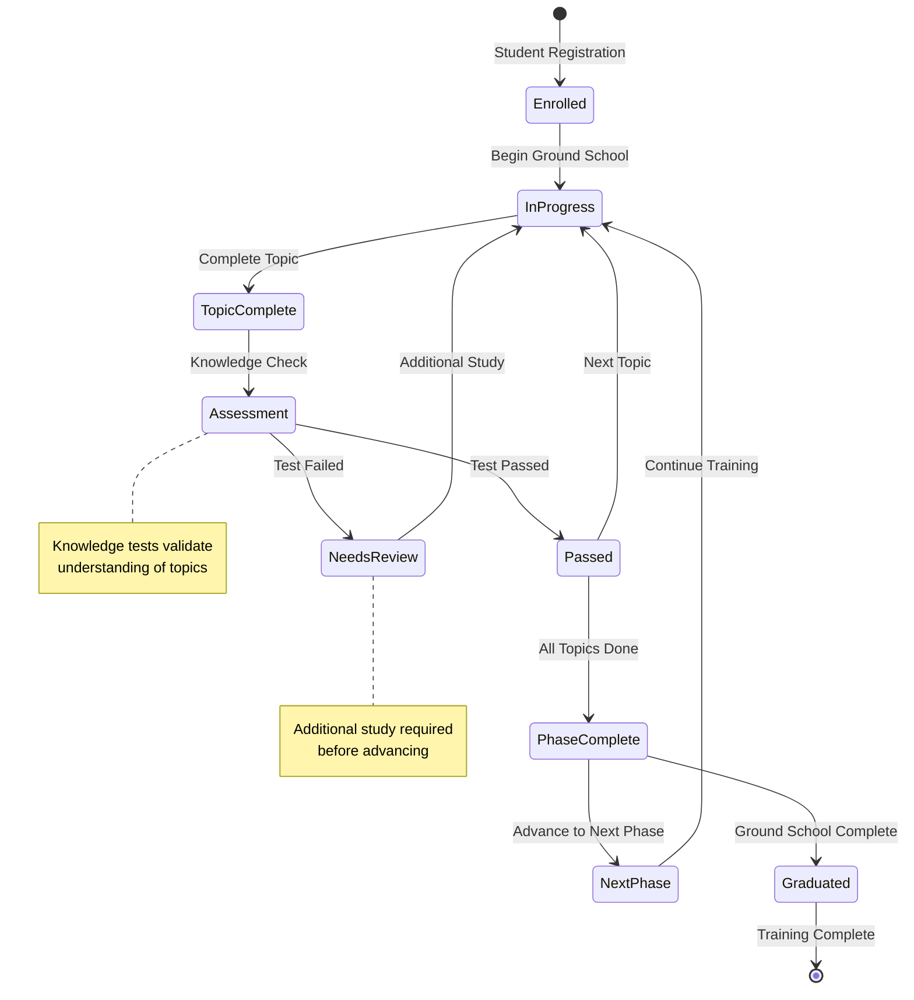

### **Database Schema**

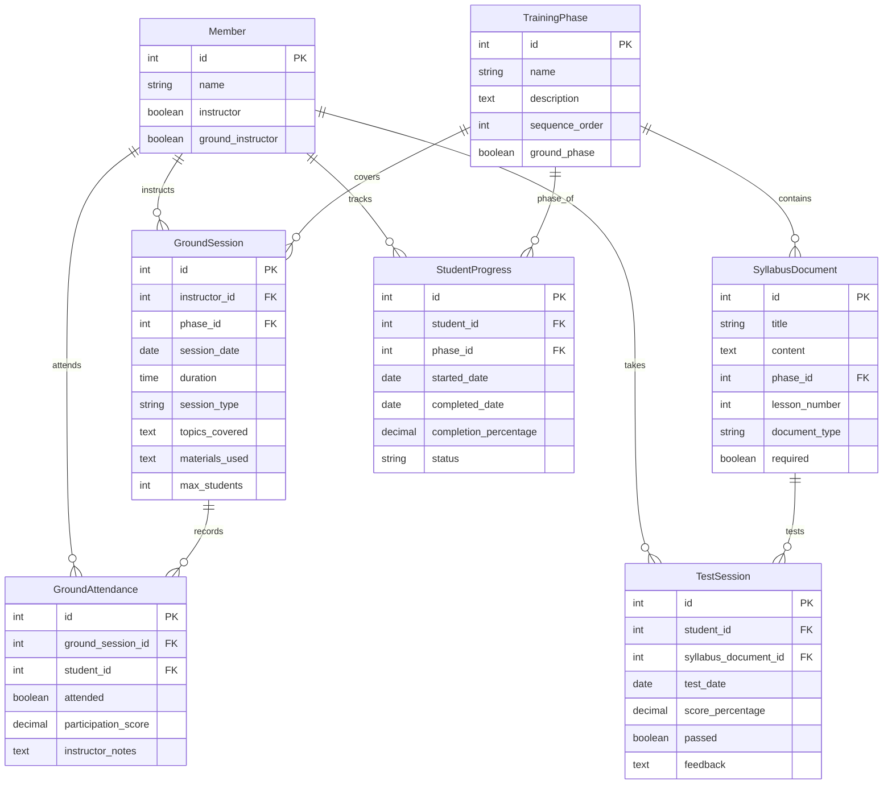

## Key Integration Points

### **Flight Instruction Integration**
Ground instruction coordinates closely with flight training:

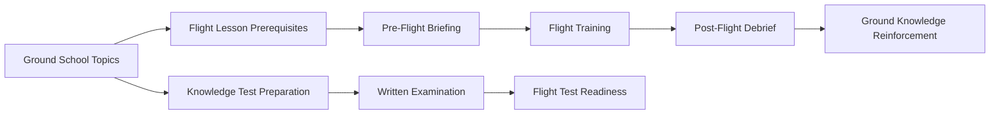

### **Knowledge Test Integration**
Ground instruction feeds directly into formal testing:

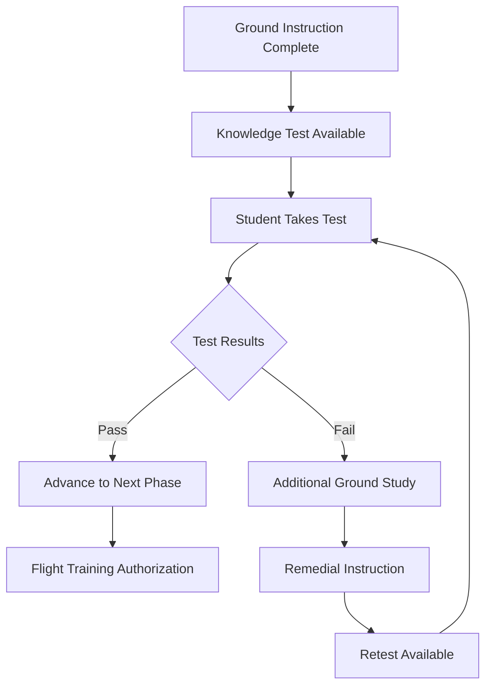

### **Safety Program Integration**
Ground instruction supports overall safety management:

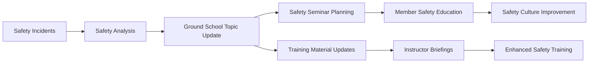

## Common Workflows

### **Monthly Ground School Series**

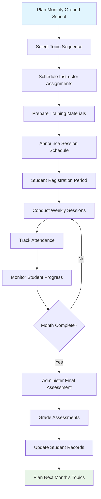

### **Individual Student Briefing Process**

```mermaid
flowchart LR
    A[Flight Lesson Scheduled] --> B[Pre-Flight Ground Brief]
    B --> C[Review Lesson Objectives]
    C --> D[Discuss Weather/Conditions]
    D --> E[Aircraft Systems Review]
    
    E --> F[Flight Training Session]
    F --> G[Post-Flight Debrief]
    G --> H[Lesson Performance Review]
    H --> I[Identify Learning Points]
    I --> J[Plan Next Lesson]
    
    J --> K[Update Training Record]
    K --> L[Schedule Next Session]
```

### **Safety Seminar Management**

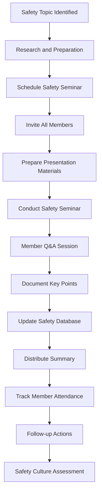

## Known Gaps & Improvements

### **Current Strengths**
- ✅ Comprehensive syllabus management and organization
- ✅ Integration with flight instruction and progress tracking
- ✅ Knowledge test integration for assessment validation
- ✅ Flexible session types (group, individual, safety seminars)
- ✅ Attendance tracking and progress monitoring
- ✅ Safety training integration

### **Identified Gaps**
- 🟡 **Online Learning Platform**: No support for remote/online ground instruction
- 🟡 **Multimedia Content**: Limited support for videos, animations, and interactive content
- 🟡 **Learning Management**: No formal LMS features like assignments or discussions
- 🟡 **Progress Analytics**: Limited analytics on learning effectiveness and outcomes
- 🟡 **Mobile Access**: Ground school materials not optimized for mobile devices

### **Improvement Opportunities**
- 🔄 **Online Learning Portal**: Full-featured online learning management system
- 🔄 **Interactive Content**: Support for videos, simulations, and interactive exercises
- 🔄 **Adaptive Learning**: Personalized learning paths based on student progress
- 🔄 **Gamification**: Achievement badges and progress incentives
- 🔄 **Collaborative Learning**: Discussion forums and peer learning features

### **Content Management**
- 🔄 **Content Versioning**: Track and manage updates to training materials
- 🔄 **Resource Library**: Comprehensive library of training resources and references
- 🔄 **Content Creation Tools**: Better tools for instructors to create and update materials
- 🔄 **External Content Integration**: Integration with external training resources and materials
- 🔄 **Quality Assurance**: Review and approval process for training content

### **Assessment and Analytics**
- 🔄 **Advanced Assessment**: More sophisticated testing and evaluation capabilities
- 🔄 **Learning Analytics**: Detailed analytics on student learning patterns and outcomes
- 🔄 **Instructor Analytics**: Performance metrics for ground instructors
- 🔄 **Competency Tracking**: Formal competency-based progression tracking
- 🔄 **Certification Management**: Track and manage instructor certifications and currency

### **Communication and Collaboration**
- 🔄 **Student Communication**: Enhanced communication tools between instructors and students
- 🔄 **Parent/Guardian Portal**: Access for parents of younger students
- 🔄 **Study Groups**: Tools for organizing and managing student study groups
- 🔄 **Instructor Collaboration**: Better coordination tools for ground school instructors
- 🔄 **Calendar Integration**: Integration with personal and club calendars

## Related Workflows

- **[Instruction Workflow](03-instruction-workflow.md)**: How ground instruction integrates with flight training
- **[Knowledge Test Lifecycle](09-knowledge-test-lifecycle.md)**: How ground instruction prepares students for testing
- **[Member Lifecycle](02-member-lifecycle.md)**: How ground school supports member development and progression
- **[System Overview](01-system-overview.md)**: How ground instruction fits into overall training programs

---

*Ground instruction is essential for safe, knowledgeable pilots. Effective ground school programs build the theoretical foundation that supports practical flight training and lifelong learning.*