# Knowledge Test Lifecycle

## Manager Overview

The knowledge test lifecycle manages the complete process of written examinations from creation through administration, grading, and cleanup. This system supports both formal certification exams and informal knowledge checks, ensuring secure test administration while providing comprehensive progress tracking and feedback.

**Key Stages:**
1. **Test Creation** - Design and development of knowledge assessments
2. **Test Distribution** - Assignment and scheduling of tests for students
3. **Test Administration** - Secure test taking environment and monitoring
4. **Grading and Feedback** - Automated scoring and detailed feedback generation
5. **Data Management** - Results analysis and secure test data cleanup

## Process Flow

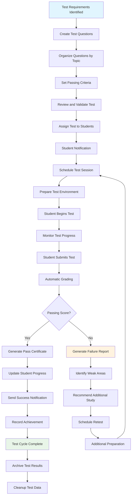

## Technical Implementation

### **Models Involved**
- **`knowledgetest.TestPreset`**: Configurable test presets with category weight distributions
- **`knowledgetest.Question`**: Individual test questions and answers
- **`knowledgetest.QuestionCategory`**: Topic organization for questions
- **`knowledgetest.WrittenTestTemplate`**: Test definitions and configurations
- **`knowledgetest.WrittenTestAttempt`**: Individual test-taking sessions
- **`knowledgetest.WrittenTestAnswer`**: Student responses to questions
- **`knowledgetest.WrittenTestAssignment`**: Test assignments to students
- **`members.Member`**: Students taking tests and instructors creating them

### **Key Files**
- **Models**: `knowledgetest/models.py` - Test data structures and relationships
- **Views**: `knowledgetest/views.py` - Test administration interface
- **Forms**: `knowledgetest/forms.py` - Test creation and administration forms
- **Utils**: `knowledgetest/utils.py` - Scoring algorithms and test logic
- **Management**: `knowledgetest/management/commands/` - Automated test cleanup

### **Test Session Management**

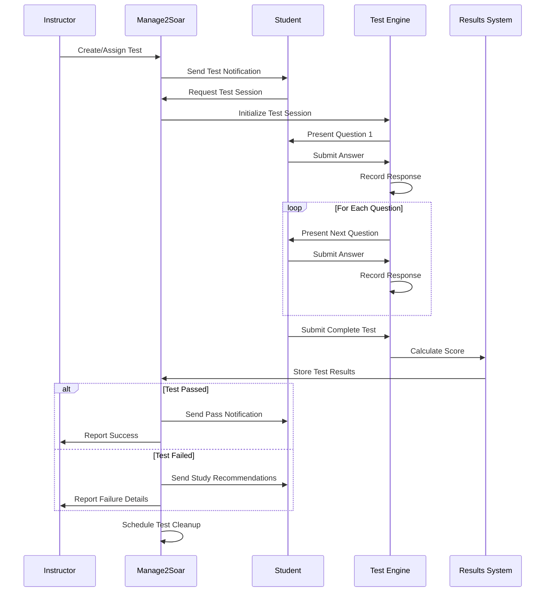

### **Question Bank Management**

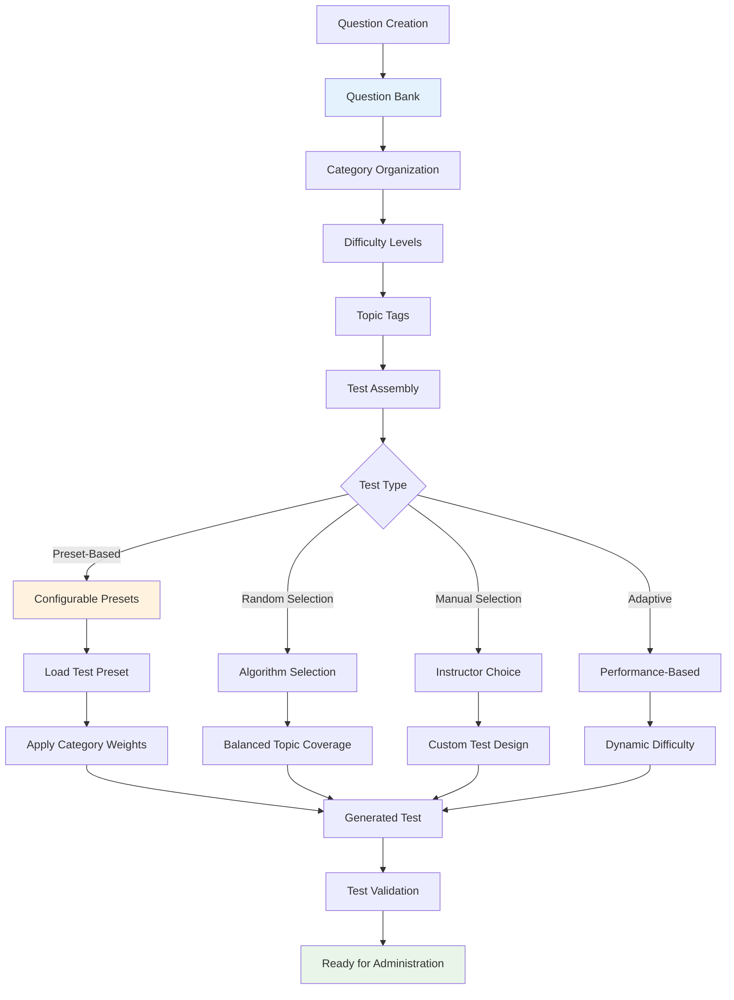

### **Test Security and Integrity**

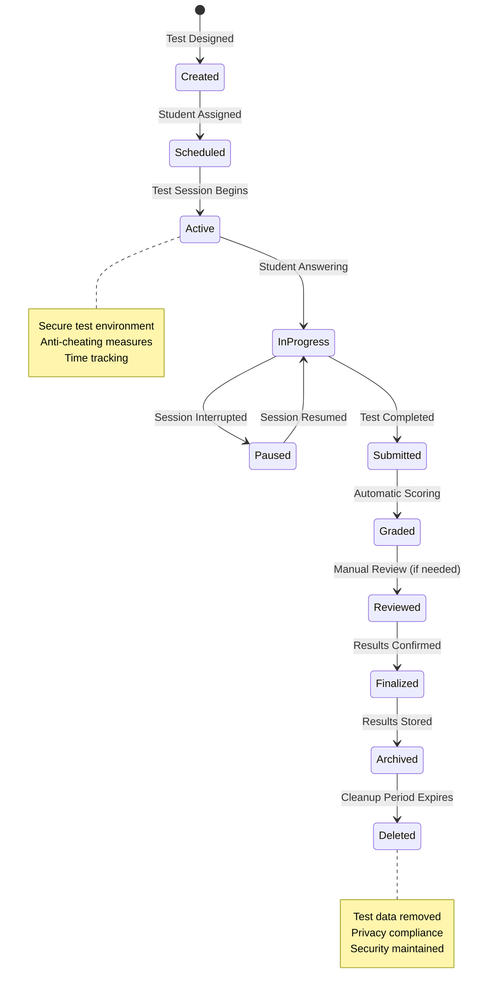

### **Database Schema**

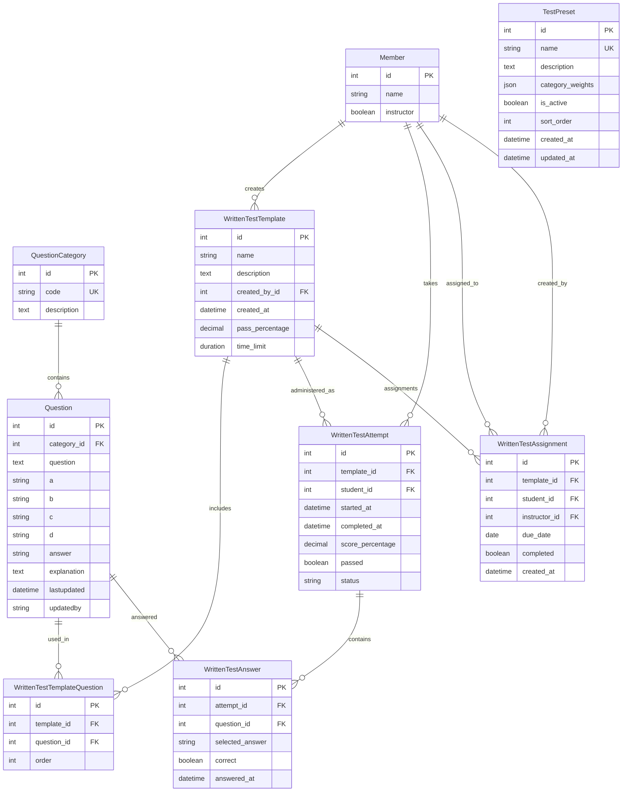

## Key Integration Points

### **Ground Instruction Integration**
Knowledge tests validate ground school learning:

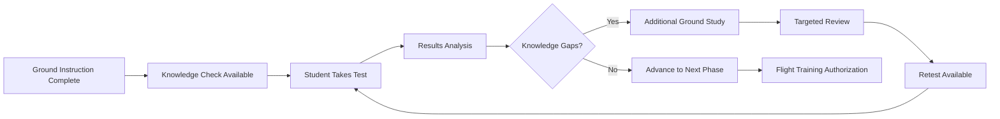

### **Training Progress Integration** 
Test results directly impact training progression:

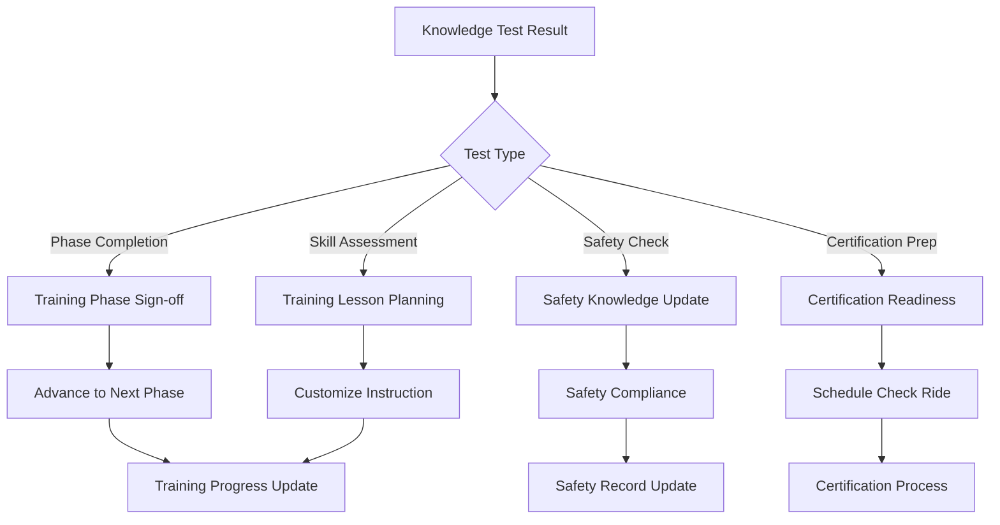

### **Analytics and Reporting Integration**
Test data provides valuable learning analytics:

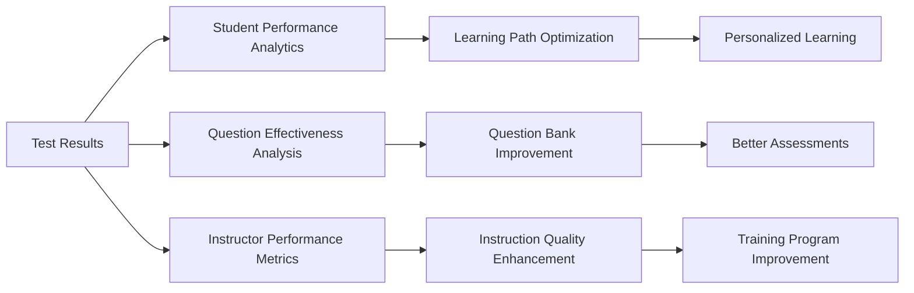

### **Configurable Test Presets (Issue #135)**

The knowledge test system now supports database-driven test presets that replace hardcoded configurations:

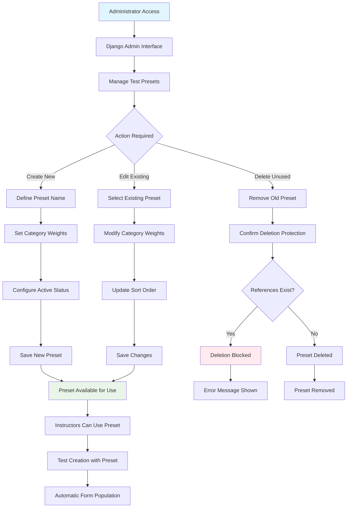

**Key Benefits:**
- **Flexibility**: Clubs can customize test configurations without code changes
- **Consistency**: Standardized test formats for specific aircraft or topics
- **Safety**: Deletion protection prevents accidental removal of active presets
- **Usability**: URL parameters automatically populate test creation forms

**Available Presets** (migrated from legacy system):
- **ASK21**: ASK-21 aircraft-specific test (73 questions)
- **PW5**: PW-5 aircraft-specific test (78 questions)
- **DISCUS**: Discus aircraft-specific test (47 questions)
- **ACRO**: Aerobatics-focused test (30 questions)
- **EMPTY**: Blank preset for custom test creation

## Common Workflows

### **Standard Knowledge Test Administration**

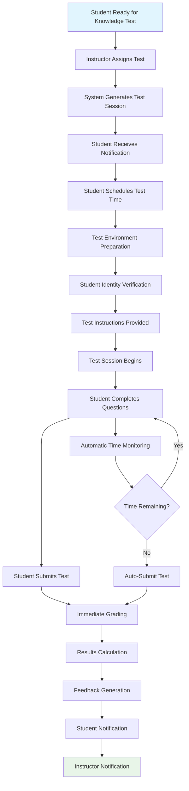

### **Adaptive Testing Process**

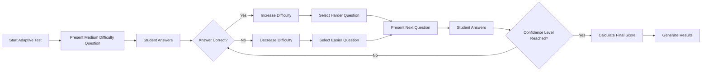

### **Test Data Cleanup Process**

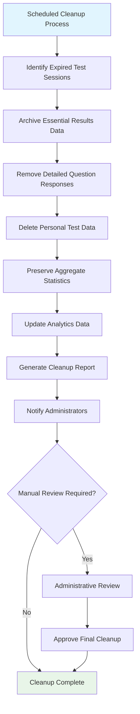

## Known Gaps & Improvements

### **Current Strengths**
- ✅ **Configurable test presets** - Database-driven test configurations replace hardcoded values
- ✅ Comprehensive question bank management system
- ✅ Secure test administration with time tracking
- ✅ Automatic grading and immediate feedback
- ✅ Integration with training progress tracking
- ✅ Privacy-compliant data cleanup processes
- ✅ Detailed analytics on test performance

### **Identified Gaps**
- 🟡 **Advanced Question Types**: Limited support for multimedia, drag-and-drop, or interactive questions
- 🟡 **Anti-Cheating Measures**: Basic security, could be enhanced with proctoring features
- 🟡 **Mobile Testing**: Limited mobile interface for test taking
- 🟡 **Offline Testing**: No support for offline test administration
- 🟡 **Question Authoring**: Limited tools for creating complex questions

### **Improvement Opportunities**
- 🔄 **Enhanced Question Types**: Support for multimedia, simulations, and interactive assessments
- 🔄 **AI-Powered Testing**: Adaptive testing with AI-driven question selection
- 🔄 **Remote Proctoring**: Secure remote test administration with monitoring
- 🔄 **Collaborative Authoring**: Better tools for multiple instructors to create and review questions
- 🔄 **Learning Analytics**: Advanced analytics on learning patterns and effectiveness

### **Test Security and Integrity**
- 🔄 **Advanced Anti-Cheating**: Browser lockdown, keystroke monitoring, and behavior analysis
- 🔄 **Identity Verification**: Biometric or multi-factor authentication for high-stakes tests
- 🔄 **Question Pool Management**: Larger question pools with better randomization
- 🔄 **Secure Delivery**: Enhanced encryption and secure test delivery mechanisms
- 🔄 **Audit Trails**: Comprehensive logging of all test administration activities

### **Accessibility and Usability**
- 🔄 **Accessibility Compliance**: Full WCAG compliance for students with disabilities
- 🔄 **Multi-language Support**: Tests and interfaces in multiple languages
- 🔄 **Customizable Interface**: Adaptable interface for different learning styles
- 🔄 **Performance Optimization**: Faster loading and responsive design
- 🔄 **Offline Capability**: Support for offline test taking with later synchronization

### **Analytics and Reporting**
- 🔄 **Predictive Analytics**: Predict student success and identify at-risk learners
- 🔄 **Question Analytics**: Deep analysis of question effectiveness and bias
- 🔄 **Instructor Dashboards**: Comprehensive dashboards for instructors and administrators
- 🔄 **Competency Mapping**: Link test results to specific competencies and skills
- 🔄 **Longitudinal Analysis**: Track learning progress over extended periods

## Related Workflows

- **[Ground Instruction](08-ground-instruction.md)**: How ground school prepares students for knowledge tests
- **[Instruction Workflow](03-instruction-workflow.md)**: How knowledge tests integrate with flight training progression
- **[Member Lifecycle](02-member-lifecycle.md)**: How knowledge tests support member development and certification
- **[System Overview](01-system-overview.md)**: How knowledge testing fits into overall training and assessment systems

---

*The knowledge test lifecycle ensures comprehensive, secure, and fair assessment of student learning. Effective testing validates training outcomes and supports continuous improvement in instruction quality.*