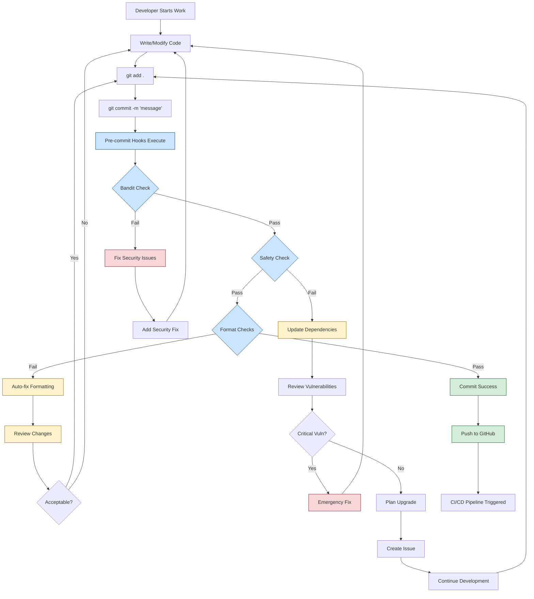
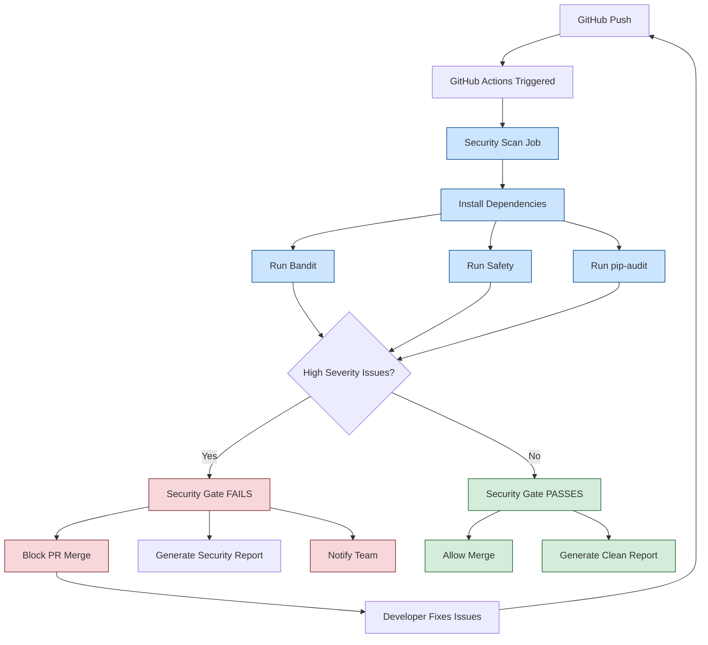

# Security and Code Quality Workflow

This document outlines the security scanning and code quality processes for the Manage2Soar platform.

## 👤 **Manager Overview**

The security workflow ensures code quality and security throughout the development lifecycle. This automated system:

- **Prevents security vulnerabilities** from entering the codebase
- **Maintains code quality standards** through automated formatting and linting
- **Provides early feedback** to developers during development
- **Blocks dangerous code** from reaching production
- **Generates security reports** for compliance and auditing

**Business Impact**: Protects club data, prevents security breaches, and maintains system reliability.

## 📊 **Process Flow**

### Development Security Workflow



### CI/CD Security Pipeline



## 🔧 **Technical Implementation**

### Security Tools Stack

| Tool | Purpose | Configuration |
|------|---------|---------------|
| **Bandit** | Python static security analysis | `bandit.yaml` |
| **Safety** | Python dependency vulnerability scanner | Built-in database |
| **pip-audit** | Alternative dependency scanner | PyPI vulnerability database |
| **Pre-commit** | Git hook automation | `.pre-commit-config.yaml` |

### Key Configuration Files

**`.pre-commit-config.yaml`**
```yaml
repos:
  - repo: https://github.com/pycqa/bandit
    rev: '1.8.6'
    hooks:
      - id: bandit
        args: ['-c', 'bandit.yaml']
  - repo: https://github.com/gitguardian/ggshield
    rev: v1.29.0
    hooks:
      - id: ggshield
        language: python
        stages: [commit]
```

**`bandit.yaml`**
```yaml
exclude_dirs:
  - .venv
  - staticfiles
  - static
skips:
  - B101  # assert_used
  - B106  # hardcoded_password_funcarg
  - B308  # mark_safe_used
  - B601  # paramiko_calls
  - B703  # django_mark_safe
```

**`.github/workflows/security.yml`**
- Automated security scanning on pushes and PRs
- Security gate that blocks high-severity issues
- Artifact generation for security reports
- PR commenting with security summaries

### Models and Database

**No direct database models** - Security workflow is process-based, but integrates with:

- `User` models for authentication security
- `AuditLog` for security event tracking (if implemented)
- File upload validation in various apps

### Key Integration Points

1. **Authentication Security** (`members` app)
   - Password policies
   - Session management
   - OAuth2 integration security

2. **File Upload Security** (multiple apps)
   - File type validation
   - Upload size limits
   - Path traversal prevention

3. **Database Security** (all apps)
   - SQL injection prevention (Django ORM)
   - Input validation
   - Output encoding

## 🔗 **Key Integration Points**

### Pre-Development Integration
- **Member Lifecycle**: Security checks apply to all member-related code changes
- **System Architecture**: Security scanning validates all architectural changes

### Development Integration
- **All Workflows**: Every code change goes through security validation
- **Git Workflow**: Pre-commit hooks integrate with standard git operations

### Post-Development Integration
- **CI/CD Pipeline**: Security gates prevent insecure code deployment
- **Production Deployment**: Only security-validated code reaches production

## ❌ **Known Gaps & Improvements**

### Current Limitations
1. **Runtime Security Monitoring**: No real-time security monitoring in production
2. **Penetration Testing**: No automated penetration testing workflow
3. **Dependency Updates**: Manual dependency upgrade process
4. **Security Audit Logging**: Limited security event logging

### Planned Improvements
1. **SAST/DAST Integration**: Add dynamic security testing
2. **Automated Dependency Updates**: Implement Dependabot or similar
3. **Security Incident Response**: Define incident response procedures
4. **Security Training Integration**: Link to developer security training

### Enhancement Opportunities
- **Security Metrics Dashboard**: Track security metrics over time
- **Compliance Reporting**: Generate compliance reports automatically
- **Third-party Integration Security**: Validate external service integrations
- **Infrastructure Security**: Extend security scanning to infrastructure code

## 🚨 **Emergency Procedures**

### High-Severity Security Issue Found
1. **Immediate**: Block all PR merges
2. **Assessment**: Evaluate impact and exploitability
3. **Fix Development**: Prioritize security fix development
4. **Testing**: Verify fix resolves issue without breaking functionality
5. **Deployment**: Emergency deployment if production is affected
6. **Communication**: Notify stakeholders of resolution

### Security Tool Failures
1. **Bypass Approval**: Security team can override checks for critical fixes
2. **Manual Review**: Enhanced manual code review when tools fail
3. **Tool Recovery**: Prioritize restoring security tool functionality
4. **Documentation**: Document any temporary security process changes

---

**Related Workflows:**
- [System Overview](01-system-overview.md) - Overall architecture security considerations
- [Member Lifecycle](02-member-lifecycle.md) - Authentication and authorization security
- All other workflows - Security validation applies to all processes

**External References:**
- [OWASP Top 10](https://owasp.org/www-project-top-ten/)
- [Django Security Best Practices](https://docs.djangoproject.com/en/stable/topics/security/)
- [Bandit Documentation](https://bandit.readthedocs.io/)
