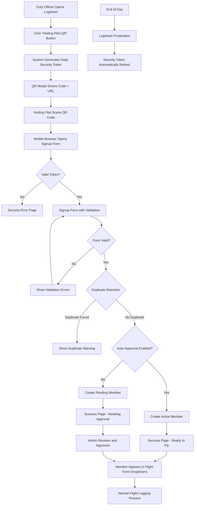

# Visiting Pilot Workflow

## Overview

The visiting pilot workflow enables soaring club members from other clubs to quickly register and participate in operations at the host club. This system provides a secure, streamlined process that integrates seamlessly with existing logsheet and flight management systems.

## Business Requirements

- **Quick Registration**: Visiting pilots can register on-site without lengthy paperwork
- **Security**: Prevent automated bot abuse while maintaining ease of use
- **Integration**: Seamlessly integrate with existing flight logging and duty officer workflows  
- **Flexibility**: Support both auto-approval and manual approval workflows
- **Data Quality**: Comprehensive duplicate detection and validation

## System Architecture

### Components

1. **SiteConfiguration Model** (`siteconfig.models`)
   - Visiting pilot configuration and business rules
   - Security token lifecycle management
   - Auto-approval settings

2. **Member Model** (`members.models`)
   - Extended with `home_club` field for visiting pilots
   - Standard member fields for integration with existing systems

3. **Visiting Pilot Views** (`members.views`)
   - QR code generation and display
   - Secure signup form with token validation
   - Success and error handling

4. **FlightForm Integration** (`logsheet.forms`)
   - Visiting pilots appear in pilot/instructor/tow pilot/passenger dropdowns
   - Home club display for easy identification

## Workflow Process



## Security Model

### Token Lifecycle

1. **Generation**: Tokens created on-demand when duty officer requests QR code
2. **Validity**: Tokens valid for current day only (until midnight)
3. **Retirement**: Tokens automatically retired when logsheet is finalized
4. **Single Use**: Each token tied to specific logsheet/date combination

### Security Features

- **Daily Expiry**: Prevents long-term URL exposure
- **Automatic Cleanup**: No manual token management required
- **Bot Prevention**: Tokens required for all signup attempts
- **Rate Limiting**: Natural rate limiting through duty officer workflow

## Data Model Integration

### SiteConfiguration Fields

```python
# Visiting Pilot Configuration
visiting_pilot_enabled = models.BooleanField(default=False)
visiting_pilot_status = models.CharField(max_length=50, blank=True)
visiting_pilot_auto_approve = models.BooleanField(default=False)
visiting_pilot_require_ssa = models.BooleanField(default=True)
visiting_pilot_require_rating = models.BooleanField(default=False)

# Security Token Management  
visiting_pilot_token = models.CharField(max_length=20, blank=True)
visiting_pilot_token_created = models.DateTimeField(null=True, blank=True)
```

### Member Model Extensions

```python
# Added field for visiting pilots
home_club = models.CharField(
    max_length=100,
    blank=True,
    help_text="Home soaring club (for visiting pilots)"
)
```

## User Experience

### Duty Officer Workflow

1. Open daily logsheet management
2. Click "Visiting Pilot QR" button in QR Code Actions section
3. Modal displays QR code and URL
4. Visiting pilot scans code or enters URL manually
5. Monitor signup success through normal member management

### Visiting Pilot Experience

1. Scan QR code with mobile device
2. Fill out signup form (auto-populated URL includes security token)
3. Receive immediate feedback on approval status
4. If auto-approved, immediately available for flight logging

### Flight Form Integration

Visiting pilots appear in flight form dropdowns with clear identification:

- **Pilot Dropdown**: "Visiting Pilots" optgroup
- **Instructor Dropdown**: "Visiting Instructors" optgroup (if qualified)
- **Tow Pilot Dropdown**: "Visiting Tow Pilots" optgroup (if qualified)  
- **Passenger Dropdown**: "Visiting Pilots" optgroup

Format: `"John Doe (Other Soaring Club)"` or `"Jane Smith (Unknown Club)"`

## Configuration Options

### Basic Setup

```python
# Enable visiting pilot feature
visiting_pilot_enabled = True
visiting_pilot_status = "Affiliate Member"  # Membership status for visiting pilots
visiting_pilot_auto_approve = True  # Auto-approve or require manual review
```

### Validation Requirements

```python
# Data requirements
visiting_pilot_require_ssa = True  # Require SSA membership
visiting_pilot_require_rating = False  # Require pilot rating
```

## Duplicate Detection

The system performs comprehensive duplicate detection:

1. **Email Address**: Exact match across all members
2. **SSA Number**: Exact match when provided
3. **Name Similarity**: Smart detection of similar names with same SSA number
4. **Name Warning**: Alert for identical names without SSA numbers

## Error Handling

### Security Errors
- Invalid or expired tokens redirect to security error page
- Clear messaging about token expiration and requesting new QR code

### Validation Errors
- Real-time form validation with clear error messages
- Duplicate detection warnings with options to proceed or cancel

### System Errors
- Graceful degradation when visiting pilot feature is disabled
- Fallback messaging for configuration issues

## Integration Points

### Existing Systems

1. **Member Management**: Visiting pilots are standard members with special status
2. **Flight Logging**: Seamless integration with existing FlightForm dropdowns
3. **Duty Roster**: Works with existing duty officer permissions and workflows
4. **Admin Interface**: Full Django admin integration for manual management

### Future Extensibility

- Email notifications for new visiting pilot signups
- Reporting and analytics for visiting pilot activity
- Integration with external soaring organization databases
- Automated home club verification

## Testing Strategy

### Automated Tests

- **Unit Tests**: 16 tests covering all form validation and security scenarios
- **Integration Tests**: 6 tests covering FlightForm dropdown integration
- **Security Tests**: Token lifecycle and validation testing

### Manual Testing

- End-to-end workflow from QR scan to flight logging
- Mobile device testing for QR code scanning
- Cross-browser compatibility for signup forms

## Operational Procedures

### Daily Operations

1. **Duty Officer Setup**: No special setup required - QR codes generated on demand
2. **Token Management**: Automatic - no manual intervention needed
3. **Member Approval**: Configure auto-approval or use Django admin for manual review

### Periodic Maintenance

1. **Token Cleanup**: Automatic through logsheet finalization
2. **Member Status Review**: Standard member management procedures apply
3. **Configuration Updates**: Adjust requirements through Django admin

## Performance Considerations

- **Database Impact**: Minimal - adds one field to Member model, extends SiteConfiguration
- **Token Storage**: Single token per club, automatically managed
- **Query Performance**: Efficient dropdown queries with proper indexing
- **Mobile Performance**: Lightweight signup forms optimized for mobile devices

## Security Considerations

- **Token Exposure**: Tokens automatically expire and are retired promptly
- **Data Privacy**: Standard member data protection practices apply
- **Access Control**: Standard Django authentication and permission systems
- **Audit Trail**: Standard Django model history and logging

## Conclusion

The visiting pilot workflow provides a comprehensive, secure, and user-friendly system for integrating visiting pilots into daily soaring operations. The system balances security requirements with operational efficiency, providing a seamless experience for both duty officers and visiting pilots while maintaining data integrity and preventing abuse.
