# Membership Manager Workflow

## Manager Overview

The Membership Manager is one of the most critical human roles in the soaring club, serving as the primary gateway for new member onboarding and ongoing membership administration. With the implementation of the visitor contact system (Issue #70), Membership Managers now have streamlined tools to handle inquiries, process applications, and manage member lifecycles efficiently.

**Core Responsibilities:**
- **Visitor Contact Management**: Process and respond to inquiries from the `/contact/` form
- **New Member Onboarding**: Review applications, verify profiles, approve/reject memberships
- **Membership Status Management**: Handle renewals, status changes, and member transitions
- **Waiting List Administration**: Manage prospective member queue and communications
- **Communication Coordination**: Send welcome emails, notifications, and updates

**Key Integration Points:**
- Visitor contact form system (`cms.models.VisitorContact`)
- Member management through Django admin (`members.models.Member`)
- Email notification system (`notifications.models.Notification`)
- OAuth2 authentication pipeline for new registrations

## Process Flow

### High-Level Membership Manager Workflow


## Detailed Workflows

### 1. Visitor Contact Response Workflow

**Purpose**: Process and respond to inquiries submitted through the club's `/contact/` form.

**Access Method**: Django Admin → CMS → Visitor Contacts


**Response Time Standards:**
- **Trial Flight Requests**: Within 24 hours on weekdays
- **Membership Inquiries**: Within 2-3 business days
- **General Questions**: Within 1 week

**Contact Triage Categories:**

| Category | Description | Response Protocol |
|----------|-------------|-------------------|
| **Trial Flights** | First-time visitors interested in flying | Forward to CFI, provide scheduling info |
| **Membership Applications** | Serious about joining the club | Send application package, add to waiting list |
| **General Information** | Questions about club activities | Direct response with club information |
| **Aircraft/Equipment** | Technical questions about fleet | Forward to maintenance officer |
| **Events/Activities** | Club events and competitions | Forward to appropriate organizer |

### 2. New Member Application Process

**Purpose**: Review and process applications from prospective members who have completed the initial registration.


**Application Review Checklist:**

#### Profile Completeness
- [ ] Full name and contact information
- [ ] Profile photo uploaded
- [ ] Biography/background completed
- [ ] Emergency contact information
- [ ] Aviation experience documented
- [ ] References provided (minimum 2)

#### Background Verification
- [ ] Previous club memberships verified
- [ ] Aviation credentials checked (if applicable)
- [ ] References contacted and verified
- [ ] No significant safety concerns identified
- [ ] Financial capability assessment (if required)

#### Club Integration Assessment
- [ ] Alignment with club values and culture
- [ ] Willingness to participate in club duties
- [ ] Availability for club activities
- [ ] Geographic proximity to club operations

### 3. Membership Status Management

**Purpose**: Handle ongoing membership administration including renewals, status changes, and transitions.

**Common Status Transitions:**


**Annual Renewal Process:**
1. **Pre-Renewal Communication** (60 days before expiration)
   - Send renewal notices via email
   - Include dues information and deadlines
   - Provide online renewal options

2. **Renewal Processing** (30-day window)
   - Track payments and confirmations
   - Update membership records
   - Handle special circumstances

3. **Post-Renewal Follow-up** (After deadline)
   - Contact non-renewals for status clarification
   - Process late renewals with appropriate penalties
   - Update member status to inactive if necessary

### 4. Waiting List Administration

**Purpose**: Manage the queue of prospective members when club membership is at capacity.

**Waiting List Management Process:**

```mermaid
flowchart TD
    A[New Inquiry] --> B{Membership Available?}
    B -->|Yes| C[Direct to Application Process]
    B -->|No| D[Add to Waiting List]

    D --> E[Assign Priority Number]
    E --> F[Send Waiting List Confirmation]
    F --> G[Regular Status Updates]

    H[Member Departure] --> I[Opening Available]
    I --> J[Contact Next on List]
    J --> K{Still Interested?}
    K -->|Yes| L[Begin Application Process]
    K -->|No| M[Remove from List]
    M --> N[Contact Next Person]

    G --> O[Quarterly Check-ins]
    O --> P{Maintain Interest?}
    P -->|Yes| G
    P -->|No| Q[Remove from List]

    style C fill:#e8f5e8
    style L fill:#e8f5e8
```



**Waiting List Priority Factors:**
1. **Date of Initial Contact** (primary factor)
2. **Completion of Requirements** (application materials submitted)
3. **Geographic Proximity** (local vs. distant members)
4. **Aviation Experience** (certificated pilots may get priority)
5. **Special Skills** (mechanics, instructors, etc.)
6. **Referrals** (existing member recommendations)

## Technical Implementation

### Django Admin Configuration

**Visitor Contact Management:**
```python
# cms/admin.py - VisitorContactAdmin configuration
- List display: name, email, subject, submitted_at, handled_by
- List filters: submitted_at, handled
- Search fields: name, email, subject
- Bulk actions: mark_as_handled, export_to_csv
```

**Member Management Tools:**
```python
# members/admin.py - MemberAdmin configuration
- List display: username, full_name, membership_status, is_active
- List filters: membership_status, date_joined, is_active
- Search fields: username, first_name, last_name, email
- Bulk actions: activate_members, send_renewal_notices
```

### Key Model Relationships


### Integration Points

**Email Notification System:**
- Automatic notifications for new visitor contacts
- Welcome email templates for new members
- Renewal reminder scheduling
- Status change notifications

**Authentication Pipeline:**
- OAuth2 registration handling
- Unknown user flagging for review
- Automatic profile creation
- Permission assignment

## Standard Operating Procedures

### Communication Templates

#### Welcome Email Template
```
Subject: Welcome to [Club Name] - Next Steps

Dear [Member Name],

Congratulations! Your membership application has been approved, and we're excited to welcome you to [Club Name].

Your membership details:
- Status: [Membership Type]
- Member ID: [Member Number]
- Effective Date: [Start Date]

Next steps:
1. Complete your safety orientation (scheduled for [Date])
2. Review club operations manual
3. Set up your duty roster preferences
4. Join our member communication channels

Your membership manager: [Manager Name] ([Manager Email])

Welcome aboard!

[Club Leadership]
```

#### Rejection Notice Template
```
Subject: [Club Name] Membership Application Update

Dear [Applicant Name],

Thank you for your interest in joining [Club Name]. After careful review of your application, we regret to inform you that we cannot offer membership at this time.

[Specific reason - if appropriate to share]

We encourage you to:
- Address the noted concerns and reapply in [timeframe]
- Consider visiting as a guest to better understand our club culture
- Contact us if you have questions about this decision

We appreciate your understanding and wish you the best in your soaring endeavors.

Sincerely,
[Membership Manager Name]
```

### Response Time Standards

| Task Type | Target Response Time | Escalation Threshold |
|-----------|---------------------|---------------------|
| Visitor Contact - Trial Flight | 24 hours | 48 hours |
| Visitor Contact - General | 3 business days | 1 week |
| Application Review | 2 weeks | 3 weeks |
| Status Change Requests | 1 week | 2 weeks |
| Renewal Processing | Same day | 3 days |

### Documentation Requirements

**For Each New Member:**
- [ ] Completed application with all required fields
- [ ] Reference verification records
- [ ] Background check documentation (if required)
- [ ] Welcome package delivery confirmation
- [ ] Orientation completion record

**For Status Changes:**
- [ ] Reason for change documented
- [ ] Member notification sent and acknowledged
- [ ] System records updated
- [ ] Follow-up requirements noted

### Seasonal Considerations

**Flying Season (April - October):**
- Increased visitor contact volume
- Priority processing for trial flight requests
- Enhanced new member orientation scheduling
- Active waiting list management

**Off-Season (November - March):**
- Focus on administrative tasks
- Annual renewal processing
- Waiting list maintenance and updates
- Planning for next season's growth

## Quality Assurance and Metrics

### Key Performance Indicators

**Response Metrics:**
- Average response time to visitor contacts
- Application processing time (goal: <2 weeks)
- Member satisfaction with onboarding process
- Waiting list conversion rate

**Membership Health:**
- New member retention rate (1-year mark)
- Annual renewal rate
- Member engagement level
- Inactive member reactivation success

### Regular Reviews

**Monthly:**
- Visitor contact response time analysis
- Application pipeline review
- Waiting list status update
- Member status change tracking

**Quarterly:**
- New member integration success assessment
- Process improvement identification
- Communication template effectiveness review
- Waiting list priority adjustment

**Annually:**
- Complete membership workflow audit
- Renewal process optimization
- Member satisfaction survey
- Growth planning and capacity assessment

## Related Issues and References

- **Issue #70**: Visitor contact form implementation
- **Issue #24**: Waiting list tracking system
- **Issue #164**: Unknown user OAuth2 handling
- **Issue #180**: Workflow documentation project

**See Also:**
- [Member Lifecycle Workflow](02-member-lifecycle.md) - Technical member management
- [System Overview](01-system-overview.md) - Overall architecture
- [Security Workflow](10-security-workflow.md) - User permission management

---

*This workflow document addresses Issue #188 and provides comprehensive guidance for Membership Manager responsibilities and procedures.*
