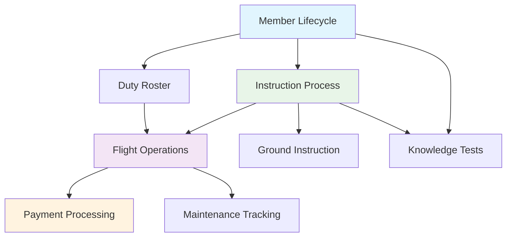

# Manage2Soar Workflow Documentation

This directory contains comprehensive workflow documentation for the Manage2Soar soaring club management platform. These documents describe how information flows through the system and how different processes connect together.

## 📋 **Workflow Documents**

1. **[System Overview](01-system-overview.md)** - High-level architecture and data flow between apps
2. **[Member Lifecycle](02-member-lifecycle.md)** - How members are onboarded and managed
3. **[Instruction Workflow](03-instruction-workflow.md)** - Student training and lesson management process
4. **[Logsheet Workflow](04-logsheet-workflow.md)** - Flight operations and logsheet management
5. **[Duty Roster Workflow](05-duty-roster-workflow.md)** - Duty scheduling and assignment process
6. **[Maintenance Workflow](06-maintenance-workflow.md)** - Equipment maintenance tracking
7. **[Payment Workflow](07-payment-workflow.md)** - Flight cost calculation and payment processing
8. **[Ground Instruction](08-ground-instruction.md)** - Ground school and knowledge transfer
9. **[Knowledge Test Lifecycle](09-knowledge-test-lifecycle.md)** - Written test creation, administration, and cleanup

## 🎯 **Target Audiences**

### **Managers & Club Officers**
- High-level process understanding
- Workflow oversight and optimization
- Training new staff members
- Process improvement identification

### **Developers & Technical Staff**
- Implementation details and code references
- Integration points between systems
- Database relationships and data flows
- Debugging and troubleshooting workflows

## 📊 **Document Structure**

Each workflow document follows this consistent structure:

- **Manager Overview** - High-level process description
- **Process Flow** - Visual Mermaid flowchart
- **Technical Implementation** - Models, views, and code details
- **Key Integration Points** - How this workflow connects to others
- **Known Gaps & Improvements** - Areas for enhancement

## 🔄 **Process Integration Map**

**Quick Navigation:**
- 👤 [Member Lifecycle](02-member-lifecycle.md) - User management & authentication
- 📚 [Instruction Process](03-instruction-workflow.md) - Flight training management  
- 📊 [Flight Operations](04-logsheet-workflow.md) - Daily flight operations (operational heart)
- 📅 [Duty Roster](05-duty-roster-workflow.md) - Duty scheduling system
- 🔧 [Maintenance](06-maintenance-workflow.md) - Aircraft maintenance tracking
- 💰 [Payment Processing](07-payment-workflow.md) - Financial processing
- 🏫 [Ground Instruction](08-ground-instruction.md) - Classroom training
- 📝 [Knowledge Tests](09-knowledge-test-lifecycle.md) - Written test administration

## 📚 **Related Documentation**

- **App-Specific Docs**: Each Django app has detailed documentation in its `docs/` directory
- **ERDs**: Database relationship diagrams are generated with `generate_erds.py`
- **API Reference**: See individual app `models.py`, `views.py`, and `admin.py` files
- **Project README**: [/README.md](../../README.md) for overall project information

## 📋 **Complete Workflow List**

| Workflow | Description | Key Focus |
|----------|-------------|-----------|
| [📋 System Overview](01-system-overview.md) | High-level architecture and data flow | Foundation understanding |
| [👤 Member Lifecycle](02-member-lifecycle.md) | User management & authentication | User onboarding |
| [📚 Instruction Process](03-instruction-workflow.md) | Flight training management | Training operations |
| [📊 Flight Operations](04-logsheet-workflow.md) | Daily flight operations | Operational heart |
| [📅 Duty Roster](05-duty-roster-workflow.md) | Duty scheduling system | Resource planning |  
| [🔧 Maintenance](06-maintenance-workflow.md) | Aircraft maintenance tracking | Fleet management |
| [💰 Payment Processing](07-payment-workflow.md) | Financial processing | Business operations |
| [🏫 Ground Instruction](08-ground-instruction.md) | Classroom training | Knowledge transfer |
| [📝 Knowledge Tests](09-knowledge-test-lifecycle.md) | Written test administration | Assessment & validation |

## �🚀 **Getting Started**

**New to the system?** Start with [System Overview](01-system-overview.md) to understand the big picture.

**Looking for a specific process?** Jump directly to the relevant workflow document.

**Technical implementation details?** Each workflow doc includes code references and integration points.

---

*This documentation was created to address [Issue #180](https://github.com/pietbarber/Manage2Soar/issues/180) - providing clear workflow descriptions for new users and comprehensive system understanding.*