# Manage2Soar Workflow Documentation

This directory contains comprehensive workflow documentation for the Manage2Soar soaring club management platform. These documents describe how information flows through the system and how different processes connect together.

## 📋 **Workflow Documents**

1. **[System Overview](01-system-overview.md)** - High-level architecture and data flow between apps
2. **[Member Lifecycle](02-member-lifecycle.md)** - How members are onboarded and managed
3. **[Instruction Workflow](03-instruction-workflow.md)** - Student training and lesson management process
4. **[Logsheet Workflow](04-logsheet-workflow.md)** - Flight operations and logsheet management
5. **[Duty Roster Workflow](05-duty-roster-workflow.md)** - Duty scheduling and assignment process
6. **[Maintenance Workflow](06-maintenance-workflow.md)** - Equipment maintenance tracking
7. **[Payment Workflow](07-payment-workflow.md)** - Flight cost calculation and payment processing
8. **[Ground Instruction](08-ground-instruction.md)** - Ground school and knowledge transfer
9. **[Knowledge Test Lifecycle](09-knowledge-test-lifecycle.md)** - Written test creation, administration, and cleanup

## 🎯 **Target Audiences**

### **Managers & Club Officers**
- High-level process understanding
- Workflow oversight and optimization
- Training new staff members
- Process improvement identification

### **Developers & Technical Staff**
- Implementation details and code references
- Integration points between systems
- Database relationships and data flows
- Debugging and troubleshooting workflows

## 📊 **Document Structure**

Each workflow document follows this consistent structure:

- **Manager Overview** - High-level process description
- **Process Flow** - Visual Mermaid flowchart
- **Technical Implementation** - Models, views, and code details
- **Key Integration Points** - How this workflow connects to others
- **Known Gaps & Improvements** - Areas for enhancement

## 🔄 **Process Integration Map**

## 📚 **Related Documentation**

- **App-Specific Docs**: Each Django app has detailed documentation in its `docs/` directory
- **ERDs**: Database relationship diagrams are generated with `generate_erds.py`
- **API Reference**: See individual app `models.py`, `views.py`, and `admin.py` files
- **Project README**: [/README.md](../../README.md) for overall project information

## �️ **Interactive Workflow Navigation**

Click any workflow below to jump directly to its documentation:

```mermaid
flowchart TD
    Start([🏠 Workflow Hub]) --> System[📋 System Overview]
    System --> Member[👤 Member Lifecycle]
    System --> Operations[🛩️ Flight Operations]
    
    Member --> Instruction[📚 Instruction Process]
    Member --> Knowledge[📝 Knowledge Tests]
    
    Operations --> Logsheet[📊 Flight Logsheet]
    Operations --> Duty[📅 Duty Roster]
    Operations --> Maintenance[🔧 Maintenance]
    
    Instruction --> Ground[🏫 Ground Instruction]
    Logsheet --> Payment[💰 Payment Processing]
    
    click System "./01-system-overview.md" "System Architecture & Data Flow"
    click Member "./02-member-lifecycle.md" "User Management & Authentication"
    click Instruction "./03-instruction-workflow.md" "Flight Training Management"
    click Logsheet "./04-logsheet-workflow.md" "Daily Flight Operations"
    click Duty "./05-duty-roster-workflow.md" "Duty Scheduling System"
    click Maintenance "./06-maintenance-workflow.md" "Aircraft Maintenance Tracking"
    click Payment "./07-payment-workflow.md" "Financial Processing"
    click Ground "./08-ground-instruction.md" "Classroom Training"
    click Knowledge "./09-knowledge-test-lifecycle.md" "Written Test Administration"
    
    style Start fill:#e1f5fe
    style System fill:#f3e5f5
    style Operations fill:#e8f5e8
    style Member fill:#fff3e0
```

## �🚀 **Getting Started**

**New to the system?** Start with [System Overview](01-system-overview.md) to understand the big picture.

**Looking for a specific process?** Jump directly to the relevant workflow document.

**Technical implementation details?** Each workflow doc includes code references and integration points.

---

*This documentation was created to address [Issue #180](https://github.com/pietbarber/Manage2Soar/issues/180) - providing clear workflow descriptions for new users and comprehensive system understanding.*