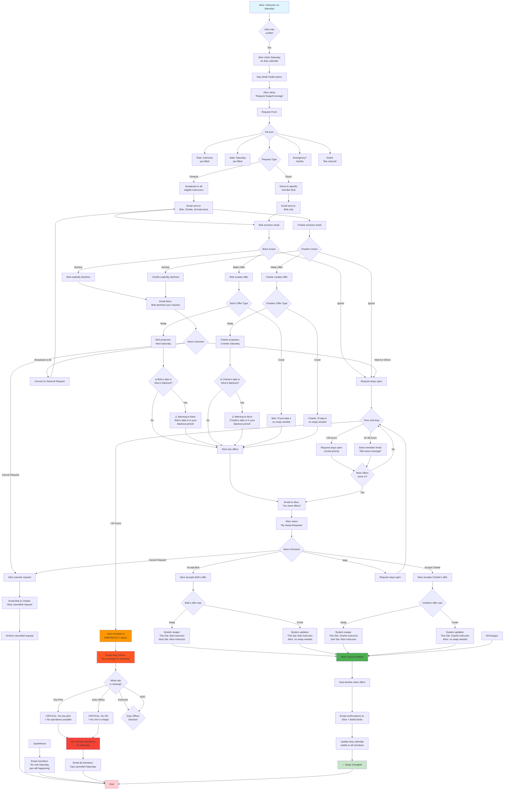

# Duty Swap Workflow - Issue #1

## Overview
This workflow handles the process where duty crew members (instructors, tow pilots, duty officers, assistant duty officers) need to find replacements for their scheduled duties when conflicts arise.

## User Story
Alice is the designated flight instructor scheduled for duty on Saturday, but she has a bar mitzvah to attend and can't make it. She needs to find a replacement. In the legacy system, all interactions happened via email. In the new system, the duty roster program handles all swaps through the web interface with no direct email interaction between instructors.

## Complete Workflow

## Key Features

### 1. Request Types
- **General Broadcast**: Request sent to all eligible members for that role
- **Direct Request**: Request sent to a specific member only
  - If the member declines, Alice can broadcast to all eligible members

Note: Alice doesn't specify whether she wants a swap or cover - that's Bob's choice when he makes his offer.

### 2. Offer Types
When Bob responds to Alice's request, he chooses:
- **Swap**: "I'll take your Saturday if you take my [proposed date]"
- **Cover**: "I'll just take your Saturday, no swap needed"

Note: Alice accepts or declines based on Bob's offer, but Bob decides what type of help to offer.

### 3. Blackout Date Checking
When someone offers a **swap** (not a cover), the system checks if the proposed swap date falls within Alice's blackout dates:
- **Warning shown**: "⚠️ This date is in your blackout period"
- **Alice can still accept**: But she's warned before committing
- **Cover offers**: No blackout check needed (Alice isn't taking a date)

### 4. Time-based Escalation
- **Normal** (>48 hours): Request stays open, normal priority
- **Warning** (24-48 hours): Reminder email sent to eligible members
- **Emergency** (<24 hours): Auto-escalate, notify Duty Officer

### 5. Resolution Paths
- Requester accepts an offer → swap/cover completed
- Requester cancels request → all offerers notified
- No offers by deadline → Duty Officer decides based on role:
  - **Critical roles (Tow Pilot, Duty Officer)**: Operations MUST be cancelled
    - No tow pilot = can't fly
    - No duty officer = no one in charge
  - **Optional roles (Instructor, ADO)**: Operations can proceed without role, or DO can cancel, or DO can manually assign someone
- Request stays open until resolved or duty day arrives

### 6. Roles Covered
- Instructor
- Tow Pilot
- Duty Officer
- Assistant Duty Officer

### 7. Site Configuration Constraints
**Critical**: Swap requests are only available for roles that are **scheduled** ahead of time.

From `SiteConfiguration`:
- `schedule_instructors` (default=False): "We schedule Instructors ahead of time"
- `schedule_tow_pilots` (default=False): "We schedule tow pilots ahead of time"
- `schedule_duty_officers` (default=False): "We schedule Duty Officers ahead of time"
- `schedule_assistant_duty_officers` (default=False): "We schedule Assistant Duty Officers ahead of time"

**Business Rules:**
- If a role is NOT scheduled (flag=False), swap requests cannot be created for that role
- Example: If `schedule_tow_pilots=False`, tow pilots show up ad-hoc, so there's no scheduled assignment to swap
- UI should hide "Request Swap" button for unscheduled roles
- Form validation should check scheduling config before accepting requests

**Critical Role Fallback:**
- If **Tow Pilot** or **Duty Officer** are NOT scheduled (ad-hoc model), the club must have a fallback plan:
  - Rely on self-volunteers showing up
  - Cancel operations if no one appears
  - This is outside the swap system's scope (no scheduled assignment = nothing to swap)

## Email Notifications

### Request Created
**To:** All eligible members (or specific member if direct request)
**Content:**
- Who needs coverage (Alice)
- What role (Instructor)
- What date (Saturday)
- Why (bar mitzvah)
- Link to make an offer

### Offer Made
**To:** Requester (Alice)
**Content:**
- Who made offer (Bob)
- What type of offer:
  - **Swap**: Bob will take Saturday if Alice takes [proposed date]
  - **Cover**: Bob will just take Saturday, no swap needed
- **Blackout warning** (if swap date is in Alice's blackout period): "\u26a0\ufe0f Warning: This date is in your blackout period"
- Link to review and accept/decline

### Request Declined by Member
**To:** Requester (Alice)
**Content:**
- Who declined (Bob)
- Optional: Bob's reason for declining
- Options for Alice:
  - Cancel the request
  - Broadcast to all eligible members (if it was a direct request)
  - Wait for other offers
- Link to manage request

### Offer Accepted
**To:** Both parties (Alice and Bob)
**Content:**
- Swap details confirmed
- Updated calendar dates
- Thank you message

### Offer Auto-declined
**To:** Declined offerer (Charlie)
**Content:**
- Alice accepted another offer
- Thank you for offering
- Encouragement to help with future requests

### Request Cancelled
**To:** All offerers
**Content:**
- Alice cancelled the request
- No longer needs help
- Thank you for offering

### Emergency Escalation
**To:** Duty Officer
**Content:**
- Critical: No coverage for [Role] on [Date]
- Requester: Alice
- Time remaining: <24 hours
- **If Tow Pilot or Duty Officer**: Operations MUST be cancelled (critical roles)
  - No tow pilot = can't fly
  - No duty officer = no one in charge
- **If Instructor/ADO**: Options available (proceed without role, find someone, or cancel)
- Link to duty assignment editor

### Operations Cancelled
**To:** All active members
**Content:**
- Operations cancelled for [Date]
- Reason: No [Role] coverage available
- **Critical roles**: Tow Pilot, Duty Officer (required for operations)
  - No tow pilot = can't fly
  - No duty officer = no one in charge
- **Optional roles**: Instructor, ADO (ops can proceed without, but better to have)
- Contact Duty Officer with questions

### Operations Proceeding Without Role
**To:** All active members
**Content:**
- Operations happening on [Date]
- Note: No [Role] available this day
- Example: "No instructor available Saturday - club gliders only, no instruction"
- Contact Duty Officer if you can help fill the role

## Open Questions

### Q1: Multiple Offers - Negotiation
Should Bob & Charlie be able to negotiate/comment on offers, or does Alice just pick one and others auto-decline?

### Q2: Cover Accounting
If Bob "covers" Alice with no swap expected, should we:
- Track it as a favor owed?
- Affect future roster fairness?
- Just update calendar with no accounting?

### Q3: Emergency Escalation - DO UI
When DO gets emergency notification, should they have UI to:
- Manually assign someone (requires their permission)?
- Or just email/call and manually update the calendar in admin?

### Q4: Mixed Scheduling Models - ANSWERED
**Question:** What if some roles are scheduled and others are ad-hoc?
**Answer:** Swap system only operates on scheduled roles (those with `schedule_[role]=True`). Unscheduled roles operate outside this system on self-volunteer basis.

## Technical Implementation Notes

### Existing Models (already in codebase)
- `DutySwapRequest`: Request for coverage/swap
- `DutySwapOffer`: Offer to help with a request
- `DutyAssignment`: The actual duty assignments

### New Components Needed
- Views for creating/managing requests
- Views for making/accepting offers
- Templates for all UIs
- Email templates for notifications
- URL routing
- Management command for time-based escalation (CronJob)
- Tests for complete workflow

### UI Access Points
- **Calendar day modal**: "Request Swap" button when viewing your own duty
- **Duty Roster navbar**: Link to "My Swap Requests" and "Open Requests"
- **Dashboard**: Alerts for pending offers/requests
