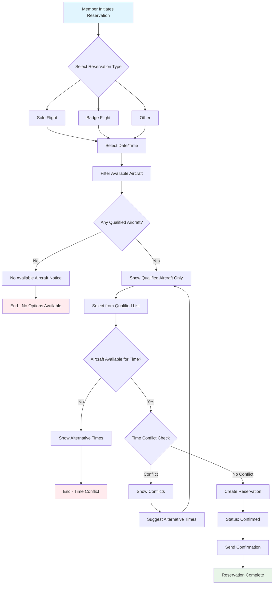
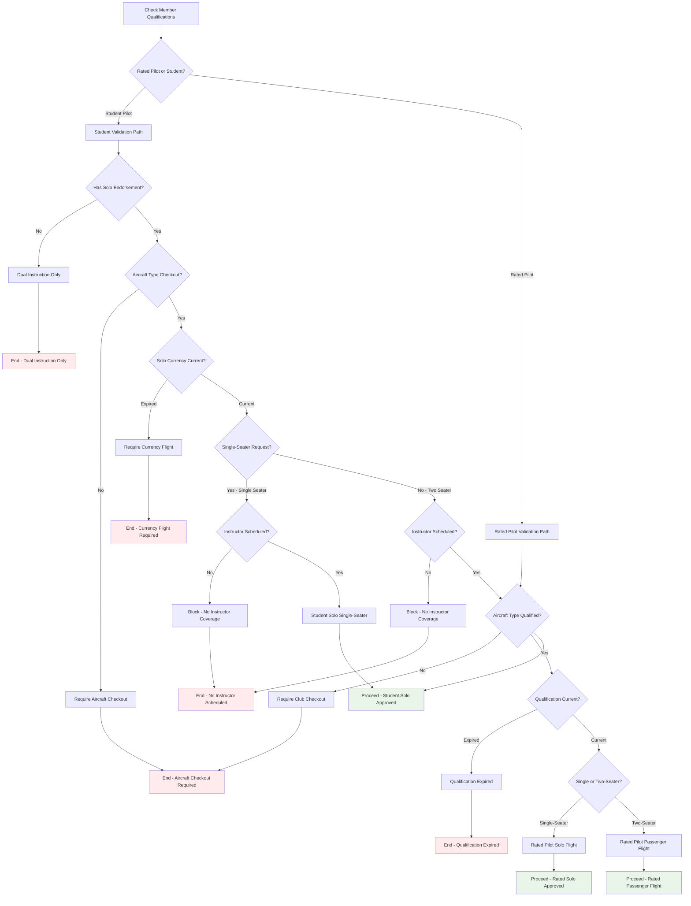
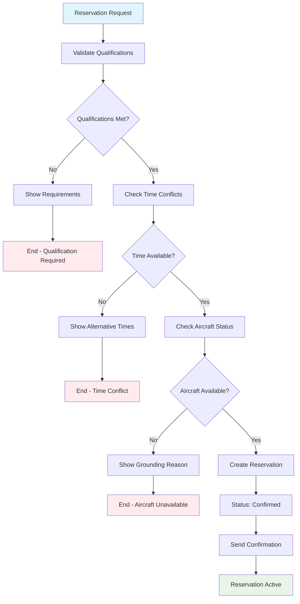
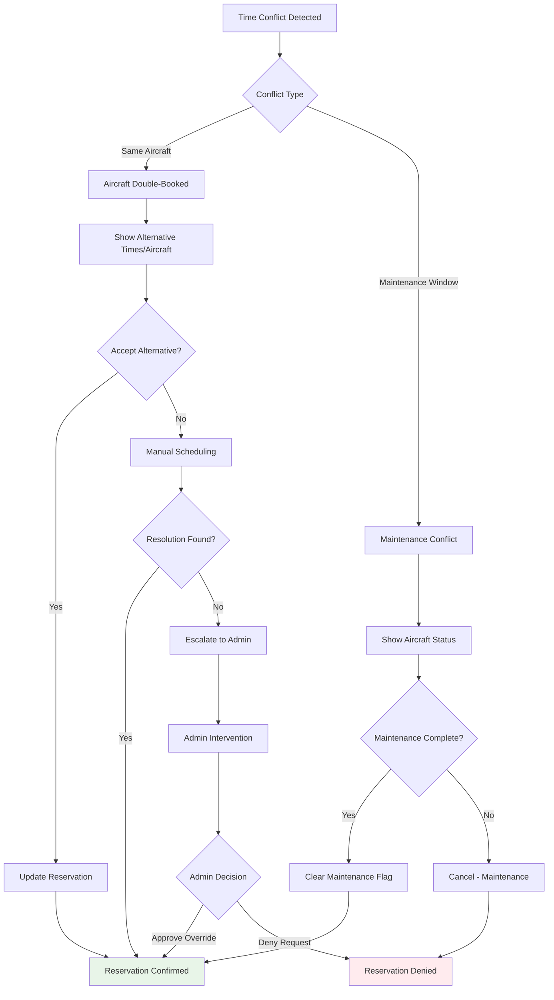
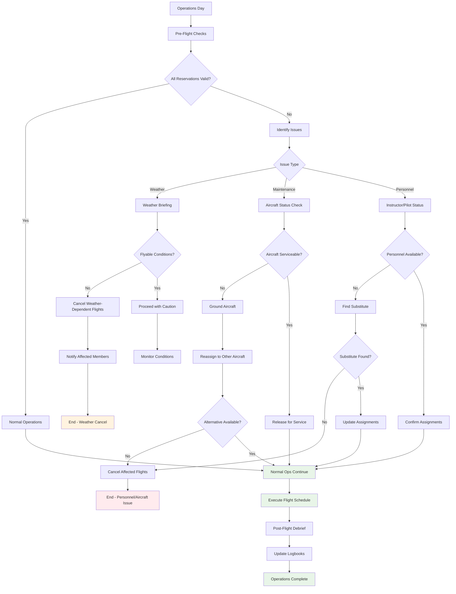

# Issue #190: Enhanced Glider Reservation System Design

## Overview
This document outlines the comprehensive glider reservation system that will transform the duty roster workflow into a full-featured club operations management system comparable to ClickNGlide functionality.

## Reservation Workflow

### Master Workflow - All Reservation Types



### Qualification Validation Workflow



### Fun Flying Only - No Instructors

**Glider reservations are exclusively for member fun flying:**
- **Solo Flight**: Member flying alone for recreation
- **Badge Flight**: Solo flights for badge/achievement purposes  
- **Other**: Miscellaneous fun flying (demo flights, checkout flights, etc.)

**No instruction-related reservations** - instruction scheduling is handled separately through the instructor scheduling system.

### First-Come-First-Served System

The reservation system operates on a **first-come-first-served** basis with automatic confirmation upon successful validation. No approval workflows or gatekeepers required.



**Key Principles:**
- ✅ **First registered wins** - No priority system or approval hierarchy
- ✅ **Qualification validation** - System enforces member credentials automatically  
- ✅ **Time conflict prevention** - Double-booking impossible
- ✅ **Aircraft status checking** - Maintenance issues block reservations
- ✅ **Immediate confirmation** - No waiting for human approval

### Conflict Resolution Workflow



**Simplified Conflict Resolution:**
- **Removed instructor double-booking** - instructors manage their own student queues
- **Removed weather restrictions** - system doesn't track weather conditions
- **Focus on aircraft availability** and maintenance windows only

### Daily Operations Workflow



## Database Schema Design

### GliderReservation Model

```python
class GliderReservation(models.Model):
    """
    Comprehensive glider reservation system supporting various flight types,
    qualification validation, and operational safety checks.
    """
    
    # Core reservation data
    member = models.ForeignKey('members.Member', on_delete=models.CASCADE)
    glider = models.ForeignKey('logsheet.Glider', on_delete=models.CASCADE)
    date = models.DateField()
    start_time = models.TimeField()
    end_time = models.TimeField()
    
    # Reservation type with comprehensive options
    RESERVATION_TYPE_CHOICES = [
        ('solo', 'Solo Flight'),
        ('badge', 'Badge Flight'),
        ('other', 'Other'),
    ]
    reservation_type = models.CharField(
        max_length=20, 
        choices=RESERVATION_TYPE_CHOICES,
        help_text="Type of flight operation planned"
    )
    
    # Status tracking
    STATUS_CHOICES = [
        ('confirmed', 'Confirmed'),
        ('cancelled', 'Cancelled'),
        ('completed', 'Completed'),
        ('no_show', 'No Show'),
    ]
    status = models.CharField(
        max_length=15, 
        choices=STATUS_CHOICES, 
        default='confirmed'
    )
    
    # No instructor field - glider reservations are for fun flying only
    
    # Additional details
    purpose = models.TextField(
        blank=True,
        help_text="Additional details about the planned flight"
    )
    special_requirements = models.TextField(
        blank=True,
        help_text="Any special equipment or setup requirements"
    )
    
    # Administrative tracking
    created_at = models.DateTimeField(auto_now_add=True)
    updated_at = models.DateTimeField(auto_now=True)
    
    class Meta:
        unique_together = ['glider', 'date', 'start_time']
        ordering = ['date', 'start_time']
        indexes = [
            models.Index(fields=['date', 'glider']),
            models.Index(fields=['member', 'date']),
        ]
    
    def __str__(self):
        return f"{self.member.full_display_name} - {self.glider} on {self.date} at {self.start_time}"
    
    def clean(self):
        """Comprehensive validation for reservation requests"""
        from django.core.exceptions import ValidationError
        
        # Check if glider is grounded
        if self.glider.is_grounded:
            raise ValidationError(f"Glider {self.glider} is currently grounded for maintenance")
        
        # Validate instructor requirement for certain reservation types
        instructor_required_types = ['instruction', 'flight_review', 'faa_wings', 'check']
        if self.reservation_type in instructor_required_types and not self.instructor:
            raise ValidationError(f"Instructor required for {self.get_reservation_type_display()} flights")
        
        # Validate member qualifications for single-seater aircraft
        if self.glider.seats == 1:
            self._validate_single_seater_qualification()
        
        # Validate two-seater permissions
        elif self.glider.seats == 2:
            self._validate_two_seater_permission()
        
        # Check for time conflicts
        self._validate_time_conflicts()
        
        # Validate badge flight requirements
        if self.reservation_type == 'badge':
            self._validate_badge_flight_requirements()
    
    def _validate_single_seater_qualification(self):
        """Validate member is qualified for single-seater operations"""
        # Implementation will check member's solo endorsements and currency
        pass
    
    def _validate_two_seater_permission(self):
        """Validate member has permission for two-seater operations"""
        # Implementation will check member's dual instruction authorization
        pass
    
    def _validate_time_conflicts(self):
        """Check for overlapping reservations"""
        from django.core.exceptions import ValidationError
        
        conflicting_reservations = GliderReservation.objects.filter(
            glider=self.glider,
            date=self.date,
            status__in=['pending', 'confirmed']
        ).exclude(pk=self.pk if self.pk else None)
        
        for reservation in conflicting_reservations:
            if (self.start_time < reservation.end_time and 
                self.end_time > reservation.start_time):
                raise ValidationError(
                    f"Time conflict with existing reservation: "
                    f"{reservation.start_time}-{reservation.end_time}"
                )
    
    def _validate_badge_flight_requirements(self):
        """Validate requirements for badge flights"""
        # Badge flights typically require full-day access and specific qualifications
        if self.end_time <= self.start_time:
            from django.core.exceptions import ValidationError
            raise ValidationError("Badge flights require end time after start time")
    
    @property
    def duration_hours(self):
        """Calculate planned flight duration in hours"""
        from datetime import datetime, timedelta
        
        start_dt = datetime.combine(self.date, self.start_time)
        end_dt = datetime.combine(self.date, self.end_time)
        
        # Handle overnight flights (rare but possible)
        if end_dt <= start_dt:
            end_dt += timedelta(days=1)
        
        duration = end_dt - start_dt
        return duration.total_seconds() / 3600
    
    @property
    def requires_instructor(self):
        """Check if this reservation type requires an instructor"""
        instructor_required_types = ['instruction', 'flight_review', 'faa_wings', 'check']
        return self.reservation_type in instructor_required_types
    
    @property
    def is_training_flight(self):
        """Check if this is a training-related flight"""
        training_types = ['instruction', 'flight_review', 'faa_wings', 'check', 'badge']
        return self.reservation_type in training_types
```

## Reservation Type Specifications

### Solo Flight
- **Purpose**: Independent recreational flight by qualified pilot
- **Requirements**: Current solo endorsement for aircraft type
- **Validation**: Member must meet currency requirements for aircraft
- **Duration**: Variable based on flight plan
- **Notes**: Primary fun flying reservation type

### Badge Flight
- **Purpose**: Solo badge/rating attempts (Silver, Gold, Diamond badges)
- **Requirements**: Member qualifications for badge type
- **Validation**: Member must meet badge prerequisites  
- **Duration**: Typically full day (sunrise to sunset)
- **Notes**: Badge Official coordination happens outside reservation system

### Other
- **Purpose**: Miscellaneous fun flying not covered by standard categories
- **Requirements**: Standard aircraft qualifications only
- **Validation**: Basic qualification check for aircraft type
- **Duration**: Variable
- **Notes**: Examples: demo flights, aircraft checkout, maintenance test flights

## Integration with Existing Systems

### Connection to Logsheet App
- Validate against `logsheet.Glider` availability and grounding status
- Check maintenance issues before allowing reservations
- Link completed reservations to actual flight entries

### Connection to Members App
- Validate member qualifications and currency
- Check membership status and privileges
- Track member reservation history and patterns

## Validation Rules Summary

| Reservation Type | Instructor Required | Qualification Validation | Duration Limits |
|------------------|--------------------|--------------------|-----------------|
| Solo | ❌ No | Aircraft qualification only | Variable |
| Badge | ❌ No | Badge prerequisites + aircraft qual | Full day |
| Other | ❌ No | Basic aircraft qualifications | Variable |

**Key Points:**
- **No instructors involved** - all reservation types are for independent fun flying
- **First-come-first-served** - automatic confirmation upon qualification validation
- **Badge Official coordination** happens outside the reservation system

## Critical System Separation

### Glider Reservations vs. Instruction Scheduling

**Glider Reservations (This System):**
- ✅ **Solo Flight**: Member flying alone for fun
- ✅ **Badge Flight**: Solo badge attempts
- ✅ **Other**: Demo flights, checkouts, maintenance tests
- 🚫 **NO INSTRUCTORS** - pure member fun flying only

**Instruction Scheduling (Separate System):**
- ✅ **Flight Instruction**: Student-instructor training
- ✅ **Flight Reviews**: CFI-G conducting BFRs
- ✅ **Check Flights**: Instructor conducting proficiency checks
- ✅ **FAA Wings**: Instructor-led Wings program flights

**Why Separate?**
- Different workflows: Fun flying vs. educational/regulatory
- Different validation: Aircraft qualification vs. instructor availability
- Different scheduling: Time-specific reservations vs. instructor queues

## Workflow Simplifications (Updated)

### Instructor Assignment Reality
- **Universal CFI-G Capability**: All club CFI-G instructors handle Wings, Flight Reviews, Check flights, and Badge Official duties
- **No Specialized Categories**: Eliminated separate "Wings CFI", "Check Pilot", "Badge Official" requirements
- **Student Queue Management**: Instructors manage their own student queues - no system-based instructor conflicts
- **No Admin Review**: "Other" reservations require no special approval

### Conflict Resolution Reality  
- **Aircraft-Only Conflicts**: Focus on aircraft double-booking and maintenance windows
- **No Instructor Conflicts**: Removed instructor double-booking since they manage their own queues
- **No Weather Integration**: System doesn't track weather conditions for conflict resolution
- **Simplified Decision Tree**: Streamlined to actual club operational conflicts

### Combined Reservation Types
- **Flight Review/FAA Wings**: Merged into single workflow since any CFI-G can handle both
- **Reduced Types**: From 7 reservation types to 6 (eliminated FAA Wings as separate category)

## Next Implementation Steps

1. **Create Migration**: Add `GliderReservation` model to `duty_roster` app
2. **Build Admin Interface**: Management tools for reservation oversight
3. **Create Forms**: User-friendly reservation request forms with validation
4. **Implement Views**: Reservation creation, modification, and approval workflows
5. **Build Templates**: Responsive UI for reservation management
6. **Add Permissions**: Role-based access for different reservation types
7. **Create Notifications**: Email/SMS alerts for reservation status changes
8. **Integration Testing**: Validate with existing duty roster calendar system

This comprehensive reservation system will provide the advanced scheduling capabilities requested in Issue #190 while maintaining safety and regulatory compliance.

## Critical Issue: Qualification System Odontogenesis

### Problem Statement

**Current State**: The qualification badges (`ClubQualificationType` and `MemberQualification`) are purely **visual indicators** with no enforcement mechanism. A member with an "ASK-21" badge has no actual system-enforced permission to reserve or fly the ASK-21 glider.

**Required Solution**: The qualification system requires **odontogenesis** - the development and formation of functional enforcement mechanisms that link qualification badges to specific aircraft access permissions.

### Enhanced Qualification Architecture

#### New Model: GliderQualificationRequirement

```python
class GliderQualificationRequirement(models.Model):
    """
    Links specific gliders to required qualifications for access.
    This gives "teeth" to the qualification badge system.
    """
    
    glider = models.ForeignKey('logsheet.Glider', on_delete=models.CASCADE)
    qualification = models.ForeignKey('instructors.ClubQualificationType', on_delete=models.CASCADE)
    
    # Requirement type
    REQUIREMENT_TYPE_CHOICES = [
        ('solo', 'Solo Flight Authorization'),
        ('dual', 'Dual Flight Authorization'),  
        ('either', 'Solo OR Dual Authorization'),
        ('pic', 'Pilot-in-Command Authorization'),
        ('checkout', 'Aircraft Type Checkout'),
    ]
    requirement_type = models.CharField(
        max_length=15, 
        choices=REQUIREMENT_TYPE_CHOICES,
        default='either'
    )
    
    # Optional experience constraints (configurable per club)
    minimum_hours_total = models.DecimalField(
        max_digits=6, 
        decimal_places=1, 
        null=True, 
        blank=True,
        help_text="Optional: Minimum total flight hours (club configurable)"
    )
    minimum_hours_type = models.DecimalField(
        max_digits=6, 
        decimal_places=1, 
        null=True, 
        blank=True,
        help_text="Optional: Minimum hours in this aircraft type (club configurable)"
    )
    requires_instructor_present = models.BooleanField(
        default=False,
        help_text="Instructor must be present for this aircraft"
    )
    requires_current_medical = models.BooleanField(
        default=False,
        help_text="Valid medical certificate required"
    )
    
    # NOTE: Weather/wind constraints removed - these are operational decisions
    # for PIC and Duty Officer, not software enforcement
    
    # Administrative
    created_date = models.DateTimeField(auto_now_add=True)
    notes = models.TextField(blank=True)
    
    class Meta:
        unique_together = ['glider', 'qualification', 'requirement_type']
        ordering = ['glider', 'requirement_type']
    
    def __str__(self):
        return f"{self.glider} requires {self.qualification.code} for {self.get_requirement_type_display()}"
```

#### Enhanced Qualification Validation System

```python
class GliderAccessValidator:
    """
    Enforces qualification requirements for glider access.
    This completes the odontogenesis of the qualification badges.
    """
    
    @staticmethod
    def can_member_access_glider(member, glider, flight_type='solo', date=None):
        """
        Check if member has required qualifications for glider access.
        Primary validation based on pilot rating status, not aircraft configuration.
        
        Args:
            member: Member instance
            glider: Glider instance
            flight_type: 'solo', 'dual', or 'pic'
            date: Flight date (required for student solo validation)
            
        Returns:
            tuple: (is_authorized: bool, missing_requirements: list)
        """
        
        missing_requirements = []
        
        # STEP 1: Check pilot rating status (primary validation)
        is_rated_pilot = member.glider_rating in ['private', 'commercial']
        is_student_pilot = member.glider_rating == 'student'
        
        if not (is_rated_pilot or is_student_pilot):
            missing_requirements.append(f"Member rating '{member.glider_rating}' not recognized for flight operations")
            return False, missing_requirements
        
        # STEP 2: Get glider-specific requirements
        requirements = GliderQualificationRequirement.objects.filter(
            glider=glider,
            requirement_type__in=[flight_type, 'either']
        )
        
        if not requirements.exists():
            # No specific requirements - apply basic rating-based validation
            if is_student_pilot and flight_type == 'solo':
                missing_requirements.append("Student pilots require solo endorsement for solo flights")
                return False, missing_requirements
            return True, []
        
        # STEP 3: Validate specific glider qualifications
        for req in requirements:
            # Check if member has the required qualification
            member_qual = MemberQualification.objects.filter(
                member=member,
                qualification=req.qualification,
                is_qualified=True
            ).first()
            
            if not member_qual:
                missing_requirements.append(f"Missing {req.qualification.name}")
                continue
            
            # CRITICAL: Check if qualification is current (odontogenesis enforcement!)
            if member_qual.expiration_date and member_qual.expiration_date < timezone.now().date():
                missing_requirements.append(f"{req.qualification.name} expired on {member_qual.expiration_date}")
                continue
            
            # Check optional minimum hours requirements (if club enables this)
            # NOTE: Many clubs prefer not to enforce this due to external training
            if req.minimum_hours_total and hasattr(member, 'get_total_flight_hours'):
                try:
                    total_hours = member.get_total_flight_hours()
                    if total_hours < req.minimum_hours_total:
                        missing_requirements.append(f"Club policy: Need {req.minimum_hours_total} total hours (have {total_hours})")
                except:
                    # External training records not available - skip enforcement
                    pass
            
            if req.minimum_hours_type and hasattr(member, 'get_aircraft_type_hours'):
                try:
                    type_hours = member.get_aircraft_type_hours(glider.model)
                    if type_hours < req.minimum_hours_type:
                        missing_requirements.append(f"Club policy: Need {req.minimum_hours_type} hours in {glider.model} (have {type_hours})")
                except:
                    # External training records not available - skip enforcement
                    pass
        
        # STEP 4: Rating-specific additional validation
        if is_student_pilot and flight_type == 'solo':
            # CRITICAL: Student solo flights require instructor presence (insurance requirement)
            from duty_roster.models import DutySlot
            
            instructor_scheduled = DutySlot.objects.filter(
                duty_day__date=date,  # Assumes date parameter passed in
                role='instructor',
                member__instructor=True
            ).exists()
            
            if not instructor_scheduled:
                missing_requirements.append("Student solo flights require an instructor to be scheduled on duty")
            
            # Additional single-seater requirements
            if glider.seats == 1:
                solo_endorsement = MemberQualification.objects.filter(
                    member=member,
                    qualification__code__icontains='solo',
                    is_qualified=True
                ).exists()
                if not solo_endorsement:
                    missing_requirements.append("Student pilot requires solo endorsement for single-seater aircraft")
        
        is_authorized = len(missing_requirements) == 0
        return is_authorized, missing_requirements
    
    @staticmethod
    def get_accessible_gliders(member, flight_type='solo', date=None):
        """
        Get list of gliders member is qualified to access.
        This is the FIRST step - filter options before presenting to user.
        """
        accessible_gliders = []
        
        for glider in Glider.objects.filter(is_active=True, club_owned=True):
            # Skip grounded aircraft entirely
            if glider.is_grounded:
                continue
                
            # Check if member is qualified for this aircraft
            is_authorized, _ = GliderAccessValidator.can_member_access_glider(
                member, glider, flight_type
            )
            if is_authorized:
                accessible_gliders.append({
                    'glider': glider,
                    'qualification_status': 'qualified',
                    'available_times': glider.get_available_times(date) if date else None
                })
        
        return accessible_gliders
    
    @staticmethod
    def get_user_friendly_aircraft_list(member, flight_type='solo', date=None):
        """
        Returns a clean list for UI display - only shows what user can actually book.
        No teasing with unavailable options!
        """
        accessible = GliderAccessValidator.get_accessible_gliders(member, flight_type, date)
        
        if not accessible:
            return {
                'aircraft': [],
                'message': f"No aircraft available for {flight_type} flights. Contact an instructor about additional qualifications.",
                'suggestions': [
                    "Complete required aircraft checkouts",
                    "Ensure qualifications are current",
                    "Check with CFI about training requirements"
                ]
            }
        
        return {
            'aircraft': accessible,
            'message': f"Available aircraft for {flight_type} flights:",
            'total_count': len(accessible)
        }
```

### Integration with Reservation System

#### Enhanced GliderReservation Validation

```python
# Update the GliderReservation.clean() method
def clean(self):
    """Enhanced validation with qualification enforcement"""
    from django.core.exceptions import ValidationError
    
    # Existing validations...
    
    # NEW: Enforce qualification requirements
    flight_type = 'solo' if self.reservation_type == 'solo' else 'dual'
    is_authorized, missing_requirements = GliderAccessValidator.can_member_access_glider(
        self.member, self.glider, flight_type, self.date
    )
    
    if not is_authorized:
        raise ValidationError(
            f"Member not qualified for {self.glider}: {', '.join(missing_requirements)}"
        )
```

### Database Migration Plan

#### Step 1: Create GliderQualificationRequirement Table
```sql
CREATE TABLE duty_roster_gliderqualificationrequirement (
    id BIGSERIAL PRIMARY KEY,
    glider_id BIGINT NOT NULL REFERENCES logsheet_glider(id),
    qualification_id BIGINT NOT NULL REFERENCES instructors_clubqualificationtype(id),
    requirement_type VARCHAR(15) NOT NULL DEFAULT 'either',
    minimum_hours_total DECIMAL(6,1) NULL,
    minimum_hours_type DECIMAL(6,1) NULL,
    requires_instructor_present BOOLEAN NOT NULL DEFAULT FALSE,
    requires_current_medical BOOLEAN NOT NULL DEFAULT FALSE,
    max_wind_speed INTEGER NULL,
    max_crosswind INTEGER NULL,
    created_date TIMESTAMP WITH TIME ZONE NOT NULL DEFAULT NOW(),
    notes TEXT NOT NULL DEFAULT '',
    UNIQUE(glider_id, qualification_id, requirement_type)
);
```

#### Step 2: Populate Initial Requirements
```python
# Example data population for common club aircraft
ASK_21_qual = ClubQualificationType.objects.get(code='ASK-21')
ASK_21_glider = Glider.objects.get(competition_number='ASK')

GliderQualificationRequirement.objects.create(
    glider=ASK_21_glider,
    qualification=ASK_21_qual,
    requirement_type='solo',
    minimum_hours_total=10.0,
    notes='Standard ASK-21 solo checkout required'
)
```

### Administrative Interface

#### Enhanced Admin for Glider Requirements
```python
@admin.register(GliderQualificationRequirement)
class GliderQualificationRequirementAdmin(admin.ModelAdmin):
    list_display = ('glider', 'qualification', 'requirement_type', 'minimum_hours_total')
    list_filter = ('requirement_type', 'glider__model', 'qualification__code')
    search_fields = ('glider__competition_number', 'qualification__name')
    autocomplete_fields = ('glider', 'qualification')
    
    fieldsets = (
        (None, {
            'fields': ('glider', 'qualification', 'requirement_type')
        }),
        ('Hour Requirements', {
            'fields': ('minimum_hours_total', 'minimum_hours_type')
        }),
        ('Safety Requirements', {
            'fields': ('requires_instructor_present', 'requires_current_medical')
        }),
        ('Notes', {
            'fields': ('notes',)
        })
    )
```

### User Interface Updates

#### Member Qualification Display
```html
<!-- Enhanced member qualification display with aircraft access -->
<div class="qualification-badge">
    
    <div class="qualification-details">
        <strong>{{ qual.name }}</strong>
        <div class="authorized-aircraft">
            <small class="text-muted">
                Authorizes: 
                
                    {{ glider.competition_number }}, 
                
            </small>
        </div>
    </div>
</div>
```

#### Reservation Form Enhancement
```html
<!-- Glider selection with qualification indicators -->
<select name="glider" class="form-control">
  
    <option value="{{ glider.id }}" 
            disabled>
      {{ glider }} 
       - QUALIFICATION REQUIRED
    </option>
  
</select>
```

### Implementation Priority

1. **Phase 1**: Create `GliderQualificationRequirement` model and admin
2. **Phase 2**: Implement `GliderAccessValidator` validation logic
3. **Phase 3**: Integrate validation into reservation system
4. **Phase 4**: Update UI to show qualification status and requirements
5. **Phase 5**: Populate initial qualification requirements for existing aircraft

This odontogenic enhancement transforms the qualification badges from **cosmetic indicators** to **functional access controls**, ensuring that only properly qualified members can reserve and operate specific aircraft through systematic enforcement development.