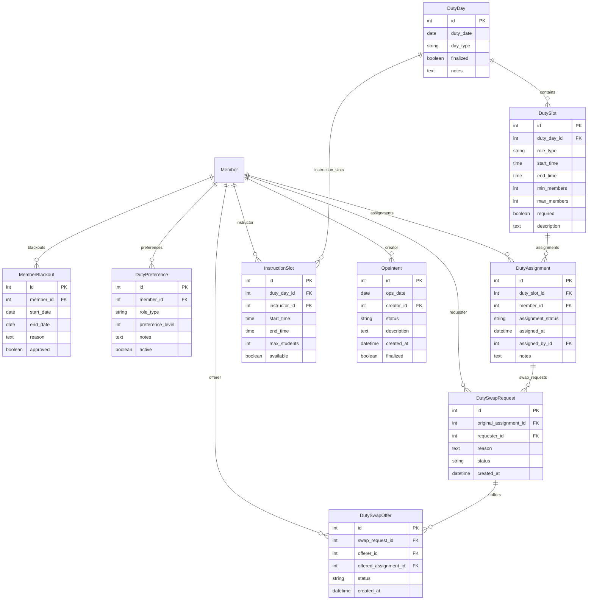

# Duty Roster App

[→ Duty Roster AppConfig (apps.py)](apps.md) | [→ Management Commands](management.md) | [→ Views](views.md)

## Database Schema

The **Duty Roster** app manages scheduling and assignments for Duty Officers (DO), Assistant Duty Officers (ADO), and other operational roles. It integrates with members, logsheet, and notification systems to ensure smooth club operations.

- **Audience:** authenticated members (view), rostermeisters/admins (edit)
- **Route:** `/duty_roster/`
- **Nav:** included via the main navbar.

---

## Quick Start

1. Log in as a member or rostermeister.
2. Visit `/duty_roster/` to view your assignments or the full calendar.
3. Rostermeisters can generate, edit, or publish rosters via the admin or web interface.

---

## Pages & Permissions

- `duty_roster.views.duty_calendar` (all members, calendar view)
- `duty_roster.views.blackout_manage` (members, manage blackout dates)
- `duty_roster.views.propose_roster` (rostermeisters, propose/generate roster)
- `duty_roster.views.duty_list` (all members, list view)
- `duty_roster.views.duty_detail` (all members, assignment detail)

---

## URL Patterns

- `/duty_roster/` – calendar view
- `/duty_roster/blackout/` – manage blackout dates
- `/duty_roster/propose/` – propose/generate roster (rostermeister only)
- `/duty_roster/list/` – list of all assignments
- `/duty_roster/<pk>/` – assignment detail

---

## Core Models

- **DutyAssignment**: assignment of a member to a DO/ADO role on a specific date
- **BlackoutDate**: member-submitted unavailable dates
- **DutyRoster**: a published or draft roster for a period
- **DutyRole**: defines roles (DO, ADO, etc.)

---

## Implementation Notes

- **Templates:** `templates/duty_roster/` (calendar, list, blackout, propose)
- **Models:** `duty_roster/models.py` (see database schema above)
- **Admin:** all core models are editable via Django admin
- **Permissions:** only rostermeisters can generate or edit rosters; all can view
- **Roster Generation:** see `duty_roster/roster_generator.py` for logic

---

## See Also
- [AppConfig](apps.md)
- [Management Commands](management.md)
- [Views](views.md)
