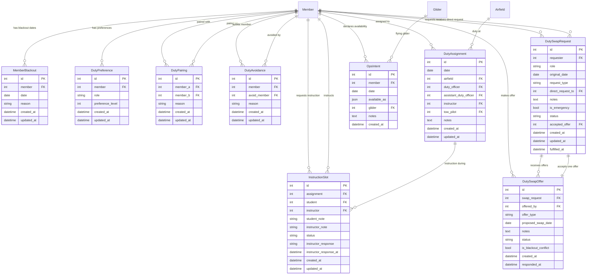

# Duty Roster Models

**App:** `duty_roster`
**File:** `duty_roster/models.py`

## Overview

The Duty Roster app manages operational crew assignments, member availability, duty preferences, and instruction scheduling for the soaring club. It coordinates with the `members` and `logsheet` apps to ensure safe, efficient operations.

## Entity Relationship Diagram

## Models

### MemberBlackout

**Purpose:** Tracks dates when members are unavailable for duty assignments.

**Key Features:**
- Prevents roster generator from assigning duties on specific dates
- Member-specified reasons for unavailability (vacation, medical, etc.)
- Used in duty roster generation algorithm

**Fields:**
- `member` (FK to Member): The member who is unavailable
- `date` (Date): The specific date of unavailability
- `reason` (CharField): Optional reason for the blackout
- `created_at`, `updated_at`: Audit timestamps

**Usage:**
Members declare blackout dates through the duty roster UI. The roster generator respects these constraints when making assignments.

---

### DutyPreference

**Purpose:** Stores member preferences for specific duty roles.

**Key Features:**
- Preference levels (0-10 scale) for each role type
- Influences roster generator's assignment decisions
- Helps balance member satisfaction with operational needs

**Fields:**
- `member` (FK to Member): The member expressing preference
- `role` (CharField): Role key (DO, ADO, INSTRUCTOR, TOW)
- `preference_level` (IntegerField): 0-10 scale (0=avoid, 10=prefer)
- `created_at`, `updated_at`: Audit timestamps

**Choices:**
- Roles: Duty Officer (DO), Assistant Duty Officer (ADO), Instructor (INSTRUCTOR), Tow Pilot (TOW)

**Usage:**
Members set preferences through their profile. Roster generator uses these as soft constraints to optimize assignments.

---

### DutyPairing

**Purpose:** Defines requested pairings between members for duty assignments.

**Key Features:**
- Bidirectional relationship between two members
- Reason field to document why pairing is beneficial
- Roster generator attempts to honor pairings when possible

**Fields:**
- `member_a` (FK to Member): First member in pairing
- `member_b` (FK to Member): Second member in pairing
- `reason` (TextField): Explanation for the pairing request
- `created_at`, `updated_at`: Audit timestamps

**Constraints:**
- `unique_together`: Ensures only one pairing record per member combination

**Usage:**
Members can request to be paired with specific members (e.g., mentor/mentee, preferred working relationships). Roster generator treats this as a soft constraint.

---

### DutyAvoidance

**Purpose:** Documents member requests to avoid being scheduled with specific other members.

**Key Features:**
- Allows members to request non-assignment with another member
- Reason field for documentation
- Roster generator respects these as hard constraints

**Fields:**
- `member` (FK to Member): The member requesting the avoidance
- `avoid_member` (FK to Member): The member to avoid being scheduled with
- `reason` (TextField): Explanation for the avoidance request
- `created_at`, `updated_at`: Audit timestamps

**Constraints:**
- `unique_together`: Ensures only one avoidance record per member pair

**Usage:**
Members can request to not be scheduled with specific members. This is treated as a hard constraint by the roster generator to maintain harmonious operations.

---

### DutyAssignment

**Purpose:** Represents the complete duty roster for a single operational day at a specific airfield.

**Key Features:**
- Assigns all critical roles for operational day (DO, ADO, Instructor, Tow Pilot)
- Links to airfield for multi-site operations
- Related to instruction slots scheduled for that day
- Central model for daily operations coordination

**Fields:**
- `date` (Date): The operational date
- `airfield` (FK to Airfield): The airfield for this assignment
- `duty_officer` (FK to Member): Assigned Duty Officer
- `assistant_duty_officer` (FK to Member): Assigned Assistant Duty Officer
- `instructor` (FK to Member): Assigned Instructor
- `tow_pilot` (FK to Member): Assigned Tow Pilot
- `notes` (TextField): Additional notes or special instructions
- `created_at`, `updated_at`: Audit timestamps

**Constraints:**
- `unique_together`: One assignment per date/airfield combination

**Related Models:**
- `InstructionSlot` (reverse FK): Instruction requests for this duty day

**Usage:**
Created by roster generator or manually by Duty Officers. Viewed by members to see their upcoming assignments. Updated through duty swap system when coverage is needed.

---

### InstructionSlot

**Purpose:** Manages instruction requests and assignments for specific duty days.

**Key Features:**
- Student requests instruction for a specific duty day
- Instructor can accept or reject requests
- Tracks status workflow (requested → confirmed/cancelled)
- Links to specific DutyAssignment for coordination

**Fields:**
- `assignment` (FK to DutyAssignment): The duty day for instruction
- `student` (FK to Member): Student requesting instruction
- `instructor` (FK to Member): Instructor assigned (null until accepted)
- `student_note` (TextField): Student's note about their request
- `instructor_note` (TextField): Instructor's response note
- `status` (CharField): Current status (requested, confirmed, cancelled)
- `instructor_response` (CharField): Instructor's decision (null, accepted, rejected)
- `instructor_response_at` (DateTime): When instructor responded
- `created_at`, `updated_at`: Audit timestamps

**Choices:**
- Status: requested, confirmed, cancelled
- Instructor Response: null (pending), accepted, rejected

**Constraints:**
- `unique_together`: One request per student per duty day

**Methods:**
- `accept(instructor, note)`: Instructor accepts the request
- `reject(note)`: Instructor rejects the request

**Workflow:**
1. Student creates instruction request (status=requested)
2. Instructor reviews and accepts/rejects
3. On accept: instructor assigned, status=confirmed
4. On reject: status=cancelled with note

**Usage:**
Students request instruction through the duty roster UI. Instructors see pending requests and can accept/reject. Used to coordinate instruction activities with operational duty assignments.

---

### DutySwapRequest

**Purpose:** Manages requests from duty crew members who need coverage for their assigned duties.

**Key Features:**
- General broadcast (all eligible members) or direct request (specific member)
- Emergency flag for urgent situations (IMSAFE, medical)
- Status workflow (open → fulfilled/cancelled/expired)
- Urgency calculation based on days until duty
- Critical role identification (Tow Pilot, DO)

**Fields:**
- `requester` (FK to Member): Member requesting the swap
- `role` (CharField): Role needing coverage (DO, ADO, INSTRUCTOR, TOW)
- `original_date` (Date): The duty date needing coverage
- `request_type` (CharField): "general" or "direct"
- `direct_request_to` (FK to Member): Target member for direct requests
- `notes` (TextField): Reason for needing coverage
- `is_emergency` (Boolean): Urgent request flag
- `status` (CharField): Current status (open, fulfilled, cancelled, expired)
- `accepted_offer` (OneToOne to DutySwapOffer): The accepted offer (if fulfilled)
- `created_at`, `updated_at`: Audit timestamps
- `fulfilled_at` (DateTime): When an offer was accepted

**Choices:**
- Roles: Duty Officer (DO), Assistant Duty Officer (ADO), Instructor (INSTRUCTOR), Tow Pilot (TOW)
- Request Types: general, direct
- Status: open, fulfilled, cancelled, expired

**Methods:**
- `get_role_title()`: Gets display title from SiteConfiguration
- `is_critical_role()`: Returns True for Tow Pilot or DO
- `days_until_duty()`: Calculates days remaining until duty date
- `get_urgency_level()`: Returns urgency (normal, soon, urgent, emergency)

**Urgency Levels:**
- **emergency**: `is_emergency=True` OR < 3 days until duty
- **urgent**: 3-7 days until duty
- **soon**: 8-14 days until duty
- **normal**: > 14 days until duty

**Workflow:**
1. Member sees assignment, clicks "Request Swap" (status=open)
2. Request sent to eligible members (general) or specific member (direct)
3. Members make offers (DutySwapOffer)
4. Requester accepts an offer → status=fulfilled
5. If no offers by duty date → status=expired

**Usage:**
Provides self-service duty coverage mechanism. Members handle their own swaps/coverage requests. Emergency requests get higher visibility. Critical roles (Tow Pilot, DO) escalate to Duty Officer if unfulfilled.

---

### DutySwapOffer

**Purpose:** Represents an offer from a member to help with a duty swap request.

**Key Features:**
- Two offer types: cover (take requester's shift) or swap (exchange shifts)
- Blackout conflict detection for swap proposals
- Status workflow (pending → accepted/declined/auto_declined/withdrawn)
- Auto-decline other offers when one is accepted

**Fields:**
- `swap_request` (FK to DutySwapRequest): The request being responded to
- `offered_by` (FK to Member): Member making the offer
- `offer_type` (CharField): "cover" or "swap"
- `proposed_swap_date` (Date): Date offerer wants requester to take (swap only)
- `notes` (TextField): Optional note about the offer
- `status` (CharField): Current status
- `is_blackout_conflict` (Boolean): True if proposed date conflicts with requester's blackout
- `created_at`: When offer was made
- `responded_at` (DateTime): When requester responded

**Choices:**
- Offer Types: cover, swap
- Status: pending, accepted, declined, auto_declined, withdrawn

**Methods:**
- `check_blackout_conflict()`: Checks if proposed swap date is in requester's blackout
- `save()`: Auto-checks blackout conflict before saving

**Workflow:**
1. Member sees open swap request
2. Member creates offer (cover or swap with proposed date)
3. System checks for blackout conflicts (swap offers only)
4. Requester reviews offers, accepts one
5. Accepted offer triggers duty assignment updates
6. Other pending offers auto-decline

**Usage:**
Members respond to swap requests by making offers. Cover offers are simpler (just take the shift). Swap offers require proposing a date for requester to cover in return. System prevents swap proposals that conflict with requester's blackout dates.

---

### OpsIntent

**Purpose:** Captures member availability and operational intentions for specific dates.

**Key Features:**
- Multi-select activities (instruction, club glider, private glider, tow pilot, glider pilot)
- Optional glider specification
- Free-form notes for additional context
- Used for operational planning and resource allocation

**Fields:**
- `member` (FK to Member): Member declaring availability
- `date` (Date): The operational date
- `available_as` (JSONField): List of activity keys
- `glider` (FK to Glider): Specific glider member plans to fly (optional)
- `notes` (TextField): Additional notes about availability
- `created_at`: When intent was declared

**Activity Choices:**
- instruction: Instruction
- club: Club glider
- private: Private glider
- towpilot: Tow Pilot
- glider_pilot: Glider Pilot

**Constraints:**
- `unique_together`: One intent record per member per date

**Methods:**
- `available_as_labels()`: Returns human-friendly labels for stored activity keys

**Usage:**
Members declare their operational intent for upcoming flying days. Helps Duty Officers and Operations team plan resources, coordinate instruction, and ensure adequate tow pilot coverage. Provides visibility into expected operational tempo.

---

## Integration Notes

### Cross-App Dependencies
- **members.Member**: Central user model for all duty roster relationships
- **logsheet.Airfield**: Links duty assignments to specific operating locations
- **logsheet.Glider**: Links ops intent to specific aircraft
- **siteconfig.SiteConfiguration**: Provides role display titles via `get_role_title()`

### Related Systems
- **Roster Generator** (`roster_generator.py`): Uses MemberBlackout, DutyPreference, DutyPairing, DutyAvoidance to generate optimal duty assignments
- **Duty Swap System**: Coordinates DutySwapRequest and DutySwapOffer to enable member-driven coverage solutions
- **Instruction Coordination**: InstructionSlot links student requests to operational duty days
- **Notifications**: CronJob system sends reminders for upcoming duties, swap requests, instruction confirmations

### Data Flow
1. Members set preferences, blackouts, pairings → Roster Generator creates DutyAssignments
2. Students request instruction → InstructionSlots linked to DutyAssignments
3. Members need coverage → DutySwapRequests → DutySwapOffers → DutyAssignment updates
4. Members declare intent → OpsIntent provides operational planning visibility

## See Also
- [Duty Roster README](../README.md) - Overview and usage
- [Roster Generator](management.md) - Automated roster generation
- [Views Documentation](views.md) - UI and workflows
- [Workflows: Duty Operations](../../docs/workflows/duty-operations.md) - Business processes
