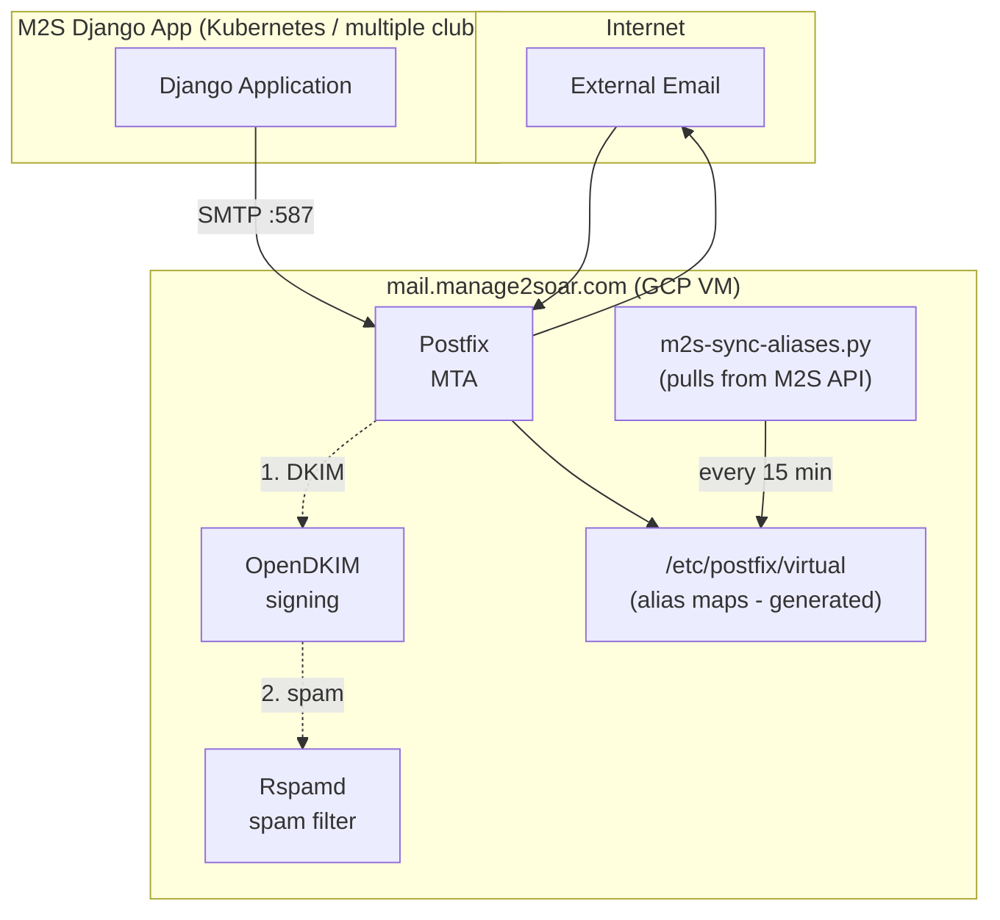

# Infrastructure

This directory contains Ansible playbooks and configuration for Manage2Soar infrastructure.

## Deployment Options

| Option | Description | Documentation |
|--------|-------------|---------------|
| **GCP Database** | Dedicated PostgreSQL server on GCP | [docs/gcp-database-deployment.md](docs/gcp-database-deployment.md) |
| **Single-Host** | All-in-one server deployment | [docs/single-host-architecture.md](docs/single-host-architecture.md) |
| **Mail Server** | Dedicated mail server with mailing lists | This document (below) |

## Structure

```
infrastructure/
├── ansible/
│   ├── ansible.cfg              # Ansible configuration
│   ├── inventory/
│   │   ├── hosts.yml.example    # Template - copy to hosts.yml
│   │   ├── gcp_database.yml.example  # GCP database inventory template
│   │   └── hosts.yml            # GITIGNORED - your actual inventory
│   ├── group_vars/
│   │   ├── all.yml.example      # Template - copy to all.yml
│   │   ├── gcp_database.*.example    # GCP database config templates
│   │   └── all.yml              # GITIGNORED - your actual variables
│   ├── playbooks/
│   │   ├── gcp-database.yml     # GCP database server playbook
│   │   ├── single-host.yml      # Single-host deployment playbook
│   │   └── mail-server.yml      # Mail server playbook
│   └── roles/
│       ├── common/              # Base system setup
│       ├── gcp-vm/              # GCP VM provisioning
│       ├── postgresql/          # PostgreSQL database
│       ├── m2s-app/             # Django/Gunicorn application
│       ├── nginx/               # NGINX reverse proxy
│       ├── postfix/             # Postfix MTA
│       ├── opendkim/            # DKIM signing
│       ├── rspamd/              # Spam filtering
│       └── m2s-mail-sync/       # M2S alias sync script
├── scripts/
│   ├── setup-admin-ubuntu.sh        # Setup admin workstation (Ubuntu/Debian)
│   ├── setup-admin-homebrew.sh      # Setup admin workstation (macOS)
│   ├── setup-dev.sh                 # Setup development environment
│   ├── generate-db-password.sh      # Generate secure DB password
│   ├── generate-django-secret.sh    # Generate Django SECRET_KEY
│   └── initialize-vault-secrets.sh  # Initialize all secrets
├── docs/
│   ├── gcp-database-deployment.md   # GCP database documentation
│   └── single-host-architecture.md  # Single-host documentation
└── README.md
```

## Security

**NEVER commit secrets to this repository!**

The following files are gitignored and must be created manually:
- `ansible/inventory/hosts.yml` - Your actual inventory with IPs
- `ansible/inventory/gcp_database.yml` - GCP database inventory
- `ansible/group_vars/all.yml` - Your actual variables with passwords
- `ansible/group_vars/gcp_database/` - GCP database configuration
- Any `*.vault.yml` files - Ansible Vault encrypted files
- Any `*.json` files in ansible/ - GCP service account keys

### Secret Generation

Use the provided scripts to generate secure secrets:

```bash
# Generate a database password
./scripts/generate-db-password.sh

# Generate a Django SECRET_KEY
./scripts/generate-django-secret.sh

# Initialize all secrets with Ansible Vault encryption
./scripts/initialize-vault-secrets.sh group_vars/gcp_database/vault.yml
```

## Quick Start

1. **Copy example files:**
   ```bash
   cd infrastructure/ansible
   cp inventory/hosts.yml.example inventory/hosts.yml
   cp group_vars/all.yml.example group_vars/all.yml
   ```

2. **Edit with your values:**
   ```bash
   vim inventory/hosts.yml      # Add your server IPs
   vim group_vars/all.yml       # Add passwords, domains, etc.
   ```

3. **Run the playbook:**
   ```bash
   ansible-playbook playbooks/mail-server.yml
   ```

## Mail Server Architecture



## Spam Filtering (Rspamd)

Rspamd provides spam filtering for incoming mailing list traffic:

- **Milter integration**: Scans mail during SMTP, rejects spam before accepting
- **Whitelist bypass**: Club members (synced from M2S API) skip all spam checks
- **Hard reject**: Spam is rejected during SMTP (score 15+), no bounces generated
- **Auto-updates**: Rules update automatically via Rspamd's built-in updater

### How it works

1. External email arrives at Postfix
2. Postfix calls Rspamd milter (port 11332)
3. Rspamd checks sender against per-club whitelist (`/etc/rspamd/local.d/whitelists/{club}_whitelist.map`)
4. If whitelisted AND recipient matches club domain → bypass all checks, return OK
5. If not whitelisted → full spam scan
6. Score 15+ → REJECT during SMTP
7. Score 6-15 → Accept with X-Spam-Status header
8. Score <6 → Clean pass

### Multi-Tenant Whitelist Isolation

Each club has its own whitelist file that **only applies to mail destined for that club's domain**. This prevents a malicious club admin from whitelisting spammers that could affect other clubs.

```
/etc/rspamd/local.d/whitelists/
├── ssc_whitelist.map      # Only applies to *@ssc.manage2soar.com
├── masa_whitelist.map     # Only applies to *@masa.manage2soar.com
└── ...
```

The whitelist rule uses `rcpt` matching to scope each whitelist:
- `ssc_whitelist.map` → only bypasses spam checks for mail TO `@ssc.manage2soar.com`
- `masa_whitelist.map` → only bypasses spam checks for mail TO `@masa.manage2soar.com`

### Monitoring

```bash
# View Rspamd stats
rspamc stat

# Check Rspamd logs
journalctl -u rspamd -f

# Test spam detection
rspamc < /path/to/test-email.eml

# View per-club whitelist
cat /etc/rspamd/local.d/whitelists/ssc_whitelist.map
```

## Multi-Tenant Architecture

The mail server supports multiple clubs (tenants), each with:
- Separate email domain (`{club}.manage2soar.com`)
- Independent mailing lists
- Isolated spam whitelists
- Optional per-club API authentication

## Development Mode (Safety Valve)

During development and testing, you can redirect **all** mailing list recipients to a single email address. This prevents accidentally sending emails to real club members.

### Enable Dev Mode

**⚠️ Check your current settings first!** In production environments, this should always be `false`.

In `group_vars/all.yml`:

```yaml
# Development mode - redirect all mailing list recipients
dev_mode_enabled: true
dev_mode_redirect_to: "developer@example.com"
```

### How It Works

When dev mode is enabled:
1. The sync script fetches real member lists from M2S API (as normal)
2. Instead of writing real recipients to virtual aliases, it writes only your dev email
3. All mailing list emails go to your dev address instead of real members

Example virtual alias output in dev mode:
```
# *** DEV MODE ENABLED ***
# All mailing list recipients redirected to: developer@example.com

# --- ssc.manage2soar.com ---
# Original recipients (45): alice@gmail.com,bob@yahoo.com,carol@...
members@ssc.manage2soar.com  developer@example.com
# Original recipients (8): alice@gmail.com,david@outlook.com,eve@...
instructors@ssc.manage2soar.com  developer@example.com
```

### Disable for Production

**⚠️ WARNING**: Always disable dev mode for production!

```yaml
dev_mode_enabled: false
dev_mode_redirect_to: ""
```

Then redeploy with `ansible-playbook playbooks/mail-server.yml --tags sync`.

### Pre-Deployment Checklist

Before deploying to production, verify:

1. **Check dev mode is disabled**: `grep dev_mode_enabled group_vars/all.yml`
2. **Verify configuration**: Run `ansible-playbook playbooks/mail-server.yml --check --diff`
3. **Test sync manually**: SSH to mail server and run `/opt/m2s-mail-sync/sync-aliases.py`
4. **Verify aliases**: Check `/etc/postfix/virtual` contains real recipients, not dev email

### Per-Club API Keys

For stronger tenant isolation, each club can have its own API key:

```yaml
# group_vars/all.yml
club_domains:
  - prefix: "ssc"
    name: "Skyline Soaring Club"
    api_url: "https://ssc.manage2soar.com/api/email-lists/"
    auth_token: "SSC_SPECIFIC_KEY_HERE"  # Optional

  - prefix: "masa"
    name: "Mid-Atlantic Soaring Association"
    api_url: "https://masa.manage2soar.com/api/email-lists/"
    auth_token: "MASA_SPECIFIC_KEY_HERE"  # Optional

# Default key used if club doesn't have its own auth_token
m2s_api_key: "DEFAULT_FALLBACK_KEY"
```

## Supported Domains

Each club gets a subdomain under manage2soar.com:
- `ssc.manage2soar.com` - Skyline Soaring Club
- `masa.manage2soar.com` - Mid-Atlantic Soaring Association
- etc.

Each subdomain has:
- DKIM key pair
- SPF record
- DMARC policy
- Virtual aliases for mailing lists

## DNS Records Required

For each club subdomain (e.g., `ssc.manage2soar.com`):

```dns
; MX record
ssc.manage2soar.com.  IN  MX  10 mail.manage2soar.com.

; SPF record
ssc.manage2soar.com.  IN  TXT "v=spf1 mx a:mail.manage2soar.com -all"

; DKIM record (selector: mail)
mail._domainkey.ssc.manage2soar.com.  IN  TXT "v=DKIM1; k=rsa; p=<public-key>"

; DMARC policy
_dmarc.ssc.manage2soar.com.  IN  TXT "v=DMARC1; p=quarantine; rua=mailto:dmarc@manage2soar.com"
```

## Mailing Lists per Club

Each club automatically gets these lists:
- `members@{club}.manage2soar.com` - All active members
- `instructors@{club}.manage2soar.com` - Members with is_instructor=True
- `towpilots@{club}.manage2soar.com` - Members with is_towpilot=True  
- `board@{club}.manage2soar.com` - Members with is_board_member=True

Lists are **whitelist-only** - only club members can send to them.

## SMTP Relay (SMTP2GO)

GCP blocks outbound port 25 (SMTP) by default to prevent spam. To enable outbound email delivery, we use SMTP2GO as a relay service.

### Why SMTP2GO?

- **GCP Port 25 Block**: Google Cloud blocks outbound SMTP on port 25 for all VMs
- **Reputation**: SMTP2GO has established IP reputation for better deliverability
- **Monitoring**: Provides delivery logs and bounce handling

### Configuration

The mail server uses SMTP2GO as a smarthost relay on port 587:

```
# In Postfix main.cf
relayhost = [mail.smtp2go.com]:587
smtp_sasl_auth_enable = yes
smtp_sasl_password_maps = hash:/etc/postfix/sasl_passwd
```

### Required Credentials

Store SMTP2GO credentials in `group_vars/all.yml`:
```yaml
smtp2go_username: "your-smtp2go-username"
smtp2go_password: "your-smtp2go-password"
```

These are written to `/etc/postfix/sasl_passwd` (mode 600) during deployment.

## Django Email Configuration

The M2S Django application connects to the mail server on port 587 with SASL authentication.

### Required Environment Variables

Configure these in your Django `.env` file or Kubernetes secrets:

```bash
EMAIL_HOST=mail.manage2soar.com
EMAIL_PORT=587
EMAIL_USE_TLS=True
EMAIL_HOST_USER=<username>@manage2soar.com   # Full username with domain
EMAIL_HOST_PASSWORD=<password>
EMAIL_DEV_MODE=false                          # Set true to redirect all emails
EMAIL_DEV_MODE_REDIRECT_TO=                   # Only needed if EMAIL_DEV_MODE=true
```

**Important:** The `EMAIL_HOST_USER` must include the full domain suffix (e.g., `m2s-app@manage2soar.com`), not just the username.

### Kubernetes Secrets

For GKE deployments:

```bash
kubectl patch secret manage2soar-env --patch='{"stringData":{
  "EMAIL_HOST":"mail.manage2soar.com",
  "EMAIL_PORT":"587",
  "EMAIL_USE_TLS":"True",
  "EMAIL_HOST_USER":"<username>@manage2soar.com",
  "EMAIL_HOST_PASSWORD":"<password>",
  "EMAIL_DEV_MODE":"false",
  "EMAIL_DEV_MODE_REDIRECT_TO":""
}}'
kubectl rollout restart deployment/django-app
```

### Testing Email

```bash
# From Django pod
kubectl exec -it deployment/django-app -- python manage.py sendtestemail your@email.com
```

### Architecture Notes

The SASL authentication uses `auxprop` with `sasldb` (not `saslauthd`) because:
- Postfix runs in a chroot at `/var/spool/postfix`
- The sasldb file is copied into the chroot at `/var/spool/postfix/etc/sasldb2`
- This avoids socket access issues between the chroot and saslauthd

Similarly, the OpenDKIM socket is placed inside the Postfix chroot at `/var/spool/postfix/opendkim/opendkim.sock`.
