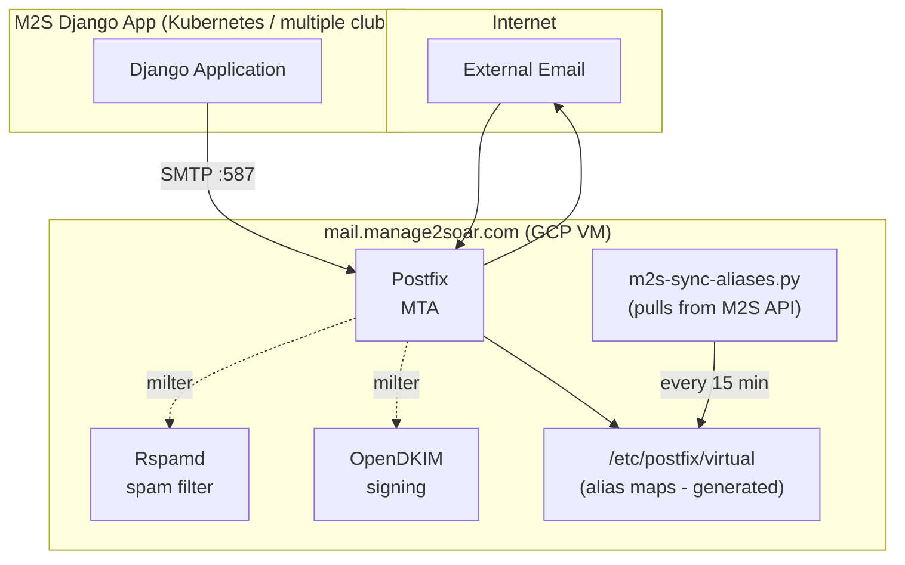

# Infrastructure

This directory contains Ansible playbooks and configuration for Manage2Soar infrastructure.

## Structure

```
infrastructure/
├── ansible/
│   ├── ansible.cfg              # Ansible configuration
│   ├── inventory/
│   │   ├── hosts.yml.example    # Template - copy to hosts.yml
│   │   └── hosts.yml            # GITIGNORED - your actual inventory
│   ├── group_vars/
│   │   ├── all.yml.example      # Template - copy to all.yml
│   │   └── all.yml              # GITIGNORED - your actual variables
│   ├── playbooks/
│   │   └── mail-server.yml      # Main mail server playbook
│   └── roles/
│       ├── common/              # Base system setup
│       ├── postfix/             # Postfix MTA
│       ├── opendkim/            # DKIM signing
│       ├── rspamd/              # Spam filtering
│       └── m2s-mail-sync/       # M2S alias sync script
└── README.md
```

## Security

**NEVER commit secrets to this repository!**

The following files are gitignored and must be created manually:
- `ansible/inventory/hosts.yml` - Your actual inventory with IPs
- `ansible/group_vars/all.yml` - Your actual variables with passwords
- Any `*.vault.yml` files - Ansible Vault encrypted files

## Quick Start

1. **Copy example files:**
   ```bash
   cd infrastructure/ansible
   cp inventory/hosts.yml.example inventory/hosts.yml
   cp group_vars/all.yml.example group_vars/all.yml
   ```

2. **Edit with your values:**
   ```bash
   vim inventory/hosts.yml      # Add your server IPs
   vim group_vars/all.yml       # Add passwords, domains, etc.
   ```

3. **Run the playbook:**
   ```bash
   ansible-playbook playbooks/mail-server.yml
   ```

## Mail Server Architecture



## Spam Filtering (Rspamd)

Rspamd provides spam filtering for incoming mailing list traffic:

- **Milter integration**: Scans mail during SMTP, rejects spam before accepting
- **Whitelist bypass**: Club members (synced from M2S API) skip all spam checks
- **Hard reject**: Spam is rejected during SMTP (score 15+), no bounces generated
- **Auto-updates**: Rules update automatically via Rspamd's built-in updater

### How it works

1. External email arrives at Postfix
2. Postfix calls Rspamd milter (port 11332)
3. Rspamd checks sender against whitelist (`/etc/rspamd/local.d/sender_whitelist.map`)
4. If whitelisted → bypass all checks, return OK
5. If not whitelisted → full spam scan
6. Score 15+ → REJECT during SMTP
7. Score 6-15 → Accept with X-Spam-Status header
8. Score <6 → Clean pass

### Monitoring

```bash
# View Rspamd stats
rspamadm stat

# Check Rspamd logs
journalctl -u rspamd -f

# Test spam detection
rspamc < /path/to/test-email.eml
```

## Supported Domains

Each club gets a subdomain under manage2soar.com:
- `ssc.manage2soar.com` - Skyline Soaring Club
- `masa.manage2soar.com` - Mid-Atlantic Soaring Association
- etc.

Each subdomain has:
- DKIM key pair
- SPF record
- DMARC policy
- Virtual aliases for mailing lists

## DNS Records Required

For each club subdomain (e.g., `ssc.manage2soar.com`):

```dns
; MX record
ssc.manage2soar.com.  IN  MX  10 mail.manage2soar.com.

; SPF record
ssc.manage2soar.com.  IN  TXT "v=spf1 mx a:mail.manage2soar.com -all"

; DKIM record (selector: mail)
mail._domainkey.ssc.manage2soar.com.  IN  TXT "v=DKIM1; k=rsa; p=<public-key>"

; DMARC policy
_dmarc.ssc.manage2soar.com.  IN  TXT "v=DMARC1; p=quarantine; rua=mailto:dmarc@manage2soar.com"
```

## Mailing Lists per Club

Each club automatically gets these lists:
- `members@{club}.manage2soar.com` - All active members
- `instructors@{club}.manage2soar.com` - Members with is_instructor=True
- `towpilots@{club}.manage2soar.com` - Members with is_towpilot=True  
- `board@{club}.manage2soar.com` - Members with is_board_member=True

Lists are **whitelist-only** - only club members can send to them.

## SMTP Relay (SMTP2GO)

GCP blocks outbound port 25 (SMTP) by default to prevent spam. To enable outbound email delivery, we use SMTP2GO as a relay service.

### Why SMTP2GO?

- **GCP Port 25 Block**: Google Cloud blocks outbound SMTP on port 25 for all VMs
- **Reputation**: SMTP2GO has established IP reputation for better deliverability
- **Monitoring**: Provides delivery logs and bounce handling

### Configuration

The mail server uses SMTP2GO as a smarthost relay on port 587:

```
# In Postfix main.cf
relayhost = [mail.smtp2go.com]:587
smtp_sasl_auth_enable = yes
smtp_sasl_password_maps = hash:/etc/postfix/sasl_passwd
```

### Required Credentials

Store SMTP2GO credentials in `group_vars/all.yml`:
```yaml
smtp2go_username: "your-smtp2go-username"
smtp2go_password: "your-smtp2go-password"
```

These are written to `/etc/postfix/sasl_passwd` (mode 600) during deployment.
