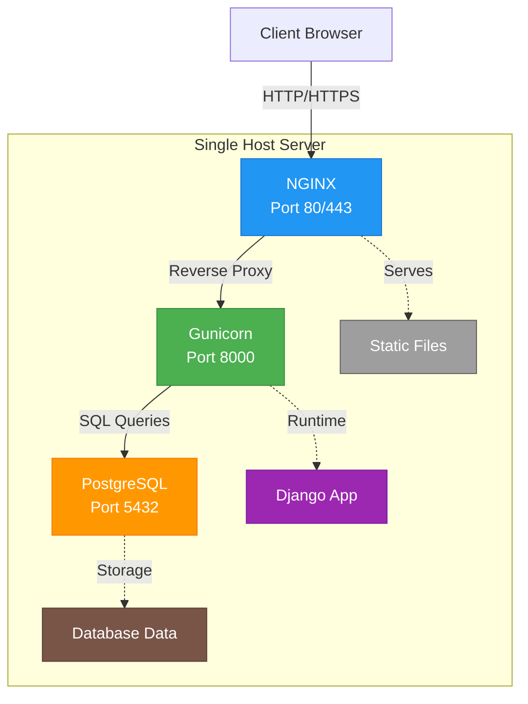

# Manage2Soar Ansible Deployment

This directory contains Ansible playbooks and roles for deploying Manage2Soar. Three deployment options are available:

| Deployment Type | Best For | Cost | Complexity |
|----------------|----------|------|------------|
| **[Single-Host](#single-host-deployment)** | Small-medium clubs, self-hosted | ~$12-24/month VPS | Low |
| **[GKE (Kubernetes)](docs/gke-deployment-guide.md)** | Large clubs, multi-tenant, high availability | ~$70-150/month | Medium |
| **[GKE Cluster Provisioning](docs/gke-cluster-provisioning-guide.md)** | Create new GKE clusters | See cluster costs | Low |

## Complete GKE Workflow

For GKE deployments, use these playbooks in order:

```bash
# Step 1: Provision GKE cluster (one-time)
ansible-playbook -i inventory/gcp_cluster.yml \
  playbooks/gcp-cluster-provision.yml

# Step 2: Deploy application to cluster
ansible-playbook -i inventory/gcp_app.yml \
  --vault-password-file ~/.ansible_vault_pass \
  playbooks/gcp-app-deploy.yml
```

---

# Single-Host Deployment

This section covers deploying a complete Manage2Soar instance on a single server. This is ideal for small to medium-sized soaring clubs that want a self-hosted solution.

## Architecture Overview



## System Requirements

### Recommended Server Specifications

#### Minimum Viable (Testing/Small Club <50 members)
- **RAM**: 2GB
- **CPU**: 1-2 cores
- **Disk**: 20GB
- **Notes**: Tight but functional. PostgreSQL defaults are tuned for this.

#### Recommended (Small-Medium Club 50-200 members)
- **RAM**: 4GB
- **CPU**: 2 cores
- **Disk**: 40GB
- **Notes**: Comfortable headroom for growth, multiple concurrent users, background tasks.

#### Comfortable (Medium-Large Club 200-500 members)
- **RAM**: 8GB
- **CPU**: 4 cores
- **Disk**: 80GB
- **Notes**: Handles peak usage (weekend operations), large datasets, analytics queries.

#### Component Memory Breakdown (4GB example)

| Component | RAM Usage | Notes |
|-----------|-----------|-------|
| Ubuntu 24.04 | ~500MB | Base OS |
| PostgreSQL | ~800MB | Shared buffers + cache |
| Gunicorn (3 workers) | ~600MB | 3×200MB per worker |
| NGINX | ~50MB | Minimal footprint |
| System buffer/cache | ~2GB | File caching, performance |
| **Total** | **~4GB** | |

#### Disk Space Breakdown

| Directory | Typical Size | Growth Rate |
|-----------|-------------|-------------|
| OS + packages | ~5GB | Static |
| Django app | ~500MB | Minimal |
| PostgreSQL data | 500MB-5GB | 1-2GB/year |
| Media uploads | 1-10GB | Varies by usage |
| Backups (7-day retention) | 3-20GB | ~7× daily size |
| Logs | 100MB-1GB | Rotated |
| **Recommended** | **40-80GB** | |

#### Performance Tuning for Larger Servers

If you allocate more RAM, update these in `group_vars/single_host/vars.yml`:

```yaml
# For 4GB RAM server
postgresql_shared_buffers: "512MB"        # 12.5% of RAM
postgresql_effective_cache_size: "3GB"    # 75% of RAM
postgresql_work_mem: "8MB"
m2s_gunicorn_workers: 5                   # (2 × 2 cores) + 1

# For 8GB RAM server
postgresql_shared_buffers: "1GB"          # 12.5% of RAM
postgresql_effective_cache_size: "6GB"    # 75% of RAM
postgresql_work_mem: "16MB"
m2s_gunicorn_workers: 9                   # (2 × 4 cores) + 1
```

#### Cloud VPS Cost Comparison

| Provider | Specs | Monthly Cost |
|----------|-------|--------------|
| DigitalOcean | 2GB / 1 CPU / 50GB | $12 |
| DigitalOcean | 4GB / 2 CPU / 80GB | $24 |
| Linode | 4GB / 2 CPU / 80GB | $24 |
| Hetzner | 4GB / 2 CPU / 80GB | €5 (~$5) |
| **GKE (comparison)** | **~$70-150/month** | |

## Quick Start

### Prerequisites

1. **Target Server**: Ubuntu 22.04 or 24.04 LTS with SSH access (see [System Requirements](#system-requirements) above)
2. **Control Machine**: Any machine with Ansible 2.10+ installed
3. **Domain Name**: A domain pointing to your server (for SSL)

### Step 1: Install Ansible

```bash
# On Ubuntu/Debian
pip install ansible

# Or using pipx (recommended)
pipx install ansible
```

### Step 2: Clone the Repository

```bash
git clone https://github.com/pietbarber/Manage2Soar.git
cd Manage2Soar/infrastructure/ansible
```

### Step 3: Configure Inventory

```bash
cp inventory/single_host.yml.example inventory/single_host.yml
```

Edit `inventory/single_host.yml`:

```yaml
all:
  hosts:
    m2s-server:
      ansible_host: your-server-ip-or-hostname
      ansible_user: your-ssh-user
```

### Step 4: Configure Variables

Create the variables directory:

```bash
mkdir -p group_vars/single_host
```

Copy and customize the variable files:

```bash
cp group_vars/single_host.vars.yml.example group_vars/single_host/vars.yml
# Edit vars.yml with your club's configuration
```

### Step 5: Set Up Encrypted Secrets (Vault)

Create a vault password file:

```bash
# Generate a strong password
openssl rand -base64 32 > ~/.ansible_vault_pass
chmod 600 ~/.ansible_vault_pass
```

Create the encrypted vault file:

```bash
ansible-vault create group_vars/single_host/vault.yml \
  --vault-password-file ~/.ansible_vault_pass
```

Add your secrets (the editor will open):

```yaml
---
ansible_become_password: "your-sudo-password"
vault_postgresql_password: "generate-strong-password"
vault_django_secret_key: "generate-50-char-secret"
```

Generate secure values:

```bash
# PostgreSQL password
openssl rand -base64 32

# Django secret key
python -c "from django.core.management.utils import get_random_secret_key; print(get_random_secret_key())"
```

### Step 6: Test Connection

```bash
ansible -i inventory/single_host.yml all -m ping \
  --vault-password-file ~/.ansible_vault_pass \
  -e "@group_vars/single_host/vault.yml"
```

### Step 7: Deploy

```bash
ansible-playbook -i inventory/single_host.yml \
  --vault-password-file ~/.ansible_vault_pass \
  -e "@group_vars/single_host/vault.yml" \
  -e "@group_vars/single_host/vars.yml" \
  playbooks/single-host.yml
```

## Directory Structure

```
infrastructure/ansible/
├── docs/
│   ├── gke-deployment-guide.md         # GKE app deployment documentation
│   └── gke-cluster-provisioning-guide.md  # GKE cluster provisioning docs
├── inventory/
│   ├── single_host.yml.example         # Single-host inventory template
│   ├── gcp_app.yml.example             # GKE app deployment inventory
│   └── gcp_cluster.yml.example         # GKE cluster provisioning inventory
├── group_vars/
│   ├── single_host/                    # Single-host config (gitignored)
│   │   ├── vars.yml                    # Non-secret variables
│   │   └── vault.yml                   # Encrypted secrets
│   ├── gcp_app/                        # GKE app config (gitignored)
│   │   ├── vars.yml                    # GCP/GKE variables
│   │   └── vault.yml                   # Encrypted secrets
│   ├── gcp_cluster/                    # GKE cluster config (gitignored)
│   │   ├── vars.yml                    # Cluster variables
│   │   └── vault.yml                   # Optional secrets
│   ├── single_host.vars.yml.example
│   ├── single_host.vault.yml.example
│   ├── gcp_app.vars.yml.example        # GKE app variables template
│   ├── gcp_app.vault.yml.example       # GKE app secrets template
│   ├── gcp_cluster.vars.yml.example    # GKE cluster variables template
│   └── gcp_cluster.vault.yml.example   # GKE cluster secrets template
├── playbooks/
│   ├── single-host.yml                 # Single-host deployment
│   ├── gcp-app-deploy.yml              # GKE app deployment
│   ├── gcp-cluster-provision.yml       # GKE cluster provisioning
│   ├── test-postgresql.yml             # PostgreSQL testing
│   ├── test-nginx.yml                  # NGINX testing
│   └── test-m2s-app.yml                # Application testing
└── roles/
    ├── gke-deploy/                     # GKE deployment role
    ├── postgresql/                     # Database role
    ├── nginx/                          # Web server role
    ├── m2s-app/                        # Django application role
    ├── postfix/                        # Mail server (optional)
    ├── opendkim/                       # DKIM signing (optional)
    └── rspamd/                         # Spam filtering (optional)
```

## Roles

### postgresql

Installs and configures PostgreSQL 17:
- Creates M2S database and user
- Configures performance settings
- Sets up automated daily backups
- Enables logrotate

### nginx

Configures NGINX as reverse proxy:
- Optional Let's Encrypt SSL (certbot)
- Rate limiting and security headers
- Gzip compression
- Static and media file serving

### m2s-app

Deploys the Django application:
- Git-based deployment from repository
- Python virtual environment
- Gunicorn WSGI server with systemd
- Automated migrations and collectstatic
- Environment file configuration

### postfix (optional)

Installs and configures Postfix mail server:
- Send-only MTA for transactional emails
- SASL authentication support (for future use)
- TLS encryption for outbound mail
- Optional SMTP relay support (for cloud providers that block port 25)

### opendkim (optional)

Configures DKIM email signing:
- Automatic key generation
- Integration with Postfix
- Outputs DNS record requirements

### rspamd (optional)

Spam filtering for inbound mail:
- Only enabled if `mail_server_receive_enabled: true`
- Redis-backed for rate limiting and history
- Milter integration with Postfix for inbound mail only (no effect on send-only outbound mail)

## Mail Server Configuration

Enable mail server functionality by setting `mail_server_enabled: true` in your `vars.yml`.

### Basic Setup (Sending Only)

For most clubs, you only need to send transactional emails (notifications, password resets):

```yaml
# group_vars/single_host/vars.yml
mail_server_enabled: true
mail_hostname: "{{ m2s_domain }}"
mail_domain: "{{ m2s_domain }}"
```

Add the SMTP password to your vault:

```yaml
# group_vars/single_host/vault.yml
vault_smtp_password: "generate-with-openssl-rand"
```

**NOTE**: The `vault_smtp_password` is used by Postfix for SASL authentication when relaying to external SMTP servers (see "Using an SMTP Relay" below). Django sends mail unauthenticated to `localhost:25`, and Postfix handles all authentication for external relays.
### DNS Records Required

After deployment, add these DNS records:

#### SPF Record
```
Type: TXT
Name: @ (or your domain)
Value: v=spf1 a mx ip4:YOUR-SERVER-IP ~all
```

#### DKIM Record
The playbook will output the DKIM record path. Get the value with:
```bash
ssh your-server
# Keys are stored in {club_prefix}.{mail_domain} format due to multi-tenant OpenDKIM role
# Example: if club_prefix=msc and mail_domain=mountainsoaring.org:
cat /etc/opendkim/keys/msc.mountainsoaring.org/default.txt
```

**IMPORTANT**: Despite the directory structure using `{club_prefix}.{mail_domain}`,
your mail is sent FROM your actual `mail_domain` (e.g., m2s.yourclub.com), NOT from
a prefixed subdomain. The OpenDKIM role correctly signs emails for `mail_domain`.
Your DNS records should use `mail_domain` only, not `club_prefix.mail_domain`.

This directory structure exists to support multi-tenant hosting where multiple clubs
share one mail server. For single-host deployments, there will be one directory.

Add as TXT record:
```
Type: TXT
Name: default._domainkey
Value: (paste content from file)
```

#### DMARC Record (Recommended)
```
Type: TXT
Name: _dmarc
Value: v=DMARC1; p=quarantine; rua=mailto:postmaster@yourdomain.com
```

### Using an SMTP Relay

Some cloud providers (GCP, Azure, AWS) block outbound port 25. Use an SMTP relay service:

```yaml
# group_vars/single_host/vars.yml
mail_server_enabled: true
smtp_relay_host: "mail.smtp2go.com"
smtp_relay_port: 587

# group_vars/single_host/vault.yml
vault_smtp_relay_username: "your-smtp2go-username"
vault_smtp_relay_password: "your-smtp2go-password"
```

Popular relay services:
- **SMTP2GO**: Good free tier, reliable
- **SendGrid**: 100 emails/day free
- **Mailgun**: Developer-friendly
- **Amazon SES**: Low cost at scale

### Testing Mail Delivery

After deployment, test with:

```bash
ssh your-server
echo "Test email from M2S" | mail -s "Test" your-email@example.com
```

Check delivery at [mail-tester.com](https://www.mail-tester.com) for spam score.

### Django Email Configuration

The deployment automatically configures Django to use the local Postfix server:

```yaml
# Automatically set in .env
EMAIL_BACKEND: django.core.mail.backends.smtp.EmailBackend
EMAIL_HOST: localhost
EMAIL_PORT: 25  # Django sends to local Postfix without authentication
EMAIL_USE_TLS: false  # No TLS for localhost - Postfix handles outbound TLS
```

**Note**: Django sends mail to the local Postfix server without authentication (localhost:25).
Postfix then handles:
- DKIM signing via OpenDKIM milter (configured automatically by the opendkim role tasks)
- TLS encryption for outbound delivery
- Optional SMTP relay authentication (if configured with `smtp_relay_host`)

## Configuration Reference

### Essential Variables (vars.yml)

| Variable | Description | Example |
|----------|-------------|---------|
| `club_name` | Your club's name | `"Mountain Soaring Club"` |
| `club_prefix` | Short prefix | `"msc"` |
| `m2s_domain` | Domain name | `"m2s.mountainsoaring.org"` |
| `postgresql_database` | Database name | `"m2s"` |
| `postgresql_user` | Database user | `"m2s"` |
| `nginx_ssl_enabled` | Enable HTTPS | `true` |
| `letsencrypt_email` | Email for certificates | `"admin@club.org"` |
| `mail_server_enabled` | Enable Postfix | `false` |
| `mail_hostname` | Mail server FQDN | `"{{ m2s_domain }}"` |
| `smtp_relay_host` | External relay | `"mail.smtp2go.com"` |

### Secret Variables (vault.yml)

| Variable | Description |
|----------|-------------|
| `ansible_become_password` | Sudo password |
| `vault_postgresql_password` | Database password |
| `vault_django_secret_key` | Django secret key |
| `vault_google_oauth_client_id` | Google OAuth (optional) |
| `vault_google_oauth_client_secret` | Google OAuth (optional) |
| `vault_smtp_password` | Local SMTP auth (if mail enabled) |
| `vault_smtp_relay_username` | Relay username (if using relay) |
| `vault_smtp_relay_password` | Relay password (if using relay) |

## Post-Deployment

### Create Django Superuser

```bash
ssh your-server
sudo -u m2s /opt/m2s/venv/bin/python /opt/m2s/app/manage.py createsuperuser
```

### View Logs

```bash
# Gunicorn/Django
journalctl -u gunicorn -f

# NGINX
tail -f /var/log/nginx/access.log

# Application
tail -f /var/log/m2s/django.log
```

### Service Management

```bash
# Restart application
sudo systemctl restart gunicorn

# Restart web server
sudo systemctl restart nginx

# Check status
sudo systemctl status gunicorn nginx postgresql
```

## Updating the Application

To update to the latest version:

```bash
ansible-playbook -i inventory/single_host.yml \
  --vault-password-file ~/.ansible_vault_pass \
  -e "@group_vars/single_host/vault.yml" \
  -e "@group_vars/single_host/vars.yml" \
  -e "m2s_force_migrate=true" \
  -e "m2s_force_collectstatic=true" \
  playbooks/single-host.yml
```

## Troubleshooting

### Connection Refused

Check if services are running:

```bash
sudo systemctl status postgresql nginx gunicorn
```

### 502 Bad Gateway

Gunicorn is not running. Check logs:

```bash
journalctl -u gunicorn -n 50
```

### 500 Internal Server Error

Django application error. Check:

```bash
tail -f /var/log/m2s/django.log
```

### SSL Certificate Issues

Manually request certificate:

```bash
sudo certbot --nginx -d your-domain.com
```

## Security Recommendations

1. **Firewall**: Enable UFW and only allow ports 22, 80, 443
2. **SSH**: Disable password auth, use key-based only
3. **fail2ban**: Installed and configured automatically
4. **Automatic Security Updates**: See section below
5. **Backups**: PostgreSQL backups are automatic; also backup `/var/www/m2s/media`

### Automatic Security Updates

Both the mail server and database server are configured with `unattended-upgrades` to automatically install security patches daily. This is a critical security feature that keeps servers protected without manual intervention.

**What Gets Updated:**
- Ubuntu security patches only (noble-security origin)
- Ubuntu ESM security updates (noble-apps-security, noble-infra-security)
- Regular package updates are NOT installed automatically (must be done manually)

**Update Schedule:**
- Daily checks run via systemd timers around 6:00-6:45 AM UTC
- Updates install automatically if security patches are available
- Services restart if required (e.g., OpenSSL library updates)

**Verify unattended-upgrades is Running:**

```bash
# Check service status
sudo systemctl status unattended-upgrades.service

# View update schedule
systemctl list-timers apt-daily*

# Check recent update activity
sudo tail -n 30 /var/log/unattended-upgrades/unattended-upgrades.log
```

**Expected Output:**
- Service should show "active (running)" since server boot
- Timers should show daily schedule (NEXT/LEFT columns)
- Logs should show recent upgrade activity with package names

**Configuration:**
- Config file: `/etc/apt/apt.conf.d/50unattended-upgrades`
- Default Ubuntu 24.04 settings are used
- Automatic reboots: Currently disabled (manual reboots required for kernel updates)

**Troubleshooting:**
If updates aren't running:
1. Check systemd timers: `systemctl list-timers apt-daily*`
2. View recent logs: `sudo journalctl -u unattended-upgrades.service`
3. Manually trigger update: `sudo unattended-upgrade --debug --dry-run`

**Note:** For non-security package updates (e.g., Apache version bumps, new Python releases), you must manually run `apt update && apt upgrade` after reviewing available updates.

---

# GKE Deployment

For deploying to Google Kubernetes Engine (GKE), see the comprehensive guide:

📘 **[GKE Deployment Guide](docs/gke-deployment-guide.md)**

GKE deployment features:
- **Multi-tenant support** - Deploy multiple soaring clubs to one cluster
- **Automatic rollback** - Failed deployments automatically roll back
- **Kubernetes secrets** - Secure secrets management via Ansible Vault
- **CronJob management** - Scheduled Django management commands
- **Docker image versioning** - Automatic tagging with git commit hashes

Quick start:

```bash
# Full GKE deployment
ansible-playbook -i inventory/gcp_app.yml \
  --vault-password-file ~/.ansible_vault_pass \
  playbooks/gcp-app-deploy.yml
```

## License

Same as Manage2Soar - see main repository LICENSE.
