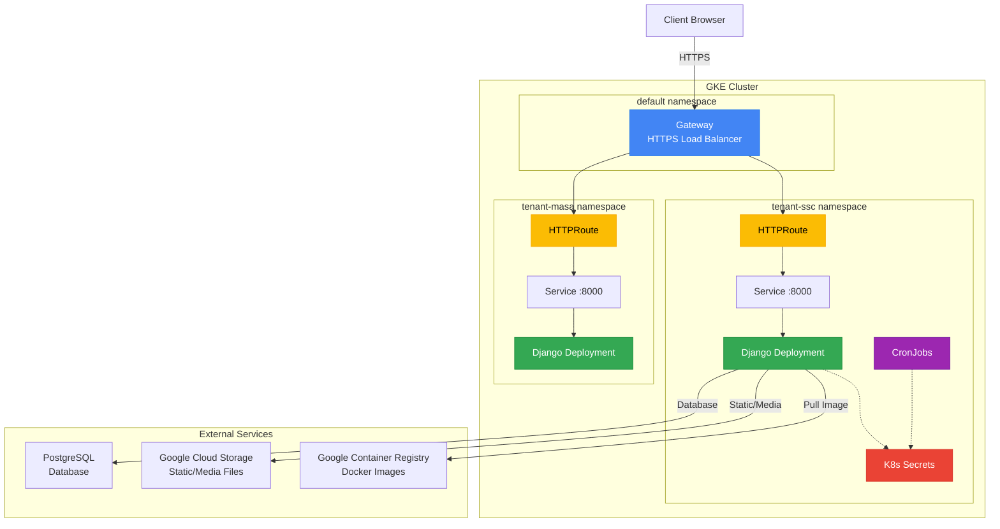

# GKE Deployment Guide

This guide covers deploying Manage2Soar to Google Kubernetes Engine (GKE) using the Ansible-based deployment system. This replaces the legacy `pushy-enhanced-v4.sh` shell script with a reproducible, version-controlled deployment workflow.

## Architecture Overview



> **Note:** For detailed Gateway API and ingress configuration, see [GKE Gateway Ingress Guide](gke-gateway-ingress-guide.md).

## Comparison: Ansible vs Legacy Shell Script

| Feature | pushy-enhanced-v4.sh | Ansible GKE Deploy |
|---------|---------------------|-------------------|
| **Secrets Management** | Hardcoded base64 in script | Ansible Vault encrypted |
| **Multi-tenant** | ❌ Not supported | ✅ Full support |
| **Automatic Rollback** | ❌ Manual intervention | ✅ On deployment failure |
| **Idempotent** | ❌ May create duplicates | ✅ Declarative state |
| **Version Control** | Script only | Full configuration |
| **Documentation** | Inline comments | Structured docs |
| **Validation** | Minimal | Comprehensive pre-flight checks |
| **Error Handling** | Basic | Detailed error messages |

## System Requirements

### Control Machine (Where Ansible Runs)

- **Ansible**: 2.15 or later
- **Python**: 3.9 or later
- **Required Ansible Collections**:
  ```bash
  ansible-galaxy collection install kubernetes.core
  ansible-galaxy collection install google.cloud
  ```

### GCP Requirements

- **GKE Cluster**: Kubernetes 1.27 or later
- **GCR Access**: Docker configured for `gcr.io`
- **Service Account**: With roles:
  - `roles/container.developer` (GKE deployments)
  - `roles/storage.objectAdmin` (GCS for static/media)
  - `roles/cloudsql.client` (if using Cloud SQL)

### Local Tools

```bash
# Required CLI tools
gcloud           # Google Cloud SDK
kubectl          # Kubernetes CLI
docker           # Docker for building images

# Verify versions
gcloud version
kubectl version --client
docker --version
```

## Quick Start

### Step 1: Install Prerequisites

```bash
# Install Ansible collections
ansible-galaxy collection install kubernetes.core google.cloud

# Authenticate with GCP
gcloud auth application-default login
gcloud auth configure-docker

# Enable required GCP APIs
gcloud services enable artifactregistry.googleapis.com --project=PROJECT_ID
gcloud services enable container.googleapis.com --project=PROJECT_ID

# Get cluster credentials
gcloud container clusters get-credentials CLUSTER_NAME \
  --zone ZONE --project PROJECT_ID
```

### Step 2: Configure Variables

```bash
cd infrastructure/ansible

# Create configuration directories
mkdir -p group_vars/gcp_app
mkdir -p inventory

# Copy example variable files
cp group_vars/gcp_app.vars.yml.example group_vars/gcp_app/vars.yml
cp group_vars/gcp_app.vault.yml.example group_vars/gcp_app/vault.yml

# Copy example inventory file
cp inventory/gcp_app.yml.example inventory/gcp_app.yml
```

Edit `group_vars/gcp_app/vars.yml`:

```yaml
# GCP Project Configuration
gcp_project: "your-gcp-project-id"
gke_cluster_name: "your-cluster-name"
gke_cluster_zone: "us-central1-c"

# Application Settings
gke_django_allowed_hosts: "your-domain.com,www.your-domain.com"
gke_replicas: 2

# Database Connection
gke_db_host: "10.128.0.2"  # Internal IP of your PostgreSQL
gke_db_name: "m2s"
gke_db_user: "m2s"
```

### Step 3: Configure Secrets

Create a vault password file:

```bash
openssl rand -base64 32 > ~/.ansible_vault_pass
chmod 600 ~/.ansible_vault_pass
```

Encrypt your vault file:

```bash
ansible-vault encrypt group_vars/gcp_app/vault.yml \
  --vault-password-file ~/.ansible_vault_pass
```

Edit secrets (editor will open):

```bash
ansible-vault edit group_vars/gcp_app/vault.yml \
  --vault-password-file ~/.ansible_vault_pass
```

Required secrets:

```yaml
---
vault_django_secret_key: "your-50-character-secret-key"
vault_postgresql_password: "your-database-password"
```

Generate secure values:

```bash
# Django secret key
python -c "from django.core.management.utils import get_random_secret_key; print(get_random_secret_key())"

# Database password
openssl rand -base64 32
```

### Step 4: Deploy

```bash
# Full deployment (build, push, deploy)
ansible-playbook -i inventory/gcp_app.yml \
  --vault-password-file ~/.ansible_vault_pass \
  playbooks/gcp-app-deploy.yml
```

## Directory Structure

```
infrastructure/ansible/
├── docs/
│   └── gke-deployment-guide.md     # This file
├── group_vars/
│   ├── gcp_app/                    # Your configuration (gitignored)
│   │   ├── vars.yml                # Non-secret variables
│   │   └── vault.yml               # Encrypted secrets
│   ├── gcp_app.vars.yml.example    # Template for vars
│   └── gcp_app.vault.yml.example   # Template for secrets
├── inventory/
│   └── gcp_app.yml.example         # Inventory template (copy to gcp_app.yml)
├── playbooks/
│   └── gcp-app-deploy.yml          # Main GKE deployment playbook
└── roles/
    └── gke-deploy/
        ├── defaults/main.yml       # Default variables
        ├── tasks/
        │   ├── main.yml            # Task orchestration
        │   ├── secrets.yml         # K8s secrets management
        │   ├── deploy.yml          # Deployment and rollout
        │   ├── cronjobs.yml        # CronJob deployment
        │   └── verify.yml          # Health verification
        ├── templates/
        │   ├── k8s-deployment.yml.j2
        │   ├── k8s-secrets.yml.j2
        │   └── k8s-cronjobs.yml.j2
        └── README.md               # Role documentation
```

## Deployment Scenarios

### Full Deployment (Build + Push + Deploy)

```bash
ansible-playbook -i inventory/gcp_app.yml \
  --vault-password-file ~/.ansible_vault_pass \
  playbooks/gcp-app-deploy.yml
```

### Deploy Existing Image (Skip Build)

```bash
ansible-playbook -i inventory/gcp_app.yml \
  --vault-password-file ~/.ansible_vault_pass \
  playbooks/gcp-app-deploy.yml \
  -e gke_build_image=false \
  -e gke_push_image=false \
  -e gke_image_tag=20251229-1200-abc1234
```

### Update Secrets Only

```bash
ansible-playbook -i inventory/gcp_app.yml \
  --vault-password-file ~/.ansible_vault_pass \
  playbooks/gcp-app-deploy.yml \
  --tags secrets
```

### Run Database Migrations

```bash
ansible-playbook -i inventory/gcp_app.yml \
  --vault-password-file ~/.ansible_vault_pass \
  playbooks/gcp-app-deploy.yml \
  -e gke_run_migrations=true
```

### Collect Static Files

```bash
ansible-playbook -i inventory/gcp_app.yml \
  --vault-password-file ~/.ansible_vault_pass \
  playbooks/gcp-app-deploy.yml \
  -e gke_collect_static=true
```

### Dry Run (Check Mode)

```bash
ansible-playbook -i inventory/gcp_app.yml \
  --vault-password-file ~/.ansible_vault_pass \
  playbooks/gcp-app-deploy.yml \
  --check
```

## Multi-Tenant Deployment

Deploy multiple soaring clubs to the same GKE cluster with isolated namespaces.

### Configuration

Edit `group_vars/gcp_app/vars.yml`:

```yaml
gke_multi_tenant: true

gke_tenants:
  - prefix: "ssc"
    name: "Skyline Soaring Club"
    domain: "m2s.skylinesoaring.org"

  - prefix: "masa"
    name: "Mid-Atlantic Soaring Association"
    domain: "m2s.midatlanticsoaring.org"

  - prefix: "bgc"
    name: "Blue Ridge Gliding Club"
    domain: "m2s.blueridgegliding.org"
```

Add tenant-specific secrets to `vault.yml`:

```yaml
vault_django_secret_key: "shared-secret-key"
vault_postgresql_password_ssc: "ssc-database-password"
vault_postgresql_password_masa: "masa-database-password"
vault_postgresql_password_bgc: "bgc-database-password"
```

> **Note:** Each tenant requires a pre-existing PostgreSQL database following the `m2s_<prefix>` naming convention (e.g., `m2s_ssc`). The Ansible role configures Kubernetes secrets pointing to these databases but does **not** create them.

### Deploy All Tenants

```bash
ansible-playbook -i inventory/gcp_app.yml \
  --vault-password-file ~/.ansible_vault_pass \
  playbooks/gcp-app-deploy.yml
```

### Deploy Specific Tenant

```bash
ansible-playbook -i inventory/gcp_app.yml \
  --vault-password-file ~/.ansible_vault_pass \
  playbooks/gcp-app-deploy.yml \
  -e gke_deploy_tenant=ssc
```

### Multi-Tenant Resource Isolation

Each tenant receives:

| Resource | Naming Pattern | Example (ssc) |
|----------|---------------|---------------|
| Namespace | `tenant-<prefix>` | `tenant-ssc` |
| Deployment | `django-app-<prefix>` | `django-app-ssc` |
| Service | `django-app-<prefix>` | `django-app-ssc` |
| Secret | `manage2soar-env-<prefix>` | `manage2soar-env-ssc` |
| Database | `m2s_<prefix>` | `m2s_ssc` |
| CronJobs | Prefixed per tenant | `send-reminders-ssc` |

## Image Tagging Strategies

| Type | Format | Example | Use Case |
|------|--------|---------|----------|
| `auto` (default) | `YYYYMMDD-HHMM-<hash>` | `20251229-1430-abc1234` | General deployments |
| `timestamp` | `YYYYMMDD-HHMM` | `20251229-1430` | Quick iteration |
| `git` | `<short-hash>` | `abc1234` | Development |
| `git-tag` | `<tag>` or `<hash>` | `v1.2.3` | Release deployments |

### Custom Tag

```bash
# Use specific tag type
ansible-playbook ... -e gke_image_tag_type=git-tag

# Or specify exact tag
ansible-playbook ... -e gke_image_tag=v1.2.3
```

## Available Tags

Control which tasks run using Ansible tags:

| Tag | Description |
|-----|-------------|
| `docker` | Docker build and push operations |
| `build` | Build Docker image only |
| `push` | Push image to GCR only |
| `secrets` | Create/update Kubernetes secrets |
| `deploy` | Apply deployment and service |
| `cronjobs` | Deploy CronJob configurations |
| `verify` | Run health verification checks |
| `gke-auth` | GKE authentication tasks |

### Examples

```bash
# Only update secrets
ansible-playbook ... --tags secrets

# Build and push only (no deploy)
ansible-playbook ... --tags docker

# Skip Docker, deploy existing image
ansible-playbook ... --skip-tags docker
```

## Configuration Reference

### Required Variables

| Variable | Description | Example |
|----------|-------------|---------|
| `gcp_project` | GCP project ID | `my-project-123` |
| `gke_cluster_name` | GKE cluster name | `manage2soar-cluster` |
| `vault_django_secret_key` | Django SECRET_KEY | (50+ chars) |
| `vault_postgresql_password` | Database password | (strong password) |

### Common Variables

| Variable | Default | Description |
|----------|---------|-------------|
| `gke_cluster_zone` | `us-central1-c` | GKE cluster zone |
| `gke_namespace` | `default` | Kubernetes namespace |
| `gke_replicas` | `2` | Number of pod replicas |
| `gke_django_allowed_hosts` | `CONFIGURE_ALLOWED_HOSTS` | Django allowed hosts |
| `gke_django_debug` | `false` | Django debug mode |

### Resource Limits

| Variable | Default | Description |
|----------|---------|-------------|
| `gke_cpu_request` | `250m` | CPU request |
| `gke_cpu_limit` | `500m` | CPU limit |
| `gke_memory_request` | `512Mi` | Memory request |
| `gke_memory_limit` | `1Gi` | Memory limit |

### Deployment Options

| Variable | Default | Description |
|----------|---------|-------------|
| `gke_build_image` | `true` | Build Docker image |
| `gke_push_image` | `true` | Push to GCR |
| `gke_run_migrations` | `false` | Run Django migrations |
| `gke_collect_static` | `false` | Run collectstatic |
| `gke_deploy_cronjobs` | `true` | Deploy CronJobs |
| `gke_wait_for_rollout` | `true` | Wait for rollout |
| `gke_rollout_timeout` | `300` | Rollout timeout (seconds) |

### Email Configuration

| Variable | Default | Description |
|----------|---------|-------------|
| `gke_email_backend` | `smtp.EmailBackend` | Django email backend |
| `gke_email_host` | `localhost` | SMTP server host |
| `gke_email_port` | `587` | SMTP server port |
| `gke_email_use_tls` | `true` | Enable TLS encryption |
| `gke_default_from_email` | `noreply@...` | Default sender address |
| `gke_email_dev_mode` | `false` | **SAFETY**: Enable email dev mode |
| `gke_email_dev_mode_redirect_to` | `""` | Redirect all emails to these addresses |

**Vault secrets for email** (in `vault.yml`):

```yaml
vault_email_host_user: "your-smtp-username"
vault_email_host_password: "your-smtp-password"
```

### Email Dev Mode (Safety Valve)

> **⚠️ CRITICAL FOR STAGING/TESTING ENVIRONMENTS**
>
> Email Dev Mode is a safety mechanism that **redirects ALL outgoing emails** to specified test
> addresses. This prevents accidental emails to real users during development, staging, or testing.
> See issue [#350](https://github.com/pietbarber/Manage2Soar/pull/350) for implementation details.

**When to enable:**
- Development environments
- Staging/QA environments
- Initial production setup before going live
- Testing email functionality

**When to disable:**
- Production deployments that should send real emails

**Configuration for staging:**

```yaml
# In group_vars/staging/vars.yml
gke_email_dev_mode: true
gke_email_dev_mode_redirect_to: "devtest@yourclub.org,qa@yourclub.org"
```

**Configuration for production:**

```yaml
# In group_vars/production/vars.yml
gke_email_dev_mode: false
gke_email_dev_mode_redirect_to: ""  # Empty - not used
```

**Behavior when enabled:**
- All emails are redirected to the comma-separated list in `gke_email_dev_mode_redirect_to`
- Subject lines are prefixed with `[DEV MODE]` and include original recipient
- Original recipients are preserved in the email body for debugging
- No emails reach real end users

See `roles/gke-deploy/defaults/main.yml` for the complete list.

## Validation and Safety

The playbook includes comprehensive pre-flight validation:

### GCP Configuration Validation

- Verifies `gcp_project` is defined and not a placeholder
- Validates `gke_cluster_name` is configured
- Checks kubectl context matches expected cluster

### Security Validation

Detects and rejects placeholder passwords:

```yaml
# These patterns are rejected:
vault_django_secret_key: "your-secret-key-here"    # ❌
vault_postgresql_password: "changeme"              # ❌
vault_postgresql_password: "placeholder-password"  # ❌
```

### First Deployment Handling

- Detects first-time deployments (no rollback history)
- Gracefully handles missing rollout history
- Provides clear error messages for initial setup issues

## Troubleshooting

### Authentication Issues

```bash
# Re-authenticate with GCP
gcloud auth application-default login
gcloud auth configure-docker

# Refresh cluster credentials
gcloud container clusters get-credentials CLUSTER_NAME \
  --zone ZONE --project PROJECT_ID

# Verify kubectl context
kubectl config current-context
kubectl get nodes
```

### Deployment Failures

```bash
# Check pod status
kubectl get pods -n NAMESPACE

# View pod logs
kubectl logs -l app=django-app -n NAMESPACE -f

# Describe deployment for events
kubectl describe deployment django-app -n NAMESPACE

# Check rollout status
kubectl rollout status deployment/django-app -n NAMESPACE
```

### Manual Rollback

```bash
# View rollout history
kubectl rollout history deployment/django-app -n NAMESPACE

# Rollback to previous version
kubectl rollout undo deployment/django-app -n NAMESPACE

# Rollback to specific revision
kubectl rollout undo deployment/django-app -n NAMESPACE --to-revision=3
```

### Secret Issues

```bash
# View secret (base64 encoded)
kubectl get secret manage2soar-env -n NAMESPACE -o yaml

# Decode a secret value
kubectl get secret manage2soar-env -n NAMESPACE \
  -o jsonpath='{.data.DJANGO_SECRET_KEY}' | base64 -d

# Recreate secrets
ansible-playbook ... --tags secrets
```

### Image Pull Errors

```bash
# Verify image exists in GCR
gcloud container images list --repository=gcr.io/PROJECT_ID

# List image tags
gcloud container images list-tags gcr.io/PROJECT_ID/manage2soar

# Re-authenticate Docker
gcloud auth configure-docker
```

## Security Best Practices

### Secrets Management

1. **Never commit secrets to git** - Use `.gitignore` for `group_vars/gcp_app/`
2. **Use strong vault passwords** - Store in `~/.ansible_vault_pass` with `chmod 600`
3. **Rotate secrets regularly** - Update vault and redeploy
4. **Use `no_log: true`** - Already configured for sensitive tasks

### GCP Service Account

1. **Principle of least privilege** - Only grant required roles
2. **Use Workload Identity** - Preferred over key files when possible
3. **Rotate service account keys** - Recommended every 90 days

### Network Security

1. **Use internal IPs** - For database connections within GCP
2. **Enable SSL** - Set `gke_db_sslmode: "require"` for database
3. **Restrict ingress** - Use Cloud Armor or network policies

## Cost Optimization

### GKE Cluster Costs

| Configuration | Approximate Monthly Cost |
|---------------|-------------------------|
| 3 × e2-small (shared) | ~$35 |
| 3 × e2-medium (dedicated) | ~$75 |
| 3 × e2-standard-2 | ~$150 |

### Cost-Saving Tips

1. **Use Spot/Preemptible VMs** - For non-critical workloads
2. **Right-size resources** - Monitor and adjust CPU/memory limits
3. **Scale down non-prod** - Reduce replicas outside business hours
4. **Use Autopilot** - Pay-per-pod pricing for variable workloads

## Related Documentation

- [GKE Gateway Ingress Guide](gke-gateway-ingress-guide.md) - External HTTPS access and SSL certificates
- [GKE Cluster Provisioning Guide](gke-cluster-provisioning-guide.md) - Create and configure GKE clusters
- [GKE Deploy Role README](../roles/gke-deploy/README.md) - Detailed role documentation
- [Single-Host Deployment](../README.md) - Alternative deployment for smaller clubs
- [Main Project Documentation](../../../README.md) - Overall project information

## Migration from pushy-enhanced-v4.sh

If migrating from the legacy shell script:

1. **Preserve existing secrets** - Extract current values from K8s secrets
2. **Match image tags** - Note current deployment image tag
3. **Test in staging** - Deploy to test namespace first
4. **Parallel run** - Keep shell script available during transition
5. **Clean up** - Archive shell script after successful migration

```bash
# Extract current secrets for migration
kubectl get secret manage2soar-env -n NAMESPACE -o yaml > current-secrets.yaml
```
