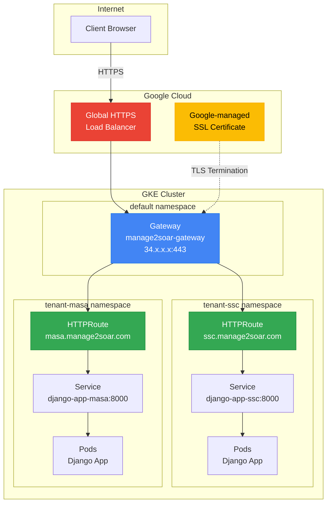

# GKE Gateway API & Ingress Guide

This guide covers configuring external HTTPS access to Manage2Soar deployments on GKE using the Gateway API. The Gateway API provides cross-namespace routing, enabling multiple tenants to share a single load balancer IP address.

## Architecture Overview



## Why Gateway API?

The deployment uses GKE Gateway API instead of traditional GCE Ingress for several reasons:

| Feature | GCE Ingress | Gateway API |
|---------|-------------|-------------|
| Cross-namespace routing | ❌ Not supported | ✅ Supported |
| Single IP for multi-tenant | ❌ Requires multiple IPs | ✅ Single shared IP |
| Host-based routing | ✅ Within same namespace | ✅ Across namespaces |
| TLS configuration | ManagedCertificate CRD | Google-managed SSL certs |
| BackendConfig support | ✅ Supported | ❌ Not supported |

## Prerequisites

### Enable Gateway API on Cluster

Gateway API must be enabled on the GKE cluster. This is a **one-time setup**:

```bash
# Enable Gateway API on existing cluster
gcloud container clusters update CLUSTER_NAME \
  --gateway-api=standard \
  --zone=ZONE \
  --project=PROJECT_ID
```

**Example:**
```bash
gcloud container clusters update manage2soar-cluster \
  --gateway-api=standard \
  --zone=us-east1-b \
  --project=manage2soar
```

> **Note:** This command modifies the cluster configuration. It takes 1-2 minutes and does not cause downtime.

### Verify Gateway API is Enabled

```bash
# Check available GatewayClasses
kubectl get gatewayclass

# Expected output includes:
# gke-l7-global-external-managed     cloud.google.com/l7-gke-gateway-controller
# gke-l7-gxlb                        cloud.google.com/l7-gke-gateway-controller
# gke-l7-rilb                        cloud.google.com/l7-gke-gateway-controller
```

## Configuration

### Enable Ingress in Inventory

Edit your `inventory/gcp_app.yml`:

```yaml
all:
  hosts:
    localhost:
      # ... existing configuration ...

      # ============================================================
      # INGRESS (External Access)
      # ============================================================
      gke_enable_ingress: true

      # Multi-tenant configuration with domains
      gke_tenants:
        - prefix: "ssc"
          name: "Skyline Soaring Club"
          domain: "ssc.manage2soar.com"

        - prefix: "masa"
          name: "Mid-Atlantic Soaring Association"
          domain: "masa.manage2soar.com"
```

### Configuration Variables

| Variable | Default | Description |
|----------|---------|-------------|
| `gke_enable_ingress` | `false` | Enable Gateway API deployment |
| `gke_enable_tls` | `true` | Enable HTTPS with SSL certificate |
| `gke_ssl_cert_name` | `<app_name>-ssl-cert` | Name of Google-managed SSL certificate |
| `gke_static_ip_name` | `<cluster>-ingress-ip` | Static IP name (optional, GKE auto-creates) |

### Domain Configuration

Each tenant can have one or more domains:

```yaml
# Single domain per tenant
gke_tenants:
  - prefix: "ssc"
    domain: "m2s.skylinesoaring.org"

# Multiple domains per tenant (for migrations)
gke_tenants:
  - prefix: "ssc"
    domains:
      - "m2s.skylinesoaring.org"
      - "skyline.manage2soar.com"  # Alias during migration
```

## Deployment

### Deploy Gateway and HTTPRoutes

The Gateway API resources are deployed automatically with the main playbook:

```bash
ansible-playbook -i inventory/gcp_app.yml \
  --vault-password-file ~/.ansible_vault_pass \
  playbooks/gcp-app-deploy.yml
```

### What Gets Created

1. **Gateway** (in `default` namespace)
   - Shared entry point for all tenants
   - Listens on ports 80 (HTTP) and 443 (HTTPS)
   - Configures TLS termination

2. **HTTPRoutes** (per tenant namespace)
   - Host-based routing rules
   - HTTP to HTTPS redirect
   - Backend service references

3. **Google-managed SSL Certificate**
   - Created via `gcloud compute ssl-certificates`
   - Automatically renewed by Google

### Verify Deployment

```bash
# Check Gateway status
kubectl get gateway -n default

# Expected output:
# NAME                  CLASS                            ADDRESS         PROGRAMMED   AGE
# manage2soar-gateway   gke-l7-global-external-managed   34.111.146.37   True         5m

# Check HTTPRoutes
kubectl get httproute -A

# Expected output:
# NAMESPACE     NAME                        HOSTNAMES                        AGE
# tenant-ssc    manage2soar-ssc-route       ["m2s.skylinesoaring.org"]       5m
# tenant-ssc    manage2soar-ssc-redirect    ["m2s.skylinesoaring.org"]       5m
# tenant-masa   manage2soar-masa-route      ["m2s.midatlanticsoaring.org"]   5m
# tenant-masa   manage2soar-masa-redirect   ["m2s.midatlanticsoaring.org"]   5m
```

## DNS Configuration

After deployment, configure DNS A records pointing to the Gateway IP:

### Get the Gateway IP

```bash
kubectl get gateway manage2soar-gateway -n default \
  -o jsonpath='{.status.addresses[0].value}'
```

### Configure DNS Records

Add A records for each tenant domain:

| Domain | Type | Value |
|--------|------|-------|
| `m2s.skylinesoaring.org` | A | `34.111.146.37` |
| `m2s.midatlanticsoaring.org` | A | `34.111.146.37` |

> **Note:** DNS propagation typically takes 5-15 minutes. SSL certificate provisioning begins after DNS is verified.

## SSL Certificate Management

### Certificate Lifecycle

1. **Creation**: Certificate created when playbook runs (if doesn't exist)
2. **Provisioning**: Waiting for DNS verification (status: `PROVISIONING`)
3. **Active**: DNS verified, certificate issued (status: `ACTIVE`)
4. **Renewal**: Automatic renewal by Google (no action needed)

### Check Certificate Status

```bash
gcloud compute ssl-certificates describe manage2soar-ssl-cert \
  --global \
  --project=PROJECT_ID \
  --format="table(name,type,managed.status,managed.domainStatus)"
```

**Status meanings:**

| Status | Description |
|--------|-------------|
| `PROVISIONING` | Waiting for DNS verification |
| `ACTIVE` | Certificate issued and serving |
| `FAILED_NOT_VISIBLE` | DNS not pointing to Gateway IP |
| `FAILED_CAA_CHECKING` | CAA record preventing issuance |

### Troubleshooting Certificate Issues

```bash
# Check certificate details
gcloud compute ssl-certificates describe manage2soar-ssl-cert --global

# Verify DNS is pointing correctly
dig ssc.manage2soar.com +short
# Should return the Gateway IP

# Delete and recreate certificate (if needed)
gcloud compute ssl-certificates delete manage2soar-ssl-cert --global --quiet
# Re-run playbook to recreate
```

## Updating Domains

### Add New Domain

1. Update inventory with new domain:
   ```yaml
   gke_tenants:
     - prefix: "ssc"
       domains:
         - "ssc.manage2soar.com"
         - "new-domain.example.com"  # Add new domain
   ```

2. Delete existing SSL certificate:
   ```bash
   gcloud compute ssl-certificates delete manage2soar-ssl-cert --global --quiet
   ```

3. Run playbook:
   ```bash
   ansible-playbook -i inventory/gcp_app.yml \
     --vault-password-file ~/.ansible_vault_pass \
     playbooks/gcp-app-deploy.yml
   ```

4. Update DNS for new domain

### Change Domain

1. Update inventory with new domain name
2. Delete SSL certificate (it contains old domain)
3. Run playbook
4. Update DNS records

## Testing

### Test HTTP Redirect

```bash
curl -v -H "Host: m2s.skylinesoaring.org" http://GATEWAY_IP/

# Should return:
# HTTP/1.1 301 Moved Permanently
# Location: https://m2s.skylinesoaring.org:443/
```

### Test HTTPS (After Certificate Active)

```bash
curl -v https://m2s.skylinesoaring.org/

# Should return:
# HTTP/2 200
# (Application response)
```

### Test with IP (Before DNS)

```bash
# HTTP redirect test
curl -v -H "Host: m2s.skylinesoaring.org" http://34.111.146.37/

# HTTPS (will fail until certificate is active)
curl -k -H "Host: m2s.skylinesoaring.org" https://34.111.146.37/
```

## Troubleshooting

### Gateway Not Programmed

```bash
kubectl describe gateway manage2soar-gateway -n default
```

**Common issues:**

| Error | Cause | Solution |
|-------|-------|----------|
| `BackendConfig annotation unsupported` | Service has BackendConfig | Remove annotation from Service |
| `Service not found` | HTTPRoute references wrong service | Check service name in HTTPRoute |
| `Certificate not found` | SSL cert name mismatch | Verify `gke_ssl_cert_name` matches |

### Remove BackendConfig Annotations

Gateway API doesn't support BackendConfig. If migrating from Ingress:

```bash
# Remove BackendConfig annotation
kubectl annotate svc django-app-ssc -n tenant-ssc \
  cloud.google.com/backend-config-

# Delete BackendConfig resources
kubectl delete backendconfig -n tenant-ssc django-app-ssc-config
```

### Certificate Stuck in Provisioning

1. **Verify DNS** points to Gateway IP
2. **Check CAA records** allow Google to issue certificates
3. **Wait 15-20 minutes** after DNS change
4. **Force recreation** by deleting and recreating certificate

```bash
# Check DNS
dig m2s.skylinesoaring.org +short

# Check CAA
dig m2s.skylinesoaring.org CAA

# CAA should be empty or include: 0 issue "pki.goog"
```

### HTTPRoute Not Attached

```bash
kubectl describe httproute manage2soar-ssc-route -n tenant-ssc
```

Check:
- `parentRefs` references correct Gateway
- `hostnames` matches expected domains
- `backendRefs` points to existing Service

## Resource Templates

The Gateway API deployment uses these Jinja2 templates:

| Template | Purpose |
|----------|---------|
| `k8s-gateway.yml.j2` | Shared Gateway with TLS |
| `k8s-httproute.yml.j2` | Per-tenant routing rules (multi-tenant) |
| `k8s-httproute-single.yml.j2` | Routing rules (single-tenant) |

Templates are in `roles/gke-deploy/templates/`.

## Comparison: Single-Tenant vs Multi-Tenant

| Aspect | Single-Tenant | Multi-Tenant |
|--------|---------------|--------------|
| Namespaces | 1 (`default`) | N (`tenant-*`) |
| Gateway | 1 in `default` | 1 in `default` |
| HTTPRoutes | 2 (main + redirect) | 2×N (per tenant) |
| SSL Certificate | 1 (single domain) | 1 (all domains) |
| IP Address | 1 | 1 |

## Cost Considerations

Gateway API uses Google Cloud Global HTTPS Load Balancer:

| Component | Approximate Cost |
|-----------|-----------------|
| Forwarding Rule | ~$18/month |
| SSL Certificate | Free (Google-managed) |
| Data Processing | ~$0.008/GB |

> **Note:** Load balancer costs are per-cluster, not per-tenant. Multi-tenant deployments share the same load balancer.

## Related Documentation

- [GKE Deployment Guide](gke-deployment-guide.md) - Main deployment documentation
- [GKE Cluster Provisioning](gke-cluster-provisioning-guide.md) - Cluster setup
- [Google Cloud Gateway API Docs](https://cloud.google.com/kubernetes-engine/docs/concepts/gateway-api)
- [Secure a Gateway](https://cloud.google.com/kubernetes-engine/docs/how-to/secure-gateway)
