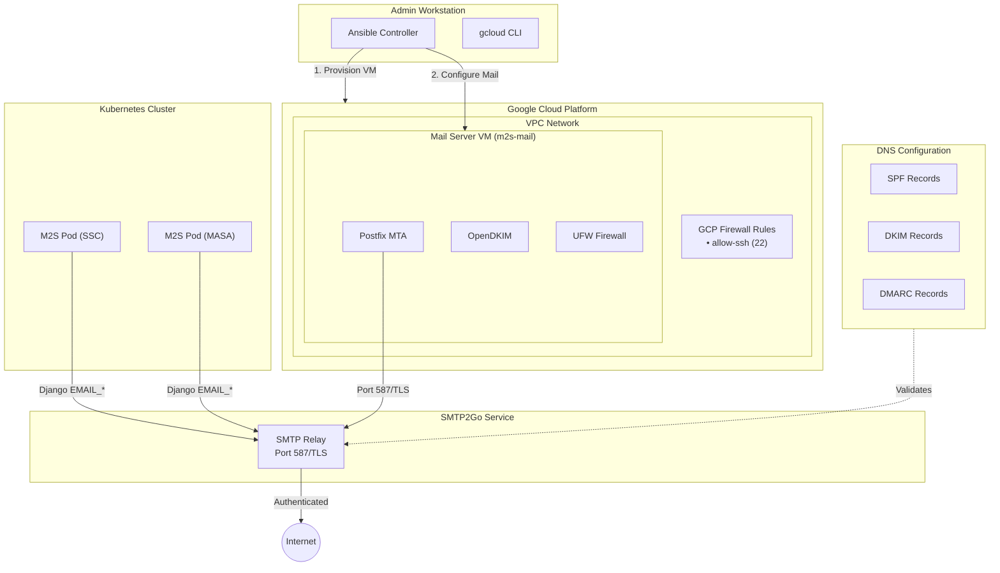

# GCP Mail Server Deployment

This document describes how to deploy a mail forwarding server on Google Cloud Platform (GCP) using Ansible automation with SMTP2Go as the relay service.

## Overview

The GCP mail server deployment supports:

- **Automated VM provisioning**: Creates GCP VM if it doesn't exist
- **Idempotent operation**: Safe to run multiple times
- **Multi-tenant domains**: One subdomain per club/tenant
- **SMTP2Go relay**: GCP blocks port 25, so we relay through SMTP2Go
- **DKIM signing**: Automatic key generation for email authentication
- **Full DNS record guidance**: SPF, DKIM, DMARC configuration

## Architecture



## Why SMTP2Go?

GCP (and most cloud providers) block outbound port 25 to prevent spam. Instead of trying to send mail directly, we relay through SMTP2Go which:

1. **Provides authenticated SMTP relay** on port 587
2. **Handles IP reputation** for deliverability
3. **Offers a free tier** sufficient for most clubs
4. **Supports DKIM/SPF/DMARC** for email authentication

### SMTP2Go Free Tier

- 1,000 emails per month
- Perfect for duty roster reminders, notifications
- Paid plans available for higher volume

## Prerequisites

### 1. Install Required Tools

```bash
# Ansible and GCP collection
pip install ansible
ansible-galaxy collection install google.cloud community.general

# GCP CLI
curl https://sdk.cloud.google.com | bash
gcloud init
```

### 2. Create SMTP2Go Account

1. **Sign up** at https://www.smtp2go.com/
2. **Verify your email** address
3. **Get API credentials**:
   - Settings → API Keys → Add API Key
   - Save the username and password shown

### 3. GCP Authentication

Choose one method:

**Option A: Application Default Credentials (Recommended)**
```bash
gcloud auth application-default login
```

**Option B: Service Account Key**
```bash
# Create service account in GCP Console
# Download JSON key file
# Set in group_vars:
gcp_auth_kind: "serviceaccount"
gcp_service_account_file: "/path/to/key.json"
```

### 4. Enable Required GCP APIs

**CRITICAL**: Enable the Compute Engine API before running the playbook:

```bash
gcloud services enable compute.googleapis.com
```

Or visit: `https://console.developers.google.com/apis/api/compute.googleapis.com/overview?project=YOUR_PROJECT_ID`

### 5. Configure SSH Access

See [SSH Configuration Guide](#ssh-configuration) below.

## Quick Start

### Step 1: Copy Configuration Files

```bash
cd infrastructure/ansible

# Inventory
cp inventory/gcp_mail.yml.example inventory/gcp_mail.yml

# Variables
mkdir -p group_vars/gcp_mail
cp group_vars/gcp_mail.vars.yml.example group_vars/gcp_mail/vars.yml
cp group_vars/gcp_mail.vault.yml.example group_vars/gcp_mail/vault.yml
```

### Step 2: Configure Variables

```bash
# Edit main configuration
vim group_vars/gcp_mail/vars.yml
```

Key settings to change:
```yaml
# GCP Project
gcp_project: "your-gcp-project-id"

# SSH access (get your IP: curl -s https://api.ipify.org)
gcp_ssh_allowed_sources:
  - "YOUR_IP/32"

gcp_ssh_public_keys:
  - "username:ssh-ed25519 YOUR_PUBLIC_KEY user@host"

# Mail domain
mail_domain: "manage2soar.com"

# Tenants
club_domains:
  - prefix: "ssc"
    name: "Skyline Soaring Club"
  - prefix: "masa"
    name: "Mid-Atlantic Soaring Association"
```

### Step 3: Configure Secrets

```bash
# Create vault password file (if not already done)
echo "<YOUR_VAULT_PASSWORD>" > ~/.ansible_vault_pass
chmod 600 ~/.ansible_vault_pass

# Edit secrets
vim group_vars/gcp_mail/vault.yml
```

Add your SMTP2Go credentials:
```yaml
vault_smtp_relay_username: "your-smtp2go-username"
vault_smtp_relay_password: "your-smtp2go-password"
```

Then encrypt:
```bash
ansible-vault encrypt group_vars/gcp_mail/vault.yml \
  --vault-password-file ~/.ansible_vault_pass
```

### Step 4: Run the Playbook

```bash
# Full deployment (provision VM + configure mail)
ansible-playbook -i inventory/gcp_mail.yml \
  --vault-password-file ~/.ansible_vault_pass \
  playbooks/gcp-mail-server.yml

# Configuration only (VM already exists)
ansible-playbook -i inventory/gcp_mail.yml \
  --vault-password-file ~/.ansible_vault_pass \
  playbooks/gcp-mail-server.yml --skip-tags gcp-provision
```

### Step 5: Configure DNS Records

After the playbook runs, it will display the DNS records you need to add. Add these to your DNS provider:

#### SPF Record
For each tenant domain:
```
ssc.manage2soar.com    TXT    v=spf1 include:spf.smtp2go.com ~all
masa.manage2soar.com   TXT    v=spf1 include:spf.smtp2go.com ~all
```

#### DKIM Record
The playbook outputs the DKIM public keys. Add as TXT records:
```
m2s._domainkey.ssc.manage2soar.com    TXT    (content from playbook output)
m2s._domainkey.masa.manage2soar.com   TXT    (content from playbook output)
```

#### DMARC Record
For each tenant domain:
```
_dmarc.ssc.manage2soar.com    TXT    v=DMARC1; p=quarantine; rua=mailto:dmarc@ssc.manage2soar.com
_dmarc.masa.manage2soar.com   TXT    v=DMARC1; p=quarantine; rua=mailto:dmarc@masa.manage2soar.com
```

### Step 6: Register and Verify Domains in SMTP2Go

#### Prerequisites

Before you begin, ensure you have:
- Run the playbook (Step 4)
- Added all SPF, DKIM, and DMARC DNS records (Step 5)
- Allowed time for DNS propagation (can take several hours)

1. Log into SMTP2Go: https://app.smtp2go.com/
2. Go to **Settings → Sender Domains**
3. Add each tenant domain:
   - `ssc.manage2soar.com`
   - `masa.manage2soar.com`
4. Use SMTP2Go's verification process for each domain
5. **If verification fails**: Wait for DNS propagation (up to 24-48 hours) and retry

## Configuration Reference

### VM Provisioning Options

| Variable | Default | Description |
|----------|---------|-------------|
| `gcp_project` | (required) | GCP project ID |
| `gcp_vm_provision` | `true` | Create VM if it doesn't exist |
| `gcp_vm_name` | `m2s-mail` | VM instance name |
| `gcp_machine_type` | `e2-micro` | GCP machine type |
| `gcp_zone` | `us-east1-b` | GCP zone |
| `gcp_boot_disk_size_gb` | `10` | Boot disk size |

### Mail Server Options

| Variable | Default | Description |
|----------|---------|-------------|
| `mail_domain` | (required) | Base domain for mail |
| `mail_hostname` | `mail.{domain}` | Mail server FQDN |
| `smtp_relay_host` | `mail.smtp2go.com` | SMTP relay host |
| `smtp_relay_port` | `587` | SMTP relay port |
| `dkim_selector` | `m2s` | DKIM selector name |
| `dkim_key_size` | `2048` | DKIM key size |

### Multi-Tenant Configuration

```yaml
club_domains:
  - prefix: "ssc"
    name: "Skyline Soaring Club"
  - prefix: "masa"
    name: "Mid-Atlantic Soaring Association"
```

Each tenant gets:
- Subdomain: `{prefix}.manage2soar.com`
- DKIM key: `{selector}._domainkey.{prefix}.{domain}`
- Isolated email identity

## SSH Configuration

### 1. Add VM Host Key to Known Hosts

For new VMs, add the host key to your known_hosts file:

```bash
# After the VM is provisioned, get its IP from the playbook output
# Then add its host key:
ssh-keyscan MAIL_VM_IP >> ~/.ssh/known_hosts
```

**Security Note**: Do not disable `host_key_checking` globally in `ansible.cfg` as this removes protection against man-in-the-middle attacks.

### 2. Get Your Public IP

```bash
curl -s https://api.ipify.org
# Example output: 203.0.113.42
```

### 3. Get Your SSH Public Key

```bash
cat ~/.ssh/id_ed25519.pub
# OR
cat ~/.ssh/id_rsa.pub
```

### 4. Configure in vars.yml

```yaml
gcp_ssh_allowed_sources:
  - "203.0.113.42/32"  # Your IP from step 2

gcp_ssh_public_keys:
  - "pb:ssh-ed25519 AAAAC3Nz... pb@laptop"  # Your key from step 3
```

## Django Configuration

Configure your Django application to send mail through SMTP2Go:

```python
# settings.py
EMAIL_BACKEND = 'django.core.mail.backends.smtp.EmailBackend'
EMAIL_HOST = 'mail.smtp2go.com'
EMAIL_PORT = 587
EMAIL_USE_TLS = True
EMAIL_HOST_USER = 'your-smtp2go-username'
EMAIL_HOST_PASSWORD = 'your-smtp2go-password'

# For multi-tenant, set DEFAULT_FROM_EMAIL per tenant
DEFAULT_FROM_EMAIL = 'noreply@ssc.manage2soar.com'
```

## Troubleshooting

### Common Issues

#### "Compute Engine API has not been used"

```bash
gcloud services enable compute.googleapis.com
```

Wait 2-5 minutes for the API to propagate.

#### "Host key verification failed"

This usually means the mail VM's SSH host key is not in your `known_hosts` file or has changed.

1. Get the VM's SSH host key and add it to `known_hosts` (replace `MAIL_VM_IP` with the VM's external IP):

   ```bash
   ssh-keyscan MAIL_VM_IP >> ~/.ssh/known_hosts
   ```

2. Do **not** disable SSH host key checking globally (e.g., `host_key_checking = False` in `ansible.cfg`), as this removes protection against man-in-the-middle attacks.

#### "Permission denied (publickey)"

Ensure your SSH public key is in `gcp_ssh_public_keys` and the username matches your local username.

#### "Connection timed out"

Add your IP address to `gcp_ssh_allowed_sources`.

#### DKIM Verification Fails

1. Wait for DNS propagation (can take 24-48 hours)
2. Check the DKIM record is added correctly:
   ```bash
   dig TXT m2s._domainkey.ssc.manage2soar.com
   ```
3. Test with opendkim-testkey:
   ```bash
   ssh root@mail-server 'opendkim-testkey -d ssc.manage2soar.com -s m2s -vvv'
   ```

### Mail Queue Issues

```bash
# Check mail queue (replace YOUR_USER and MAIL_VM_IP with your values)
ssh YOUR_USER@MAIL_VM_IP 'mailq'

# View mail logs
ssh YOUR_USER@MAIL_VM_IP 'sudo tail -100 /var/log/mail.log'

# Flush queue (retry delivery)
ssh YOUR_USER@MAIL_VM_IP 'sudo postqueue -f'
```

### Testing Email Delivery

```bash
# From the mail server
echo "Test from M2S" | mail -s "Test Email" your@email.com

# Check delivery
tail -f /var/log/mail.log
```

## Security Notes

### Files to Never Commit

These files contain secrets and should never be committed to git:

- `inventory/gcp_mail.yml` - Contains infrastructure details
- `group_vars/gcp_mail/vars.yml` - Contains configuration
- `group_vars/gcp_mail/vault.yml` - Contains encrypted secrets
- Any files in `/etc/opendkim/keys/` - Contains DKIM private keys

### Firewall Configuration

The playbook configures:
- **GCP Firewall**: Only allows SSH (port 22) from specified IPs
- **UFW**: Blocks all incoming except SSH

Since we relay through SMTP2Go, no inbound mail ports are needed.

## Re-Running the Playbook

The playbook is idempotent and safe to run multiple times:

```bash
# Re-run to apply configuration changes
ansible-playbook -i inventory/gcp_mail.yml \
  --vault-password-file ~/.ansible_vault_pass \
  playbooks/gcp-mail-server.yml

# Skip VM provisioning (faster)
ansible-playbook -i inventory/gcp_mail.yml \
  --vault-password-file ~/.ansible_vault_pass \
  playbooks/gcp-mail-server.yml --skip-tags gcp-provision
```

### DKIM Key Regeneration

DKIM keys are only generated if they don't exist. To regenerate:

```bash
# On the mail server, remove existing keys
ssh root@mail-server 'rm -rf /etc/opendkim/keys/*/m2s.*'

# Re-run playbook to generate new keys
ansible-playbook -i inventory/gcp_mail.yml \
  --vault-password-file ~/.ansible_vault_pass \
  playbooks/gcp-mail-server.yml --tags opendkim
```

Remember to update DNS records with the new DKIM public keys!

## Related Documentation

- [GCP Database Deployment](gcp-database-deployment.md) - Similar pattern for database
- [Single-Host Deployment](../../docs/single-host-ansible-deployment.md) - All-in-one deployment
- [Email Style Guide](../../docs/email-style-guide.md) - Email formatting standards
