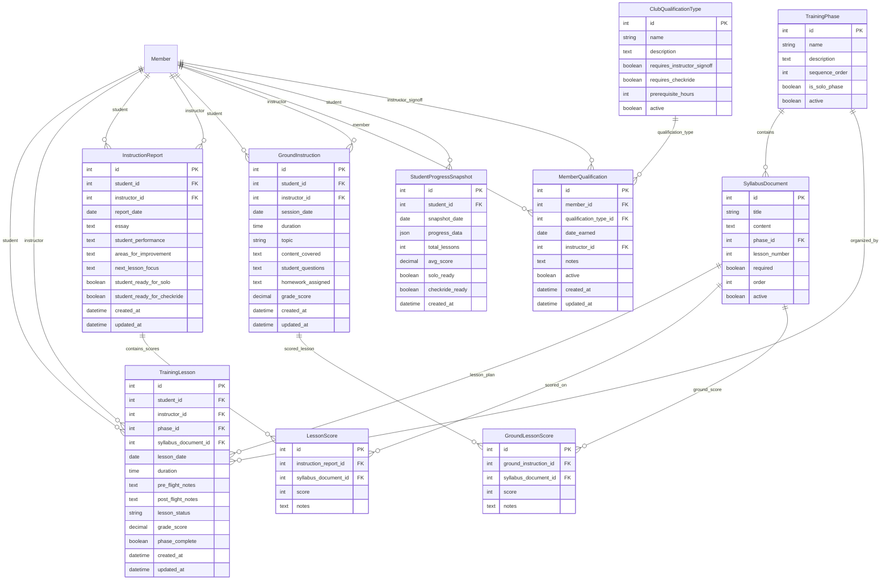

## See Also
- [README (App Overview)](README.md)
- [Management Commands](management.md)
- [Signals](signals.md)
- [Utilities](utils.md)
- [Views](views.md)
- [Decorators](decorators.md)
# Models Reference

Detailed descriptions of all Django models in the **instructors** app.

---

## Database Schema

---

## TrainingPhase

High-level grouping for lessons in the syllabus (e.g., "Before We Fly").

**Fields**

* `number` (PositiveSmallIntegerField): Ordering index for the phase.
* `name` (CharField): Human-readable title of the phase.

**Meta**

* `ordering = ["number"]`

**Methods**

* `__str__()`: Returns `"{number} – {name}"`.

---

## TrainingLesson

Defines a single lesson, with FAA references and rich HTML content.

**Fields**

* `code` (CharField): Unique short identifier (e.g., "2l").
* `title` (CharField): Lesson title (e.g., "Normal Landing").
* `description` (HTMLField): Full HTML content of the lesson.
* `far_requirement` (CharField): FAR citation text for solo endorsement.
* `pts_reference` (CharField): PTS citation text for private rating.
* `phase` (ForeignKey → TrainingPhase): Optional grouping phase.
* `created_at` (DateTimeField): Timestamp of creation.
* `updated_at` (DateTimeField): Timestamp of last update.

**Meta**

* `ordering = ["code"]`

**Methods**

* `is_required_for_solo()`: `True` if `far_requirement` is non-empty.
* `is_required_for_private()`: `True` if `pts_reference` is non-empty.
* `__str__()`: Returns `"{code} – {title}"`.

---

## SyllabusDocument

HTML documents tied to the syllabus (header, supplemental materials).

**Fields**

* `slug` (SlugField): Unique key (e.g., 'header').
* `title` (CharField): Document title.
* `content` (HTMLField): Full HTML content.

**Methods**

* `__str__()`: Returns `title`.

---

## InstructionReport

Flight‐based instructor evaluations submitted per student/date.

**Fields**

* `student` (ForeignKey → Member): Student receiving instruction.
* `instructor` (ForeignKey → Member): Instructor giving instruction.
* `report_date` (DateField): Date of the session.
* `report_text` (HTMLField): Narrative summary.
* `simulator` (BooleanField): Flag for simulator vs flight.
* `created_at`, `updated_at` (DateTimeField): Audit timestamps.

**Meta**

* `unique_together = ('student', 'instructor', 'report_date')`
* `ordering = ['-report_date']`

**Methods**

* `__str__()`: Returns `"{student.full_display_name} – {report_date} by {instructor.full_display_name}"`.

---

## LessonScore

Associates a `TrainingLesson` with a numeric proficiency score under an `InstructionReport`.

**Fields**

* `report` (ForeignKey → InstructionReport)
* `lesson` (ForeignKey → TrainingLesson)
* `score` (CharField): Choice from `SCORE_CHOICES`.

**Meta**

* `unique_together = ('report', 'lesson')`
* `ordering = ['lesson__code']`

---

## GroundInstruction

Logs non-flight instructional sessions in a ground or simulator context.

**Fields**

* `student` (ForeignKey → Member)
* `instructor` (ForeignKey → Member)
* `date` (DateField)
* `location` (CharField, optional)
* `duration` (DurationField, optional)
* `notes` (HTMLField, optional)
* `created_at`, `updated_at` (DateTimeField)

**Meta**

* `ordering = ['-date']`

**Methods**

* `__str__()`: Returns `"{date} – {student} w/ {instructor}"`.

---

## GroundLessonScore

Stores lesson‐level scores tied to a `GroundInstruction` session.

**Fields**

* `session` (ForeignKey → GroundInstruction)
* `lesson` (ForeignKey → TrainingLesson)
* `score` (CharField): Choice from `SCORE_CHOICES`.

**Meta**

* `unique_together = ('session', 'lesson')`
* `ordering = ['lesson__code']`

**Methods**

* `__str__()`: Returns `"{lesson.code} – {get_score_display()}"`.

---

## ClubQualificationType

Defines various club qualifications (e.g., CFI, ASK-Back).

**Fields**

* `code` (CharField): Unique code.
* `name` (CharField)
* `icon` (ImageField, optional)
* `applies_to` (CharField): 'student', 'rated', or 'both'.
* `is_obsolete` (BooleanField)
* `tooltip` (TextField, optional)

**Methods**

* `__str__()`: Returns `name`.

---

## MemberQualification

Tracks assignment of `ClubQualificationType` to a `Member`.

**Fields**

* `member` (ForeignKey → Member)
* `qualification` (ForeignKey → ClubQualificationType)
* `is_qualified` (BooleanField)
* `instructor` (ForeignKey → Member, optional)
* `date_awarded`, `expiration_date` (DateField, optional)
* `notes` (TextField, optional)
* `imported` (BooleanField): Legacy import flag.

**Meta**

* `unique_together = ('member', 'qualification')`

**Methods**

* `__str__()`: Returns `"{member} – {qualification.code}"`.

---

## StudentProgressSnapshot

Precomputed progress summary for dashboard performance.

**Fields**

* `student` (OneToOneField → Member)
* `solo_progress` (FloatField): 0.0–1.0 fraction of solo lessons done.
* `checkride_progress` (FloatField): 0.0–1.0 fraction of rating lessons done.
* `sessions` (IntegerField): Total count of flight + ground sessions.
* `last_updated` (DateTimeField): Auto‑updated timestamp.

**Methods**

* `__str__()`: Returns `"Progress for {student.full_display_name}"`.
