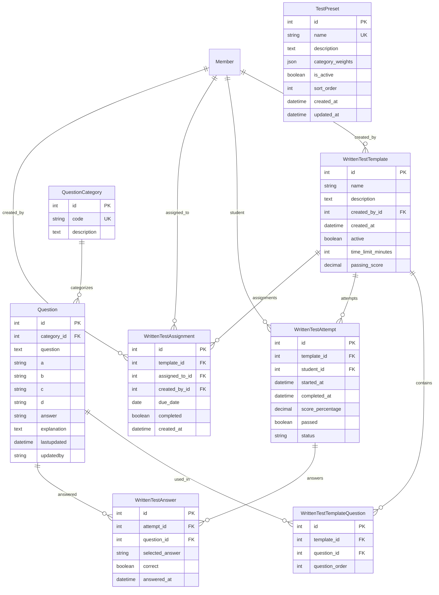

# Models in knowledgetest/models.py

This document describes all models in `knowledgetest/models.py` and includes the database schema for this app.

---

## Database Schema

## TestPreset
- **Purpose:** Configurable test presets that define question distribution across categories for standardized tests.
- **Fields:** name (unique), description, category_weights (JSONField), is_active, sort_order, created_at, updated_at
- **Key Features:** Database-driven presets replace hardcoded test configurations, deletion protection for referenced presets
- **Usage:** Staff can manage presets via Django admin, presets can be applied via URL parameters in test creation

## QuestionCategory
- **Purpose:** Groups questions by category code and description.
- **Fields:** code, description

## Question
- **Purpose:** Represents a single test question and its possible answers.
- **Fields:** category (FK), question, a, b, c, d, answer, explanation, lastupdated, updatedby

## WrittenTestTemplate
- **Purpose:** Defines a template for a written test (set of questions).
- **Fields:** name, description, created_by, created_at

## WrittenTestTemplateQuestion
- **Purpose:** Associates questions with a template and defines order.
- **Fields:** template (FK), question (FK), order

## WrittenTestAttempt
- **Purpose:** Represents a member's attempt at a written test.
- **Fields:** member (FK), template (FK), started_at, completed_at, score, passed

## WrittenTestAnswer
- **Purpose:** Stores a member's answer to a question in an attempt.
- **Fields:** attempt (FK), question (FK), answer, is_correct

## WrittenTestAssignment
- **Purpose:** Assigns a written test to a member.
- **Fields:** member (FK), template (FK), assigned_by, assigned_at, due_date, completed_at, status

---

## Also See
- [README (App Overview)](README.md)
- [Forms](forms.md)
- [Views](views.md)
- [Management Commands](management.md)
