# Models in logsheet/models.py

## Database Schema

```mermaid
erDiagram
    Member ||--o{ Flight : pilot
    Member ||--o{ Flight : instructor
    Member ||--o{ Flight : passenger
    Member ||--o{ Flight : tow_pilot
    Member ||--o{ Logsheet : created_by
    Member ||--o{ Logsheet : duty_officer
    Member ||--o{ Logsheet : assistant_duty_officer
    Member ||--o{ Logsheet : duty_instructor
    Member ||--o{ LogsheetPayment : paid_by
    Member ||--o{ MaintenanceIssue : reported_by
    Member ||--o{ AircraftMeister : member
    Member ||--o{ TowplaneCloseout : rental_charged_to

    Logsheet {
        int id PK
        date log_date
        int airfield_id FK
        int created_by_id FK
        datetime created_at
        boolean finalized
        int duty_officer_id FK
        int assistant_duty_officer_id FK
        int duty_instructor_id FK
    }

    Flight {
        int id PK
        int logsheet_id FK
        time launch_time
        time landing_time
        int pilot_id FK
        int instructor_id FK
        int glider_id FK
        int tow_pilot_id FK
        int towplane_id FK
        duration duration
        int passenger_id FK
        string guest_pilot_name
        string guest_instructor_name
        string guest_towpilot_name
        string passenger_name
        int release_altitude
        decimal tow_cost_override
        decimal rental_cost_override
        text remarks
    }

    Glider {
        int id PK
        string registration
        string competition_id
        string manufacturer
        string model
        decimal rental_rate
        string status
        boolean available
        image photo
        image photo_medium
        image photo_small
        text description
    }

    Towplane {
        int id PK
        string registration
        string manufacturer
        string model
        decimal hourly_rental_rate
        string status
        boolean available
        image photo
        image photo_medium
        image photo_small
        text description
    }

    Airfield {
        int id PK
        string name
        string icao_code
        text description
        image photo
    }

    TowplaneChargeScheme {
        int id PK
        int towplane_id FK
        string name
        decimal hookup_fee
        boolean is_active
        text description
        datetime created_at
        datetime updated_at
    }

    TowplaneChargeTier {
        int id PK
        int charge_scheme_id FK
        int altitude_start
        int altitude_end
        string rate_type
        decimal rate_amount
        boolean is_active
        string description
    }

    LogsheetPayment {
        int id PK
        int logsheet_id FK
        int paid_by_id FK
        decimal amount
        string payment_method
        text notes
    }

    LogsheetCloseout {
        int id PK
        int logsheet_id FK
        int total_flights
        decimal total_revenue
        text notes
        text safety_issues
        datetime created_at
    }

    TowplaneCloseout {
        int id PK
        int logsheet_id FK
        int towplane_id FK
        decimal tach_start
        decimal tach_end
        decimal fuel_added
        decimal rental_hours_chargeable
        int rental_charged_to_id FK
        text notes
    }

    MaintenanceIssue {
        int id PK
        int aircraft_id
        int reported_by_id FK
        string aircraft_type
        string status
        string severity
        text description
        text resolution
        datetime reported_at
        datetime resolved_at
    }

    MaintenanceDeadline {
        int id PK
        int aircraft_id
        string aircraft_type
        string deadline_type
        date due_date
        int hours_remaining
        text description
        boolean active
    }

    AircraftMeister {
        int id PK
        int member_id FK
        string aircraft_type
        int aircraft_id
    }

    RevisionLog {
        int id PK
        string model_name
        int object_id
        string action
        text changes
        int user_id FK
        datetime timestamp
    }

    Logsheet ||--o{ Flight : contains
    Logsheet ||--o{ LogsheetPayment : payments
    Logsheet ||--o{ LogsheetCloseout : closeout
    Logsheet ||--o{ TowplaneCloseout : towplane_closeouts
    Airfield ||--o{ Logsheet : location
    Glider ||--o{ Flight : aircraft
    Towplane ||--o{ Flight : tow_aircraft
    Towplane ||--o{ TowplaneCloseout : closeout_data
    Glider ||--o{ MaintenanceIssue : maintenance
    Towplane ||--o{ MaintenanceIssue : maintenance
    Glider ||--o{ MaintenanceDeadline : deadlines
    Towplane ||--o{ MaintenanceDeadline : deadlines
    Glider ||--o{ AircraftMeister : maintained_by
    Towplane ||--o{ AircraftMeister : maintained_by
    Towplane ||--|| TowplaneChargeScheme : pricing
    TowplaneChargeScheme ||--o{ TowplaneChargeTier : tiers

    MemberCharge {
        int id PK
        int member_id FK
        int chargeable_item_id FK
        decimal quantity
        decimal unit_price
        decimal total_price
        date date
        int logsheet_id FK
        text notes
        int entered_by_id FK
        datetime created_at
        datetime updated_at
    }

    ChargeableItem {
        int id PK
        string name
        decimal price
        string unit
        boolean allows_decimal_quantity
        boolean is_active
        text description
        int sort_order
        datetime created_at
        datetime updated_at
    }

    Member ||--o{ MemberCharge : charges
    Member ||--o{ MemberCharge : entered_by
    ChargeableItem ||--o{ MemberCharge : item
    Logsheet ||--o{ MemberCharge : charges
```

This document describes all models in `logsheet/models.py`.

---

## Flight
- Represents a single flight log entry, including pilots, aircraft, launch method, times, and costs.

## RevisionLog
- Tracks changes to logsheet entries for audit/history.

## Towplane
- Represents a towplane, including status and maintenance.
- **New in Issue 123**: Added `hourly_rental_rate` field to support charging for non-towing flights like sightseeing, flight reviews, and retrieval missions.
- **Rental Functionality**: When enabled via `SiteConfiguration.allow_towplane_rental`, clubs can charge hourly rates for towplane usage beyond towing (e.g., sightseeing, flight reviews, aircraft retrieval).
- **Tow Pricing**: Each towplane should have a `TowplaneChargeScheme` for tow cost calculations (Issue #283).
- **Photo Thumbnails (Issue #286)**: Added `photo_medium` (150x150) and `photo_small` (100x100) fields for optimized page loading. Thumbnails are auto-generated when photos are uploaded via admin. URL properties (`photo_url_medium`, `photo_url_small`) provide graceful fallback chains.

## Glider
- Represents a glider, including status and maintenance.
- **Photo Thumbnails (Issue #286)**: Added `photo_medium` (150x150) and `photo_small` (100x100) fields for optimized page loading. Thumbnails are auto-generated when photos are uploaded via admin. URL properties (`photo_url_medium`, `photo_url_small`) provide graceful fallback chains.

## Airfield
- Represents an airfield where operations occur.

## Logsheet
- Represents a daily logsheet, including flights, crew, and closeout.

## TowplaneChargeScheme
- **New in Issue #67, Finalized in Issue #283**: Defines towplane-specific charging schemes with hookup fees and tiered pricing.
- **Replaces Legacy**: Replaced the global `TowRate` system with flexible, per-towplane pricing.
- **Self-Launch Support**: Special $0.00 schemes for self-launching gliders (motor gliders).

## TowplaneChargeTier
- **New in Issue #67**: Defines pricing tiers within a charge scheme (flat rate, per 100ft, per 1000ft).
- **Flexible Pricing**: Supports complex pricing models like "$25 base + $1 per 100ft above 1000ft".

## LogsheetPayment
- Tracks payments for logsheet entries.
- **Performance Optimization (Issue #285)**: Added composite database index on `(logsheet_id, member_id)` for faster payment lookups in finances view.

## LogsheetCloseout
- Records the closeout summary for a logsheet.

## TowplaneCloseout
- Records the closeout summary for a towplane.
- **New in Issue 123**: Includes `rental_hours_chargeable` field and `rental_charged_to` field to track non-towing towplane usage (sightseeing, flight reviews, retrieval flights).
- **Rental Cost Calculation**: The `rental_cost` property automatically calculates charges based on `rental_hours_chargeable * towplane.hourly_rental_rate`.
- **Site Configuration**: Rental fields are only shown when `SiteConfiguration.allow_towplane_rental` is enabled.

## MaintenanceIssue
- Tracks maintenance issues for aircraft.

## MaintenanceDeadline
- Tracks maintenance deadlines for aircraft.

## MemberCharge
- Represents a miscellaneous charge applied to a member during logsheet operations.
- **Issue #413**: Initial model creation for tracking merchandise, retrieve fees, and service charges.
- **Issue #615**: User-facing form enabling duty officers to add charges without Django admin access.
- **Key Fields**: `member` (who is charged), `chargeable_item` (catalog item), `quantity`, `unit_price` (snapshot), `total_price` (auto-calculated).
- **Logsheet Integration**: Optional `logsheet` FK links charges to specific operation days. Charges on finalized logsheets are locked.
- **Price Snapshot**: `unit_price` captures the catalog price at creation time; subsequent catalog price changes don't affect existing charges.
- **Auto-Calculation**: `total_price` = `quantity` × `unit_price`, computed on save.
- **Decimal Quantity**: Supports fractional quantities (e.g., 1.8 hours for tach time) when `ChargeableItem.allows_decimal_quantity` is True.

---

## Also See
- [README (App Overview)](README.md)
- [Forms](forms.md)
- [Views](views.md)
- [Signals](signals.md)
- [Management Commands](management.md)
