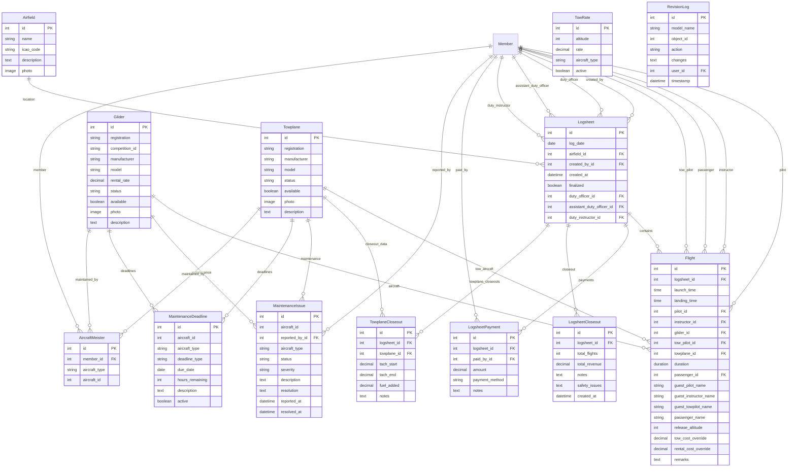

# Models in logsheet/models.py

## Database Schema

This document describes all models in `logsheet/models.py`.

---

## Flight
- Represents a single flight log entry, including pilots, aircraft, launch method, times, and costs.

## RevisionLog
- Tracks changes to logsheet entries for audit/history.

## Towplane
- Represents a towplane, including status and maintenance.
- **New in Issue 123**: Added `hourly_rental_rate` field to support charging for non-towing flights like sightseeing, flight reviews, and retrieval missions.

## Glider
- Represents a glider, including status and maintenance.

## Airfield
- Represents an airfield where operations occur.

## Logsheet
- Represents a daily logsheet, including flights, crew, and closeout.

## TowRate
- Defines tow rates for different aircraft and altitudes.

## LogsheetPayment
- Tracks payments for logsheet entries.

## LogsheetCloseout
- Records the closeout summary for a logsheet.

## TowplaneCloseout
- Records the closeout summary for a towplane.
- **New in Issue 123**: Includes `rental_hours_chargeable` field and `charged_to` field to track non-towing towplane usage (sightseeing, flight reviews, retrieval flights).
- **Rental Cost Calculation**: The `rental_cost` property automatically calculates charges based on `rental_hours_chargeable * towplane.hourly_rental_rate`.

## MaintenanceIssue
- Tracks maintenance issues for aircraft.

## MaintenanceDeadline
- Tracks maintenance deadlines for aircraft.

---

## Also See
- [README (App Overview)](README.md)
- [Forms](forms.md)
- [Views](views.md)
- [Signals](signals.md)
- [Management Commands](management.md)
